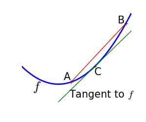
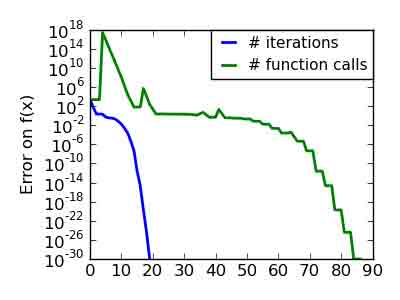
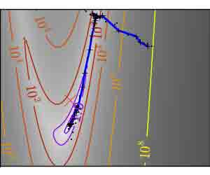

# 2.7 数学优化：找到函数的最优解

# 2.7 数学优化：找到函数的最优解

In [2]:

```py
%matplotlib inline
import numpy as np 
```

> **作者**: Gaël Varoquaux

[数学优化](http://en.wikipedia.org/wiki/Mathematical_optimization)处理寻找一个函数的最小值（最大值或零）的问题。在这种情况下，这个函数被称为*成本函数*，或*目标函数*，或*能量*。

这里，我们感兴趣的是使用[scipy.optimize](http://docs.scipy.org/doc/scipy/reference/optimize.html#scipy.optimize)来进行黑盒优化： 我们不依赖于我们优化的函数的算术表达式。注意这个表达式通常可以用于高效的、非黑盒优化。

> 先决条件
> 
> *   Numpy, Scipy
> *   matplotlib

**也可以看一下: 参考**

数学优化是非常 ... 数学的。如果你需要性能，那么很有必要读一下这些书:

*   [Convex Optimization](http://www.stanford.edu/~boyd/cvxbook/) Boyd and Vandenberghe (pdf 版线上免费)。
*   [Numerical Optimization](http://users.eecs.northwestern.edu/~nocedal/book/num-opt.html), Nocedal and Wright。 关于梯度下降方法的详细参考。
*   [Practical Methods of Optimization](http://www.amazon.com/gp/product/0471494631/ref=ox_sc_act_title_1?ie=UTF8&smid=ATVPDKIKX0DER) Fletcher: 擅长挥手解释。

**章节内容**

*   了解你的问题
    *   凸优化 VS 非凸优化
    *   平滑问题和非平滑问题
    *   嘈杂 VS 精确的成本函数
    *   限制
*   不同最优化方法的回顾
    *   入门: 一维最优化
    *   基于梯度的方法
    *   牛顿和拟牛顿法
    *   较少梯度方法
    *   全局优化
*   使用 scipy 优化的操作指南
    *   选择一个方法
    *   让你的优化器更快
    *   计算梯度
    *   虚拟练习
*   特殊情境: 非线性最小二乘
    *   最小化向量函数的范数
    *   曲线拟合
*   有限制的最优化
    *   箱边界
    *   通用限制

## 2.7.1 了解你的问题

每个问题都是不相同。了解你的问题使你可以选择正确的工具。

**问题的维数**

优化问题的规模非常好的由问题的维数来决定，即，进行搜索的标量变量的数量。

### 2.7.1.1 凸优化 VS 非凸优化

**凸函数**:

*   $f$ 在它的所有切线之上。
*   相应的, 对于两个点 point A, B, f(C) 在线段[f(A), f(B])]之下, 如果 A < C < B



**非凸函数**


**最优化凸函数简单。最优化非凸函数可能非常困难。**

> **注意**: 可以证明对于一个凸函数局部最小值也是全局最小值。然后，从某种意义上说，最小值是惟一的。

### 2.7.1.2 平滑和非平滑问题

**平滑函数**:

梯度无处不在，是一个连续函数


**非平滑函数**:


**优化平滑函数更简单一些** (在黑盒最优化的前提是对的，此外[线性编程](http://en.wikipedia.org/wiki/Linear_programming)是一个非常高效处理分段线性函数的例子)。

### 2.7.1.3 嘈杂 VS 精确成本函数

有噪音 (blue) 和无噪音 (green) 函数


**噪音梯度**

许多优化方法都依赖于目标函数的梯度。如果没有给出梯度函数，会从数值上计算他们，会产生误差。在这种情况下，即使目标函数没有噪音，基于梯度的最优化也可能是噪音最优化。

### 2.7.1.4 限制

基于限制的最优化

这里是:

$-1 < x_1 < 1$

$-1 < x_2 < 1$


## 2.7.2 不同最优化方法的回顾

### 2.7.2.1 入门: 一维最优化

使用[scipy.optimize.brent()](http://docs.scipy.org/doc/scipy/reference/generated/scipy.optimize.brent.html#scipy.optimize.brent) 来最小化一维函数。它混合抛物线近似与区间策略。

**二元函数的 Brent 方法**: 在 3 次迭代后收敛, 因为，稍后二元近似精确了。


**非凸函数的 Brent 方法**: 注意最优化方法避免了局部最小值其实是因为运气。


In [4]:

```py
from scipy import optimize
def f(x):
    return -np.exp(-(x - .7)**2)
x_min = optimize.brent(f)  # 实际上在 9 次迭代后收敛!
x_min 
```

Out[4]:

```py
0.6999999997839409 
```

In [4]:

```py
x_min - .7 
```

Out[4]:

```py
-2.160590595323697e-10 
```

> **注意**: Brent 方法也可以用于*限制区间最优化*使用[scipy.optimize.fminbound()](http://docs.scipy.org/doc/scipy/reference/generated/scipy.optimize.fminbound.html#scipy.optimize.fminbound)
> 
> **注意**: 在 scipy 0.11 中, [scipy.optimize.minimize_scalar()](http://docs.scipy.org/doc/scipy/reference/generated/scipy.optimize.minimize_scalar.html#scipy.optimize.minimize_scalar) 给出了一个一维标量最优化的通用接口。

### 2.7.2.2 基于梯度的方法

#### 2.7.2.2.1 关于梯度下降的一些直觉

这里我们关注**直觉**，不是代码。代码在后面。

从根本上说，梯度下降在于在梯度方向上前进小步，即最陡峭梯度的方向。

**固定步数梯度下降**

**状况良好的二元函数。**


**状况糟糕的二元函数。**

状况糟糕问题的梯度下降算法的核心问题是梯度并不会指向最低点。


我们可以看到非常各向异性 (状况糟糕) 函数非常难优化。

**带回家的信息**: 条件数和预条件化

如果你知道变量的自然刻度，预刻度他们以便他们的行为相似。这与[预条件化](https://en.wikipedia.org/wiki/Preconditioner)相关。

并且，很明显采用大步幅是有优势的。这在梯度下降代码中使用[直线搜索](https://en.wikipedia.org/wiki/Line_search)。

**适应步数梯度下降**

状况良好的二元函数。


状况糟糕的二元函数。


状况糟糕的非二元函数。


状况糟糕的极端非二元函数。


函数看起来越像二元函数 (椭圆半圆边框线), 最优化越简单。

#### 2.7.2.2.2 共轭梯度下降

上面的梯度下降算法是玩具不会被用于真实的问题。

正如从上面例子中看到的，简单梯度下降算法的一个问题是，它试着摇摆穿越峡谷，每次跟随梯度的方法，以便穿越峡谷。共轭梯度通过添加*摩擦力*项来解决这个问题: 每一步依赖于前两个值的梯度然后急转弯减少了。

**共轭梯度下降**

状况糟糕的非二元函数。


状况糟糕的极端非二元函数。


在 scipy 中基于共轭梯度下降方法名称带有‘cg’。最小化函数的简单共轭梯度下降方法是[scipy.optimize.fmin_cg()](http://docs.scipy.org/doc/scipy/reference/generated/scipy.optimize.fmin_cg.html#scipy.optimize.fmin_cg):

In [5]:

```py
def f(x):   # The rosenbrock 函数
    return .5*(1 - x[0])**2 + (x[1] - x[0]**2)**2
optimize.fmin_cg(f, [2, 2]) 
```

```py
Optimization terminated successfully.
         Current function value: 0.000000
         Iterations: 13
         Function evaluations: 120
         Gradient evaluations: 30 
```

Out[5]:

```py
array([ 0.99998968,  0.99997855]) 
```

这些方法需要函数的梯度。方法可以计算梯度，但是如果传递了梯度性能将更好:

In [6]:

```py
def fprime(x):
    return np.array((-2*.5*(1 - x[0]) - 4*x[0]*(x[1] - x[0]**2), 2*(x[1] - x[0]**2)))
optimize.fmin_cg(f, [2, 2], fprime=fprime) 
```

```py
Optimization terminated successfully.
         Current function value: 0.000000
         Iterations: 13
         Function evaluations: 30
         Gradient evaluations: 30 
```

Out[6]:

```py
array([ 0.99999199,  0.99998336]) 
```

注意函数只会评估 30 次，相对的没有梯度是 120 次。

### 2.7.2.3 牛顿和拟牛顿法

#### 2.7.2.3.1 牛顿法: 使用 Hessian (二阶微分))

[牛顿法](http://en.wikipedia.org/wiki/Newton%27s_method_in_optimization)使用局部二元近似来计算跳跃的方向。为了这个目的，他们依赖于函数的前两个导数*梯度*和[Hessian](http://en.wikipedia.org/wiki/Hessian_matrix)。

**状况糟糕的二元函数:**

注意，因为二元近似是精确的，牛顿法是非常快的。


**状况糟糕的非二元函数:**

这里我们最优化高斯分布，通常在它的二元近似的下面。因此，牛顿法超调量并且导致震荡。


**状况糟糕的极端非二元函数:**


在 scipy 中, 最优化的牛顿法在[scipy.optimize.fmin_ncg()](http://docs.scipy.org/doc/scipy/reference/generated/scipy.optimize.fmin_ncg.html#scipy.optimize.fmin_ncg)实现 (cg 这里是指一个内部操作的事实，Hessian 翻转, 使用共轭梯度来进行)。[scipy.optimize.fmin_tnc()](http://docs.scipy.org/doc/scipy/reference/generated/scipy.optimize.fmin_tnc.html#scipy.optimize.fmin_tnc) 可以被用于限制问题，尽管没有那么多用途:

In [7]:

```py
def f(x):   # rosenbrock 函数
    return .5*(1 - x[0])**2 + (x[1] - x[0]**2)**2
def fprime(x):
    return np.array((-2*.5*(1 - x[0]) - 4*x[0]*(x[1] - x[0]**2), 2*(x[1] - x[0]**2)))
optimize.fmin_ncg(f, [2, 2], fprime=fprime) 
```

```py
Optimization terminated successfully.
         Current function value: 0.000000
         Iterations: 9
         Function evaluations: 11
         Gradient evaluations: 51
         Hessian evaluations: 0 
```

Out[7]:

```py
array([ 1.,  1.]) 
```

注意与共轭梯度（上面的）相比，牛顿法需要较少的函数评估，更多的梯度评估，因为它使用它近似 Hessian。让我们计算 Hessian 并将它传给算法:

In [7]:

```py
def hessian(x): # Computed with sympy
    return np.array(((1 - 4*x[1] + 12*x[0]**2, -4*x[0]), (-4*x[0], 2)))
optimize.fmin_ncg(f, [2, 2], fprime=fprime, fhess=hessian) 
```

```py
Optimization terminated successfully.
         Current function value: 0.000000
         Iterations: 9
         Function evaluations: 11
         Gradient evaluations: 19
         Hessian evaluations: 9 
```

Out[7]:

```py
array([ 1.,  1.]) 
```

> **注意**：在超高维，Hessian 的翻转代价高昂并且不稳定 (大规模 > 250)。
> 
> **注意**：牛顿最优化算法不应该与基于相同原理的牛顿根发现法相混淆，[scipy.optimize.newton()](http://docs.scipy.org/doc/scipy/reference/generated/scipy.optimize.newton.html#scipy.optimize.newton)。

#### 2.7.2.3.2 拟牛顿方法: 进行着近似 Hessian

**BFGS**: BFGS (Broyden-Fletcher-Goldfarb-Shanno 算法) 改进了每一步对 Hessian 的近似。

**状况糟糕的二元函数:**

在准确的二元函数中, BFGS 并不像牛顿法那么快，但是还是很快。


**状况糟糕的非二元函数:**

这种情况下 BFGS 比牛顿好, 因为它的曲度经验估计比 Hessian 给出的好。


**状况糟糕的极端非二元函数:**




In [9]:

```py
def f(x):   # rosenbrock 函数
    return .5*(1 - x[0])**2 + (x[1] - x[0]**2)**2
def fprime(x):
    return np.array((-2*.5*(1 - x[0]) - 4*x[0]*(x[1] - x[0]**2), 2*(x[1] - x[0]**2)))
optimize.fmin_bfgs(f, [2, 2], fprime=fprime) 
```

```py
Optimization terminated successfully.
         Current function value: 0.000000
         Iterations: 16
         Function evaluations: 24
         Gradient evaluations: 24 
```

Out[9]:

```py
array([ 1.00000017,  1.00000026]) 
```

**L-BFGS**: 限制内存的 BFGS 介于 BFGS 和共轭梯度之间: 在非常高的维度 (> 250) 计算和翻转的 Hessian 矩阵的成本非常高。L-BFGS 保留了低秩的版本。此外，scipy 版本, [scipy.optimize.fmin_l_bfgs_b()](http://docs.scipy.org/doc/scipy/reference/generated/scipy.optimize.fmin_l_bfgs_b.html#scipy.optimize.fmin_l_bfgs_b), 包含箱边界:

In [8]:

```py
def f(x):   # rosenbrock 函数
    return .5*(1 - x[0])**2 + (x[1] - x[0]**2)**2
def fprime(x):
    return np.array((-2*.5*(1 - x[0]) - 4*x[0]*(x[1] - x[0]**2), 2*(x[1] - x[0]**2)))
optimize.fmin_l_bfgs_b(f, [2, 2], fprime=fprime) 
```

Out[8]:

```py
(array([ 1.00000005,  1.00000009]),
 1.4417677473011859e-15,
 {'funcalls': 17,
  'grad': array([  1.02331202e-07,  -2.59299369e-08]),
  'nit': 16,
  'task': 'CONVERGENCE: NORM_OF_PROJECTED_GRADIENT_<=_PGTOL',
  'warnflag': 0}) 
```

> **注意**：如果你不为 L-BFGS 求解器制定梯度，你需要添加 approx_grad=1

### 2.7.2.4 较少梯度方法

#### 2.7.2.4.1 打靶法: Powell 算法

接近梯度方法

**状态糟糕的二元函数:**

Powell 法对低维局部糟糕状况并不很敏感


**状况糟糕的极端非二元函数:**


#### 2.7.2.4.2 单纯形法: Nelder-Mead

Nelder-Mead 算法是对高维空间的对立方法的归纳。这个算法通过改进[单纯形](http://en.wikipedia.org/wiki/Simplex)来工作，高维空间间隔和三角形的归纳，包裹最小值。

**长处**: 对噪音很强壮，他不依赖于计算梯度。因此，它可以在局部光滑的函数上工作，比如实验数据点，只要他显示了一个大规模的钟形行为。但是，它在光滑、非噪音函数上比基于梯度的方法慢。

**状况糟糕的非二元函数:**


**状况糟糕的极端非二元函数:**




在 scipy 中, [scipy.optimize.fmin()](http://docs.scipy.org/doc/scipy/reference/generated/scipy.optimize.fmin.html#scipy.optimize.fmin) 实现了 Nelder-Mead 法:

In [11]:

```py
def f(x):   # rosenbrock 函数
    return .5*(1 - x[0])**2 + (x[1] - x[0]**2)**2
optimize.fmin(f, [2, 2]) 
```

```py
Optimization terminated successfully.
         Current function value: 0.000000
         Iterations: 46
         Function evaluations: 91 
```

Out[11]:

```py
array([ 0.99998568,  0.99996682]) 
```

### 2.7.2.5 全局最优化算法

如果你的问题不允许惟一的局部最低点（很难测试除非是凸函数），如果你没有先前知识来让优化起点接近答案，你可能需要全局最优化算法。

#### 2.7.2.5.1 暴力: 网格搜索

[scipy.optimize.brute()](http://docs.scipy.org/doc/scipy/reference/generated/scipy.optimize.brute.html#scipy.optimize.brute)在 函数网格内来评价函数，根据最小值返回参数。参数由[numpy.mgrid](http://docs.scipy.org/doc/numpy/reference/generated/numpy.mgrid.html#numpy.mgrid)给出的范围来指定。默认情况下，每个方向进行 20 步:

In [4]:

```py
def f(x):   # rosenbrock 函数
    return .5*(1 - x[0])**2 + (x[1] - x[0]**2)**2
optimize.brute(f, ((-1, 2), (-1, 2))) 
```

Out[4]:

```py
array([ 1.00001462,  1.00001547]) 
```

## 2.7.3 使用 scipy 优化的现实指南

### 2.7.3.1 选择一个方法


**没有关于梯度的知识:**

*   一般来说，倾向于 BFGS ([scipy.optimize.fmin_bfgs()](http://docs.scipy.org/doc/scipy/reference/generated/scipy.optimize.fmin_bfgs.html#scipy.optimize.fmin_bfgs)) 或 L-BFGS (), 即使你有大概的数值梯度
*   在状况良好的问题上，Powell () 以及 Nelder-Mead ([scipy.optimize.fmin()](http://docs.scipy.org/doc/scipy/reference/generated/scipy.optimize.fmin.html#scipy.optimize.fmin)), 都是在高维上效果良好的梯度自有的方法，但是 ，他们无法支持状况糟糕的问题。

**有关于梯度的知识:**

*   BFGS ([scipy.optimize.fmin_bfgs()](http://docs.scipy.org/doc/scipy/reference/generated/scipy.optimize.fmin_bfgs.html#scipy.optimize.fmin_bfgs)) 或 L-BFGS ([scipy.optimize.fmin_l_bfgs_b()](http://docs.scipy.org/doc/scipy/reference/generated/scipy.optimize.fmin_l_bfgs_b.html#scipy.optimize.fmin_l_bfgs_b))。
*   BFGS 的计算开支要大于 L-BFGS, 它自身也比共轭梯度法开销大。另一方面，BFGS 通常比 CG（共轭梯度法）需要更少函数评估。因此，共轭梯度法在优化计算量较少的函数时比 BFGS 更好。

**带有 Hessian**:

*   如果你可以计算 Hessian, 推荐牛顿法 ([scipy.optimize.fmin_ncg()](http://docs.scipy.org/doc/scipy/reference/generated/scipy.optimize.fmin_ncg.html#scipy.optimize.fmin_ncg))。

**如果有噪音测量**:

使用 Nelder-Mead ([scipy.optimize.fmin()](http://docs.scipy.org/doc/scipy/reference/generated/scipy.optimize.fmin.html#scipy.optimize.fmin)) 或者 Powell ([scipy.optimize.fmin_powell()](http://docs.scipy.org/doc/scipy/reference/generated/scipy.optimize.fmin_powell.html#scipy.optimize.fmin_powell))。

### 2.7.3.2 让优化器更快

*   选择正确的方法 (见上面), 如果可以的话，计算梯度和 Hessia。
*   可能的时候使用[preconditionning](http://en.wikipedia.org/wiki/Preconditioner)。
*   聪明的选择你的起点。例如，如果你正在运行许多相似的优化，那么在其他结果上软启动。
*   如果你不需要准确，那么请放松并容忍

### 2.7.3.3 计算梯度

计算梯度甚至是 Hessians 的努力, 是枯燥的但是也是值得的。使用[Sympy](http://www.scipy-lectures.org/packages/sympy.html#sympy)来进行象征计算将非常方便。

优化不能很好收敛的一个来源是计算梯度过程的人为错误。你可以用[scipy.optimize.check_grad()](http://docs.scipy.org/doc/scipy/reference/generated/scipy.optimize.check_grad.html#scipy.optimize.check_grad)来检查一下梯度是否正确。它返回给出的梯度与计算的梯度之间差异的基准:

In [9]:

```py
optimize.check_grad(f, fprime, [2, 2]) 
```

Out[9]:

```py
2.384185791015625e-07 
```

也看一下[scipy.optimize.approx_fprime()](http://docs.scipy.org/doc/scipy/reference/generated/scipy.optimize.approx_fprime.html#scipy.optimize.approx_fprime)找一下你的错误。

#### 2.7.3.4 合成练习

**练习: 简单的 (?) 二次函数**


用 K[0]作为起始点优化下列函数:

In [2]:

```py
np.random.seed(0)
K = np.random.normal(size=(100, 100))

def f(x):
    return np.sum((np.dot(K, x - 1))**2) + np.sum(x**2)**2 
```

计时你的方法。找到最快的方法。为什么 BFGS 不好用了?

**练习：局部扁平最小化**


考虑一下函数$exp(-1/(.1*x² + y²)$。这个函数在（0，0）存在一个最小值。从起点（1，1）开始，试着在$1e-8$达到这个最低点。

## 2.7.4 特殊案例: 非线性最小二乘

### 2.7.4.1 最小化向量函数的基准

最小二乘法，向量函数基准值的最小化，有特定的结构可以用在[scipy.optimize.leastsq()](http://docs.scipy.org/doc/scipy/reference/generated/scipy.optimize.leastsq.html#scipy.optimize.leastsq)中实现的[Levenberg–Marquardt 算法](https://en.wikipedia.org/wiki/Levenberg-Marquardt_algorithm)。

让我们试一下最小化下面向量函数的基准:

In [5]:

```py
def f(x):
    return np.arctan(x) - np.arctan(np.linspace(0, 1, len(x)))
x0 = np.zeros(10)
optimize.leastsq(f, x0) 
```

Out[5]:

```py
(array([ 0\.        ,  0.11111111,  0.22222222,  0.33333333,  0.44444444,
         0.55555556,  0.66666667,  0.77777778,  0.88888889,  1\.        ]), 2) 
```

这用了 67 次函数评估(用'full_output=1'试一下)。如果我们自己计算基准并且使用一个更好的通用优化器（BFGS）会怎么样:

In [6]:

```py
def g(x):
    return np.sum(f(x)**2)
optimize.fmin_bfgs(g, x0) 
```

```py
Optimization terminated successfully.
         Current function value: 0.000000
         Iterations: 11
         Function evaluations: 144
         Gradient evaluations: 12 
```

Out[6]:

```py
array([ -7.44987291e-09,   1.11112265e-01,   2.22219893e-01,
         3.33331914e-01,   4.44449794e-01,   5.55560493e-01,
         6.66672149e-01,   7.77779758e-01,   8.88882036e-01,
         1.00001026e+00]) 
```

BFGS 需要更多的函数调用，并且给出了一个并不精确的结果。

注意只有当输出向量的维度非常大，比需要优化的函数还要大，`leastsq`与 BFGS 相类比才是有趣的。

如果函数是线性的，这是一个线性代数问题，应该用[scipy.linalg.lstsq()](http://docs.scipy.org/doc/scipy/reference/generated/scipy.linalg.lstsq.html#scipy.linalg.lstsq)解决。

### 2.7.4.2 曲线拟合


最小二乘问题通常出现在拟合数据的非线性拟合时。当我们自己构建优化问题时，scipy 提供了这种目的的一个帮助函数: [scipy.optimize.curve_fit()](http://docs.scipy.org/doc/scipy/reference/generated/scipy.optimize.curve_fit.html#scipy.optimize.curve_fit):

In [7]:

```py
def f(t, omega, phi):
    return np.cos(omega * t + phi)
x = np.linspace(0, 3, 50)
y = f(x, 1.5, 1) + .1*np.random.normal(size=50)
optimize.curve_fit(f, x, y) 
```

Out[7]:

```py
(array([ 1.50600889,  0.98754323]), array([[ 0.00030286, -0.00045233],
        [-0.00045233,  0.00098838]])) 
```

**练习**

用 omega = 3 来进行相同的练习。困难是什么？

## 2.7.5 有限制条件的优化

### 2.7.5.1 箱边界


箱边界是指限制优化的每个函数。注意一些最初不是写成箱边界的问题可以通过改变变量重写。

*   [scipy.optimize.fminbound()](http://docs.scipy.org/doc/scipy/reference/generated/scipy.optimize.fminbound.html#scipy.optimize.fminbound)进行一维优化
*   [scipy.optimize.fmin_l_bfgs_b()](http://docs.scipy.org/doc/scipy/reference/generated/scipy.optimize.fmin_l_bfgs_b.html#scipy.optimize.fmin_l_bfgs_b)带有边界限制的 quasi-Newton 方法:

In [8]:

```py
def f(x):
    return np.sqrt((x[0] - 3)**2 + (x[1] - 2)**2)
optimize.fmin_l_bfgs_b(f, np.array([0, 0]), approx_grad=1, bounds=((-1.5, 1.5), (-1.5, 1.5))) 
```

Out[8]:

```py
(array([ 1.5,  1.5]),
 1.5811388300841898,
 {'funcalls': 12,
  'grad': array([-0.94868331, -0.31622778]),
  'nit': 2,
  'task': 'CONVERGENCE: NORM_OF_PROJECTED_GRADIENT_<=_PGTOL',
  'warnflag': 0}) 
```

### 2.7.5.2 通用限制

相等和不相等限制特定函数: f(x) = 0 and g(x)< 0。


*   [scipy.optimize.fmin_slsqp()](http://docs.scipy.org/doc/scipy/reference/generated/scipy.optimize.fmin_slsqp.html#scipy.optimize.fmin_slsqp) 序列最小二乘程序: 相等和不相等限制:

In [10]:

```py
def f(x):
    return np.sqrt((x[0] - 3)**2 + (x[1] - 2)**2)

def constraint(x):
    return np.atleast_1d(1.5 - np.sum(np.abs(x)))

optimize.fmin_slsqp(f, np.array([0, 0]), ieqcons=[constraint, ]) 
```

```py
Optimization terminated successfully.    (Exit mode 0)
            Current function value: 2.47487373504
            Iterations: 5
            Function evaluations: 20
            Gradient evaluations: 5 
```

Out[10]:

```py
array([ 1.25004696,  0.24995304]) 
```

*   [scipy.optimize.fmin_cobyla()](http://docs.scipy.org/doc/scipy/reference/generated/scipy.optimize.fmin_cobyla.html#scipy.optimize.fmin_cobyla)通过线性估计的限定优化：只有不相等限制：

In [11]:

```py
optimize.fmin_cobyla(f, np.array([0, 0]), cons=constraint) 
```

Out[11]:

```py
array([ 1.25009622,  0.24990378]) 
```

上面这个问题在统计中被称为[Lasso](http://en.wikipedia.org/wiki/Lasso_(statistics)#LASSO_method)问题, 有许多解决它的高效方法 (比如在[scikit-learn](http://scikit-learn.org/)中)。一般来说，当特定求解器存在时不需要使用通用求解器。

**拉格朗日乘子法**

如果你有足够的数学知识，许多限定优化问题可以被转化为非限定性优化问题，使用被称为拉格朗日乘子法的数学技巧。