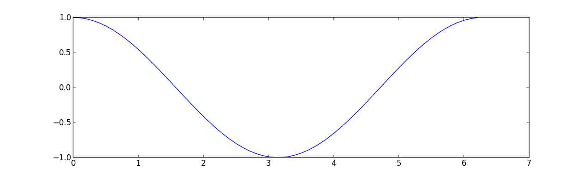

# 2.8 与 C 进行交互

# 2.8 与 C 进行交互

In [1]:

```py
%matplotlib inline
import numpy as np 
```

> **作者**: Valentin Haenel

本章包含了许多可以在 Python 使用原生代码（主要是 C/C++）方式的*介绍*，这个过程通常被称为*封装*。本章的目的是给你有哪些技术存在已经各自有优劣式的一点儿感觉，这样你可以根据你的具体需求选择适合的方式。无论如何，只要你开始做封装，你几乎都必然需要咨询你选定技术的文档。

章节内容

```py
简介
Python-C-Api
Ctypes
SWIG
Cython
总结
进一步阅读和参考
练习 
```

## 2.8.1 简介

本章将涵盖一下技术：

*   Python-C-Api
*   Ctypes
*   SWIG (简化封装器和接口生成器)
*   Cython

这四种技术可能是最知名的，其中 Cython 可能是最高级的，并且你应该最优先使用它。其他的技术也很重要，如果你想要从不同点角度理解封装问题。之前提到过，还有其他的替代技术，但是，理解了以上这些基础的，你就可以评估你选择的技术是否满足你的需求。

在评估技术时，下列标准会有帮助:

*   需要额外的库吗?
*   代码可以自动生成?
*   是否需要编译?
*   与 Numpy 数组交互是否有良好的支持?
*   是否支持 C++?

在你动手前，应该先考虑一下使用情景。在于原生代码交互时，通常来自于两个应用场景:

*   需要利用 C/C++中现存的代码，或者是因为它已经存在，或者是因为它更快。
*   Python 代码太慢，将内部循环变成原生代码

每个技术都使用来自 math.h 的`cos`函数的封装来进行演示。尽管这是一个无聊例子，但是它确实给我们很好的演示了封装方法的基础，因为每个技术也包含了一定程度 Numpy 支持，这也用计算一些数组来计算 consine 的例子来演示。

最后，两个小警示:

*   所有这些方法在 Python 解释器中都可能崩溃(细分错误)，因为在 C 代码中的错误。
*   所有的例子都在 Linux 中完成，他们应该在其他操作系统中也可用。
*   在大多数例子中，你都会需要 C 编译器。

## 2.8.2 Python-C-Api

Python-C-API 是标准 Python 解释器（即 CPython）的基础。使用这个 API 可以在 C 和 C++中写 Python 扩展模块。很明显，由于语言兼容性的优点，这些扩展模块可以调用任何用 C 或者 C++写的函数。

当使用 Python-C-API 时，人们通常写许多样板化的代码，首先解析函数接收的参数，然后构建返回的类型。

**优点**

*   不需要额外的库
*   许多系层的控制
*   C++完全可用

**不足**

*   可以需要一定的努力
*   高代码成本
*   必须编译
*   高维护成本
*   如果 C-API 改变无法向前兼容 Python 版本
*   引用计数错误很容易出现，但是很难被跟踪。

**注意** 此处的 Python-C-Api 例子主要是用来演示。许多其他例子的确依赖它，因此，对于它如何工作有一个高层次的理解。在 99%的使用场景下，使用替代技术会更好。

**注意** 因为引用计数很容易出现然而很难被跟踪，任何需要使用 Python C-API 的人都应该阅读[官方 Python 文档关于对象、类型和引用计数的部分](https://docs.python.org/2/c-api/intro.html#objects-types-and-reference-counts)。此外，有一个名为[cpychecker](https://gcc-python-plugin.readthedocs.org/en/latest/cpychecker.html)的工具可以发现引用计数的常见错误。

### 2.8.2.1 例子

下面的 C 扩展模块，让来自标准`math`库的`cos`函数在 Python 中可用:

In [ ]:

```py
/*  用 Python-C-API 封装来自 math.h 的 cos 函数的例子 */

#include <Python.h>
#include <math.h>

/*  wrapped cosine function */
static PyObject* cos_func(PyObject* self, PyObject* args)
{
    double value;
    double answer;

    /*  parse the input, from python float to c double */
    if (!PyArg_ParseTuple(args, "d", &value))
        return NULL;
    /* if the above function returns -1, an appropriate Python exception will
     * have been set, and the function simply returns NULL
     */

    /* call cos from libm */
    answer = cos(value);

    /*  construct the output from cos, from c double to python float */
    return Py_BuildValue("f", answer);
}

/*  define functions in module */
static PyMethodDef CosMethods[] =
{
     {"cos_func", cos_func, METH_VARARGS, "evaluate the cosine"},
     {NULL, NULL, 0, NULL}
};

/* module initialization */
PyMODINIT_FUNC

initcos_module(void)
{
     (void) Py_InitModule("cos_module", CosMethods);
} 
```

如你所见，有许多样板，既包括 «massage» 的参数和 return 类型以及模块初始化。尽管随着扩展的增长，这些东西中的一些是分期偿还，模板每个函数需要的模板还是一样的。

标准 python 构建系统`distutils`支持从`setup.py`编译 C-扩展, 非常方便:

In [ ]:

```py
from distutils.core import setup, Extension

# 定义扩展模块
cos_module = Extension('cos_module', sources=['cos_module.c'])

# 运行 setup
setup(ext_modules=[cos_module]) 
```

这可以被编译:

```py
 $ cd advanced/interfacing_with_c/python_c_api

$ ls
cos_module.c  setup.py

$ python setup.py build_ext --inplace
running build_ext
building 'cos_module' extension
creating build
creating build/temp.linux-x86_64-2.7
gcc -pthread -fno-strict-aliasing -g -O2 -DNDEBUG -g -fwrapv -O3 -Wall -Wstrict-prototypes -fPIC -I/home/esc/anaconda/include/python2.7 -c cos_module.c -o build/temp.linux-x86_64-2.7/cos_module.o
gcc -pthread -shared build/temp.linux-x86_64-2.7/cos_module.o -L/home/esc/anaconda/lib -lpython2.7 -o /home/esc/git-working/scipy-lecture-notes/advanced/interfacing_with_c/python_c_api/cos_module.so

$ ls
build/  cos_module.c  cos_module.so  setup.py 
```

*   `build_ext` 是构建扩展模块
*   `--inplace` 将把编译后的扩展模块输出到当前目录

文件`cos_module.so`包含编译后的扩展，我们可以在 IPython 解释器中加载它:

In [ ]:

```py
In [1]: import cos_module

In [2]: cos_module?
Type:       module
String Form:<module 'cos_module' from 'cos_module.so'>
File:       /home/esc/git-working/scipy-lecture-notes/advanced/interfacing_with_c/python_c_api/cos_module.so
Docstring:  <no docstring>

In [3]: dir(cos_module)
Out[3]: ['__doc__', '__file__', '__name__', '__package__', 'cos_func']

In [4]: cos_module.cos_func(1.0)
Out[4]: 0.5403023058681398

In [5]: cos_module.cos_func(0.0)
Out[5]: 1.0

In [6]: cos_module.cos_func(3.14159265359)
Out[7]: -1.0 
```

现在我们看一下这有多强壮:

In [ ]:

```py
In [10]: cos_module.cos_func('foo')
---------------------------------------------------------------------------
TypeError                                 Traceback (most recent call last)
<ipython-input-10-11bee483665d> in <module>()
----> 1 cos_module.cos_func('foo')

TypeError: a float is required 
```

### 2.8.2.2\. Numpy 支持

Numpy 模拟 Python-C-API, 自身也实现了 C-扩展, 产生了 Numpy-C-API。这个 API 可以被用来创建和操作来自 C 的 Numpy 数组, 当写一个自定义的 C-扩展。也可以看一下:参考:`advanced_numpy`。

**注意** 如果你确实需要使用 Numpy C-API 参考关于[Arrays](http://docs.scipy.org/doc/numpy/reference/c-api.array.html)和[Iterators](http://docs.scipy.org/doc/numpy/reference/c-api.iterator.html)的文档。

下列的例子显示如何将 Numpy 数组作为参数传递给函数，以及如果使用(旧)Numpy-C-API 在 Numpy 数组上迭代。它只是将一个数组作为参数应用到来自`math.h`的 cosine 函数，并且返回生成的新数组。

In [ ]:

```py
/*  使用 Numpy-C-API 封装来自 math.h 的 cos 函数 . */

#include <Python.h>
#include <numpy/arrayobject.h>
#include <math.h>

/*  封装 cosine 函数 */
static PyObject* cos_func_np(PyObject* self, PyObject* args)
{

    PyArrayObject *in_array;
    PyObject      *out_array;
    NpyIter *in_iter;
    NpyIter *out_iter;
    NpyIter_IterNextFunc *in_iternext;
    NpyIter_IterNextFunc *out_iternext;

    /*  parse single numpy array argument */
    if (!PyArg_ParseTuple(args, "O!", &PyArray_Type, &in_array))
        return NULL;

    /*  construct the output array, like the input array */
    out_array = PyArray_NewLikeArray(in_array, NPY_ANYORDER, NULL, 0);
    if (out_array == NULL)
        return NULL;

    /*  create the iterators */
    in_iter = NpyIter_New(in_array, NPY_ITER_READONLY, NPY_KEEPORDER,
                             NPY_NO_CASTING, NULL);
    if (in_iter == NULL)
        goto fail;

    out_iter = NpyIter_New((PyArrayObject *)out_array, NPY_ITER_READWRITE,
                          NPY_KEEPORDER, NPY_NO_CASTING, NULL);
    if (out_iter == NULL) {
        NpyIter_Deallocate(in_iter);
        goto fail;
    }

    in_iternext = NpyIter_GetIterNext(in_iter, NULL);
    out_iternext = NpyIter_GetIterNext(out_iter, NULL);
    if (in_iternext == NULL || out_iternext == NULL) {
        NpyIter_Deallocate(in_iter);
        NpyIter_Deallocate(out_iter);
        goto fail;
    }
    double ** in_dataptr = (double **) NpyIter_GetDataPtrArray(in_iter);
    double ** out_dataptr = (double **) NpyIter_GetDataPtrArray(out_iter);

    /*  iterate over the arrays */
    do {
        **out_dataptr = cos(**in_dataptr);
    } while(in_iternext(in_iter) && out_iternext(out_iter));

    /*  clean up and return the result */
    NpyIter_Deallocate(in_iter);
    NpyIter_Deallocate(out_iter);
    Py_INCREF(out_array);
    return out_array;

    /*  in case bad things happen */
    fail:
        Py_XDECREF(out_array);
        return NULL;
}

/*  在模块中定义函数 */
static PyMethodDef CosMethods[] =
{
     {"cos_func_np", cos_func_np, METH_VARARGS,
         "evaluate the cosine on a numpy array"},
     {NULL, NULL, 0, NULL}
};

/* 模块初始化 */
PyMODINIT_FUNC
initcos_module_np(void)
{
     (void) Py_InitModule("cos_module_np", CosMethods);
     /* IMPORTANT: this must be called */
     import_array();
} 
```

要编译这个模块，我们可以再用`distutils`。但是我们需要通过使用 func:numpy.get_include 确保包含了 Numpy 头部:

In [ ]:

```py
from distutils.core import setup, Extension
import numpy

# define the extension module
cos_module_np = Extension('cos_module_np', sources=['cos_module_np.c'],
                          include_dirs=[numpy.get_include()])

# run the setup
setup(ext_modules=[cos_module_np]) 
```

要说服我们自己这个方式确实有效，我们来跑一下下面的测试脚本:

In [ ]:

```py
import cos_module_np
import numpy as np
import pylab

x = np.arange(0, 2 * np.pi, 0.1)
y = cos_module_np.cos_func_np(x)
pylab.plot(x, y)
pylab.show() 
```

这会产生以下的图像:



## 2.8.3\. Ctypes

Ctypes 是 Python 的一个外来函数库。它提供了 C 兼容的数据类型，并且允许在 DLLs 或者共享的库中调用函数。它可以用来在纯 Python 中封装这些库。

**优点**

*   Python 标准库的一部分
*   不需要编译
*   代码封装都是在 Python 中

**不足**

*   需要代码作为一个共享的库（粗略地说，在 windows 中是 *.dll，在 Linux 中是*.so，在 Mac OSX 中是 *.dylib）
*   对 C++支持并不好

### 2.8.3.1 例子

如前面提到的，代码封装完全在 Python 中。

In [ ]:

```py
""" 用 ctypes 封装来自 math.h 的 cos 函数。 """

import ctypes
from ctypes.util import find_library

# find and load the library
libm = ctypes.cdll.LoadLibrary(find_library('m'))
# set the argument type
libm.cos.argtypes = [ctypes.c_double]
# set the return type
libm.cos.restype = ctypes.c_double

def cos_func(arg):
    ''' 封装 math.h cos 函数 '''
    return libm.cos(arg) 
```

*   寻找和加载库可能非常依赖于你的操作系统，检查[文档](https://docs.python.org/2/library/ctypes.html#loading-dynamic-link-libraries)来了解细节
*   这可能有些欺骗性，因为 math 库在系统中已经是编译模式。如果你想要封装一个内置的库，需要先编译它，可能需要或者不需要额外的工作。 我们现在可以像前面一样使用这个库：

In [ ]:

```py
In [1]: import cos_module

In [2]: cos_module?
Type:       module
String Form:<module 'cos_module' from 'cos_module.py'>
File:       /home/esc/git-working/scipy-lecture-notes/advanced/interfacing_with_c/ctypes/cos_module.py
Docstring:  <no docstring>

In [3]: dir(cos_module)
Out[3]:
['__builtins__',
 '__doc__',
 '__file__',
 '__name__',
 '__package__',
 'cos_func',
 'ctypes',
 'find_library',
 'libm']

In [4]: cos_module.cos_func(1.0)
Out[4]: 0.5403023058681398

In [5]: cos_module.cos_func(0.0)
Out[5]: 1.0

In [6]: cos_module.cos_func(3.14159265359)
Out[6]: -1.0 
```

### 2.8.3.2 Numpy 支持

Numpy 包含一些与 ctypes 交互的支持。特别是支持将特定 Numpy 数组属性作为 ctypes 数据类型研究，并且有函数可以将 C 数组和 Numpy 数据互相转换。

更多信息，可以看一下 Numpy 手册的对应部分或者`numpy.ndarray.ctypes`和`numpy.ctypeslib`的 API 文档。

对于下面的例子，让我们假设一个 C 函数，输入输出都是一个数组，计算输入数组的 cosine 并将结果输出为一个数组。

库包含下列头文件（尽管在这个例子中并不是必须这样，为了完整，我们还是把这一步列出来):

In [ ]:

```py
void cos_doubles(double * in_array, double * out_array, int size); 
```

这个函数实现在下列的 C 源文件中:

In [ ]:

```py
#include <math.h>

/*  Compute the cosine of each element in in_array, storing the result in
 *  out_array. */
void cos_doubles(double * in_array, double * out_array, int size){
    int i;
    for(i=0;i<size;i++){
        out_array[i] = cos(in_array[i]);
    }
} 
```

并且因为这个库是纯 C 的，我们不能使用`distutils`来编译，但是，必须使用`make`和`gcc`的组合:

In [ ]:

```py
m.PHONY : clean

libcos_doubles.so : cos_doubles.o
    gcc -shared -Wl,-soname,libcos_doubles.so -o libcos_doubles.so cos_doubles.o

cos_doubles.o : cos_doubles.c
    gcc -c -fPIC cos_doubles.c -o cos_doubles.o

clean :
    -rm -vf libcos_doubles.so cos_doubles.o cos_doubles.pyc 
```

接下来，我们可以将这个库编译到共享的库 (on Linux)`libcos_doubles.so`:

In [ ]:

```py
$ ls
cos_doubles.c  cos_doubles.h  cos_doubles.py  makefile  test_cos_doubles.py
$ make
gcc -c -fPIC cos_doubles.c -o cos_doubles.o
gcc -shared -Wl,-soname,libcos_doubles.so -o libcos_doubles.so cos_doubles.o
$ ls
cos_doubles.c  cos_doubles.o   libcos_doubles.so*  test_cos_doubles.py
cos_doubles.h  cos_doubles.py  makefile 
```

现在我们可以继续通过 ctypes 对 Numpy 数组的直接支持（一定程度上）来封装这个库:

In [ ]:

```py
""" 封装一个使用 numpy.ctypeslib 接受 C 双数组作为输入的例子。"""

import numpy as np
import numpy.ctypeslib as npct
from ctypes import c_int

# cos_doubles 的输入类型
# 必须是双数组, 有相邻的单维度
array_1d_double = npct.ndpointer(dtype=np.double, ndim=1, flags='CONTIGUOUS')

# 加载库，运用 numpy 机制
libcd = npct.load_library("libcos_doubles", ".")

# 设置反馈类型和参数类型
libcd.cos_doubles.restype = None
libcd.cos_doubles.argtypes = [array_1d_double, array_1d_double, c_int]

def cos_doubles_func(in_array, out_array):
    return libcd.cos_doubles(in_array, out_array, len(in_array)) 
```

*   注意临近单维度 Numpy 数组的固有限制，因为 C 函数需要这类的缓存器。
*   也需要注意输出数组也需要是预分配的，例如[numpy.zeros()](http://docs.scipy.org/doc/numpy/reference/generated/numpy.zeros.html#numpy.zeros)和函数将用它的缓存器来写。
*   尽管`cos_doubles`函数的原始签名是`ARRAY`, `ARRAY`, `int`最终的`cos_doubles_func`需要两个 Numpy 数组作为参数。

并且，和前面一样，我们我要为自己证明一下它是有效的:

In [ ]:

```py
import numpy as np
import pylab
import cos_doubles

x = np.arange(0, 2 * np.pi, 0.1)
y = np.empty_like(x)

cos_doubles.cos_doubles_func(x, y)
pylab.plot(x, y)
pylab.show() 
```


## 2.8.4 SWIG

[SWIG](http://www.swig.org/), 简化封装接口生成器，是一个联接用 C 和 C++写的程序与需要高级程序语言，包括 Python 的软件开发工具。SWIG 的重点在于它可以为你自动生成封装器代码。尽管从编程时间上来说这是一个优势，但是同时也是一个负担。生成的文件通常很大，并且可能并不是人类可读的，封装过程造成的多层间接引用可能很难理解。

**注意** 自动生成的 C 代码使用 Python-C-Api。

**优势**

*   给定头部可以自动封装整个库
*   在 C++中表现良好

**不足**

*   自动生成的文件很庞大
*   如果出错很难 debug
*   陡峭的学习曲线

### 2.8.4.1 例子

让我们想象我们的`cos`函数存在于用 C 写的`cos_module`中，包含在源文件`cos_module.c`中:

In [ ]:

```py
#include <math.h>

double cos_func(double arg){
    return cos(arg);
} 
```

头文件`cos_module.h`:

In [ ]:

```py
double cos_func(double arg); 
```

尽管我们的目的是将`cos_func`暴露给 Python。要用 SWIG 来完成这个目的，我们需要写一个包含 SWIG 指导的接口文件。

In [ ]:

```py
/*  Example of wrapping cos function from math.h using SWIG. */

%module cos_module
%{
    /* the resulting C file should be built as a python extension */
    #define SWIG_FILE_WITH_INIT
    /*  Includes the header in the wrapper code */
    #include "cos_module.h"
%}
/*  Parse the header file to generate wrappers */
%include "cos_module.h" 
```

如你所见，这里不需要太多的代码。对于这个简单的例子，它简单到只需要在接口文件中包含一个头文件，来向 Python 暴露函数。但是，SWIG 确实允许更多精细包含或者排除在头文件中发现的函数，细节检查一下文档。

生成编译的封装器是一个两阶段的过程:

*   在接口文件上运行`swig`可执行文件来生成文件`cos_module_wrap.c`, 其源文件是自动生成的 Python C-extension 和`cos_module.py`, 是自动生成的 Python 模块。

*   编译`cos_module_wrap.c`到`_cos_module.so`。幸运的，`distutils`知道如何处理 SWIG 接口文件, 因此我们的`setup.py`是很简单的:

In [ ]:

```py
from distutils.core import setup, Extension

setup(ext_modules=[Extension("_cos_module",
      sources=["cos_module.c", "cos_module.i"])]) 
```

In [ ]:

```py
$ cd advanced/interfacing_with_c/swig

$ ls
cos_module.c  cos_module.h  cos_module.i  setup.py

$ python setup.py build_ext --inplace
running build_ext
building '_cos_module' extension
swigging cos_module.i to cos_module_wrap.c
swig -python -o cos_module_wrap.c cos_module.i
creating build
creating build/temp.linux-x86_64-2.7
gcc -pthread -fno-strict-aliasing -g -O2 -DNDEBUG -g -fwrapv -O3 -Wall -Wstrict-prototypes -fPIC -I/home/esc/anaconda/include/python2.7 -c cos_module.c -o build/temp.linux-x86_64-2.7/cos_module.o
gcc -pthread -fno-strict-aliasing -g -O2 -DNDEBUG -g -fwrapv -O3 -Wall -Wstrict-prototypes -fPIC -I/home/esc/anaconda/include/python2.7 -c cos_module_wrap.c -o build/temp.linux-x86_64-2.7/cos_module_wrap.o
gcc -pthread -shared build/temp.linux-x86_64-2.7/cos_module.o build/temp.linux-x86_64-2.7/cos_module_wrap.o -L/home/esc/anaconda/lib -lpython2.7 -o /home/esc/git-working/scipy-lecture-notes/advanced/interfacing_with_c/swig/_cos_module.so

$ ls
build/  cos_module.c  cos_module.h  cos_module.i  cos_module.py  _cos_module.so*  cos_module_wrap.c  setup.py 
```

我们可以像前面的例子中那样加载和运行`cos_module`:

In [ ]:

```py
In [1]: import cos_module

In [2]: cos_module?
Type:       module
String Form:<module 'cos_module' from 'cos_module.py'>
File:       /home/esc/git-working/scipy-lecture-notes/advanced/interfacing_with_c/swig/cos_module.py
Docstring:  <no docstring>

In [3]: dir(cos_module)
Out[3]:
['__builtins__',
 '__doc__',
 '__file__',
 '__name__',
 '__package__',
 '_cos_module',
 '_newclass',
 '_object',
 '_swig_getattr',
 '_swig_property',
 '_swig_repr',
 '_swig_setattr',
 '_swig_setattr_nondynamic',
 'cos_func']

In [4]: cos_module.cos_func(1.0)
Out[4]: 0.5403023058681398

In [5]: cos_module.cos_func(0.0)
Out[5]: 1.0

In [6]: cos_module.cos_func(3.14159265359)
Out[6]: -1.0 
```

接下来我们测试一下强壮性，我们看到我们可以获得一个更多的错误信息 (虽然, 严格来讲在 Python 中没有 double 类型):

In [ ]:

```py
In [7]: cos_module.cos_func('foo')
---------------------------------------------------------------------------
TypeError                                 Traceback (most recent call last)
<ipython-input-7-11bee483665d> in <module>()
----> 1 cos_module.cos_func('foo')

TypeError: in method 'cos_func', argument 1 of type 'double' 
```

### 2.8.4.2 Numpy 支持

Numpy 在`numpy.i`文件中提供了[SWIG 的支持](http://docs.scipy.org/doc/numpy/reference/swig.html)。这个接口文件定义了许多所谓的 typemaps，支持了 Numpy 数组和 C-Arrays 的转化。在接下来的例子中，我们将快速看一下 typemaps 实际是如何工作的。

我们有相同的`cos_doubles`函数，在 ctypes 例子中:

In [ ]:

```py
void cos_doubles(double * in_array, double * out_array, int size); 
```

In [ ]:

```py
#include <math.h>

/*  Compute the cosine of each element in in_array, storing the result in
 *  out_array. */
void cos_doubles(double * in_array, double * out_array, int size){
    int i;
    for(i=0;i<size;i++){
        out_array[i] = cos(in_array[i]);
    }
} 
```

使用了 SWIG 接口文件封装了`cos_doubles_func`:

In [ ]:

```py
/*  Example of wrapping a C function that takes a C double array as input using
 *  numpy typemaps for SWIG. */

%module cos_doubles
%{
    /* the resulting C file should be built as a python extension */
    #define SWIG_FILE_WITH_INIT
    /*  Includes the header in the wrapper code */
    #include "cos_doubles.h"
%}

/*  include the numpy typemaps */
%include "numpy.i"
/*  need this for correct module initialization */
%init %{
    import_array();
%}

/*  typemaps for the two arrays, the second will be modified in-place */
%apply (double* IN_ARRAY1, int DIM1) {(double * in_array, int size_in)}
%apply (double* INPLACE_ARRAY1, int DIM1) {(double * out_array, int size_out)}

/*  Wrapper for cos_doubles that massages the types */
%inline %{
    /*  takes as input two numpy arrays */
    void cos_doubles_func(double * in_array, int size_in, double * out_array, int size_out) {
        /*  calls the original funcion, providing only the size of the first */
        cos_doubles(in_array, out_array, size_in);
    }
%} 
```

*   要使用 Numpy 的 typemaps, 我们需要包含`numpy.i`文件。
*   观察一下对`import_array()`的调用，这个模块我们已经在 Numpy-C-API 例子中遇到过。
*   因为类型映射只支持 ARRAY、SIZE 的签名，我们需要将 cos_doubles 封装为 cos_doubles_func，接收两个数组包括大小作为输入。
*   与 SWIG 不同的是, 我们并没有包含`cos_doubles.h`头部，我们并不需要暴露给 Python，因为，我们通过`cos_doubles_func`暴露了相关的功能。

并且，和之前一样，我们可以用`distutils`来封装这个函数:

In [ ]:

```py
from distutils.core import setup, Extension
import numpy

setup(ext_modules=[Extension("_cos_doubles",
      sources=["cos_doubles.c", "cos_doubles.i"],
      include_dirs=[numpy.get_include()])]) 
```

和前面一样，我们需要用`include_dirs`来制定位置。

In [ ]:

```py
$ ls
cos_doubles.c  cos_doubles.h  cos_doubles.i  numpy.i  setup.py  test_cos_doubles.py
$ python setup.py build_ext -i
running build_ext
building '_cos_doubles' extension
swigging cos_doubles.i to cos_doubles_wrap.c
swig -python -o cos_doubles_wrap.c cos_doubles.i
cos_doubles.i:24: Warning(490): Fragment 'NumPy_Backward_Compatibility' not found.
cos_doubles.i:24: Warning(490): Fragment 'NumPy_Backward_Compatibility' not found.
cos_doubles.i:24: Warning(490): Fragment 'NumPy_Backward_Compatibility' not found.
creating build
creating build/temp.linux-x86_64-2.7
gcc -pthread -fno-strict-aliasing -g -O2 -DNDEBUG -g -fwrapv -O3 -Wall -Wstrict-prototypes -fPIC -I/home/esc/anaconda/lib/python2.7/site-packages/numpy/core/include -I/home/esc/anaconda/include/python2.7 -c cos_doubles.c -o build/temp.linux-x86_64-2.7/cos_doubles.o
gcc -pthread -fno-strict-aliasing -g -O2 -DNDEBUG -g -fwrapv -O3 -Wall -Wstrict-prototypes -fPIC -I/home/esc/anaconda/lib/python2.7/site-packages/numpy/core/include -I/home/esc/anaconda/include/python2.7 -c cos_doubles_wrap.c -o build/temp.linux-x86_64-2.7/cos_doubles_wrap.o
In file included from /home/esc/anaconda/lib/python2.7/site-packages/numpy/core/include/numpy/ndarraytypes.h:1722,
                 from /home/esc/anaconda/lib/python2.7/site-packages/numpy/core/include/numpy/ndarrayobject.h:17,
                 from /home/esc/anaconda/lib/python2.7/site-packages/numpy/core/include/numpy/arrayobject.h:15,
                 from cos_doubles_wrap.c:2706:
/home/esc/anaconda/lib/python2.7/site-packages/numpy/core/include/numpy/npy_deprecated_api.h:11:2: warning: #warning "Using deprecated NumPy API, disable it by #defining NPY_NO_DEPRECATED_API NPY_1_7_API_VERSION"
gcc -pthread -shared build/temp.linux-x86_64-2.7/cos_doubles.o build/temp.linux-x86_64-2.7/cos_doubles_wrap.o -L/home/esc/anaconda/lib -lpython2.7 -o /home/esc/git-working/scipy-lecture-notes/advanced/interfacing_with_c/swig_numpy/_cos_doubles.so
$ ls
build/         cos_doubles.h  cos_doubles.py    cos_doubles_wrap.c  setup.py
cos_doubles.c  cos_doubles.i  _cos_doubles.so*  numpy.i             test_cos_doubles.py 
```

并且，和前面一样，我们来验证一下它工作正常:

In [ ]:

```py
import numpy as np
import pylab
import cos_doubles

x = np.arange(0, 2 * np.pi, 0.1)
y = np.empty_like(x)

cos_doubles.cos_doubles_func(x, y)
pylab.plot(x, y)
pylab.show() 
```


## 2.8.5 Cython

Cython 既是写 C 扩展的类 Python 语言，也是这种语言的编译器。Cython 语言是 Python 的超集，带有额外的结构，允许你调用 C 函数和 C 类型的注释变量和类属性。在这个意义上，可以称之为带有类型的 Python。

除了封装原生代码的基础应用案例，Cython 也支持额外的应用案例，即交互优化。从根本上来说，从纯 Python 脚本开始，向瓶颈代码逐渐增加 Cython 类型来优化那些确实有影响的代码。

在这种情况下，与 SWIG 很相似，因为代码可以自动生成，但是，从另一个角度来说，又与 ctypes 很类似，因为，封装代码（大部分）是用 Python 写的。

尽管其他自动生成代码的解决方案很难 debug（比如 SWIG），Cython 有一个 GNU debugger 扩展来帮助 debug Python，Cython 和 C 代码。

**注意** 自动生成的 C 代码使用 Python-C-Api。

**优点**

*   类 Python 语言来写扩展
*   自动生成代码
*   支持增量优化
*   包含一个 GNU debugger 扩展
*   支持 C++ (从版本 0.13) **不足**
*   必须编译
*   需要额外的库 ( 只是在 build 的时候, 在这个问题中，可以通过运送生成的 C 文件来克服)

### 2.8.5.1 例子

`cos_module`的主要 Cython 代码包含在文件`cos_module.pyx`中:

In [ ]:

```py
""" Example of wrapping cos function from math.h using Cython. """

cdef extern from "math.h":
    double cos(double arg)

def cos_func(arg):
    return cos(arg) 
```

注意额外的关键词，比如`cdef`和`extern`。同时，`cos_func`也是纯 Python。

和前面一样，我们可以使用标准的`distutils`模块，但是，这次我们需要一些来自于`Cython.Distutils`的更多代码:

In [ ]:

```py
from distutils.core import setup, Extension
from Cython.Distutils import build_ext

setup(
    cmdclass={'build_ext': build_ext},
    ext_modules=[Extension("cos_module", ["cos_module.pyx"])]
) 
```

编译这个模块:

In [ ]:

```py
$ cd advanced/interfacing_with_c/cython
$ ls
cos_module.pyx  setup.py
$ python setup.py build_ext --inplace
running build_ext
cythoning cos_module.pyx to cos_module.c
building 'cos_module' extension
creating build
creating build/temp.linux-x86_64-2.7
gcc -pthread -fno-strict-aliasing -g -O2 -DNDEBUG -g -fwrapv -O3 -Wall -Wstrict-prototypes -fPIC -I/home/esc/anaconda/include/python2.7 -c cos_module.c -o build/temp.linux-x86_64-2.7/cos_module.o
gcc -pthread -shared build/temp.linux-x86_64-2.7/cos_module.o -L/home/esc/anaconda/lib -lpython2.7 -o /home/esc/git-working/scipy-lecture-notes/advanced/interfacing_with_c/cython/cos_module.so
$ ls
build/  cos_module.c  cos_module.pyx  cos_module.so*  setup.py 
```

并且运行:

In [ ]:

```py
In [1]: import cos_module

In [2]: cos_module?
Type:       module
String Form:<module 'cos_module' from 'cos_module.so'>
File:       /home/esc/git-working/scipy-lecture-notes/advanced/interfacing_with_c/cython/cos_module.so
Docstring:  <no docstring>

In [3]: dir(cos_module)
Out[3]:
['__builtins__',
 '__doc__',
 '__file__',
 '__name__',
 '__package__',
 '__test__',
 'cos_func']

In [4]: cos_module.cos_func(1.0)
Out[4]: 0.5403023058681398

In [5]: cos_module.cos_func(0.0)
Out[5]: 1.0

In [6]: cos_module.cos_func(3.14159265359)
Out[6]: -1.0 
```

并且，测试一下强壮性，我们可以看到我们得到了更好的错误信息:

In [ ]:

```py
In [7]: cos_module.cos_func('foo')
---------------------------------------------------------------------------
TypeError                                 Traceback (most recent call last)
<ipython-input-7-11bee483665d> in <module>()
----> 1 cos_module.cos_func('foo')

/home/esc/git-working/scipy-lecture-notes/advanced/interfacing_with_c/cython/cos_module.so in cos_module.cos_func (cos_module.c:506)()

TypeError: a float is required 
```

此外，不需要 Cython 完全传输到 C math 库的声明，上面的代码可以简化为:

In [ ]:

```py
""" Simpler example of wrapping cos function from math.h using Cython. """

from libc.math cimport cos

def cos_func(arg):
    return cos(arg) 
```

在这种情况下，`cimport`语句用于导入`cos`函数。

### 2.8.5.2 Numpy 支持

Cython 通过`numpy.pyx`文件支持 Numpy，允许你为你的 Cython 代码添加 Numpy 数组类型，即就像指定变量`i`是`int`类型，你也可以指定变量`a`是带有给定的`dtype`的`numpy.ndarray`。同时，同时特定的优化比如边际检查也是支持的。看一下[Cython 文档](http://docs.cython.org/src/tutorial/numpy.html)的对应部分。如果你想要将 Numpy 数组作为 C 数组传递给 Cython 封装的 C 函数，在[Cython wiki](http://wiki.cython.org/tutorials/NumpyPointerToC)上有对应的部分。

在下面的例子中，我们将演示如何用 Cython 来封装类似的`cos_doubles`。

In [ ]:

```py
void cos_doubles(double * in_array, double * out_array, int size); 
```

In [ ]:

```py
#include <math.h>

/*  Compute the cosine of each element in in_array, storing the result in
 *  out_array. */
void cos_doubles(double * in_array, double * out_array, int size){
    int i;
    for(i=0;i<size;i++){
        out_array[i] = cos(in_array[i]);
    }
} 
```

这个函数使用下面的 Cython 代码来封装`cos_doubles_func`:

In [ ]:

```py
""" Example of wrapping a C function that takes C double arrays as input using
 the Numpy declarations from Cython """

# cimport the Cython declarations for numpy
cimport numpy as np

# if you want to use the Numpy-C-API from Cython
# (not strictly necessary for this example, but good practice)
np.import_array()

# cdefine the signature of our c function
cdef extern from "cos_doubles.h":
    void cos_doubles (double * in_array, double * out_array, int size)

# create the wrapper code, with numpy type annotations
def cos_doubles_func(np.ndarray[double, ndim=1, mode="c"] in_array not None,
                     np.ndarray[double, ndim=1, mode="c"] out_array not None):
    cos_doubles(<double*> np.PyArray_DATA(in_array),
                <double*> np.PyArray_DATA(out_array),
                in_array.shape[0]) 
```

可以使用`distutils`来编译:

In [ ]:

```py
from distutils.core import setup, Extension
import numpy
from Cython.Distutils import build_ext

setup(
    cmdclass={'build_ext': build_ext},
    ext_modules=[Extension("cos_doubles",
                 sources=["_cos_doubles.pyx", "cos_doubles.c"],
                 include_dirs=[numpy.get_include()])],
) 
```

与前面的编译 Numpy 例子类似，我们需要`include_dirs`选项。

In [ ]:

```py
$ ls
cos_doubles.c  cos_doubles.h  _cos_doubles.pyx  setup.py  test_cos_doubles.py
$ python setup.py build_ext -i
running build_ext
cythoning _cos_doubles.pyx to _cos_doubles.c
building 'cos_doubles' extension
creating build
creating build/temp.linux-x86_64-2.7
gcc -pthread -fno-strict-aliasing -g -O2 -DNDEBUG -g -fwrapv -O3 -Wall -Wstrict-prototypes -fPIC -I/home/esc/anaconda/lib/python2.7/site-packages/numpy/core/include -I/home/esc/anaconda/include/python2.7 -c _cos_doubles.c -o build/temp.linux-x86_64-2.7/_cos_doubles.o
In file included from /home/esc/anaconda/lib/python2.7/site-packages/numpy/core/include/numpy/ndarraytypes.h:1722,
                 from /home/esc/anaconda/lib/python2.7/site-packages/numpy/core/include/numpy/ndarrayobject.h:17,
                 from /home/esc/anaconda/lib/python2.7/site-packages/numpy/core/include/numpy/arrayobject.h:15,
                 from _cos_doubles.c:253:
/home/esc/anaconda/lib/python2.7/site-packages/numpy/core/include/numpy/npy_deprecated_api.h:11:2: warning: #warning "Using deprecated NumPy API, disable it by #defining NPY_NO_DEPRECATED_API NPY_1_7_API_VERSION"
/home/esc/anaconda/lib/python2.7/site-packages/numpy/core/include/numpy/__ufunc_api.h:236: warning: ‘_import_umath’ defined but not used
gcc -pthread -fno-strict-aliasing -g -O2 -DNDEBUG -g -fwrapv -O3 -Wall -Wstrict-prototypes -fPIC -I/home/esc/anaconda/lib/python2.7/site-packages/numpy/core/include -I/home/esc/anaconda/include/python2.7 -c cos_doubles.c -o build/temp.linux-x86_64-2.7/cos_doubles.o
gcc -pthread -shared build/temp.linux-x86_64-2.7/_cos_doubles.o build/temp.linux-x86_64-2.7/cos_doubles.o -L/home/esc/anaconda/lib -lpython2.7 -o /home/esc/git-working/scipy-lecture-notes/advanced/interfacing_with_c/cython_numpy/cos_doubles.so
$ ls
build/  _cos_doubles.c  cos_doubles.c  cos_doubles.h  _cos_doubles.pyx  cos_doubles.so*  setup.py  test_cos_doubles.py 
```

和前面一样，我们来验证一下它是有效的:

In [ ]:

```py
import numpy as np
import pylab
import cos_doubles

x = np.arange(0, 2 * np.pi, 0.1)
y = np.empty_like(x)

cos_doubles.cos_doubles_func(x, y)
pylab.plot(x, y)
pylab.show() 
```


### 2.8.6 总结

这个部分演示了四种与原生代码交互的技术。下表概述了这些技术的一些方面。

| x | Part of CPython | Compiled | Autogenerated | Numpy Support |
| --- | --- | --- | --- | --- |
| Python-C-API | True | True | False | True |
| Ctypes | True | False | False | True |
| Swig | False | True | True | True |
| Cython | False | True | True | True |

在上面的技术中，Cython 是最现代最高级的。特别是，通过为 Python 代码添加类型来增量优化代码的技术是惟一的。

## 2.8.7 Further Reading and References

[Gaël Varoquaux 关于避免数据复制的博客](http://gael-varoquaux.info/blog/?p=157)给出了一些如何精明的处理内存管理的见解。如果你在大数据量时出现问题，可以回到这里寻找一些灵感。

## 2.8.8 练习

因为这是一个新部分，练习更像是一个接下来应该查看什么的指示器，因此，看一下那些你觉得更有趣的部分。如果你有关于练习更好点子，请告诉我们！

*   下载每个例子的源码，并且在你的机器上运行并编译他们。
*   对每个例子做一些修改，并且自己验证一下是否有效。 ( 比如，将 cos 改为 sin。)
*   绝大多数例子，特别是包含了 Numpy 的例子，可能还是比较脆弱，对输入错误反应较差。找一些方法来让例子崩溃，找出问题所在，并且设计潜在的解决方案。这些是有些点子:

    *   数字溢出
    *   输入输出数组长度不一致
    *   多维度数据
    *   空数组
    *   non-double 类型数组
*   使用`%timeit`IPython 魔法函数来测量不同解决方案的执行时间

### 2.8.8.1 Python-C-API

*   修改 Numpy 例子以便函数有两个输入参数，第二个参数是预分配输出数组，让它与其他的 Numpy 例子一致。
*   修改这个例子，以便这个函数只有一个输入数组，在原地修改这个函数。
*   试着用新的[Numpy 迭代协议](http://docs.scipy.org/doc/numpy/reference/c-api.iterator.html)修改例子。如果你刚好获得了一个可用的解决方案，请将其提交一个请求到 github。
*   你可能注意到了，Numpy-C-API 例子只是 Numpy 例子没有封装`cos_doubles`但是直接将`cos`函数应用于 Numpy 数组的元素上。这样做与其他技术相比有什么优势。
*   你可以只用 Numpy-C-API 来封装`cos_doubles`。你可能需要确保数组有正确的类型，并且是单维度和内存临近。

### 2.8.8.2 Ctypes

*   修改 Numpy 例子以便`cos_doubles_func`为你处理预分配，让它更像 Numpy-C-API 例子。

### 2.8.8.3\. SWIG

*   看一下 SWIG 自动生成的代码，你能理解多少?
*   修改 Numpy 例子，以便`cos_doubles_func`为你处理预处理，让它更像 Numpy-C-API 例子。
*   修改`cos_doubles` C 函数，以便它返回分配的数组。你可以用 SWIG typemaps 类封装吗? 如果不可以，为什么不可以? 对于这种特殊的情况有没有什么变通方法? (提示: 你知道输出数组的大小, 因此，可以从返回的`double \*`构建 Numpy 数组。

### 2.8.8.4 Cython

*   看一下 Cython 自动生成的代码。仔细看一下 Cython 插入的一些评论。你能看到些什么?
*   看一下 Cython 文档中[与 Numpy 工作](http://docs.cython.org/src/tutorial/numpy.html)的部分, 学习一下如何使用 Numpy 增量优化 python 脚本。
*   修改 Numpy 例子，以便`cos_doubles_func`为你处理预处理，让它更像 Numpy-C-API 例子。