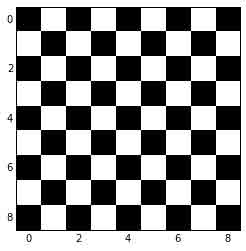

# 3.3 Scikit-image：图像处理

> **作者**: Emmanuelle Gouillart

[scikit-image](http://scikit-image.org/)是专注于图像处理的 Python 包，并且使用原生的 Numpy 数组作为图像对象。本章描述如何在不同图像处理任务上使用`scikit-image`，并且保留了其他科学 Python 模块比如 Numpy 和 Scipy 的链接。

**也可以看一下：**对于基本图像处理，比如图像剪切或者简单过滤，大量简单操作可以用 Numpy 和 SciPy 来实现。看一下[使用 Numpy 和 Scipy 图像操作和处理部分](http://www.scipy-lectures.org/advanced/image_processing/index.html#basic-image)。

注意，在阅读本章之前你应该熟悉前面章节的内容，比如基础操作，比如面具和标签作为先决条件。

**章节内容**

*   **介绍和观点**
    *   `scikit-image` 和 `SciPy`生态系统
    *   `scikit-image`能发现什么
*   **输入/输出, 数据类型和 颜色空间**
    *   数据类型
    *   颜色空间
*   **图像预处理/增强**
    *   本地过滤器
    *   非-本地过滤器
    *   数学形态学
*   **图像细分**
    *   二元细分: 前景 + 背景
    *   基于标记的方法
*   **测量区域的属性**
*   **数据可视化和交互**

## 3.3.1 介绍和观点

图像是 NumPy 的数组`np.ndarray`

| 图像: | np.ndarray |
| --- | --- |
| 像素: | array values: a[2, 3] |
| 渠道: | array dimensions |
| 图像编码: | dtype (np.uint8, np.uint16, np.float) |
| 过滤器: | functions (numpy, skimage, scipy) |

In [1]:

```py
%matplotlib inline
import numpy as np
check = np.zeros((9, 9))
check[::2, 1::2] = 1
check[1::2, ::2] = 1
import matplotlib.pyplot as plt
plt.imshow(check, cmap='gray', interpolation='nearest') 
```

Out[1]:

```py
<matplotlib.image.AxesImage at 0x105717610> 
```



### 3.3.1.1 scikit-image 和 SciPy 生态系统

最新版的`scikit-image`包含在大多数的科学 Python 发行版中，比如，Anaconda 或 Enthought Canopy。它也包含在 Ubuntu/Debian。

In [6]:

```py
import skimage
from skimage import data  # 大多数函数在子包中 
```

大多数`scikit-image`函数用 NumPy ndarrays 作为参数

In [6]:

```py
camera = data.camera()
camera.dtype 
```

Out[6]:

```py
dtype('uint8') 
```

In [7]:

```py
camera.shape 
```

Out[7]:

```py
(512, 512) 
```

In [8]:

```py
from skimage import restoration
filtered_camera = restoration.denoise_bilateral(camera)
type(filtered_camera) 
```

Out[8]:

```py
numpy.ndarray 
```

其他 Python 包也可以用于图像处理，并且使用 Numpy 数组:

*   [scipy.ndimage](http://docs.scipy.org/doc/scipy/reference/ndimage.html#module-scipy.ndimage) : 对于 nd-arrays。基础过滤、数学形态学和区域属性
*   [Mahotas](http://luispedro.org/software/mahotas) 同时，强大的图形处理库有 Python 封装:
*   [OpenCV](https://opencv-python-tutroals.readthedocs.org/en/latest/) (计算机视觉)
*   [ITK](http://www.itk.org/itkindex.html) (3D 图像和注册)
*   其他 (但是，他们没有那么 Pythonic 也没有 Numpy 友好，在一定范围)。

### 3.3.1.2 scikit-image 能发现什么

*   网站: [`scikit-image.org/`](http://scikit-image.org/)
*   例子库 (就像在 [matplotlib](http://matplotlib.org/gallery.html) 或 [scikit-learn](http://scikit-learn.org/)): [`scikit-image.org/docs/stable/auto_examples/`](http://scikit-image.org/docs/stable/auto_examples/) 不同类的函数，从基本的使用函数到高级最新算法。

*   过滤器: 函数将图像转化为其他图像。

    *   NumPy 组件
    *   通用过滤器算法
*   数据简化函数: 计算图像直方图、局部极值位置、角。
*   其他动作: I/O, 可视化，等。

## 3.3.2 输入/输出, 数据类型和颜色空间

I/O: [skimage.io](http://scikit-image.org/docs/stable/api/skimage.io.html#module-skimage.io)

In [4]:

```py
from skimage import io 
```

读取文件: [skimage.io.imread()](http://scikit-image.org/docs/stable/api/skimage.io.html#skimage.io.imread)

In [7]:

```py
import os
filename = os.path.join(skimage.data_dir, 'camera.png')
camera = io.imread(filename) 
```


支持所有被 Python Imaging Library（或者`imread` `plugin`关键词提供的任何 I/O 插件）的数据格式。 也支持 URL 图片路径:

In [3]:

```py
logo = io.imread('http://scikit-image.org/_static/img/logo.png') 
```

存储文件:

In [4]:

```py
io.imsave('local_logo.png', logo) 
```

(`imsave`也用外部插件比如 PIL)

### 3.3.2.1 数据类型


图像 ndarrays 可以用整数（有符号或无符号）或浮点来代表。

小心整数类型的溢出

In [8]:

```py
camera = data.camera()
camera.dtype 
```

Out[8]:

```py
dtype('uint8') 
```

In [8]:

```py
camera_multiply = 3 * camera 
```

可用不同的整型大小: 8-, 16- 或 32-字节, 有符号或无符号。

一个重要的 (如果有疑问的话) `skimage` **惯例**: 图像浮点支持在[-1, 1] (与所以浮点图像相对)

In [9]:

```py
from skimage import img_as_float
camera_float = img_as_float(camera)
camera.max(), camera_float.max() 
```

Out[9]:

```py
(255, 1.0) 
```

一些图像处理程序需要应用在浮点数组上，因此，输出的数组可能类型和数据范围都与输入数组不同

In [9]:

```py
try:
    from skimage import filters
except ImportError:
    from skimage import filter as filters
camera_sobel = filters.sobel(camera)
camera_sobel.max() 
```

Out[9]:

```py
0.5915023652179584 
```

在上面的例子中，我们使用`scikit-image`的子模块`filters`，在 0.11 到 0.10 版本间，`filter`被重命名为`filters`，为了避免与 Python 内置的`filter`冲突。

在[skimage](http://scikit-image.org/docs/stable/api/skimage.html#module-skimage)提供了下列 skimage 实用的函数来转化 dtype 和 data range: `util.img_as_float`、 `util.img_as_ubyte`等。

看一下[用户手册](http://scikit-image.org/docs/stable/user_guide/data_types.html)来了解细节。

In [ ]:

```py
An important (if questionable) skimage convention: float images are supposed to lie in [-1, 1] (in order to have comparable contrast for all float images) 
```

In [ ]:

```py
3.3.1\. Introduction and concepts

Images are NumPy’s arrays np.ndarray 
```