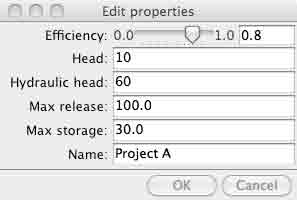
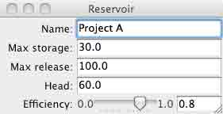
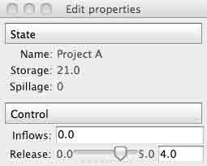

# 3.4 Traits：创建交互对话

# 3.4 Traits：创建交互对话

In [10]:

```py
%matplotlib inline
import numpy as np 
```

> 作者 : *Didrik Pinte*

Traits 项目允许你可以向 Python 项目属性方便的添加验证、初始化、委托、通知和图形化界面。

在这个教程中，我们将研究 Traits 工具包并且学习如何动态减少你所写的锅炉片代码，进行快速的 GUI 应用开发，以及理解 Enthought 工具箱中其他部分的想法。

Traits 和 Enthought 工具箱是基于 BSD-style 证书的开源项目。

**目标受众**

## Python 中高级程序员

**要求**

*   [wxPython](http://www.wxpython.org/)、[PyQt](https://riverbankcomputing.com/software/pyqt/intro)或[PySide](https://pyside.github.io/docs/pyside/)之一
*   Numpy 和 Scipy
*   [Enthought 工具箱](http://code.enthought.com/projects)
*   所有需要的软件都可以通过安装[EPD 免费版](https://store.enthought.com/)来获得

**教程内容**

*   介绍
*   例子
*   Traits 是什么
    *   初始化
    *   验证
    *   文档
    *   可视化: 打开一个对话框
    *   推迟
    *   通知
    *   一些更高级的特征

## 3.4.1 介绍

Enthought 工具箱可以构建用于数据分析、2D 绘图和 3D 可视化的精密应用框架。这些强力可重用的组块是在 BSD-style 证书下发布的。

Enthought 工具箱主要的包是：

*   Traits - 基于组块的方式构建我们的应用。
*   Kiva - 2D 原生支持基于路径的 rendering、affine 转化、alpha 混合及其它。
*   Enable - 基于对象的 2D 绘图画布。
*   Chaco - 绘图工具箱，用于构建复杂的交互 2D 图像。
*   Mayavi -基于 VTK 的 3D 科学数据可视化
*   Envisage - 应用插件框架，用于构建脚本化可扩展的应用


在这篇教程中，我们将关注 Traits。

## 3.4.2 例子

在整个这篇教程中，我们将使用基于水资源管理简单案例的一个样例。我们将试着建模一个水坝和水库系统。水库和水坝有下列参数：

*   名称
*   水库的最小和最大容量 [$hm³$]
*   水坝的高度和宽度[$m$]
*   蓄水面积[$km²$]
*   水压头[$m$]
*   涡轮的动力[$MW$]
*   最小和最大放水量[$m³/s$]
*   涡轮的效率

水库有一个已知的运转情况。一部分是与基于放水量有关的能量产生。估算水力发电机电力生产的简单公式是$P = \rho hrgk$, 其中

*   P 以瓦特为单位的功率,
*   \rho 是水的密度 ($~1000 kg/m³$),
*   h 是水的高度,
*   r 是以每秒立方米为单位的流动率,
*   g 重力加速度，9.8 $m/s²$,
*   k 是效率系数，范围从 0 到 1。

年度的电能生产取决于可用的水供给。在一些设施中，水流率在一年中可能差 10 倍。

运行状态的第二个部分是蓄水量，蓄水量(storage)依赖于控制和非控制参数：

$storage_{t+1} = storage_t + inflows - release - spillage - irrigation$

本教程中使用的数据不是真实的，可能甚至在现实中没有意义。

## 3.4.3 Traits 是什么

trait 是可以用于常规 Python 对象属性的类型定义，给出属性的一些额外特性:

*   标准化:
    *   初始化
    *   验证
    *   推迟
*   通知
*   可视化
*   文档

类可以自由混合基于 trait 的属性与通用 Python 属性，或者选择允许在这个类中只使用固定的或开放的 trait 属性集。类定义的 Trait 属性自动继承自由这个类衍生的其他子类。

创建一个 traits 类的常用方式是通过扩展**HasTraits**基础类，并且定义类的 traits :

In [1]:

```py
from traits.api import HasTraits, Str, Float

class Reservoir(HasTraits):

    name = Str
    max_storage = Float 
```

对 Traits 3.x 用户来说

如果使用 Traits 3.x, 你需要调整 traits 包的命名空间:

*   traits.api 应该为 enthought.traits.api
*   traitsui.api 应该为 enthought.traits.ui.api

像这样使用 traits 类和使用其他 Python 类一样简单。注意，trait 值通过关键词参数传递:

In [2]:

```py
reservoir = Reservoir(name='Lac de Vouglans', max_storage=605) 
```

### 3.4.3.1 初始化

所有的 traits 都有一个默认值来初始化变量。例如，基础 python 类型有如下的 trait 等价物:

| Trait | Python 类型 | 内置默认值 |
| --- | --- | --- |
| Bool | Boolean | False |
| Complex | Complex number | 0+0j |
| Float | Floating point number | 0.0 |
| Int | Plain integer | 0 |
| Long | Long integer | 0L |
| Str | String | '' |
| Unicode | Unicode | u'' |

存在很多其他预定义的 trait 类型: Array, Enum, Range, Event, Dict, List, Color, Set, Expression, Code, Callable, Type, Tuple, etc。

自定义默认值可以在代码中定义:

In [3]:

```py
from traits.api import HasTraits, Str, Float

class Reservoir(HasTraits):

    name = Str
    max_storage = Float(100)

reservoir = Reservoir(name='Lac de Vouglans') 
```

复杂初始化

当一个 trait 需要复杂的初始化时，可以实施*XXX*默认魔法方法。当调用 XXX trait 时，它会被懒惰的调用。例如：

In [4]:

```py
def _name_default(self):
    """ Complex initialisation of the reservoir name. """

    return 'Undefined' 
```

### 3.4.3.2 验证

当用户试图设置 trait 的内容时，每一个 trait 都会被验证:

In [5]:

```py
reservoir = Reservoir(name='Lac de Vouglans', max_storage=605)

reservoir.max_storage = '230' 
```

```py
---------------------------------------------------------------------------
TraitError                                Traceback (most recent call last)
<ipython-input-5-cbed071af0b9> in <module>()
 1 reservoir = Reservoir(name='Lac de Vouglans', max_storage=605)
 2 
----> 3  reservoir.max_storage = '230'

/Library/Python/2.7/site-packages/traits/trait_handlers.pyc in error(self, object, name, value)
 170         """
 171         raise TraitError( object, name, self.full_info( object, name, value ),
--> 172 value ) 173 
 174     def full_info ( self, object, name, value ):

TraitError: The 'max_storage' trait of a Reservoir instance must be a float, but a value of '230' <type 'str'> was specified. 
```

### 3.4.3.3 文档

从本质上说，所有的 traits 都提供关于模型自身的文档。创建类的声明方式使它是自解释的:

In [6]:

```py
from traits.api import HasTraits, Str, Float

class Reservoir(HasTraits):

    name = Str
    max_storage = Float(100) 
```

trait 的**desc**元数据可以用来提供关于 trait 更多的描述信息:

In [7]:

```py
from traits.api import HasTraits, Str, Float

class Reservoir(HasTraits):

    name = Str
    max_storage = Float(100, desc='Maximal storage [hm3]') 
```

现在让我们来定义完整的 reservoir 类:

In [8]:

```py
from traits.api import HasTraits, Str, Float, Range

class Reservoir(HasTraits):
    name = Str
    max_storage = Float(1e6, desc='Maximal storage [hm3]')
    max_release = Float(10, desc='Maximal release [m3/s]')
    head = Float(10, desc='Hydraulic head [m]')
    efficiency = Range(0, 1.)

    def energy_production(self, release):
        ''' Returns the energy production [Wh] for the given release [m3/s]
 '''
        power = 1000 * 9.81 * self.head * release * self.efficiency
        return power * 3600

if __name__ == '__main__':
    reservoir = Reservoir(
                        name = 'Project A',
                        max_storage = 30,
                        max_release = 100.0,
                        head = 60,
                        efficiency = 0.8
                    )

    release = 80
    print 'Releasing {} m3/s produces {} kWh'.format(
                        release, reservoir.energy_production(release)
                    ) 
```

```py
Releasing 80 m3/s produces 1.3561344e+11 kWh 
```

### 3.4.3.4 可视化: 打开一个对话框

Traits 库也关注用户界面，可以弹出一个 Reservoir 类的默认视图:

In [ ]:

```py
reservoir1 = Reservoir()
reservoir1.edit_traits() 
```



TraitsUI 简化了创建用户界面的方式。HasTraits 类上的每一个 trait 都有一个默认的编辑器，将管理 trait 在屏幕上显示的方式 (即 Range trait 显示为一个滑块等)。

与 Traits 声明方式来创建类的相同渠道，TraitsUI 提供了声明的界面来构建用户界面代码:

In [ ]:

```py
from traits.api import HasTraits, Str, Float, Range
from traitsui.api import View

class Reservoir(HasTraits):
    name = Str
    max_storage = Float(1e6, desc='Maximal storage [hm3]')
    max_release = Float(10, desc='Maximal release [m3/s]')
    head = Float(10, desc='Hydraulic head [m]')
    efficiency = Range(0, 1.)

    traits_view = View(
        'name', 'max_storage', 'max_release', 'head', 'efficiency',
        title = 'Reservoir',
        resizable = True,
    )

    def energy_production(self, release):
        ''' Returns the energy production [Wh] for the given release [m3/s]
 '''
        power = 1000 * 9.81 * self.head * release * self.efficiency 
        return power * 3600

if __name__ == '__main__':
    reservoir = Reservoir(
                        name = 'Project A',
                        max_storage = 30,
                        max_release = 100.0,
                        head = 60,
                        efficiency = 0.8
                    )

    reservoir.configure_traits() 
```



### 3.4.3.5 推迟

可以将 trait 定义和它的值推送给另一个对象是 Traits 的有用的功能。

In [ ]:

```py
from traits.api import HasTraits, Instance, DelegatesTo, Float, Range

from reservoir import Reservoir

class ReservoirState(HasTraits):
    """Keeps track of the reservoir state given the initial storage.
 """
    reservoir = Instance(Reservoir, ())
    min_storage = Float
    max_storage = DelegatesTo('reservoir')
    min_release = Float
    max_release = DelegatesTo('reservoir')

    # state attributes
    storage = Range(low='min_storage', high='max_storage')

    # control attributes
    inflows =  Float(desc='Inflows [hm3]')
    release = Range(low='min_release', high='max_release')
    spillage = Float(desc='Spillage [hm3]')

    def print_state(self):
        print 'Storage\tRelease\tInflows\tSpillage'
        str_format = '\t'.join(['{:7.2f}'for i in range(4)])
        print str_format.format(self.storage, self.release, self.inflows,
                self.spillage)
        print '-' * 79

if __name__ == '__main__':
    projectA = Reservoir(
            name = 'Project A',
            max_storage = 30,
            max_release = 100.0,
            hydraulic_head = 60,
            efficiency = 0.8
        )

    state = ReservoirState(reservoir=projectA, storage=10)
    state.release = 90
    state.inflows = 0
    state.print_state()

    print 'How do we update the current storage ?' 
```

特殊的 trait 允许用魔法 _xxxx_fired 方法管理事件和触发器函数:

In [ ]:

```py
from traits.api import HasTraits, Instance, DelegatesTo, Float, Range, Event

from reservoir import Reservoir

class ReservoirState(HasTraits):
    """Keeps track of the reservoir state given the initial storage.

 For the simplicity of the example, the release is considered in
 hm3/timestep and not in m3/s.
 """
    reservoir = Instance(Reservoir, ())
    min_storage = Float
    max_storage = DelegatesTo('reservoir')
    min_release = Float
    max_release = DelegatesTo('reservoir')

    # state attributes
    storage = Range(low='min_storage', high='max_storage')

    # control attributes
    inflows =  Float(desc='Inflows [hm3]')
    release = Range(low='min_release', high='max_release')
    spillage = Float(desc='Spillage [hm3]')

    update_storage = Event(desc='Updates the storage to the next time step')

    def _update_storage_fired(self):
        # update storage state
        new_storage = self.storage - self.release  + self.inflows
        self.storage = min(new_storage, self.max_storage)
        overflow = new_storage - self.max_storage
        self.spillage = max(overflow, 0)

    def print_state(self):
        print 'Storage\tRelease\tInflows\tSpillage'
        str_format = '\t'.join(['{:7.2f}'for i in range(4)])
        print str_format.format(self.storage, self.release, self.inflows,
                self.spillage)
        print '-' * 79

if __name__ == '__main__':
    projectA = Reservoir(
        name = 'Project A',
        max_storage = 30,
        max_release = 5.0,
        hydraulic_head = 60,
        efficiency = 0.8
    )

    state = ReservoirState(reservoir=projectA, storage=15)
    state.release = 5
    state.inflows = 0

    # release the maximum amount of water during 3 time steps
    state.update_storage = True
    state.print_state()
    state.update_storage = True
    state.print_state()
    state.update_storage = True
    state.print_state() 
```

对象间的依赖可以自动使用 trait**Property**完成。**depends_on**属性表示 property 其他 traits 的依赖性。当其他 traits 改变了,property 是无效的。此外，Traits 为属性使用魔法函数的名字:

*   _get_XXX 来获得 XXX 属性的 trait
*   _set_XXX 来设置 XXX 属性的 trait

In [ ]:

```py
from traits.api import HasTraits, Instance, DelegatesTo, Float, Range
from traits.api import Property

from reservoir import Reservoir

class ReservoirState(HasTraits):
    """Keeps track of the reservoir state given the initial storage.

 For the simplicity of the example, the release is considered in
 hm3/timestep and not in m3/s.
 """
    reservoir = Instance(Reservoir, ())
    max_storage = DelegatesTo('reservoir')
    min_release = Float
    max_release = DelegatesTo('reservoir')

    # state attributes
    storage = Property(depends_on='inflows, release')

    # control attributes
    inflows =  Float(desc='Inflows [hm3]')
    release = Range(low='min_release', high='max_release')
    spillage = Property(
            desc='Spillage [hm3]', depends_on=['storage', 'inflows', 'release']
        )

    ### Private traits.
    _storage = Float

    ### Traits property implementation.
    def _get_storage(self):
        new_storage = self._storage - self.release + self.inflows
        return min(new_storage, self.max_storage)

    def _set_storage(self, storage_value):
        self._storage = storage_value

    def _get_spillage(self):
        new_storage = self._storage - self.release  + self.inflows
        overflow = new_storage - self.max_storage
        return max(overflow, 0)

    def print_state(self):
        print 'Storage\tRelease\tInflows\tSpillage'
        str_format = '\t'.join(['{:7.2f}'for i in range(4)])
        print str_format.format(self.storage, self.release, self.inflows,
                self.spillage)
        print '-' * 79

if __name__ == '__main__':
    projectA = Reservoir(
                    name = 'Project A',
                    max_storage = 30,
                    max_release = 5,
                    hydraulic_head = 60,
                    efficiency = 0.8
                )

    state = ReservoirState(reservoir=projectA, storage=25)
    state.release = 4
    state.inflows = 0

    state.print_state() 
```

**注意** 缓存属性 当访问一个输入没有改变的属性时，[[email protected]](cdn-cgi/l/email-protection)_property 修饰器可以用来缓存这个值，并且只有在失效时才会重新计算一次他们。

让我们用 ReservoirState 的例子来扩展 TraitsUI 介绍:

In [ ]:

```py
from traits.api import HasTraits, Instance, DelegatesTo, Float, Range, Property
from traitsui.api import View, Item, Group, VGroup

from reservoir import Reservoir

class ReservoirState(HasTraits):
    """Keeps track of the reservoir state given the initial storage.

 For the simplicity of the example, the release is considered in
 hm3/timestep and not in m3/s.
 """
    reservoir = Instance(Reservoir, ())
    name = DelegatesTo('reservoir')
    max_storage = DelegatesTo('reservoir')
    max_release = DelegatesTo('reservoir')
    min_release = Float

    # state attributes
    storage = Property(depends_on='inflows, release')

    # control attributes
    inflows =  Float(desc='Inflows [hm3]')
    release = Range(low='min_release', high='max_release')
    spillage = Property(
            desc='Spillage [hm3]', depends_on=['storage', 'inflows', 'release']
        )

    ### Traits view
    traits_view = View(
        Group(
            VGroup(Item('name'), Item('storage'), Item('spillage'),
                label = 'State', style = 'readonly'
            ),
            VGroup(Item('inflows'), Item('release'), label='Control'),
        )
    )

    ### Private traits.
    _storage = Float

    ### Traits property implementation.
    def _get_storage(self):
        new_storage = self._storage - self.release + self.inflows
        return min(new_storage, self.max_storage)

    def _set_storage(self, storage_value):
        self._storage = storage_value

    def _get_spillage(self):
        new_storage = self._storage - self.release  + self.inflows
        overflow = new_storage - self.max_storage
        return max(overflow, 0)

    def print_state(self):
        print 'Storage\tRelease\tInflows\tSpillage'
        str_format = '\t'.join(['{:7.2f}'for i in range(4)])
        print str_format.format(self.storage, self.release, self.inflows,
                self.spillage)
        print '-' * 79

if __name__ == '__main__':
    projectA = Reservoir(
        name = 'Project A',
        max_storage = 30,
        max_release = 5,
        hydraulic_head = 60,
        efficiency = 0.8
    )

    state = ReservoirState(reservoir=projectA, storage=25)
    state.release = 4
    state.inflows = 0

    state.print_state()
    state.configure_traits() 
```



Some use cases need the delegation mechanism to be broken by the user when setting the value of the trait. The PrototypeFrom trait implements this behaviour.

In [ ]:

```py
TraitsUI simplifies the way user interfaces are created. Every trait on a HasTraits class has a default editor that will manage the way the trait is rendered to the screen (e.g. the Range trait is displayed as a slider, etc.).
In the very same vein as the Traits declarative way of creating classes, TraitsUI provides a declarative interface to build user interfaces code: 
```