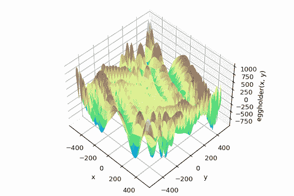
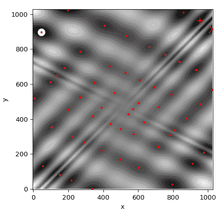
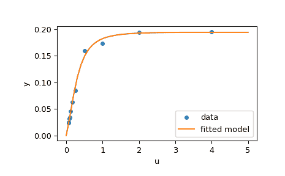

# 优化 (scipy.optimize)

> 原文：[`docs.scipy.org/doc/scipy-1.12.0/tutorial/optimize.html`](https://docs.scipy.org/doc/scipy-1.12.0/tutorial/optimize.html)

目录

+   优化 (`scipy.optimize`)

    +   多元标量函数的无约束最小化 (`minimize`)

        +   尼尔德-米德单纯形算法 (`method='Nelder-Mead'`)

        +   布洛伊登-弗莱彻-戈尔德法-沙诺算法 (`method='BFGS'`)

            +   避免冗余计算

        +   牛顿共轭梯度算法 (`method='Newton-CG'`)

            +   完整海森矩阵示例：

            +   海森矩阵乘积示例：

        +   信赖区域牛顿共轭梯度算法 (`method='trust-ncg'`)

            +   完整海森矩阵示例：

            +   海森矩阵乘积示例：

        +   信赖区域截断广义兰兹-共轭梯度算法 (`method='trust-krylov'`)

            +   完整海森矩阵示例：

            +   海森矩阵乘积示例：

        +   信赖区域近乎精确算法 (`method='trust-exact'`)

    +   多元标量函数的约束最小化 (`minimize`)

        +   信赖区域约束算法 (`method='trust-constr'`)

            +   定义边界约束：

            +   定义线性约束：

            +   定义非线性约束：

            +   解决优化问题：

        +   顺序最小二乘编程 (SLSQP) 算法 (`method='SLSQP'`)

    +   全局优化

    +   最小二乘最小化 (`least_squares`)

        +   解决拟合问题的示例

        +   更多示例

    +   一元函数最小化器 (`minimize_scalar`)

        +   无约束最小化 (`method='brent'`)

        +   有界最小化 (`method='bounded'`)

    +   自定义最小化器

    +   根查找

        +   标量函数

        +   固定点求解

        +   方程组

        +   大问题的根查找

        +   仍然太慢？预调节。

    +   线性规划 (`linprog`)

        +   线性规划示例

    +   分配问题

        +   线性和分配问题示例

    +   混合整数线性规划

        +   背包问题示例

`scipy.optimize` 包提供了几种常用的优化算法。详细清单可参阅：`scipy.optimize` （也可通过`help(scipy.optimize)`查找）。

## 无约束多变量标量函数最小化 (`minimize`)

`minimize` 函数为多变量标量函数的无约束和约束最小化算法提供了通用接口，在`scipy.optimize`中使用。为了演示最小化函数，考虑如下问题，即最小化具有\(N\)个变量的 Rosenbrock 函数：

\[f\left(\mathbf{x}\right)=\sum_{i=1}^{N-1}100\left(x_{i+1}-x_{i}^{2}\right)^{2}+\left(1-x_{i}\right)^{2}.\]

此函数的最小值为 0，当\(x_{i}=1.\)时达到。

注意，Rosenbrock 函数及其导数包含在`scipy.optimize`中。以下部分中展示的实现示例说明了如何定义一个目标函数以及其雅可比和 Hessian 函数。`scipy.optimize`中的目标函数期望其第一个参数是 numpy 数组，用于优化，并且必须返回一个浮点值。确切的调用签名必须是`f(x, *args)`，其中`x`表示 numpy 数组，`args`是传递给目标函数的额外参数的元组。

### Nelder-Mead Simplex 算法 (`method='Nelder-Mead'`)

在下面的示例中，使用*Nelder-Mead* simplex 算法（通过`method`参数选择）调用了`minimize`例程：

```py
>>> import numpy as np
>>> from scipy.optimize import minimize 
```

```py
>>> def rosen(x):
...  """The Rosenbrock function"""
...     return sum(100.0*(x[1:]-x[:-1]**2.0)**2.0 + (1-x[:-1])**2.0) 
```

```py
>>> x0 = np.array([1.3, 0.7, 0.8, 1.9, 1.2])
>>> res = minimize(rosen, x0, method='nelder-mead',
...                options={'xatol': 1e-8, 'disp': True})
Optimization terminated successfully.
 Current function value: 0.000000
 Iterations: 339
 Function evaluations: 571 
```

```py
>>> print(res.x)
[1\. 1\. 1\. 1\. 1.] 
```

Simplex 算法可能是最简单的最小化相当良好函数的方法。它只需要函数评估，并且对于简单的最小化问题是一个很好的选择。然而，由于它不使用任何梯度评估，可能需要更长时间找到最小值。

另一个仅需函数调用来找到最小值的优化算法是*Powell*方法，通过在`minimize`中设置`method='powell'`来选择。

为了演示如何向目标函数提供额外参数，让我们最小化 Rosenbrock 函数，其中包括一个额外的缩放因子*a*和一个偏移量*b*：

\[f\left(\mathbf{x}, a, b\right)=\sum_{i=1}^{N-1}a\left(x_{i+1}-x_{i}^{2}\right)^{2}+\left(1-x_{i}\right)^{2} + b.\]

再次使用`minimize`例程，以下代码块展示了如何使用示例参数 `a=0.5` 和 `b=1` 来解决这个问题。

```py
>>> def rosen_with_args(x, a, b):
...  """The Rosenbrock function with additional arguments"""
...     return sum(a*(x[1:]-x[:-1]**2.0)**2.0 + (1-x[:-1])**2.0) + b 
```

```py
>>> x0 = np.array([1.3, 0.7, 0.8, 1.9, 1.2])
>>> res = minimize(rosen_with_args, x0, method='nelder-mead',
...                args=(0.5, 1.), options={'xatol': 1e-8, 'disp': True})
Optimization terminated successfully.
 Current function value: 1.000000
 Iterations: 319 # may vary
 Function evaluations: 525 # may vary 
```

```py
>>> print(res.x)
[1\.         1\.         1\.         1\.         0.99999999] 
```

作为使用`minimize`的`args`参数的替代方法，只需将目标函数包装在一个新函数中，该函数仅接受`x`作为参数即可。当需要将额外参数作为关键字参数传递给目标函数时，这种方法也很有用。

```py
>>> def rosen_with_args(x, a, *, b):  # b is a keyword-only argument
...     return sum(a*(x[1:]-x[:-1]**2.0)**2.0 + (1-x[:-1])**2.0) + b
>>> def wrapped_rosen_without_args(x):
...     return rosen_with_args(x, 0.5, b=1.)  # pass in `a` and `b`
>>> x0 = np.array([1.3, 0.7, 0.8, 1.9, 1.2])
>>> res = minimize(wrapped_rosen_without_args, x0, method='nelder-mead',
...                options={'xatol': 1e-8,})
>>> print(res.x)
[1\.         1\.         1\.         1\.         0.99999999] 
```

另一种选择是使用[`functools.partial`](https://docs.python.org/3/library/functools.html#functools.partial "(in Python v3.12)")。

```py
>>> from functools import partial
>>> partial_rosen = partial(rosen_with_args, a=0.5, b=1.)
>>> res = minimize(partial_rosen, x0, method='nelder-mead',
...                options={'xatol': 1e-8,})
>>> print(res.x)
[1\.         1\.         1\.         1\.         0.99999999] 
```

### Broyden-Fletcher-Goldfarb-Shanno 算法 (`method='BFGS'`)

为了更快地收敛到解，这个例程使用了目标函数的梯度。如果用户没有提供梯度，则使用一阶差分法估算。即使必须估算梯度，Broyden-Fletcher-Goldfarb-Shanno（BFGS）方法通常比单纯形法需要更少的函数调用。

为了演示这个算法，再次使用了 Rosenbrock 函数。Rosenbrock 函数的梯度是以下向量：

\begin{eqnarray*} \frac{\partial f}{\partial x_{j}} & = & \sum_{i=1}^{N}200\left(x_{i}-x_{i-1}^{2}\right)\left(\delta_{i,j}-2x_{i-1}\delta_{i-1,j}\right)-2\left(1-x_{i-1}\right)\delta_{i-1,j}.\\ & = & 200\left(x_{j}-x_{j-1}^{2}\right)-400x_{j}\left(x_{j+1}-x_{j}^{2}\right)-2\left(1-x_{j}\right).\end{eqnarray*}

这个表达式对内部导数是有效的。特殊情况包括

\begin{eqnarray*} \frac{\partial f}{\partial x_{0}} & = & -400x_{0}\left(x_{1}-x_{0}^{2}\right)-2\left(1-x_{0}\right),\\ \frac{\partial f}{\partial x_{N-1}} & = & 200\left(x_{N-1}-x_{N-2}^{2}\right).\end{eqnarray*}

用以下代码段构建一个计算此梯度的 Python 函数：

```py
>>> def rosen_der(x):
...     xm = x[1:-1]
...     xm_m1 = x[:-2]
...     xm_p1 = x[2:]
...     der = np.zeros_like(x)
...     der[1:-1] = 200*(xm-xm_m1**2) - 400*(xm_p1 - xm**2)*xm - 2*(1-xm)
...     der[0] = -400*x[0]*(x[1]-x[0]**2) - 2*(1-x[0])
...     der[-1] = 200*(x[-1]-x[-2]**2)
...     return der 
```

这些梯度信息在`minimize`函数中通过`jac`参数指定，如下所示。

```py
>>> res = minimize(rosen, x0, method='BFGS', jac=rosen_der,
...                options={'disp': True})
Optimization terminated successfully.
 Current function value: 0.000000
 Iterations: 25                     # may vary
 Function evaluations: 30
 Gradient evaluations: 30
>>> res.x
array([1., 1., 1., 1., 1.]) 
```

#### 避免冗余计算

目标函数及其梯度共享部分计算是常见的。例如，考虑以下问题。

```py
>>> def f(x):
...    return -expensive(x[0])**2
>>>
>>> def df(x):
...     return -2 * expensive(x[0]) * dexpensive(x[0])
>>>
>>> def expensive(x):
...     # this function is computationally expensive!
...     expensive.count += 1  # let's keep track of how many times it runs
...     return np.sin(x)
>>> expensive.count = 0
>>>
>>> def dexpensive(x):
...     return np.cos(x)
>>>
>>> res = minimize(f, 0.5, jac=df)
>>> res.fun
-0.9999999999999174
>>> res.nfev, res.njev
6, 6
>>> expensive.count
12 
```

这里，`expensive` 被调用了 12 次：在目标函数中六次，在梯度中六次。减少冗余计算的一种方法是创建一个返回目标函数和梯度的单一函数。

```py
>>> def f_and_df(x):
...     expensive_value = expensive(x[0])
...     return (-expensive_value**2,  # objective function
...             -2*expensive_value*dexpensive(x[0]))  # gradient
>>>
>>> expensive.count = 0  # reset the counter
>>> res = minimize(f_and_df, 0.5, jac=True)
>>> res.fun
-0.9999999999999174
>>> expensive.count
6 
```

当我们调用 minimize 时，指定`jac==True`表示提供的函数返回目标函数及其梯度。虽然方便，但并非所有`scipy.optimize`函数都支持此功能，而且仅适用于在函数和其梯度之间共享计算，而在某些问题中，我们可能需要在 Hessian（目标函数的二阶导数）和约束之间共享计算。更一般的方法是对计算的昂贵部分进行缓存。在简单情况下，可以使用[`functools.lru_cache`](https://docs.python.org/3/library/functools.html#functools.lru_cache "(in Python v3.12)")包装器实现。

```py
>>> from functools import lru_cache
>>> expensive.count = 0  # reset the counter
>>> expensive = lru_cache(expensive)
>>> res = minimize(f, 0.5, jac=df)
>>> res.fun
-0.9999999999999174
>>> expensive.count
6 
```

### Newton-Conjugate-Gradient 算法（`method='Newton-CG'`）

Newton-Conjugate Gradient 算法是改进的 Newton 方法，使用共轭梯度算法（近似）求解局部 Hessian 矩阵的逆[[NW]](#nw)。Newton 方法基于将函数局部拟合为二次型：

\[f\left(\mathbf{x}\right)\approx f\left(\mathbf{x}_{0}\right)+\nabla f\left(\mathbf{x}_{0}\right)\cdot\left(\mathbf{x}-\mathbf{x}_{0}\right)+\frac{1}{2}\left(\mathbf{x}-\mathbf{x}_{0}\right)^{T}\mathbf{H}\left(\mathbf{x}_{0}\right)\left(\mathbf{x}-\mathbf{x}_{0}\right).\]

where \(\mathbf{H}\left(\mathbf{x}_{0}\right)\) is a matrix of second-derivatives (the Hessian). If the Hessian is positive definite then the local minimum of this function can be found by setting the gradient of the quadratic form to zero, resulting in

\[\mathbf{x}_{\textrm{opt}}=\mathbf{x}_{0}-\mathbf{H}^{-1}\nabla f.\]

The inverse of the Hessian is evaluated using the conjugate-gradient method. An example of employing this method to minimizing the Rosenbrock function is given below. To take full advantage of the Newton-CG method, a function which computes the Hessian must be provided. The Hessian matrix itself does not need to be constructed, only a vector which is the product of the Hessian with an arbitrary vector needs to be available to the minimization routine. As a result, the user can provide either a function to compute the Hessian matrix, or a function to compute the product of the Hessian with an arbitrary vector.

#### Full Hessian example:

The Hessian of the Rosenbrock function is

\begin{eqnarray*} H_{ij}=\frac{\partial^{2}f}{\partial x_{i}\partial x_{j}} & = & 200\left(\delta_{i,j}-2x_{i-1}\delta_{i-1,j}\right)-400x_{i}\left(\delta_{i+1,j}-2x_{i}\delta_{i,j}\right)-400\delta_{i,j}\left(x_{i+1}-x_{i}^{2}\right)+2\delta_{i,j},\\ & = & \left(202+1200x_{i}^{2}-400x_{i+1}\right)\delta_{i,j}-400x_{i}\delta_{i+1,j}-400x_{i-1}\delta_{i-1,j},\end{eqnarray*}

if \(i,j\in\left[1,N-2\right]\) with \(i,j\in\left[0,N-1\right]\) defining the \(N\times N\) matrix. Other non-zero entries of the matrix are

\begin{eqnarray*} \frac{\partial^{2}f}{\partial x_{0}^{2}} & = & 1200x_{0}^{2}-400x_{1}+2,\\ \frac{\partial^{2}f}{\partial x_{0}\partial x_{1}}=\frac{\partial^{2}f}{\partial x_{1}\partial x_{0}} & = & -400x_{0},\\ \frac{\partial^{2}f}{\partial x_{N-1}\partial x_{N-2}}=\frac{\partial^{2}f}{\partial x_{N-2}\partial x_{N-1}} & = & -400x_{N-2},\\ \frac{\partial^{2}f}{\partial x_{N-1}^{2}} & = & 200.\end{eqnarray*}

For example, the Hessian when \(N=5\) is

\[\begin{split}\mathbf{H}=\begin{bmatrix} 1200x_{0}^{2}+2\mkern-2em\\&1200x_{1}^{2}+202\mkern-2em\\&&1200x_{1}^{2}+202\mkern-2em\\&&&1200x_{3}^{2}+202\mkern-1em\\&&&&200\end{bmatrix}-400\begin{bmatrix} x_1 & x_0 \\ x_0 & x_2 & x_1 \\ & x_1 & x_3 & x_2\\ & & x_2 & x_4 & x_3 \\ & & & x_3 & 0\end{bmatrix}.\end{split}\]

The code which computes this Hessian along with the code to minimize the function using Newton-CG method is shown in the following example:

```py
>>> def rosen_hess(x):
...     x = np.asarray(x)
...     H = np.diag(-400*x[:-1],1) - np.diag(400*x[:-1],-1)
...     diagonal = np.zeros_like(x)
...     diagonal[0] = 1200*x[0]**2-400*x[1]+2
...     diagonal[-1] = 200
...     diagonal[1:-1] = 202 + 1200*x[1:-1]**2 - 400*x[2:]
...     H = H + np.diag(diagonal)
...     return H 
```

```py
>>> res = minimize(rosen, x0, method='Newton-CG',
...                jac=rosen_der, hess=rosen_hess,
...                options={'xtol': 1e-8, 'disp': True})
Optimization terminated successfully.
 Current function value: 0.000000
 Iterations: 19                       # may vary
 Function evaluations: 22
 Gradient evaluations: 19
 Hessian evaluations: 19
>>> res.x
array([1.,  1.,  1.,  1.,  1.]) 
```

#### Hessian product example:

对于更大的最小化问题，存储整个 Hessian 矩阵可能会消耗大量时间和内存。Newton-CG 算法仅需 Hessian 与任意向量的乘积。因此，用户可以提供计算该乘积的代码，而不是完整的 Hessian 矩阵，方法是通过提供一个 `hess` 函数，该函数将最小化向量作为第一个参数，任意向量作为第二个参数（以及传递给要最小化函数的额外参数）。如果可能，使用具有 Hessian 乘积选项的 Newton-CG 可能是最快的最小化函数的方式。

在这种情况下，用 Rosenbrock Hessian 乘以任意向量的乘积并不难计算。如果 \(\mathbf{p}\) 是任意向量，则 \(\mathbf{H}\left(\mathbf{x}\right)\mathbf{p}\) 的元素为：

\[\begin{split}\mathbf{H}\left(\mathbf{x}\right)\mathbf{p}=\begin{bmatrix} \left(1200x_{0}^{2}-400x_{1}+2\right)p_{0}-400x_{0}p_{1}\\ \vdots\\ -400x_{i-1}p_{i-1}+\left(202+1200x_{i}^{2}-400x_{i+1}\right)p_{i}-400x_{i}p_{i+1}\\ \vdots\\ -400x_{N-2}p_{N-2}+200p_{N-1}\end{bmatrix}.\end{split}\]

使用 `minimize` 函数来最小化 Rosenbrock 函数的代码如下：

```py
>>> def rosen_hess_p(x, p):
...     x = np.asarray(x)
...     Hp = np.zeros_like(x)
...     Hp[0] = (1200*x[0]**2 - 400*x[1] + 2)*p[0] - 400*x[0]*p[1]
...     Hp[1:-1] = -400*x[:-2]*p[:-2]+(202+1200*x[1:-1]**2-400*x[2:])*p[1:-1] \
...                -400*x[1:-1]*p[2:]
...     Hp[-1] = -400*x[-2]*p[-2] + 200*p[-1]
...     return Hp 
```

```py
>>> res = minimize(rosen, x0, method='Newton-CG',
...                jac=rosen_der, hessp=rosen_hess_p,
...                options={'xtol': 1e-8, 'disp': True})
Optimization terminated successfully.
 Current function value: 0.000000
 Iterations: 20                    # may vary
 Function evaluations: 23
 Gradient evaluations: 20
 Hessian evaluations: 44
>>> res.x
array([1., 1., 1., 1., 1.]) 
```

根据 [[NW]](#nw) 第 170 页，当 Hessian 矩阵条件差时，`Newton-CG` 算法可能效率低下，因为在这些情况下方法提供的搜索方向质量较差。作者表示，`trust-ncg` 方法更有效地处理这种问题情况，并将在下文中详细描述。

### Trust-Region Newton-Conjugate-Gradient Algorithm (`method='trust-ncg'`)

`Newton-CG` 方法是一种线搜索方法：它找到一个搜索方向，最小化函数的二次近似，然后使用一种线搜索算法在该方向上找到（几乎）最优的步长。另一种方法是先固定步长限制 \(\Delta\)，然后通过解以下二次子问题找到给定信赖半径内的最优步 \(\mathbf{p}\)：

\begin{eqnarray*} \min_{\mathbf{p}} f\left(\mathbf{x}_{k}\right)+\nabla f\left(\mathbf{x}_{k}\right)\cdot\mathbf{p}+\frac{1}{2}\mathbf{p}^{T}\mathbf{H}\left(\mathbf{x}_{k}\right)\mathbf{p};&\\ \text{subject to: } \|\mathbf{p}\|\le \Delta.& \end{eqnarray*}

解被更新为 \(\mathbf{x}_{k+1} = \mathbf{x}_{k} + \mathbf{p}\)，并且信赖半径 \(\Delta\) 根据二次模型与实际函数的一致程度进行调整。这类方法被称为信赖域方法。`trust-ncg` 算法是一种信赖域方法，它使用共轭梯度算法来解决信赖域子问题 [[NW]](#nw)。

#### Full Hessian example:

```py
>>> res = minimize(rosen, x0, method='trust-ncg',
...                jac=rosen_der, hess=rosen_hess,
...                options={'gtol': 1e-8, 'disp': True})
Optimization terminated successfully.
 Current function value: 0.000000
 Iterations: 20                    # may vary
 Function evaluations: 21
 Gradient evaluations: 20
 Hessian evaluations: 19
>>> res.x
array([1., 1., 1., 1., 1.]) 
```

#### Hessian product example:

```py
>>> res = minimize(rosen, x0, method='trust-ncg',
...                jac=rosen_der, hessp=rosen_hess_p,
...                options={'gtol': 1e-8, 'disp': True})
Optimization terminated successfully.
 Current function value: 0.000000
 Iterations: 20                    # may vary
 Function evaluations: 21
 Gradient evaluations: 20
 Hessian evaluations: 0
>>> res.x
array([1., 1., 1., 1., 1.]) 
```

### Trust-Region Truncated Generalized Lanczos / Conjugate Gradient Algorithm (`method='trust-krylov'`)

与`trust-ncg`方法类似，`trust-krylov`方法适用于大规模问题，因为它只使用海森矩阵作为线性操作符，通过矩阵-向量乘积来解决二次子问题。它比`trust-ncg`方法更准确地解决了二次子问题。

\begin{eqnarray*} \min_{\mathbf{p}} f\left(\mathbf{x}_{k}\right)+\nabla f\left(\mathbf{x}_{k}\right)\cdot\mathbf{p}+\frac{1}{2}\mathbf{p}^{T}\mathbf{H}\left(\mathbf{x}_{k}\right)\mathbf{p};&\\ \text{subject to: } \|\mathbf{p}\|\le \Delta.& \end{eqnarray*}

该方法使用[[TRLIB]](#trlib)实现了[[GLTR]](#gltr)方法，精确求解了限制在截断 Krylov 子空间中的信任域子问题。对于不定问题，使用该方法通常更好，因为它减少了非线性迭代的次数，而在每个子问题求解中增加了少量的矩阵-向量乘积。

#### Full Hessian example:

```py
>>> res = minimize(rosen, x0, method='trust-krylov',
...                jac=rosen_der, hess=rosen_hess,
...                options={'gtol': 1e-8, 'disp': True})
Optimization terminated successfully.
 Current function value: 0.000000
 Iterations: 19                    # may vary
 Function evaluations: 20
 Gradient evaluations: 20
 Hessian evaluations: 18
>>> res.x
array([1., 1., 1., 1., 1.]) 
```

#### Hessian product example:

```py
>>> res = minimize(rosen, x0, method='trust-krylov',
...                jac=rosen_der, hessp=rosen_hess_p,
...                options={'gtol': 1e-8, 'disp': True})
Optimization terminated successfully.
 Current function value: 0.000000
 Iterations: 19                    # may vary
 Function evaluations: 20
 Gradient evaluations: 20
 Hessian evaluations: 0
>>> res.x
array([1., 1., 1., 1., 1.]) 
```

[TRLIB]

F. Lenders, C. Kirches, A. Potschka：“trlib: A vector-free implementation of the GLTR method for iterative solution of the trust region problem”, [arXiv:1611.04718](https://arxiv.org/abs/1611.04718)

[GLTR]

N. Gould, S. Lucidi, M. Roma, P. Toint：“Solving the Trust-Region Subproblem using the Lanczos Method”, SIAM J. Optim., 9(2), 504–525, (1999). [DOI:10.1137/S1052623497322735](https://doi.org/10.1137/S1052623497322735)

### Trust-Region Nearly Exact Algorithm (`method='trust-exact'`)

所有方法`Newton-CG`，`trust-ncg`和`trust-krylov`都适用于处理大规模问题（具有数千个变量的问题）。这是因为共轭梯度算法通过迭代近似地解决信任域子问题（或反转海森矩阵），而不需要显式的海森矩阵分解。由于只需海森矩阵与任意向量的乘积，因此该算法特别适用于处理稀疏海森矩阵，从而实现低存储需求和在这些稀疏问题中显著的时间节省。

对于中等大小的问题，其中海森矩阵的存储和分解成本并不关键，通过几乎精确地求解信任域子问题，可以在较少的迭代次数内获得解决方案。为了实现这一点，对每个二次子问题进行了某些非线性方程的迭代求解 [[CGT]](#cgt)。这种解决方案通常需要对海森矩阵进行 3 到 4 次乔列斯基分解。因此，该方法收敛的迭代次数较少，并且比其他实现的信任域方法需要更少的目标函数评估。该算法不支持海森乘积选项。以下是使用 Rosenbrock 函数的示例：

```py
>>> res = minimize(rosen, x0, method='trust-exact',
...                jac=rosen_der, hess=rosen_hess,
...                options={'gtol': 1e-8, 'disp': True})
Optimization terminated successfully.
 Current function value: 0.000000
 Iterations: 13                    # may vary
 Function evaluations: 14
 Gradient evaluations: 13
 Hessian evaluations: 14
>>> res.x
array([1., 1., 1., 1., 1.]) 
```

[NW] (1,2,3)

J. Nocedal, S.J. Wright：“Numerical optimization.” 第 2 版. Springer Science (2006).

[CGT]

康恩, A. R., 戈尔德, N. I., & 琼特, P. L. “信赖域方法”. Siam. (2000). pp. 169-200.

## 多变量标量函数的约束最小化 (`minimize`)

`minimize` 函数提供了约束最小化的算法，即 `'trust-constr'` 、 `'SLSQP'` 和 `'COBYLA'` 。它们要求约束使用稍微不同的结构定义。 `'trust-constr'` 方法要求约束以 `LinearConstraint` 和 `NonlinearConstraint` 对象序列的形式给出。另一方面， `'SLSQP'` 和 `'COBYLA'` 方法要求约束以字典序列的形式给出，其中包括 `type` 、 `fun` 和 `jac` 键。

例如，让我们考虑对 Rosenbrock 函数的约束最小化：

\begin{eqnarray*} \min_{x_0, x_1} & ~~100\left(x_{1}-x_{0}^{2}\right)^{2}+\left(1-x_{0}\right)^{2} &\\ \text{subject to: } & x_0 + 2 x_1 \leq 1 & \\ & x_0² + x_1 \leq 1 & \\ & x_0² - x_1 \leq 1 & \\ & 2 x_0 + x_1 = 1 & \\ & 0 \leq x_0 \leq 1 & \\ & -0.5 \leq x_1 \leq 2.0\. & \end{eqnarray*}

该优化问题有唯一解 \([x_0, x_1] = [0.4149,~ 0.1701]\)，其中仅第一和第四个约束是活动约束。

### 信赖域约束算法 (`method='trust-constr'`)

信赖域约束方法处理以下形式的约束最小化问题：

\begin{eqnarray*} \min_x & f(x) & \\ \text{subject to: } & ~~~ c^l \leq c(x) \leq c^u, &\\ & x^l \leq x \leq x^u. & \end{eqnarray*}

当 \(c^l_j = c^u_j\) 时，该方法将第 \(j\) 个约束视为等式约束，并相应处理。此外，通过将上界或下界设置为 `np.inf` 和适当的符号，可以指定单侧约束。

实现基于 [[EQSQP]](#eqsqp) 用于等式约束问题和 [[TRIP]](#trip) 用于不等式约束问题。这两种方法都是适用于大规模问题的信赖域类型算法。

#### 定义边界约束：

边界约束 \(0 \leq x_0 \leq 1\) 和 \(-0.5 \leq x_1 \leq 2.0\) 使用 `Bounds` 对象定义。

```py
>>> from scipy.optimize import Bounds
>>> bounds = Bounds([0, -0.5], [1.0, 2.0]) 
```

#### 定义线性约束：

约束 \(x_0 + 2 x_1 \leq 1\) 和 \(2 x_0 + x_1 = 1\) 可以用线性约束标准格式写成：

\begin{equation*} \begin{bmatrix}-\infty \\1\end{bmatrix} \leq \begin{bmatrix} 1& 2 \\ 2& 1\end{bmatrix} \begin{bmatrix} x_0 \\x_1\end{bmatrix} \leq \begin{bmatrix} 1 \\ 1\end{bmatrix},\end{equation*}

并使用 `LinearConstraint` 对象定义。

```py
>>> from scipy.optimize import LinearConstraint
>>> linear_constraint = LinearConstraint([[1, 2], [2, 1]], [-np.inf, 1], [1, 1]) 
```

#### 定义非线性约束:

非线性约束：

\begin{equation*} c(x) = \begin{bmatrix} x_0² + x_1 \\ x_0² - x_1\end{bmatrix} \leq \begin{bmatrix} 1 \\ 1\end{bmatrix}, \end{equation*}

其中 Jacobian 矩阵为：

\begin{equation*} J(x) = \begin{bmatrix} 2x_0 & 1 \\ 2x_0 & -1\end{bmatrix},\end{equation*}

和 Hessian 的线性组合：

\begin{equation*} H(x, v) = \sum_{i=0}¹ v_i \nabla² c_i(x) = v_0\begin{bmatrix} 2 & 0 \\ 0 & 0\end{bmatrix} + v_1\begin{bmatrix} 2 & 0 \\ 0 & 0\end{bmatrix}, \end{equation*}

使用 `NonlinearConstraint` 对象定义。

```py
>>> def cons_f(x):
...     return [x[0]**2 + x[1], x[0]**2 - x[1]]
>>> def cons_J(x):
...     return [[2*x[0], 1], [2*x[0], -1]]
>>> def cons_H(x, v):
...     return v[0]*np.array([[2, 0], [0, 0]]) + v[1]*np.array([[2, 0], [0, 0]])
>>> from scipy.optimize import NonlinearConstraint
>>> nonlinear_constraint = NonlinearConstraint(cons_f, -np.inf, 1, jac=cons_J, hess=cons_H) 
```

或者，也可以将 Hessian \(H(x, v)\) 定义为稀疏矩阵。

```py
>>> from scipy.sparse import csc_matrix
>>> def cons_H_sparse(x, v):
...     return v[0]*csc_matrix([[2, 0], [0, 0]]) + v[1]*csc_matrix([[2, 0], [0, 0]])
>>> nonlinear_constraint = NonlinearConstraint(cons_f, -np.inf, 1,
...                                            jac=cons_J, hess=cons_H_sparse) 
```

或作为 `LinearOperator` 对象定义。

```py
>>> from scipy.sparse.linalg import LinearOperator
>>> def cons_H_linear_operator(x, v):
...     def matvec(p):
...         return np.array([p[0]*2*(v[0]+v[1]), 0])
...     return LinearOperator((2, 2), matvec=matvec)
>>> nonlinear_constraint = NonlinearConstraint(cons_f, -np.inf, 1,
...                                           jac=cons_J, hess=cons_H_linear_operator) 
```

当评估 Hessian \(H(x, v)\) 难以实现或计算上不可行时，可以使用 `HessianUpdateStrategy`。目前可用的策略有 `BFGS` 和 `SR1`。

```py
>>> from scipy.optimize import BFGS
>>> nonlinear_constraint = NonlinearConstraint(cons_f, -np.inf, 1, jac=cons_J, hess=BFGS()) 
```

或者，可以通过有限差分来近似 Hessian。

```py
>>> nonlinear_constraint = NonlinearConstraint(cons_f, -np.inf, 1, jac=cons_J, hess='2-point') 
```

约束的 Jacobian 也可以通过有限差分来近似。然而，在这种情况下，Hessian 不能通过有限差分来计算，需要用户提供或使用 `HessianUpdateStrategy` 定义。

```py
>>> nonlinear_constraint = NonlinearConstraint(cons_f, -np.inf, 1, jac='2-point', hess=BFGS()) 
```

#### 解决优化问题:

优化问题的解决方法为：

```py
>>> x0 = np.array([0.5, 0])
>>> res = minimize(rosen, x0, method='trust-constr', jac=rosen_der, hess=rosen_hess,
...                constraints=[linear_constraint, nonlinear_constraint],
...                options={'verbose': 1}, bounds=bounds)
# may vary
`gtol` termination condition is satisfied.
Number of iterations: 12, function evaluations: 8, CG iterations: 7, optimality: 2.99e-09, constraint violation: 1.11e-16, execution time: 0.016 s.
>>> print(res.x)
[0.41494531 0.17010937] 
```

当需要时，可以使用 `LinearOperator` 对象定义目标函数的 Hessian，

```py
>>> def rosen_hess_linop(x):
...     def matvec(p):
...         return rosen_hess_p(x, p)
...     return LinearOperator((2, 2), matvec=matvec)
>>> res = minimize(rosen, x0, method='trust-constr', jac=rosen_der, hess=rosen_hess_linop,
...                constraints=[linear_constraint, nonlinear_constraint],
...                options={'verbose': 1}, bounds=bounds)
# may vary
`gtol` termination condition is satisfied.
Number of iterations: 12, function evaluations: 8, CG iterations: 7, optimality: 2.99e-09, constraint violation: 1.11e-16, execution time: 0.018 s.
>>> print(res.x)
[0.41494531 0.17010937] 
```

或者通过参数 `hessp` 实现 Hessian-向量乘积。

```py
>>> res = minimize(rosen, x0, method='trust-constr', jac=rosen_der, hessp=rosen_hess_p,
...                constraints=[linear_constraint, nonlinear_constraint],
...                options={'verbose': 1}, bounds=bounds)
# may vary
`gtol` termination condition is satisfied.
Number of iterations: 12, function evaluations: 8, CG iterations: 7, optimality: 2.99e-09, constraint violation: 1.11e-16, execution time: 0.018 s.
>>> print(res.x)
[0.41494531 0.17010937] 
```

或者，可以近似计算目标函数的一阶和二阶导数。例如，可以用`SR1`拟牛顿逼近法近似计算 Hessian 矩阵，用有限差分法近似计算梯度。

```py
>>> from scipy.optimize import SR1
>>> res = minimize(rosen, x0, method='trust-constr',  jac="2-point", hess=SR1(),
...                constraints=[linear_constraint, nonlinear_constraint],
...                options={'verbose': 1}, bounds=bounds)
# may vary
`gtol` termination condition is satisfied.
Number of iterations: 12, function evaluations: 24, CG iterations: 7, optimality: 4.48e-09, constraint violation: 0.00e+00, execution time: 0.016 s.
>>> print(res.x)
[0.41494531 0.17010937] 
```

[旅行]

Byrd, Richard H., Mary E. Hribar, and Jorge Nocedal. 1999. An interior point algorithm for large-scale nonlinear programming. SIAM Journal on Optimization 9.4: 877-900.

[EQSQP]

Lalee, Marucha, Jorge Nocedal, and Todd Plantega. 1998\. On the implementation of an algorithm for large-scale equality constrained optimization. SIAM Journal on Optimization 8.3: 682-706.

### 顺序最小二乘规划（SLSQP）算法（`method='SLSQP'`）

SLSQP 方法处理形如以下约束极小化问题：

\begin{eqnarray*} \min_x & f(x) \\ \text{subject to: } & c_j(x) = 0 , &j \in \mathcal{E}\\ & c_j(x) \geq 0 , &j \in \mathcal{I}\\ & \text{lb}_i \leq x_i \leq \text{ub}_i , &i = 1,...,N. \end{eqnarray*}

其中\(\mathcal{E}\)或\(\mathcal{I}\)是包含等式和不等式约束的索引集合。

线性和非线性约束都被定义为带有`type`、`fun`和`jac`键的字典。

```py
>>> ineq_cons = {'type': 'ineq',
...              'fun' : lambda x: np.array([1 - x[0] - 2*x[1],
...                                          1 - x[0]**2 - x[1],
...                                          1 - x[0]**2 + x[1]]),
...              'jac' : lambda x: np.array([[-1.0, -2.0],
...                                          [-2*x[0], -1.0],
...                                          [-2*x[0], 1.0]])}
>>> eq_cons = {'type': 'eq',
...            'fun' : lambda x: np.array([2*x[0] + x[1] - 1]),
...            'jac' : lambda x: np.array([2.0, 1.0])} 
```

优化问题的求解方式为：

```py
>>> x0 = np.array([0.5, 0])
>>> res = minimize(rosen, x0, method='SLSQP', jac=rosen_der,
...                constraints=[eq_cons, ineq_cons], options={'ftol': 1e-9, 'disp': True},
...                bounds=bounds)
# may vary
Optimization terminated successfully.    (Exit mode 0)
 Current function value: 0.342717574857755
 Iterations: 5
 Function evaluations: 6
 Gradient evaluations: 5
>>> print(res.x)
[0.41494475 0.1701105 ] 
```

大多数适用于方法`'trust-constr'`的选项对`'SLSQP'`不可用。

## 全局优化

全局优化旨在在给定边界内找到函数的全局最小值，在可能存在许多局部最小值的情况下。通常情况下，全局最小化器能有效地搜索参数空间，同时在底层使用局部最小化器（例如`minimize`）。SciPy 包含多种优秀的全局优化器。在这里，我们将在相同的目标函数上使用它们，即（恰当命名的）`eggholder`函数：

```py
>>> def eggholder(x):
...     return (-(x[1] + 47) * np.sin(np.sqrt(abs(x[0]/2 + (x[1]  + 47))))
...             -x[0] * np.sin(np.sqrt(abs(x[0] - (x[1]  + 47)))))

>>> bounds = [(-512, 512), (-512, 512)] 
```

该函数看起来像一个蛋盒：

```py
>>> import matplotlib.pyplot as plt
>>> from mpl_toolkits.mplot3d import Axes3D

>>> x = np.arange(-512, 513)
>>> y = np.arange(-512, 513)
>>> xgrid, ygrid = np.meshgrid(x, y)
>>> xy = np.stack([xgrid, ygrid])

>>> fig = plt.figure()
>>> ax = fig.add_subplot(111, projection='3d')
>>> ax.view_init(45, -45)
>>> ax.plot_surface(xgrid, ygrid, eggholder(xy), cmap='terrain')
>>> ax.set_xlabel('x')
>>> ax.set_ylabel('y')
>>> ax.set_zlabel('eggholder(x, y)')
>>> plt.show() 
```



现在我们使用全局优化器来获取最小值及其处的函数值。我们将结果存储在字典中，以便稍后比较不同的优化结果。

```py
>>> from scipy import optimize
>>> results = dict()
>>> results['shgo'] = optimize.shgo(eggholder, bounds)
>>> results['shgo']
 fun: -935.3379515604197  # may vary
 funl: array([-935.33795156])
 message: 'Optimization terminated successfully.'
 nfev: 42
 nit: 2
 nlfev: 37
 nlhev: 0
 nljev: 9
 success: True
 x: array([439.48096952, 453.97740589])
 xl: array([[439.48096952, 453.97740589]]) 
```

```py
>>> results['DA'] = optimize.dual_annealing(eggholder, bounds)
>>> results['DA']
 fun: -956.9182316237413  # may vary
 message: ['Maximum number of iteration reached']
 nfev: 4091
 nhev: 0
 nit: 1000
 njev: 0
 x: array([482.35324114, 432.87892901]) 
```

所有优化器返回一个`OptimizeResult`，除了解决方案外，还包含有关函数评估次数、优化是否成功等信息。为简洁起见，我们不会显示其他优化器的完整输出：

```py
>>> results['DE'] = optimize.differential_evolution(eggholder, bounds) 
```

`shgo`还有第二种方法，它返回所有局部最小值，而不仅仅是它认为的全局最小值：

```py
>>> results['shgo_sobol'] = optimize.shgo(eggholder, bounds, n=200, iters=5,
...                                       sampling_method='sobol') 
```

我们现在将所有找到的最小值绘制在函数的热图上：

```py
>>> fig = plt.figure()
>>> ax = fig.add_subplot(111)
>>> im = ax.imshow(eggholder(xy), interpolation='bilinear', origin='lower',
...                cmap='gray')
>>> ax.set_xlabel('x')
>>> ax.set_ylabel('y')
>>>
>>> def plot_point(res, marker='o', color=None):
...     ax.plot(512+res.x[0], 512+res.x[1], marker=marker, color=color, ms=10)

>>> plot_point(results['DE'], color='c')  # differential_evolution - cyan
>>> plot_point(results['DA'], color='w')  # dual_annealing.        - white

>>> # SHGO produces multiple minima, plot them all (with a smaller marker size)
>>> plot_point(results['shgo'], color='r', marker='+')
>>> plot_point(results['shgo_sobol'], color='r', marker='x')
>>> for i in range(results['shgo_sobol'].xl.shape[0]):
...     ax.plot(512 + results['shgo_sobol'].xl[i, 0],
...             512 + results['shgo_sobol'].xl[i, 1],
...             'ro', ms=2)

>>> ax.set_xlim([-4, 514*2])
>>> ax.set_ylim([-4, 514*2])
>>> plt.show() 
```



## 最小二乘最小化（`least_squares`)

SciPy 能够解决鲁棒的有界非线性最小二乘问题：

\begin{align} &\min_\mathbf{x} \frac{1}{2} \sum_{i = 1}^m \rho\left(f_i(\mathbf{x})²\right) \\ &\text{subject to }\mathbf{lb} \leq \mathbf{x} \leq \mathbf{ub} \end{align}

这里 \( f_i(\mathbf{x}) \) 是从 \( \mathbb{R}^n \) 到 \( \mathbb{R} \) 的光滑函数，我们称之为残差。标量函数 \( \rho(\cdot) \) 的目的是减少异常残差的影响，并有助于解的鲁棒性，我们称之为损失函数。线性损失函数给出了标准的最小二乘问题。此外，允许对某些 \( x_j \) 设置下界和上界的约束。

所有特定于最小二乘最小化的方法都利用一个 \( m \times n \) 的偏导数矩阵，称为雅可比矩阵，定义为 \( J_{ij} = \partial f_i / \partial x_j \)。强烈建议通过解析方式计算此矩阵并传递给 `least_squares`，否则将通过有限差分法估计，这将耗费大量额外时间，并且在复杂情况下可能非常不准确。

函数 `least_squares` 可用于将函数 \(\varphi(t; \mathbf{x})\) 拟合到经验数据 \(\{(t_i, y_i), i = 0, \ldots, m-1\}\)。为此，只需预先计算残差如 \( f_i(\mathbf{x}) = w_i (\varphi(t_i; \mathbf{x}) - y_i) \)，其中 \( w_i \) 是分配给每个观测值的权重。

### 解决拟合问题的示例

这里我们考虑一个酶反应 [[1]](#id15)。定义了 11 个残差为

\[ f_i(x) = \frac{x_0 (u_i² + u_i x_1)}{u_i² + u_i x_2 + x_3} - y_i, \quad i = 0, \ldots, 10, \]

其中\(y_i\)是测量值，\(u_i\)是自变量值。未知参数向量为\(\mathbf{x} = (x_0, x_1, x_2, x_3)^T\)。如前所述，建议以闭合形式计算雅可比矩阵：

\begin{align} &J_{i0} = \frac{\partial f_i}{\partial x_0} = \frac{u_i² + u_i x_1}{u_i² + u_i x_2 + x_3} \\ &J_{i1} = \frac{\partial f_i}{\partial x_1} = \frac{u_i x_0}{u_i² + u_i x_2 + x_3} \\ &J_{i2} = \frac{\partial f_i}{\partial x_2} = -\frac{x_0 (u_i² + u_i x_1) u_i}{(u_i² + u_i x_2 + x_3)²} \\ &J_{i3} = \frac{\partial f_i}{\partial x_3} = -\frac{x_0 (u_i² + u_i x_1)}{(u_i² + u_i x_2 + x_3)²} \end{align}

我们将使用在[[2]](#id16)中定义的“难点”起始点。为了找到物理上有意义的解，避免可能的除零，并确保收敛到全局最小值，我们施加约束条件\(0 \leq x_j \leq 100, j = 0, 1, 2, 3\)。

下面的代码实现了对\(\mathbf{x}\)的最小二乘估计，并最终绘制了原始数据和拟合的模型函数：

```py
>>> from scipy.optimize import least_squares 
```

```py
>>> def model(x, u):
...     return x[0] * (u ** 2 + x[1] * u) / (u ** 2 + x[2] * u + x[3]) 
```

```py
>>> def fun(x, u, y):
...     return model(x, u) - y 
```

```py
>>> def jac(x, u, y):
...     J = np.empty((u.size, x.size))
...     den = u ** 2 + x[2] * u + x[3]
...     num = u ** 2 + x[1] * u
...     J[:, 0] = num / den
...     J[:, 1] = x[0] * u / den
...     J[:, 2] = -x[0] * num * u / den ** 2
...     J[:, 3] = -x[0] * num / den ** 2
...     return J 
```

```py
>>> u = np.array([4.0, 2.0, 1.0, 5.0e-1, 2.5e-1, 1.67e-1, 1.25e-1, 1.0e-1,
...               8.33e-2, 7.14e-2, 6.25e-2])
>>> y = np.array([1.957e-1, 1.947e-1, 1.735e-1, 1.6e-1, 8.44e-2, 6.27e-2,
...               4.56e-2, 3.42e-2, 3.23e-2, 2.35e-2, 2.46e-2])
>>> x0 = np.array([2.5, 3.9, 4.15, 3.9])
>>> res = least_squares(fun, x0, jac=jac, bounds=(0, 100), args=(u, y), verbose=1)
# may vary
`ftol` termination condition is satisfied.
Function evaluations 130, initial cost 4.4383e+00, final cost 1.5375e-04, first-order optimality 4.92e-08.
>>> res.x
array([ 0.19280596,  0.19130423,  0.12306063,  0.13607247]) 
```

```py
>>> import matplotlib.pyplot as plt
>>> u_test = np.linspace(0, 5)
>>> y_test = model(res.x, u_test)
>>> plt.plot(u, y, 'o', markersize=4, label='data')
>>> plt.plot(u_test, y_test, label='fitted model')
>>> plt.xlabel("u")
>>> plt.ylabel("y")
>>> plt.legend(loc='lower right')
>>> plt.show() 
```



### 更多示例

下面的三个互动示例详细说明了如何使用`least_squares`。

1.  [Scipy 中的大规模束调整](https://scipy-cookbook.readthedocs.io/items/bundle_adjustment.html)展示了`least_squares`的大规模能力，以及如何高效地计算稀疏雅可比矩阵的有限差分近似。

1.  [Scipy 中的鲁棒非线性回归](https://scipy-cookbook.readthedocs.io/items/robust_regression.html)展示了如何在非线性回归中使用鲁棒损失函数处理异常值。

1.  [Scipy 中解离散边值问题](https://scipy-cookbook.readthedocs.io/items/discrete_bvp.html)介绍了如何解决大型方程系统，并使用边界来实现解的期望性质。

有关实现背后数学算法的详细信息，请参阅`least_squares`的文档。

## 单变量函数最小化器 (`minimize_scalar`)

经常只需要对单变量函数（即以标量作为输入的函数）进行最小化。在这些情况下，已经开发出了其他可以更快工作的优化技术。这些技术可以从`minimize_scalar`函数中访问，该函数提供了几种算法。

### 无约束最小化（`method='brent'`）

实际上，有两种方法可以用来最小化单变量函数：`brent`和`golden`，但`golden`仅用于学术目的，应该很少使用。这些可以通过`minimize_scalar`中的*method*参数分别选择。`brent`方法使用 Brent 算法来寻找最小值。理想情况下，应该提供一个包含所需最小值的区间（`bracket`参数），这是一个三元组 \(\left( a, b, c \right)\)，使得 \(f \left( a \right) > f \left( b \right) < f \left( c \right)\) 并且 \(a < b < c\)。如果未提供这个参数，则可以选择两个起始点，并且使用简单的逐步算法从这些点中找到一个区间。如果没有提供这两个起始点，则会使用 *0* 和 *1*（这可能不是您函数的正确选择，可能会返回意外的最小值）。

这里是一个例子：

```py
>>> from scipy.optimize import minimize_scalar
>>> f = lambda x: (x - 2) * (x + 1)**2
>>> res = minimize_scalar(f, method='brent')
>>> print(res.x)
1.0 
```

### 有界最小化（`method='bounded'`）

很多时候，在进行最小化之前可以对解空间施加约束。`minimize_scalar`中的 *bounded* 方法是一个有约束的最小化过程的例子，它为标量函数提供了一个基本的区间约束。区间约束只允许在两个固定端点之间进行最小化，这些端点使用强制的 *bounds* 参数指定。

例如，要在 \(x=5\) 附近找到 \(J_{1}\left( x \right)\) 的最小值，可以使用区间 \(\left[ 4, 7 \right]\) 作为约束来调用`minimize_scalar`。结果是 \(x_{\textrm{min}}=5.3314\) ：

```py
>>> from scipy.special import j1
>>> res = minimize_scalar(j1, bounds=(4, 7), method='bounded')
>>> res.x
5.33144184241 
```

## 自定义最小化器

有时候，使用自定义方法作为（多变量或单变量）最小化器可能很有用，例如，在使用某些库包装器时，例如 `minimize`（例如，`basinhopping`）。

我们可以通过不传递方法名称，而是传递一个可调用对象（一个函数或实现了 *__call__* 方法的对象）作为 *method* 参数来实现这一点。

让我们考虑一个（诚然相当虚拟的）需求，使用一个简单的自定义多变量最小化方法，只会以固定步长独立地在每个维度中搜索邻域：

```py
>>> from scipy.optimize import OptimizeResult
>>> def custmin(fun, x0, args=(), maxfev=None, stepsize=0.1,
...         maxiter=100, callback=None, **options):
...     bestx = x0
...     besty = fun(x0)
...     funcalls = 1
...     niter = 0
...     improved = True
...     stop = False
...
...     while improved and not stop and niter < maxiter:
...         improved = False
...         niter += 1
...         for dim in range(np.size(x0)):
...             for s in [bestx[dim] - stepsize, bestx[dim] + stepsize]:
...                 testx = np.copy(bestx)
...                 testx[dim] = s
...                 testy = fun(testx, *args)
...                 funcalls += 1
...                 if testy < besty:
...                     besty = testy
...                     bestx = testx
...                     improved = True
...             if callback is not None:
...                 callback(bestx)
...             if maxfev is not None and funcalls >= maxfev:
...                 stop = True
...                 break
...
...     return OptimizeResult(fun=besty, x=bestx, nit=niter,
...                           nfev=funcalls, success=(niter > 1))
>>> x0 = [1.35, 0.9, 0.8, 1.1, 1.2]
>>> res = minimize(rosen, x0, method=custmin, options=dict(stepsize=0.05))
>>> res.x
array([1., 1., 1., 1., 1.]) 
```

对于单变量优化，这同样有效：

```py
>>> def custmin(fun, bracket, args=(), maxfev=None, stepsize=0.1,
...         maxiter=100, callback=None, **options):
...     bestx = (bracket[1] + bracket[0]) / 2.0
...     besty = fun(bestx)
...     funcalls = 1
...     niter = 0
...     improved = True
...     stop = False
...
...     while improved and not stop and niter < maxiter:
...         improved = False
...         niter += 1
...         for testx in [bestx - stepsize, bestx + stepsize]:
...             testy = fun(testx, *args)
...             funcalls += 1
...             if testy < besty:
...                 besty = testy
...                 bestx = testx
...                 improved = True
...         if callback is not None:
...             callback(bestx)
...         if maxfev is not None and funcalls >= maxfev:
...             stop = True
...             break
...
...     return OptimizeResult(fun=besty, x=bestx, nit=niter,
...                           nfev=funcalls, success=(niter > 1))
>>> def f(x):
...    return (x - 2)**2 * (x + 2)**2
>>> res = minimize_scalar(f, bracket=(-3.5, 0), method=custmin,
...                       options=dict(stepsize = 0.05))
>>> res.x
-2.0 
```

## 根查找

### 标量函数

如果有单变量方程，则可以尝试多种不同的根查找算法。大多数这些算法需要预期根处函数变号的区间端点（因为函数变化方向）。一般而言，`brentq` 是最佳选择，但其他方法在某些情况或学术目的下可能也有用。当不存在一个区间但存在一个或多个导数时，则可以应用 `newton`（或 `halley`，`secant`）。特别是在函数在复平面的某个子集上定义时，且无法使用区间法时，这种情况尤为如此。

### 固定点求解

与查找函数零点密切相关的问题是查找函数的固定点的问题。函数的固定点是使得函数评估返回该点的点：\(g\left(x\right)=x.\) 显然，\(g\) 的固定点是 \(f\left(x\right)=g\left(x\right)-x\) 的根。等价地，\(f\) 的根是 \(g\left(x\right)=f\left(x\right)+x\) 的固定点。例程 `fixed_point` 提供了一种简单的迭代方法，使用 Aitkens 序列加速来估计给定起始点的 \(g\) 的固定点。

### 方程组

可以使用 `root` 函数来找到一组非线性方程的根。有多种方法可用，其中包括使用 Powell 的混合方法和 MINPACK 中的 Levenberg-Marquardt 方法的 `hybr`（默认）和 `lm`。

以下示例考虑单变量超越方程

\[x+2\cos\left(x\right)=0,\]

可以如下找到一个根：

```py
>>> import numpy as np
>>> from scipy.optimize import root
>>> def func(x):
...     return x + 2 * np.cos(x)
>>> sol = root(func, 0.3)
>>> sol.x
array([-1.02986653])
>>> sol.fun
array([ -6.66133815e-16]) 
```

现在考虑一组非线性方程：

\begin{eqnarray*} x_{0}\cos\left(x_{1}\right) & = & 4,\\ x_{0}x_{1}-x_{1} & = & 5. \end{eqnarray*}

我们定义目标函数，使其返回雅可比矩阵，并通过设置 `jac` 参数为 `True` 来指示这一点。此外，这里使用了 Levenberg-Marquardt 求解器。

```py
>>> def func2(x):
...     f = [x[0] * np.cos(x[1]) - 4,
...          x[1]*x[0] - x[1] - 5]
...     df = np.array([[np.cos(x[1]), -x[0] * np.sin(x[1])],
...                    [x[1], x[0] - 1]])
...     return f, df
>>> sol = root(func2, [1, 1], jac=True, method='lm')
>>> sol.x
array([ 6.50409711,  0.90841421]) 
```

### 解决大问题的根查找

方法 `hybr` 和 `lm` 在 `root` 中不能处理非常大数量的变量 (*N*)，因为它们需要在每次牛顿步骤中计算并求逆密集的 *N x N* 雅可比矩阵，当 *N* 增大时效率变得相当低下。

例如，考虑在正方形 \([0,1]\times[0,1]\) 上解决以下积分微分方程：

\[(\partial_x² + \partial_y²) P + 5 \left(\int_0¹\int_0¹\cosh(P)\,dx\,dy\right)² = 0\]

在边界条件 \(P(x,1) = 1\) 上以及方形边界上的其他地方 \(P=0\)。可以通过在网格上近似连续函数 *P* 的值 \(P_{n,m}\approx{}P(n h, m h)\)，其中网格间距 *h* 很小，来完成此操作。然后可以近似导数和积分；例如 \(\partial_x² P(x,y)\approx{}(P(x+h,y) - 2 P(x,y) + P(x-h,y))/h²\)。然后，问题等效于找到某些函数 `residual(P)` 的根，其中 `P` 是长度为 \(N_x N_y\) 的向量。

现在，由于 \(N_x N_y\) 可能很大，方法 `root` 中的 `hybr` 或 `lm` 将花费很长时间来解决这个问题。然而，可以使用其中一个大规模求解器（例如 `krylov`、`broyden2` 或 `anderson`）来找到解决方案。这些方法使用所谓的不精确牛顿方法，它不会精确计算雅可比矩阵，而是形成其近似值。

现在我们可以解决如下问题：

```py
import numpy as np
from scipy.optimize import root
from numpy import cosh, zeros_like, mgrid, zeros

# parameters
nx, ny = 75, 75
hx, hy = 1./(nx-1), 1./(ny-1)

P_left, P_right = 0, 0
P_top, P_bottom = 1, 0

def residual(P):
   d2x = zeros_like(P)
   d2y = zeros_like(P)

   d2x[1:-1] = (P[2:]   - 2*P[1:-1] + P[:-2]) / hx/hx
   d2x[0]    = (P[1]    - 2*P[0]    + P_left)/hx/hx
   d2x[-1]   = (P_right - 2*P[-1]   + P[-2])/hx/hx

   d2y[:,1:-1] = (P[:,2:] - 2*P[:,1:-1] + P[:,:-2])/hy/hy
   d2y[:,0]    = (P[:,1]  - 2*P[:,0]    + P_bottom)/hy/hy
   d2y[:,-1]   = (P_top   - 2*P[:,-1]   + P[:,-2])/hy/hy

   return d2x + d2y + 5*cosh(P).mean()**2

# solve
guess = zeros((nx, ny), float)
sol = root(residual, guess, method='krylov', options={'disp': True})
#sol = root(residual, guess, method='broyden2', options={'disp': True, 'max_rank': 50})
#sol = root(residual, guess, method='anderson', options={'disp': True, 'M': 10})
print('Residual: %g' % abs(residual(sol.x)).max())

# visualize
import matplotlib.pyplot as plt
x, y = mgrid[0:1:(nx*1j), 0:1:(ny*1j)]
plt.pcolormesh(x, y, sol.x, shading='gouraud')
plt.colorbar()
plt.show() 
```


### 还是太慢？预处理。

当寻找函数 \(f_i({\bf x}) = 0\) 的零点时，*i = 1, 2, …, N*，`krylov` 求解器大部分时间用于求解雅可比矩阵的逆。

\[J_{ij} = \frac{\partial f_i}{\partial x_j} .\]

如果你对逆矩阵 \(M\approx{}J^{-1}\) 有一个近似值，可以用它来*预处理*线性反演问题。其思想是，不是解决 \(J{\bf s}={\bf y}\)，而是解决 \(MJ{\bf s}=M{\bf y}\)：因为矩阵 \(MJ\) 比 \(J\) 更接近单位矩阵，所以对于 Krylov 方法来说，这个方程应该更容易处理。

矩阵*M*可以作为选项`options['jac_options']['inner_M']`传递给`root`的`krylov`方法。它可以是一个（稀疏）矩阵或`scipy.sparse.linalg.LinearOperator`实例。

对于前一节中的问题，我们注意到要解决的函数由两部分组成：第一部分是拉普拉斯算子的应用，\([\partial_x² + \partial_y²] P\)，第二部分是积分。实际上，我们可以很容易地计算与拉普拉斯算子部分对应的雅可比矩阵：我们知道在一维中

\[\begin{split}\partial_x² \approx \frac{1}{h_x²} \begin{pmatrix} -2 & 1 & 0 & 0 \cdots \\ 1 & -2 & 1 & 0 \cdots \\ 0 & 1 & -2 & 1 \cdots \\ \ldots \end{pmatrix} = h_x^{-2} L\end{split}\]

使得整个二维算子表示为

\[J_1 = \partial_x² + \partial_y² \simeq h_x^{-2} L \otimes I + h_y^{-2} I \otimes L\]

与积分对应的雅可比矩阵\(J_2\)更难计算，由于其所有条目都不为零，因此很难求逆。另一方面，\(J_1\)是一个相对简单的矩阵，可以通过`scipy.sparse.linalg.splu`求逆（或者可以通过`scipy.sparse.linalg.spilu`近似求逆）。因此，我们满足于取\(M\approx{}J_1^{-1}\)并希望一切顺利。

在下面的示例中，我们使用预处理器\(M=J_1^{-1}\)。

```py
from scipy.optimize import root
from scipy.sparse import spdiags, kron
from scipy.sparse.linalg import spilu, LinearOperator
from numpy import cosh, zeros_like, mgrid, zeros, eye

# parameters
nx, ny = 75, 75
hx, hy = 1./(nx-1), 1./(ny-1)

P_left, P_right = 0, 0
P_top, P_bottom = 1, 0

def get_preconditioner():
  """Compute the preconditioner M"""
    diags_x = zeros((3, nx))
    diags_x[0,:] = 1/hx/hx
    diags_x[1,:] = -2/hx/hx
    diags_x[2,:] = 1/hx/hx
    Lx = spdiags(diags_x, [-1,0,1], nx, nx)

    diags_y = zeros((3, ny))
    diags_y[0,:] = 1/hy/hy
    diags_y[1,:] = -2/hy/hy
    diags_y[2,:] = 1/hy/hy
    Ly = spdiags(diags_y, [-1,0,1], ny, ny)

    J1 = kron(Lx, eye(ny)) + kron(eye(nx), Ly)

    # Now we have the matrix `J_1`. We need to find its inverse `M` --
    # however, since an approximate inverse is enough, we can use
    # the *incomplete LU* decomposition

    J1_ilu = spilu(J1)

    # This returns an object with a method .solve() that evaluates
    # the corresponding matrix-vector product. We need to wrap it into
    # a LinearOperator before it can be passed to the Krylov methods:

    M = LinearOperator(shape=(nx*ny, nx*ny), matvec=J1_ilu.solve)
    return M

def solve(preconditioning=True):
  """Compute the solution"""
    count = [0]

    def residual(P):
        count[0] += 1

        d2x = zeros_like(P)
        d2y = zeros_like(P)

        d2x[1:-1] = (P[2:]   - 2*P[1:-1] + P[:-2])/hx/hx
        d2x[0]    = (P[1]    - 2*P[0]    + P_left)/hx/hx
        d2x[-1]   = (P_right - 2*P[-1]   + P[-2])/hx/hx

        d2y[:,1:-1] = (P[:,2:] - 2*P[:,1:-1] + P[:,:-2])/hy/hy
        d2y[:,0]    = (P[:,1]  - 2*P[:,0]    + P_bottom)/hy/hy
        d2y[:,-1]   = (P_top   - 2*P[:,-1]   + P[:,-2])/hy/hy

        return d2x + d2y + 5*cosh(P).mean()**2

    # preconditioner
    if preconditioning:
        M = get_preconditioner()
    else:
        M = None

    # solve
    guess = zeros((nx, ny), float)

    sol = root(residual, guess, method='krylov',
               options={'disp': True,
                        'jac_options': {'inner_M': M}})
    print('Residual', abs(residual(sol.x)).max())
    print('Evaluations', count[0])

    return sol.x

def main():
    sol = solve(preconditioning=True)

    # visualize
    import matplotlib.pyplot as plt
    x, y = mgrid[0:1:(nx*1j), 0:1:(ny*1j)]
    plt.clf()
    plt.pcolor(x, y, sol)
    plt.clim(0, 1)
    plt.colorbar()
    plt.show()

if __name__ == "__main__":
    main() 
```

结果运行，首先没有预处理：

```py
0:  |F(x)| = 803.614; step 1; tol 0.000257947
1:  |F(x)| = 345.912; step 1; tol 0.166755
2:  |F(x)| = 139.159; step 1; tol 0.145657
3:  |F(x)| = 27.3682; step 1; tol 0.0348109
4:  |F(x)| = 1.03303; step 1; tol 0.00128227
5:  |F(x)| = 0.0406634; step 1; tol 0.00139451
6:  |F(x)| = 0.00344341; step 1; tol 0.00645373
7:  |F(x)| = 0.000153671; step 1; tol 0.00179246
8:  |F(x)| = 6.7424e-06; step 1; tol 0.00173256
Residual 3.57078908664e-07
Evaluations 317 
```

然后进行预处理：

```py
0:  |F(x)| = 136.993; step 1; tol 7.49599e-06
1:  |F(x)| = 4.80983; step 1; tol 0.00110945
2:  |F(x)| = 0.195942; step 1; tol 0.00149362
3:  |F(x)| = 0.000563597; step 1; tol 7.44604e-06
4:  |F(x)| = 1.00698e-09; step 1; tol 2.87308e-12
Residual 9.29603061195e-11
Evaluations 77 
```

使用预处理器将`residual`函数的评估次数减少了*4*倍。对于计算成本高昂的残差的问题，良好的预处理至关重要 —— 它甚至可以决定问题在实践中是否可解。

预处理是一门艺术、科学和工业。在这里，我们很幸运地做出了一个简单的选择，效果还不错，但这个主题比这里展示的要深入得多。

## 线性规划（`linprog`)

函数`linprog`可以最小化一个线性目标函数，同时满足线性等式和不等式约束。这种问题被称为线性规划。线性规划解决以下形式的问题：

\[\begin{split}\min_x \ & c^T x \\ \mbox{such that} \ & A_{ub} x \leq b_{ub},\\ & A_{eq} x = b_{eq},\\ & l \leq x \leq u ,\end{split}\]

其中\(x\)是决策变量向量；\(c\)、\(b_{ub}\)、\(b_{eq}\)、\(l\)和\(u\)是向量；\(A_{ub}\)和\(A_{eq}\)是矩阵。

在本教程中，我们将尝试使用`linprog`解决典型的线性规划问题。

### 线性规划示例

考虑以下简单的线性规划问题：

\[\begin{split}\max_{x_1, x_2, x_3, x_4} \ & 29x_1 + 45x_2 \\ \mbox{such that} \ & x_1 -x_2 -3x_3 \leq 5\\ & 2x_1 -3x_2 -7x_3 + 3x_4 \geq 10\\ & 2x_1 + 8x_2 + x_3 = 60\\ & 4x_1 + 4x_2 + x_4 = 60\\ & 0 \leq x_0\\ & 0 \leq x_1 \leq 5\\ & x_2 \leq 0.5\\ & -3 \leq x_3\\\end{split}\]

我们需要一些数学操作来将目标问题转换为`linprog`接受的形式。

首先，让我们考虑目标函数。我们想要最大化目标函数，但`linprog`只能接受最小化问题。这很容易通过将最大化\(29x_1 + 45x_2\)转换为最小化\(-29x_1 -45x_2\)来修正。另外，\(x_3, x_4\)在目标函数中没有显示。这意味着与\(x_3, x_4\)对应的权重为零。因此，目标函数可以转换为：

\[\min_{x_1, x_2, x_3, x_4} \ -29x_1 -45x_2 + 0x_3 + 0x_4\]

如果我们定义决策变量向量\(x = [x_1, x_2, x_3, x_4]^T\)，那么`linprog`在这个问题中的目标权重向量\(c\)应为

\[c = [-29, -45, 0, 0]^T\]

接下来，让我们考虑这两个不等式约束。第一个是“小于”不等式，因此已经是`linprog`接受的形式。第二个是“大于”不等式，因此我们需要将两边乘以\(-1\)将其转换为“小于”不等式。明确显示零系数，我们有：

\[\begin{split}x_1 -x_2 -3x_3 + 0x_4 &\leq 5\\ -2x_1 + 3x_2 + 7x_3 - 3x_4 &\leq -10\\\end{split}\]

这些方程可以转换为矩阵形式：

\[\begin{split}A_{ub} x \leq b_{ub}\\\end{split}\]

其中

\begin{equation*} A_{ub} = \begin{bmatrix} 1 & -1 & -3 & 0 \\ -2 & 3 & 7 & -3 \end{bmatrix} \end{equation*}\begin{equation*} b_{ub} = \begin{bmatrix} 5 \\ -10 \end{bmatrix} \end{equation*}

接下来，让我们考虑两个等式约束。明确显示零权重，它们是：

\[\begin{split}2x_1 + 8x_2 + 1x_3 + 0x_4 &= 60\\ 4x_1 + 4x_2 + 0x_3 + 1x_4 &= 60\\\end{split}\]

这些方程可以转换为矩阵形式：

\[\begin{split}A_{eq} x = b_{eq}\\\end{split}\]

其中

\begin{equation*} A_{eq} = \begin{bmatrix} 2 & 8 & 1 & 0 \\ 4 & 4 & 0 & 1 \end{bmatrix} \end{equation*}\begin{equation*} b_{eq} = \begin{bmatrix} 60 \\ 60 \end{bmatrix} \end{equation*}

最后，让我们考虑对单独决策变量的分离不等式约束，这些约束被称为“箱约束”或“简单边界”。这些约束可以使用 `linprog` 的 bounds 参数来应用。如 `linprog` 文档中所述，bounds 的默认值为 `(0, None)`，意味着每个决策变量的下界为 0，上界为无穷大：所有决策变量均为非负数。我们的边界不同，因此我们需要将每个决策变量的下界和上界指定为一个元组，并将这些元组分组成一个列表。

最后，我们可以使用 `linprog` 解决转换后的问题。

```py
>>> import numpy as np
>>> from scipy.optimize import linprog
>>> c = np.array([-29.0, -45.0, 0.0, 0.0])
>>> A_ub = np.array([[1.0, -1.0, -3.0, 0.0],
...                 [-2.0, 3.0, 7.0, -3.0]])
>>> b_ub = np.array([5.0, -10.0])
>>> A_eq = np.array([[2.0, 8.0, 1.0, 0.0],
...                 [4.0, 4.0, 0.0, 1.0]])
>>> b_eq = np.array([60.0, 60.0])
>>> x0_bounds = (0, None)
>>> x1_bounds = (0, 5.0)
>>> x2_bounds = (-np.inf, 0.5)  # +/- np.inf can be used instead of None
>>> x3_bounds = (-3.0, None)
>>> bounds = [x0_bounds, x1_bounds, x2_bounds, x3_bounds]
>>> result = linprog(c, A_ub=A_ub, b_ub=b_ub, A_eq=A_eq, b_eq=b_eq, bounds=bounds)
>>> print(result.message)
The problem is infeasible. (HiGHS Status 8: model_status is Infeasible; primal_status is At lower/fixed bound) 
```

结果显示我们的问题是不可行的，这意味着没有满足所有约束的解向量。这并不一定意味着我们做错了什么；有些问题确实是不可行的。然而，假设我们决定我们对 \(x_1\) 的边界约束太严格，可以放宽为 \(0 \leq x_1 \leq 6\)。在调整我们的代码 `x1_bounds = (0, 6)` 反映这一变化并再次执行后：

```py
>>> x1_bounds = (0, 6)
>>> bounds = [x0_bounds, x1_bounds, x2_bounds, x3_bounds]
>>> result = linprog(c, A_ub=A_ub, b_ub=b_ub, A_eq=A_eq, b_eq=b_eq, bounds=bounds)
>>> print(result.message)
Optimization terminated successfully. (HiGHS Status 7: Optimal) 
```

结果显示优化成功。我们可以检查目标值 (`result.fun`) 是否与 \(c^Tx\) 相同：

```py
>>> x = np.array(result.x)
>>> obj = result.fun
>>> print(c @ x)
-505.97435889013434  # may vary
>>> print(obj)
-505.97435889013434  # may vary 
```

我们还可以检查所有约束是否在合理的容差范围内得到满足：

```py
>>> print(b_ub - (A_ub @ x).flatten())  # this is equivalent to result.slack
[ 6.52747190e-10, -2.26730279e-09]  # may vary
>>> print(b_eq - (A_eq @ x).flatten())  # this is equivalent to result.con
[ 9.78840831e-09, 1.04662945e-08]]  # may vary
>>> print([0 <= result.x[0], 0 <= result.x[1] <= 6.0, result.x[2] <= 0.5, -3.0 <= result.x[3]])
[True, True, True, True] 
```

## 分配问题

### 线性和分配问题示例

考虑选择一个游泳混合接力队的学生问题。我们有一个表格显示了五名学生每种游泳风格的时间：

| Student | backstroke | breaststroke | butterfly | freestyle |
| --- | --- | --- | --- | --- |
| A | 43.5 | 47.1 | 48.4 | 38.2 |
| B | 45.5 | 42.1 | 49.6 | 36.8 |
| C | 43.4 | 39.1 | 42.1 | 43.2 |
| D | 46.5 | 44.1 | 44.5 | 41.2 |
| E | 46.3 | 47.8 | 50.4 | 37.2 |

我们需要为每种四种游泳风格选择一个学生，以使接力总时间最小化。这是一个典型的线性和分配问题。我们可以使用 `linear_sum_assignment` 来解决它。

线性和分配问题是最著名的组合优化问题之一。给定一个“成本矩阵” \(C\)，问题是选择每行中的一个元素

+   从而确保每列中不选择超过一个元素

+   而不选择任何列中超过一个元素

+   以使所选元素的和最小化

换句话说，我们需要将每一行分配给一个列，使得对应条目的总和最小化。

正式地说，设 \(X\) 是一个布尔矩阵，其中 \(X[i,j] = 1\) 当且仅当第 \(i\) 行被分配给第 \(j\) 列。那么最优的分配成本为

\[\min \sum_i \sum_j C_{i,j} X_{i,j}\]

第一步是定义成本矩阵。在这个例子中，我们想要将每种游泳风格分配给一个学生。`linear_sum_assignment` 能够将成本矩阵的每一行分配给一列。因此，为了形成成本矩阵，需要将上表进行转置，使得行对应于游泳风格，列对应于学生：

```py
>>> import numpy as np
>>> cost = np.array([[43.5, 45.5, 43.4, 46.5, 46.3],
...                  [47.1, 42.1, 39.1, 44.1, 47.8],
...                  [48.4, 49.6, 42.1, 44.5, 50.4],
...                  [38.2, 36.8, 43.2, 41.2, 37.2]]) 
```

我们可以使用`linear_sum_assignment`解决分配问题：

```py
>>> from scipy.optimize import linear_sum_assignment
>>> row_ind, col_ind = linear_sum_assignment(cost) 
```

`row_ind` 和 `col_ind` 是成本矩阵的最优分配索引：

```py
>>> row_ind
array([0, 1, 2, 3])
>>> col_ind
array([0, 2, 3, 1]) 
```

最优分配为：

```py
>>> styles = np.array(["backstroke", "breaststroke", "butterfly", "freestyle"])[row_ind]
>>> students = np.array(["A", "B", "C", "D", "E"])[col_ind]
>>> dict(zip(styles, students))
{'backstroke': 'A', 'breaststroke': 'C', 'butterfly': 'D', 'freestyle': 'B'} 
```

最优的混合接力总时间为：

```py
>>> cost[row_ind, col_ind].sum()
163.89999999999998 
```

注意，这个结果与每种游泳风格的最小时间总和不同：

```py
>>> np.min(cost, axis=1).sum()
161.39999999999998 
```

因为学生“C”在“蛙泳”和“蝶泳”项目中都是最好的游泳者。我们不能让学生“C”同时参加两个项目，所以我们将学生 C 分配到“蛙泳”项目，学生 D 分配到“蝶泳”项目以最小化总时间。

参考文献

一些进一步阅读和相关软件，例如牛顿-克里洛夫 [[KK]](#kk)，PETSc [[PP]](#pp)，和 PyAMG [[AMG]](#amg)：

[KK]

D.A. Knoll 和 D.E. Keyes，“Jacobian-free Newton-Krylov methods”，J. Comp. Phys. 193, 357 (2004)。[DOI:10.1016/j.jcp.2003.08.010](https://doi.org/10.1016/j.jcp.2003.08.010)

[PP]

PETSc [`www.mcs.anl.gov/petsc/`](https://www.mcs.anl.gov/petsc/) 和其 Python 绑定 [`bitbucket.org/petsc/petsc4py/`](https://bitbucket.org/petsc/petsc4py/)

[AMG]

PyAMG（代数多重网格预处理器/求解器）[`github.com/pyamg/pyamg/issues`](https://github.com/pyamg/pyamg/pyamg/issues)

## 混合整数线性规划

### 背包问题示例

背包问题是一个著名的组合优化问题。给定一组物品，每个物品有一个大小和一个价值，问题是在总大小不超过一定阈值的条件下选择物品以最大化总价值。

正式地说，设

+   \(x_i\) 是一个布尔变量，表示是否将物品 \(i\) 放入背包，

+   \(n\) 表示物品的总数，

+   \(v_i\) 是物品 \(i\) 的价值，

+   \(s_i\) 表示物品 \(i\) 的大小，以及

+   \(C\) 表示背包的容量。

然后问题是:

\[\max \sum_i^n v_{i} x_{i}\]\[\text{subject to} \sum_i^n s_{i} x_{i} \leq C, x_{i} \in {0, 1}\]

尽管目标函数和不等式约束在*决策变量* \(x_i\) 中是线性的，但这与典型的线性规划问题不同，因为决策变量只能取整数值。具体来说，我们的决策变量只能是 \(0\) 或 \(1\)，因此这被称为*二进制整数线性规划*（BILP）。这种问题属于更大的*混合整数线性规划*（MILP）类别，我们可以使用`milp`来解决。

在我们的示例中，有 8 个可供选择的项目，每个项目的大小和价值如下所示。

```py
>>> import numpy as np
>>> from scipy import optimize
>>> sizes = np.array([21, 11, 15, 9, 34, 25, 41, 52])
>>> values = np.array([22, 12, 16, 10, 35, 26, 42, 53]) 
```

我们需要将八个决策变量限制为二进制。我们通过添加一个`Bounds`约束来确保它们位于 \(0\) 和 \(1\) 之间，并应用“整数性”约束以确保它们要么是 \(0\) 要么是 \(1\)。

```py
>>> bounds = optimize.Bounds(0, 1)  # 0 <= x_i <= 1
>>> integrality = np.full_like(values, True)  # x_i are integers 
```

使用`LinearConstraint`指定背包容量约束。

```py
>>> capacity = 100
>>> constraints = optimize.LinearConstraint(A=sizes, lb=0, ub=capacity) 
```

如果我们遵循线性代数的常规规则，输入 `A` 应该是一个二维矩阵，而下限和上限 `lb` 和 `ub` 应该是一维向量，但`LinearConstraint`会根据需要自动调整形状。

使用上面定义的变量，我们可以使用`milp`解决背包问题。注意，`milp`最小化目标函数，但我们希望最大化总价值，因此我们将*c*设置为值的负数。

```py
>>> from scipy.optimize import milp
>>> res = milp(c=-values, constraints=constraints,
...            integrality=integrality, bounds=bounds) 
```

让我们来检查结果：

```py
>>> res.success
True
>>> res.x
array([1., 1., 0., 1., 1., 1., 0., 0.]) 
```

这意味着我们应该选择项目 1、2、4、5、6 来优化在大小约束下的总价值。注意，这与我们解决*线性规划松弛*（没有整数约束）并尝试四舍五入决策变量所得到的结果不同。

```py
>>> from scipy.optimize import milp
>>> res = milp(c=-values, constraints=constraints,
...            integrality=False, bounds=bounds)
>>> res.x
array([1\.        , 1\.        , 1\.        , 1\.        ,
 0.55882353, 1\.        , 0\.        , 0\.        ]) 
```

如果我们将这个解决方案四舍五入到 `array([1., 1., 1., 1., 1., 1., 0., 0.])`，我们的背包将超过容量限制，而如果我们将其四舍五入到 `array([1., 1., 1., 1., 0., 1., 0., 0.])`，则会得到一个次优解。

更多 MILP 教程，请参阅 SciPy Cookbook 上的 Jupyter 笔记本：

+   [压缩感知 l1 程序](https://nbviewer.org/github/scipy/scipy-cookbook/blob/main/ipython/LinearAndMixedIntegerLinearProgramming/compressed_sensing_milp_tutorial_1.ipynb)

+   [压缩感知 l0 程序](https://nbviewer.org/github/scipy/scipy-cookbook/blob/main/ipython/LinearAndMixedIntegerLinearProgramming/compressed_sensing_milp_tutorial_2.ipynb)
