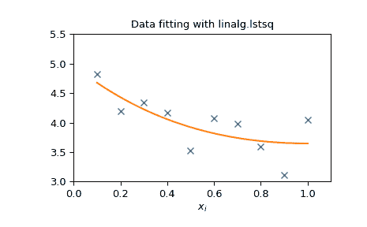

# 线性代数（`scipy.linalg`）

> 原文：[`docs.scipy.org/doc/scipy-1.12.0/tutorial/linalg.html`](https://docs.scipy.org/doc/scipy-1.12.0/tutorial/linalg.html)

当使用优化过的 ATLAS LAPACK 和 BLAS 库构建 SciPy 时，它具有非常快的线性代数功能。如果你深入挖掘，所有原始的 LAPACK 和 BLAS 库都可以用于更快的计算。在本节中，描述了这些例程的一些更易于使用的接口。

所有这些线性代数例程都期望一个可以转换为二维数组的对象。这些例程的输出也是一个二维数组。

## scipy.linalg vs numpy.linalg

`scipy.linalg` 包含了所有 [numpy.linalg](https://www.numpy.org/devdocs/reference/routines.linalg.html) 中的函数，还包括一些在 `numpy.linalg` 中不包含的更高级的函数。

使用 `scipy.linalg` 而不是 `numpy.linalg` 的另一个优势是，它始终编译了 BLAS/LAPACK 支持，而对于 NumPy 这是可选的。因此，根据 NumPy 的安装方式，SciPy 版本可能更快。

因此，除非你不希望将 `scipy` 作为 `numpy` 程序的依赖项，否则请使用 `scipy.linalg` 而不是 `numpy.linalg`。

## numpy.matrix vs 2-D numpy.ndarray

表示矩阵的类和基本操作，如矩阵乘法和转置，是 `numpy` 的一部分。为了方便起见，我们在这里总结了 [`numpy.matrix`](https://numpy.org/devdocs/reference/generated/numpy.matrix.html#numpy.matrix "(in NumPy v2.0.dev0)") 和 [`numpy.ndarray`](https://numpy.org/devdocs/reference/generated/numpy.ndarray.html#numpy.ndarray "(in NumPy v2.0.dev0)") 之间的区别。

`numpy.matrix` 是一个矩阵类，其接口比 `numpy.ndarray` 更方便用于矩阵操作。例如，这个类支持类似 MATLAB 的通过分号创建语法，`*` 运算符默认进行矩阵乘法，并包含 `I` 和 `T` 成员，分别用作求逆和转置的快捷方式：

```py
>>> import numpy as np
>>> A = np.asmatrix('[1 2;3 4]')
>>> A
matrix([[1, 2],
 [3, 4]])
>>> A.I
matrix([[-2\. ,  1\. ],
 [ 1.5, -0.5]])
>>> b = np.asmatrix('[5 6]')
>>> b
matrix([[5, 6]])
>>> b.T
matrix([[5],
 [6]])
>>> A*b.T
matrix([[17],
 [39]]) 
```

尽管 `numpy.matrix` 类很方便，但不建议使用，因为它并没有添加任何不能通过二维 `numpy.ndarray` 对象完成的功能，而且可能导致使用的类混淆。例如，上述代码可以重写为：

```py
>>> import numpy as np
>>> from scipy import linalg
>>> A = np.array([[1,2],[3,4]])
>>> A
array([[1, 2],
 [3, 4]])
>>> linalg.inv(A)
array([[-2\. ,  1\. ],
 [ 1.5, -0.5]])
>>> b = np.array([[5,6]]) #2D array
>>> b
array([[5, 6]])
>>> b.T
array([[5],
 [6]])
>>> A*b #not matrix multiplication!
array([[ 5, 12],
 [15, 24]])
>>> A.dot(b.T) #matrix multiplication
array([[17],
 [39]])
>>> b = np.array([5,6]) #1D array
>>> b
array([5, 6])
>>> b.T  #not matrix transpose!
array([5, 6])
>>> A.dot(b)  #does not matter for multiplication
array([17, 39]) 
```

`scipy.linalg` 的操作可以同样应用于 `numpy.matrix` 或二维 `numpy.ndarray` 对象。

## 基本例程

### 求逆

矩阵 \(\mathbf{A}\) 的逆矩阵是矩阵 \(\mathbf{B}\)，使得 \(\mathbf{AB}=\mathbf{I}\)，其中 \(\mathbf{I}\) 是由主对角线上的元素为 1 组成的单位矩阵。通常，\(\mathbf{B}\) 被表示为 \(\mathbf{B}=\mathbf{A}^{-1}\)。在 SciPy 中，可以使用 `linalg.inv` `(A)` 获得 NumPy 数组 A 的逆矩阵，或者如果 A 是一个矩阵，则使用 `A.I`。例如，令

\[\begin{split}\mathbf{A} = \left[\begin{array}{ccc} 1 & 3 & 5\\ 2 & 5 & 1\\ 2 & 3 & 8\end{array}\right],\end{split}\]

然后

\[\begin{split}\mathbf{A^{-1}} = \frac{1}{25} \left[\begin{array}{ccc} -37 & 9 & 22 \\ 14 & 2 & -9 \\ 4 & -3 & 1 \end{array}\right] = % \left[\begin{array}{ccc} -1.48 & 0.36 & 0.88 \\ 0.56 & 0.08 & -0.36 \\ 0.16 & -0.12 & 0.04 \end{array}\right].\end{split}\]

以下示例展示了 SciPy 中的计算过程

```py
>>> import numpy as np
>>> from scipy import linalg
>>> A = np.array([[1,3,5],[2,5,1],[2,3,8]])
>>> A
array([[1, 3, 5],
 [2, 5, 1],
 [2, 3, 8]])
>>> linalg.inv(A)
array([[-1.48,  0.36,  0.88],
 [ 0.56,  0.08, -0.36],
 [ 0.16, -0.12,  0.04]])
>>> A.dot(linalg.inv(A)) #double check
array([[  1.00000000e+00,  -1.11022302e-16,  -5.55111512e-17],
 [  3.05311332e-16,   1.00000000e+00,   1.87350135e-16],
 [  2.22044605e-16,  -1.11022302e-16,   1.00000000e+00]]) 
```

### 解线性系统

使用 SciPy 命令`linalg.solve`可以直接解线性方程组。该命令需要输入一个矩阵和一个右手边向量，然后计算解向量。提供了一个输入对称矩阵的选项，适用时可以加快处理速度。例如，假设要解以下同时方程组：

\begin{eqnarray*} x + 3y + 5z & = & 10 \\ 2x + 5y + z & = & 8 \\ 2x + 3y + 8z & = & 3 \end{eqnarray*}

我们可以通过矩阵求逆找到解向量：

\[\begin{split}\left[\begin{array}{c} x\\ y\\ z\end{array}\right]=\left[\begin{array}{ccc} 1 & 3 & 5\\ 2 & 5 & 1\\ 2 & 3 & 8\end{array}\right]^{-1}\left[\begin{array}{c} 10\\ 8\\ 3\end{array}\right]=\frac{1}{25}\left[\begin{array}{c} -232\\ 129\\ 19\end{array}\right]=\left[\begin{array}{c} -9.28\\ 5.16\\ 0.76\end{array}\right].\end{split}\]

然而，最好使用 `linalg.solve` 命令，这样可以更快速和更稳定地数值计算。在这种情况下，如下示例所示，它将给出相同的答案：

```py
>>> import numpy as np
>>> from scipy import linalg
>>> A = np.array([[1, 2], [3, 4]])
>>> A
array([[1, 2],
 [3, 4]])
>>> b = np.array([[5], [6]])
>>> b
array([[5],
 [6]])
>>> linalg.inv(A).dot(b)  # slow
array([[-4\. ],
 [ 4.5]])
>>> A.dot(linalg.inv(A).dot(b)) - b  # check
array([[  8.88178420e-16],
 [  2.66453526e-15]])
>>> np.linalg.solve(A, b)  # fast
array([[-4\. ],
 [ 4.5]])
>>> A.dot(np.linalg.solve(A, b)) - b  # check
array([[ 0.],
 [ 0.]]) 
```

### 求行列式

方阵 \(\mathbf{A}\) 的行列式通常表示为 \(\left|\mathbf{A}\right|\)，在线性代数中经常使用。假设 \(a_{ij}\) 是矩阵 \(\mathbf{A}\) 的元素，并且令 \(M_{ij}=\left|\mathbf{A}_{ij}\right|\) 是通过从 \(\mathbf{A}\) 中去除第 \(i^{\textrm{th}}\) 行和第 \(j^{\textrm{th}}\) 列后留下的矩阵的行列式。那么，对于任意行 \(i\),

\[\left|\mathbf{A}\right|=\sum_{j}\left(-1\right)^{i+j}a_{ij}M_{ij}.\]

这是定义行列式的递归方式，其中基本情况是接受 \(1\times1\) 矩阵的行列式仅为矩阵元素。在 SciPy 中，可以使用`linalg.det`计算行列式。例如，矩阵的行列式为

\[\begin{split}\mathbf{A=}\left[\begin{array}{ccc} 1 & 3 & 5\\ 2 & 5 & 1\\ 2 & 3 & 8\end{array}\right]\end{split}\]

是

\begin{eqnarray*} \left|\mathbf{A}\right| & = & 1\left|\begin{array}{cc} 5 & 1\\ 3 & 8\end{array}\right|-3\left|\begin{array}{cc} 2 & 1\\ 2 & 8\end{array}\right|+5\left|\begin{array}{cc} 2 & 5\\ 2 & 3\end{array}\right|\\ & = & 1\left(5\cdot8-3\cdot1\right)-3\left(2\cdot8-2\cdot1\right)+5\left(2\cdot3-2\cdot5\right)=-25.\end{eqnarray*}.

在 SciPy 中，计算如下所示：

```py
>>> import numpy as np
>>> from scipy import linalg
>>> A = np.array([[1,2],[3,4]])
>>> A
array([[1, 2],
 [3, 4]])
>>> linalg.det(A)
-2.0 
```

### 计算范数

也可以使用 SciPy 计算矩阵和向量的范数。使用`linalg.norm`函数可以根据 order 参数（默认为 2）计算所需阶数的向量或矩阵范数。这个函数接受一个秩为 1（向量）或秩为 2（矩阵）的数组以及一个可选的 order 参数。

对于向量*x*，参数可以是任意实数，包括`inf`或`-inf`。计算得到的范数为

\[\begin{split}\left\Vert \mathbf{x}\right\Vert =\left\{ \begin{array}{cc} \max\left|x_{i}\right| & \textrm{ord}=\textrm{inf}\\ \min\left|x_{i}\right| & \textrm{ord}=-\textrm{inf}\\ \left(\sum_{i}\left|x_{i}\right|^{\textrm{ord}}\right)^{1/\textrm{ord}} & \left|\textrm{ord}\right|<\infty.\end{array}\right.\end{split}\]

对于矩阵\(\mathbf{A}\)，范数的有效值只有\(\pm2,\pm1,\) \(\pm\) inf 和‘fro’（或‘f’）。因此，

\[\begin{split}\left\Vert \mathbf{A}\right\Vert =\left\{ \begin{array}{cc} \max_{i}\sum_{j}\left|a_{ij}\right| & \textrm{ord}=\textrm{inf}\\ \min_{i}\sum_{j}\left|a_{ij}\right| & \textrm{ord}=-\textrm{inf}\\ \max_{j}\sum_{i}\left|a_{ij}\right| & \textrm{ord}=1\\ \min_{j}\sum_{i}\left|a_{ij}\right| & \textrm{ord}=-1\\ \max\sigma_{i} & \textrm{ord}=2\\ \min\sigma_{i} & \textrm{ord}=-2\\ \sqrt{\textrm{trace}\left(\mathbf{A}^{H}\mathbf{A}\right)} & \textrm{ord}=\textrm{'fro'}\end{array}\right.\end{split}\]

其中\(\sigma_{i}\)是矩阵\(\mathbf{A}\)的奇异值。

例子：

```py
>>> import numpy as np
>>> from scipy import linalg
>>> A=np.array([[1,2],[3,4]])
>>> A
array([[1, 2],
 [3, 4]])
>>> linalg.norm(A)
5.4772255750516612
>>> linalg.norm(A,'fro') # frobenius norm is the default
5.4772255750516612
>>> linalg.norm(A,1) # L1 norm (max column sum)
6
>>> linalg.norm(A,-1)
4
>>> linalg.norm(A,np.inf) # L inf norm (max row sum)
7 
```

### 解决线性最小二乘问题和伪逆

线性最小二乘问题在应用数学的许多分支中出现。在这个问题中，寻找一组线性缩放系数，使得模型能够拟合数据。特别地，假设数据\(y_{i}\)通过系数\(c_{j}\)和模型函数\(f_{j}\left(\mathbf{x}_{i}\right)\)与数据\(\mathbf{x}_{i}\)相关联，模型表达式为

\[y_{i}=\sum_{j}c_{j}f_{j}\left(\mathbf{x}_{i}\right)+\epsilon_{i},\]

其中\(\epsilon_{i}\)表示数据中的不确定性。最小二乘策略是选择系数\(c_{j}\)使得

\[J\left(\mathbf{c}\right)=\sum_{i}\left|y_{i}-\sum_{j}c_{j}f_{j}\left(x_{i}\right)\right|^{2}.\]

理论上，全局最小值发生在

\[\frac{\partial J}{\partial c_{n}^{*}}=0=\sum_{i}\left(y_{i}-\sum_{j}c_{j}f_{j}\left(x_{i}\right)\right)\left(-f_{n}^{*}\left(x_{i}\right)\right)\]

或

\begin{eqnarray*} \sum_{j}c_{j}\sum_{i}f_{j}\left(x_{i}\right)f_{n}^{*}\left(x_{i}\right) & = & \sum_{i}y_{i}f_{n}^{*}\left(x_{i}\right)\\ \mathbf{A}^{H}\mathbf{Ac} & = & \mathbf{A}^{H}\mathbf{y}\end{eqnarray*},

其中

\[\left\{ \mathbf{A}\right\} _{ij}=f_{j}\left(x_{i}\right).\]

当\(\mathbf{A^{H}A}\)可逆时，

\[\mathbf{c}=\left(\mathbf{A}^{H}\mathbf{A}\right)^{-1}\mathbf{A}^{H}\mathbf{y}=\mathbf{A}^{\dagger}\mathbf{y},\]

其中\(\mathbf{A}^{\dagger}\)被称为\(\mathbf{A}\)的伪逆。请注意，使用此定义的\(\mathbf{A}\)模型可以写成

\[\mathbf{y}=\mathbf{Ac}+\boldsymbol{\epsilon}.\]

命令`linalg.lstsq`将解决线性最小二乘问题，给定\(\mathbf{A}\)和\(\mathbf{y}\)。此外，`linalg.pinv`将给出\(\mathbf{A}^{\dagger}\)，给定\(\mathbf{A}\)。

下面的示例和图表演示了使用`linalg.lstsq`和`linalg.pinv`解决数据拟合问题。下面显示的数据是使用以下模型生成的:

\[y_{i}=c_{1}e^{-x_{i}}+c_{2}x_{i},\]

当\(i=1\ldots10\)时，\(x_{i}=0.1i\)，\(c_{1}=5\)，\(c_{2}=4\)。在\(y_{i}\)和系数\(c_{1}\)、\(c_{2}\)上添加噪声，并使用线性最小二乘法估计。

```py
>>> import numpy as np
>>> from scipy import linalg
>>> import matplotlib.pyplot as plt
>>> rng = np.random.default_rng() 
```

```py
>>> c1, c2 = 5.0, 2.0
>>> i = np.r_[1:11]
>>> xi = 0.1*i
>>> yi = c1*np.exp(-xi) + c2*xi
>>> zi = yi + 0.05 * np.max(yi) * rng.standard_normal(len(yi)) 
```

```py
>>> A = np.c_[np.exp(-xi)[:, np.newaxis], xi[:, np.newaxis]]
>>> c, resid, rank, sigma = linalg.lstsq(A, zi) 
```

```py
>>> xi2 = np.r_[0.1:1.0:100j]
>>> yi2 = c[0]*np.exp(-xi2) + c[1]*xi2 
```

```py
>>> plt.plot(xi,zi,'x',xi2,yi2)
>>> plt.axis([0,1.1,3.0,5.5])
>>> plt.xlabel('$x_i$')
>>> plt.title('Data fitting with linalg.lstsq')
>>> plt.show() 
```



### 广义逆

使用命令`linalg.pinv`计算广义逆。设\(\mathbf{A}\)为一个\(M\times N\)矩阵，若\(M>N\)，则广义逆为

\[\mathbf{A}^{\dagger}=\left(\mathbf{A}^{H}\mathbf{A}\right)^{-1}\mathbf{A}^{H},\]

如果\(M<N\)，则矩阵的广义逆是

\[\mathbf{A}^{\#}=\mathbf{A}^{H}\left(\mathbf{A}\mathbf{A}^{H}\right)^{-1}.\]

如果\(M=N\)，则

\[\mathbf{A}^{\dagger}=\mathbf{A}^{\#}=\mathbf{A}^{-1},\]

只要\(\mathbf{A}\)是可逆的。

## 分解

在许多应用中，使用其他表示法对矩阵进行分解是有用的。SciPy 支持几种分解方法。

### 特征值和特征向量

特征值-特征向量问题是最常用的线性代数操作之一。在一个流行的形式中，特征值-特征向量问题是为某个方阵\(\mathbf{A}\)找到标量\(\lambda\)和相应向量\(\mathbf{v}\)，使得

\[\mathbf{Av}=\lambda\mathbf{v}.\]

对于一个\(N\times N\)矩阵，有\(N\)（不一定是不同的）特征值 — 是多项式的根

\[\left|\mathbf{A}-\lambda\mathbf{I}\right|=0.\]

特征向量\(\mathbf{v}\)有时也被称为右特征向量，以区别于满足以下条件的另一组左特征向量

\[\mathbf{v}_{L}^{H}\mathbf{A}=\lambda\mathbf{v}_{L}^{H}\]

或者

\[\mathbf{A}^{H}\mathbf{v}_{L}=\lambda^{*}\mathbf{v}_{L}.\]

默认情况下，命令 `linalg.eig` 返回 \(\lambda\) 和 \(\mathbf{v}.\) 然而，它也可以只返回 \(\mathbf{v}_{L}\) 和 \(\lambda\) 本身（ `linalg.eigvals` 也只返回 \(\lambda\)）。

此外，`linalg.eig` 也可以解决更一般的特征值问题。

\begin{eqnarray*} \mathbf{Av} & = & \lambda\mathbf{Bv}\\ \mathbf{A}^{H}\mathbf{v}_{L} & = & \lambda^{*}\mathbf{B}^{H}\mathbf{v}_{L}\end{eqnarray*}

对于方阵 \(\mathbf{A}\) 和 \(\mathbf{B}.\) 标准特征值问题是 \(\mathbf{B}=\mathbf{I}.\) 的一个示例。当可以解决广义特征值问题时，它提供了 \(\mathbf{A}\) 的分解如下：

\[\mathbf{A}=\mathbf{BV}\boldsymbol{\Lambda}\mathbf{V}^{-1},\]

其中 \(\mathbf{V}\) 是特征向量的集合列，\(\boldsymbol{\Lambda}\) 是特征值的对角线矩阵。

按定义，特征向量仅在一个常数比例因子内定义。在 SciPy 中，特征向量的缩放因子被选择为 \(\left\Vert \mathbf{v}\right\Vert ^{2}=\sum_{i}v_{i}^{2}=1.\)

例如，考虑找到矩阵的特征值和特征向量

\[\begin{split}\mathbf{A}=\left[\begin{array}{ccc} 1 & 5 & 2\\ 2 & 4 & 1\\ 3 & 6 & 2\end{array}\right].\end{split}\]

特征多项式是

\begin{eqnarray*} \left|\mathbf{A}-\lambda\mathbf{I}\right| & = & \left(1-\lambda\right)\left[\left(4-\lambda\right)\left(2-\lambda\right)-6\right]-\\ & & 5\left[2\left(2-\lambda\right)-3\right]+2\left[12-3\left(4-\lambda\right)\right]\\ & = & -\lambda^{3}+7\lambda^{2}+8\lambda-3.\end{eqnarray*}

这个多项式的根是 \(\mathbf{A}\) 的特征值：

\begin{eqnarray*} \lambda_{1} & = & 7.9579\\ \lambda_{2} & = & -1.2577\\ \lambda_{3} & = & 0.2997.\end{eqnarray*}

与每个特征值对应的特征向量可以使用原方程找到。然后可以找到与这些特征值相关的特征向量。

```py
>>> import numpy as np
>>> from scipy import linalg
>>> A = np.array([[1, 2], [3, 4]])
>>> la, v = linalg.eig(A)
>>> l1, l2 = la
>>> print(l1, l2)   # eigenvalues
(-0.3722813232690143+0j) (5.372281323269014+0j)
>>> print(v[:, 0])   # first eigenvector
[-0.82456484  0.56576746]
>>> print(v[:, 1])   # second eigenvector
[-0.41597356 -0.90937671]
>>> print(np.sum(abs(v**2), axis=0))  # eigenvectors are unitary
[1\. 1.]
>>> v1 = np.array(v[:, 0]).T
>>> print(linalg.norm(A.dot(v1) - l1*v1))  # check the computation
3.23682852457e-16 
```

### 奇异值分解

奇异值分解（SVD）可以看作是对不是方阵的矩阵的特征值问题的扩展。设\(\mathbf{A}\)是一个\(M\times N\)矩阵，其中\(M\)和\(N\)是任意的。矩阵\(\mathbf{A}^{H}\mathbf{A}\)和\(\mathbf{A}\mathbf{A}^{H}\)是大小分别为\(N\times N\)和\(M\times M\)的方正定矩阵。已知方正定矩阵的特征值是实数且非负。此外，\(\mathbf{A}^{H}\mathbf{A}\)和\(\mathbf{A}\mathbf{A}^{H}\)最多有\(\min\left(M,N\right)\)个相同的非零特征值。将这些正特征值定义为\(\sigma_{i}^{2}\)。这些的平方根称为\(\mathbf{A}\)的奇异值。\(\mathbf{A}^{H}\mathbf{A}\)的特征向量按列收集在一个\(N\times N\)的酉矩阵\(\mathbf{V}\)中，而\(\mathbf{A}\mathbf{A}^{H}\)的特征向量按列收集在酉矩阵\(\mathbf{U}\)中，奇异值按主对角线项设置为奇异值的\(M\times N\)零矩阵\(\mathbf{\boldsymbol{\Sigma}}\)。然后

\[\mathbf{A=U}\boldsymbol{\Sigma}\mathbf{V}^{H}\]

是矩阵\(\mathbf{A}\)的奇异值分解。每个矩阵都有一个奇异值分解。有时，奇异值被称为\(\mathbf{A}\)的频谱。使用命令`linalg.svd`将返回\(\mathbf{U}\)，\(\mathbf{V}^{H}\)和\(\sigma_{i}\)作为奇异值数组。要获取矩阵\(\boldsymbol{\Sigma}\)，请使用`linalg.diagsvd`。以下示例说明了`linalg.svd`的使用：

```py
>>> import numpy as np
>>> from scipy import linalg
>>> A = np.array([[1,2,3],[4,5,6]])
>>> A
array([[1, 2, 3],
 [4, 5, 6]])
>>> M,N = A.shape
>>> U,s,Vh = linalg.svd(A)
>>> Sig = linalg.diagsvd(s,M,N)
>>> U, Vh = U, Vh
>>> U
array([[-0.3863177 , -0.92236578],
 [-0.92236578,  0.3863177 ]])
>>> Sig
array([[ 9.508032  ,  0\.        ,  0\.        ],
 [ 0\.        ,  0.77286964,  0\.        ]])
>>> Vh
array([[-0.42866713, -0.56630692, -0.7039467 ],
 [ 0.80596391,  0.11238241, -0.58119908],
 [ 0.40824829, -0.81649658,  0.40824829]])
>>> U.dot(Sig.dot(Vh)) #check computation
array([[ 1.,  2.,  3.],
 [ 4.,  5.,  6.]]) 
```

### LU 分解

LU 分解将\(M\times N\)矩阵\(\mathbf{A}\)表示为

\[\mathbf{A}=\mathbf{P}\,\mathbf{L}\,\mathbf{U},\]

其中\(\mathbf{P}\)是一个\(M\times M\)的置换矩阵（单位矩阵的行置换），\(\mathbf{L}\)是一个\(M\times K\)的下三角或梯形矩阵（\(K=\min\left(M,N\right)\)），具有单位对角线，\(\mathbf{U}\)是一个上三角或梯形矩阵。SciPy 中进行这种分解的命令是`linalg.lu`。

这样的分解通常用于解决许多同时方程组，其中左边不变，但右边会发生变化。例如，假设我们要解决

\[\mathbf{A}\mathbf{x}_{i}=\mathbf{b}_{i}\]

对于许多不同的\(\mathbf{b}_{i}\)，LU 分解允许将其写为

\[\mathbf{PLUx}_{i}=\mathbf{b}_{i}.\]

因为 \(\mathbf{L}\) 是下三角形矩阵，这个方程可以通过前向和后向替换非常快速地解出 \(\mathbf{U}\mathbf{x}_{i}\)，最终，通过 `linalg.lu_factor` 命令求解每个新右手边的系统。

### Cholesky 分解

Cholesky 分解是 LU 分解适用于 Hermitian 正定矩阵的特例。当 \(\mathbf{A}=\mathbf{A}^{H}\) 并且对于所有的 \(\mathbf{x}\)，\(\mathbf{x}^{H}\mathbf{Ax}\geq0\)，则可以找到 \(\mathbf{A}\) 的分解，使得

\begin{eqnarray*} \mathbf{A} & = & \mathbf{U}^{H}\mathbf{U}\\ \mathbf{A} & = & \mathbf{L}\mathbf{L}^{H}\end{eqnarray*}，

其中 \(\mathbf{L}\) 是下三角形矩阵，\(\mathbf{U}\) 是上三角形矩阵。注意，\(\mathbf{L}=\mathbf{U}^{H}\)。Cholesky 分解的命令 `linalg.cholesky` 计算 Cholesky 因子分解。对于使用 Cholesky 因子分解来解方程组，还有 `linalg.cho_factor` 和 `linalg.cho_solve` 类似于它们的 LU 分解对应的例程。

### QR 分解

QR 分解（有时称为极分解）适用于任何 \(M\times N\) 数组，并找到一个 \(M\times M\) 的酉矩阵 \(\mathbf{Q}\) 和一个 \(M\times N\) 的上梯形矩阵 \(\mathbf{R}\)，使得

\[\mathbf{A=QR}\]。

注意，如果已知 \(\mathbf{A}\) 的 SVD 分解，则可以找到 QR 分解。

\[\mathbf{A}=\mathbf{U}\boldsymbol{\Sigma}\mathbf{V}^{H}=\mathbf{QR}\]。

意味着 \(\mathbf{Q}=\mathbf{U}\) 和 \(\mathbf{R}=\boldsymbol{\Sigma}\mathbf{V}^{H}\)。然而，在 SciPy 中使用独立的算法来找到 QR 和 SVD 分解。QR 分解的命令是 `linalg.qr`。

### Schur 分解

对于一个方阵 \(N\times N\)，\(\mathbf{A}\)，Schur 分解找到（不一定唯一的）矩阵 \(\mathbf{T}\) 和 \(\mathbf{Z}\)，使得

\[\mathbf{A}=\mathbf{ZT}\mathbf{Z}^{H}\]，

其中 \(\mathbf{Z}\) 是一个酉矩阵，\(\mathbf{T}\) 是上三角或准上三角，具体取决于是否请求实舒尔形式或复舒尔形式。当 \(\mathbf{A}\) 是实值时，实舒尔形式中 \(\mathbf{T}\) 和 \(\mathbf{Z}\) 都是实数值。当 \(\mathbf{A}\) 是实值矩阵时，实舒尔形式只是准上三角，因为 \(2\times2\) 块从主对角线伸出，对应于任何复值特征值。命令 `linalg.schur` 找到舒尔分解，而命令 `linalg.rsf2csf` 将 \(\mathbf{T}\) 和 \(\mathbf{Z}\) 从实舒尔形式转换为复舒尔形式。舒尔形式在计算矩阵函数时特别有用。

以下示例说明了舒尔分解：

```py
>>> from scipy import linalg
>>> A = np.asmatrix('[1 3 2; 1 4 5; 2 3 6]')
>>> T, Z = linalg.schur(A)
>>> T1, Z1 = linalg.schur(A, 'complex')
>>> T2, Z2 = linalg.rsf2csf(T, Z)
>>> T
array([[ 9.90012467,  1.78947961, -0.65498528],
 [ 0\.        ,  0.54993766, -1.57754789],
 [ 0\.        ,  0.51260928,  0.54993766]])
>>> T2
array([[ 9.90012467+0.00000000e+00j, -0.32436598+1.55463542e+00j,
 -0.88619748+5.69027615e-01j],
 [ 0\.        +0.00000000e+00j,  0.54993766+8.99258408e-01j,
 1.06493862+3.05311332e-16j],
 [ 0\.        +0.00000000e+00j,  0\.        +0.00000000e+00j,
 0.54993766-8.99258408e-01j]])
>>> abs(T1 - T2) # different
array([[  1.06604538e-14,   2.06969555e+00,   1.69375747e+00],  # may vary
 [  0.00000000e+00,   1.33688556e-15,   4.74146496e-01],
 [  0.00000000e+00,   0.00000000e+00,   1.13220977e-15]])
>>> abs(Z1 - Z2) # different
array([[ 0.06833781,  0.88091091,  0.79568503],    # may vary
 [ 0.11857169,  0.44491892,  0.99594171],
 [ 0.12624999,  0.60264117,  0.77257633]])
>>> T, Z, T1, Z1, T2, Z2 = map(np.asmatrix,(T,Z,T1,Z1,T2,Z2))
>>> abs(A - Z*T*Z.H)  # same
matrix([[  5.55111512e-16,   1.77635684e-15,   2.22044605e-15],
 [  0.00000000e+00,   3.99680289e-15,   8.88178420e-16],
 [  1.11022302e-15,   4.44089210e-16,   3.55271368e-15]])
>>> abs(A - Z1*T1*Z1.H)  # same
matrix([[  4.26993904e-15,   6.21793362e-15,   8.00007092e-15],
 [  5.77945386e-15,   6.21798014e-15,   1.06653681e-14],
 [  7.16681444e-15,   8.90271058e-15,   1.77635764e-14]])
>>> abs(A - Z2*T2*Z2.H)  # same
matrix([[  6.02594127e-16,   1.77648931e-15,   2.22506907e-15],
 [  2.46275555e-16,   3.99684548e-15,   8.91642616e-16],
 [  8.88225111e-16,   8.88312432e-16,   4.44104848e-15]]) 
```

### 插值分解

`scipy.linalg.interpolative` 包含用于计算矩阵的插值分解（ID）的例程。对于秩为 \(k \leq \min \{ m, n \}\) 的矩阵 \(A \in \mathbb{C}^{m \times n}\)，这是一种分解

\[A \Pi = \begin{bmatrix} A \Pi_{1} & A \Pi_{2} \end{bmatrix} = A \Pi_{1} \begin{bmatrix} I & T \end{bmatrix},\]

其中 \(\Pi = [\Pi_{1}, \Pi_{2}]\) 是一个带有 \(\Pi_{1} \in \{ 0, 1 \}^{n \times k}\) 的置换矩阵，即 \(A \Pi_{2} = A \Pi_{1} T\)。这等效地可以写成 \(A = BP\)，其中 \(B = A \Pi_{1}\) 和 \(P = [I, T] \Pi^{\mathsf{T}}\) 是 *骨架* 和 *插值* 矩阵。

另请参阅

`scipy.linalg.interpolative` — 获取更多信息。

## 矩阵函数

考虑具有泰勒级数展开的函数 \(f\left(x\right)\)

\[f\left(x\right)=\sum_{k=0}^{\infty}\frac{f^{\left(k\right)}\left(0\right)}{k!}x^{k}.\]

可以使用这个泰勒级数为方阵 \(\mathbf{A}\) 定义矩阵函数

\[f\left(\mathbf{A}\right)=\sum_{k=0}^{\infty}\frac{f^{\left(k\right)}\left(0\right)}{k!}\mathbf{A}^{k}.\]

注意

尽管这提供了矩阵函数的一个有用表示，但这很少是计算矩阵函数的最佳方法。特别是，如果矩阵不可对角化，结果可能不准确。

### 指数和对数函数

矩阵指数是更常见的矩阵函数之一。实现矩阵指数的首选方法是使用缩放和 Padé 近似来计算 \(e^{x}\)。此算法实现为 `linalg.expm`。

矩阵指数的逆是作为矩阵对数定义的矩阵对数：

\[\mathbf{A}\equiv\exp\left(\log\left(\mathbf{A}\right)\right).\]

可以使用 `linalg.logm` 获得矩阵对数。

### 三角函数

矩阵中的三角函数，\(\sin\), \(\cos\), 和 \(\tan\), 在 `linalg.sinm`, `linalg.cosm`, 和 `linalg.tanm` 中实现。矩阵正弦和余弦可以使用欧拉恒等式定义为

\begin{eqnarray*} \sin\left(\mathbf{A}\right) & = & \frac{e^{j\mathbf{A}}-e^{-j\mathbf{A}}}{2j}\\ \cos\left(\mathbf{A}\right) & = & \frac{e^{j\mathbf{A}}+e^{-j\mathbf{A}}}{2}.\end{eqnarray*}

切线是

\[\tan\left(x\right)=\frac{\sin\left(x\right)}{\cos\left(x\right)}=\left[\cos\left(x\right)\right]^{-1}\sin\left(x\right)\]

因此，矩阵切线被定义为

\[\left[\cos\left(\mathbf{A}\right)\right]^{-1}\sin\left(\mathbf{A}\right).\]

### 超 bolic 三角函数

超 bolic 三角函数，\(\sinh\), \(\cosh\), 和 \(\tanh\), 也可以用熟悉的定义为矩阵定义：

\begin{eqnarray*} \sinh\left(\mathbf{A}\right) & = & \frac{e^{\mathbf{A}}-e^{-\mathbf{A}}}{2}\\ \cosh\left(\mathbf{A}\right) & = & \frac{e^{\mathbf{A}}+e^{-\mathbf{A}}}{2}\\ \tanh\left(\mathbf{A}\right) & = & \left[\cosh\left(\mathbf{A}\right)\right]^{-1}\sinh\left(\mathbf{A}\right).\end{eqnarray*}

这些矩阵函数可以在 `linalg.sinhm`, `linalg.coshm`, 和 `linalg.tanhm` 中找到。

### 任意函数

最后，任意接受一个复数并返回一个复数的函数可以被称为矩阵函数，使用命令 `linalg.funm`。此命令接受矩阵和任意的 Python 函数。然后，它使用 Golub 和 Van Loan 的书“Matrix Computations”中的算法，使用 Schur 分解计算应用于矩阵的函数。请注意*函数需要接受复数*作为输入才能使用此算法。例如，以下代码计算应用于矩阵的零阶贝塞尔函数。

```py
>>> from scipy import special, linalg
>>> rng = np.random.default_rng()
>>> A = rng.random((3, 3))
>>> B = linalg.funm(A, lambda x: special.jv(0, x))
>>> A
array([[0.06369197, 0.90647174, 0.98024544],
 [0.68752227, 0.5604377 , 0.49142032],
 [0.86754578, 0.9746787 , 0.37932682]])
>>> B
array([[ 0.6929219 , -0.29728805, -0.15930896],
 [-0.16226043,  0.71967826, -0.22709386],
 [-0.19945564, -0.33379957,  0.70259022]])
>>> linalg.eigvals(A)
array([ 1.94835336+0.j, -0.72219681+0.j, -0.22270006+0.j])
>>> special.jv(0, linalg.eigvals(A))
array([0.25375345+0.j, 0.87379738+0.j, 0.98763955+0.j])
>>> linalg.eigvals(B)
array([0.25375345+0.j, 0.87379738+0.j, 0.98763955+0.j]) 
```

注意，由于矩阵解析函数的定义方式，贝塞尔函数已经作用于矩阵的特征值。

## 特殊矩阵

SciPy 和 NumPy 提供了几个用于创建在工程和科学中经常使用的特殊矩阵的函数。

| 类型 | 函数 | 描述 |
| --- | --- | --- |
| 块对角 | `scipy.linalg.block_diag` | 从提供的数组创建一个块对角矩阵。 |
| 循环 | `scipy.linalg.circulant` | 创建一个循环矩阵。 |
| 伴随 | `scipy.linalg.companion` | 创建一个伴随矩阵。 |
| 卷积 | `scipy.linalg.convolution_matrix` | 创建一个卷积矩阵。 |
| 离散傅立叶 | `scipy.linalg.dft` | 创建一个离散傅立叶变换矩阵。 |
| 菲德勒 | `scipy.linalg.fiedler` | 创建一个对称的菲德勒矩阵。 |
| 菲德勒伴随 | `scipy.linalg.fiedler_companion` | 创建一个菲德勒伴随矩阵。 |
| 哈达玛德 | `scipy.linalg.hadamard` | 创建一个哈达玛德矩阵。 |
| 汉克尔 | `scipy.linalg.hankel` | 创建一个汉克尔矩阵。 |
| 赫尔默特 | `scipy.linalg.helmert` | 创建一个赫尔默特矩阵。 |
| 希尔伯特 | `scipy.linalg.hilbert` | 创建一个希尔伯特矩阵。 |
| 逆希尔伯特 | `scipy.linalg.invhilbert` | 创建希尔伯特矩阵的逆矩阵。 |
| 莱斯利 | `scipy.linalg.leslie` | 创建一个莱斯利矩阵。 |
| 帕斯卡 | `scipy.linalg.pascal` | 创建一个帕斯卡矩阵。 |
| 逆帕斯卡 | `scipy.linalg.invpascal` | 创建帕斯卡矩阵的逆矩阵。 |
| 托普利茨 | `scipy.linalg.toeplitz` | 创建一个托普利茨矩阵。 |
| 范德蒙德 | [`numpy.vander`](https://numpy.org/devdocs/reference/generated/numpy.vander.html#numpy.vander "(in NumPy v2.0.dev0)") | 创建一个范德蒙德矩阵。 |

用这些函数的示例，请参阅它们各自的文档字符串。
