# 统计（`scipy.stats`）

> 原文：[`docs.scipy.org/doc/scipy-1.12.0/tutorial/stats.html`](https://docs.scipy.org/doc/scipy-1.12.0/tutorial/stats.html)

## 简介

在本教程中，我们讨论了许多`scipy.stats`的功能，但肯定不是所有功能。这里的意图是为用户提供对此包的工作知识。我们参考参考手册获取更多详细信息。

注意：本文档正在进行中。

+   离散统计分布

+   连续统计分布

+   SciPy 中的通用非均匀随机数采样

+   重采样和蒙特卡罗方法

## 随机变量

已经实现了两个通用分布类，用于封装连续随机变量和离散随机变量。使用这些类已经实现了超过 80 个连续随机变量（RVs）和 10 个离散随机变量。此外，用户可以轻松地添加新的例程和分布（如果您创建了一个，请贡献出来）。

所有统计函数位于子包`scipy.stats`中，可以使用`info(stats)`获取这些函数的相当完整的列表。还可以从 stats 子包的文档字符串中获取可用的随机变量列表。

在以下讨论中，我们主要关注连续 RVs。几乎所有内容也适用于离散变量，但我们在这里指出了一些差异：离散分布的特定点。

在下面的代码示例中，我们假设`scipy.stats`包已经导入为

```py
>>> from scipy import stats 
```

在某些情况下，我们假设已经导入了个别对象

```py
>>> from scipy.stats import norm 
```

### 获取帮助

首先，所有分布都伴随有帮助函数。要仅获得一些基本信息，我们打印相关的文档字符串：`print(stats.norm.__doc__)`。

要找到支持区间，即分布的上限和下限，请调用：

```py
>>> print('bounds of distribution lower: %s, upper: %s' % norm.support())
bounds of distribution lower: -inf, upper: inf 
```

我们可以用`dir(norm)`列出分布的所有方法和属性。事实证明，一些方法是私有的，尽管它们没有以下划线开头（它们的名称不是这样命名的），例如`veccdf`，只能用于内部计算（当试图使用它们时会发出警告，并且将在某个时候删除）。

要获得*真正*的主要方法，我们列出冻结分布的方法。（我们将在下面解释*冻结*分布的含义）。

```py
>>> rv = norm()
>>> dir(rv)  # reformatted
['__class__', '__delattr__', '__dict__', '__dir__', '__doc__', '__eq__',
 '__format__', '__ge__', '__getattribute__', '__gt__', '__hash__',
 '__init__', '__le__', '__lt__', '__module__', '__ne__', '__new__',
 '__reduce__', '__reduce_ex__', '__repr__', '__setattr__', '__sizeof__',
 '__str__', '__subclasshook__', '__weakref__', 'a', 'args', 'b', 'cdf',
 'dist', 'entropy', 'expect', 'interval', 'isf', 'kwds', 'logcdf',
 'logpdf', 'logpmf', 'logsf', 'mean', 'median', 'moment', 'pdf', 'pmf',
 'ppf', 'random_state', 'rvs', 'sf', 'stats', 'std', 'var'] 
```

最后，我们可以通过内省获得可用分布的列表：

```py
>>> dist_continu = [d for d in dir(stats) if
...                 isinstance(getattr(stats, d), stats.rv_continuous)]
>>> dist_discrete = [d for d in dir(stats) if
...                  isinstance(getattr(stats, d), stats.rv_discrete)]
>>> print('number of continuous distributions: %d' % len(dist_continu))
number of continuous distributions: 108
>>> print('number of discrete distributions: %d' % len(dist_discrete))
number of discrete distributions:   20 
```

### 常见方法

连续 RVs 的主要公共方法包括：

+   rvs：随机变量

+   pdf：概率密度函数

+   cdf：累积分布函数

+   sf：生存函数（1-CDF）

+   ppf：百分点函数（CDF 的逆）

+   isf：逆生存函数（SF 的逆）

+   统计：返回均值、方差、（Fisher 的）偏度或（Fisher 的）峰度

+   moment：分布的非中心矩

让我们以正态随机变量为例。

```py
>>> norm.cdf(0)
0.5 
```

要在多个点计算`cdf`，可以传递一个列表或 NumPy 数组。

```py
>>> norm.cdf([-1., 0, 1])
array([ 0.15865525,  0.5,  0.84134475])
>>> import numpy as np
>>> norm.cdf(np.array([-1., 0, 1]))
array([ 0.15865525,  0.5,  0.84134475]) 
```

因此，基本方法，如*pdf*、*cdf*等，都是矢量化的。

其他通常有用的方法也受到支持：

```py
>>> norm.mean(), norm.std(), norm.var()
(0.0, 1.0, 1.0)
>>> norm.stats(moments="mv")
(array(0.0), array(1.0)) 
```

要找到分布的中位数，我们可以使用百分点函数`ppf`，它是`cdf`的逆函数：

```py
>>> norm.ppf(0.5)
0.0 
```

要生成一系列随机变量，使用`size`关键字参数：

```py
>>> norm.rvs(size=3)
array([-0.35687759,  1.34347647, -0.11710531])   # random 
```

不要认为`norm.rvs(5)`会生成 5 个变量：

```py
>>> norm.rvs(5)
5.471435163732493  # random 
```

在这里，`5`而没有关键字被解释为第一个可能的关键字参数`loc`，它是所有连续分布采用的一对关键字参数中的第一个。这将我们带到下一小节的主题。

### 随机数生成

抽取随机数依赖于[`numpy.random`](https://numpy.org/devdocs/reference/random/index.html#module-numpy.random "(在 NumPy v2.0.dev0 中)")包中的生成器。在上述示例中，特定的随机数流在多次运行中无法重现。要实现可重复性，可以显式地*种子*一个随机数生成器。在 NumPy 中，生成器是[`numpy.random.Generator`](https://numpy.org/devdocs/reference/random/generator.html#numpy.random.Generator "(在 NumPy v2.0.dev0 中)")的实例。以下是创建生成器的标准方式：

```py
>>> from numpy.random import default_rng
>>> rng = default_rng() 
```

并且可以通过以下方式固定种子：

```py
>>> # do NOT copy this value
>>> rng = default_rng(301439351238479871608357552876690613766) 
```

警告

不要使用此数或常见值，如 0\. 仅使用一小组种子来实例化更大的状态空间意味着存在一些不可能达到的初始状态。如果每个人都使用这样的值，会造成一些偏差。获取种子的好方法是使用[`numpy.random.SeedSequence`](https://numpy.org/devdocs/reference/random/bit_generators/generated/numpy.random.SeedSequence.html#numpy.random.SeedSequence "(在 NumPy v2.0.dev0 中)"):

```py
>>> from numpy.random import SeedSequence
>>> print(SeedSequence().entropy)
301439351238479871608357552876690613766  # random 
```

分布中的*random_state*参数接受一个[`numpy.random.Generator`](https://numpy.org/devdocs/reference/random/generator.html#numpy.random.Generator "(在 NumPy v2.0.dev0 中)")类的实例或一个整数，然后用于种子化内部的`Generator`对象：

```py
>>> norm.rvs(size=5, random_state=rng)
array([ 0.47143516, -1.19097569,  1.43270697, -0.3126519 , -0.72058873])  # random 
```

欲了解更多信息，请参阅[NumPy 文档](https://numpy.org/doc/stable/reference/random/index.html)。

要了解更多关于 SciPy 中实现的随机数采样器，请参阅非均匀随机数采样教程和准蒙特卡洛教程

### 移位和缩放

所有连续分布都接受`loc`和`scale`作为关键参数，以调整分布的位置和尺度，例如，对于标准正态分布，位置是均值，尺度是标准差。

```py
>>> norm.stats(loc=3, scale=4, moments="mv")
(array(3.0), array(16.0)) 
```

在许多情况下，随机变量`X`的标准化分布是通过变换`(X - loc) / scale`来获得的。 默认值为`loc = 0`和`scale = 1`。

智能使用`loc`和`scale`可以帮助以许多方式修改标准分布。 为了进一步说明缩放，指数分布随机变量的`cdf`是

\[F(x) = 1 - \exp(-\lambda x)\]

通过应用上述的缩放规则，可以看到通过取`scale = 1./lambda`，我们得到了适当的比例。

```py
>>> from scipy.stats import expon
>>> expon.mean(scale=3.)
3.0 
```

注意

需要形状参数\(a\)的分布可能需要不仅仅是简单地应用`loc`和/或`scale`来实现所需的形式。 例如，给定长度为\(R\)的恒定向量，每个分量受独立的 N(0, \(\sigma²\))扰动影响的 2-D 向量长度分布为 rice(\(R/\sigma\), scale= \(\sigma\))。 第一个参数是一个需要与\(x\)一起缩放的形状参数。

均匀分布也很有趣：

```py
>>> from scipy.stats import uniform
>>> uniform.cdf([0, 1, 2, 3, 4, 5], loc=1, scale=4)
array([ 0\.  ,  0\.  ,  0.25,  0.5 ,  0.75,  1\.  ]) 
```

最后，请回顾前段提到的问题，即我们需要理解`norm.rvs(5)`的含义。 结果表明，像这样调用分布时，第一个参数即 5 被传递以设置`loc`参数。 让我们看看：

```py
>>> np.mean(norm.rvs(5, size=500))
5.0098355106969992  # random 
```

因此，要解释上一节示例的输出：`norm.rvs(5)`生成具有均值`loc=5`的单个正态分布随机变量，因为默认的`size=1`。

建议通过将值作为关键词而不是作为参数明确设置`loc`和`scale`参数。 当调用同一随机变量的多个方法时，可以使用冻结分布的技术来最小化重复，如下所述。

### 形状参数

虽然一般连续随机变量可以通过`loc`和`scale`参数进行移位和缩放，但某些分布需要额外的形状参数。 例如，具有密度的伽玛分布

\[\gamma(x, a) = \frac{\lambda (\lambda x)^{a-1}}{\Gamma(a)} e^{-\lambda x}\;,\]

需要形状参数\(a\)的分布。 注意，通过将`scale`关键字设置为\(1/\lambda\)可以获得\(\lambda\)。

让我们检查伽玛分布的形状参数的数量和名称。 （我们从上面知道应该是 1。）

```py
>>> from scipy.stats import gamma
>>> gamma.numargs
1
>>> gamma.shapes
'a' 
```

现在，我们将形状变量的值设为 1，以获得指数分布，以便轻松比较我们是否得到预期的结果。

```py
>>> gamma(1, scale=2.).stats(moments="mv")
(array(2.0), array(4.0)) 
```

注意，我们也可以将形状参数指定为关键词：

```py
>>> gamma(a=1, scale=2.).stats(moments="mv")
(array(2.0), array(4.0)) 
```

### 冻结分布

反复传递`loc`和`scale`关键字可能会变得非常麻烦。 使用*冻结*随机变量的概念来解决此类问题。

```py
>>> rv = gamma(1, scale=2.) 
```

通过使用`rv`，我们不再需要在每次方法调用中包含尺度或形状参数了。因此，分布可以通过两种方式之一使用，要么将所有分布参数传递给每个方法调用（例如之前所做的），要么冻结分布实例的参数。让我们来检查一下：

```py
>>> rv.mean(), rv.std()
(2.0, 2.0) 
```

这确实是我们应该得到的结果。

### 广播

基本方法`pdf`等符合通常的 numpy 广播规则。例如，我们可以计算不同概率和自由度的 t 分布上尾的临界值。

```py
>>> stats.t.isf([0.1, 0.05, 0.01], [[10], [11]])
array([[ 1.37218364,  1.81246112,  2.76376946],
 [ 1.36343032,  1.79588482,  2.71807918]]) 
```

在这里，第一行包含 10 自由度的临界值，第二行包含 11 自由度（d.o.f.）。因此，广播规则使得两次调用`isf`得到相同的结果： 

```py
>>> stats.t.isf([0.1, 0.05, 0.01], 10)
array([ 1.37218364,  1.81246112,  2.76376946])
>>> stats.t.isf([0.1, 0.05, 0.01], 11)
array([ 1.36343032,  1.79588482,  2.71807918]) 
```

如果概率数组，即`[0.1, 0.05, 0.01]`和自由度数组，即`[10, 11, 12]`具有相同的数组形状，则使用逐元素匹配。例如，我们可以通过调用以下方式获得 10 自由度的 10%尾部，11 自由度的 5%尾部和 12 自由度的 1%尾部。

```py
>>> stats.t.isf([0.1, 0.05, 0.01], [10, 11, 12])
array([ 1.37218364,  1.79588482,  2.68099799]) 
```

### 离散分布的特定点

离散分布与连续分布大多数具有相同的基本方法。但是，`pdf`被概率质量函数`pmf`替代，没有可用的估计方法（例如拟合），而`scale`不是有效的关键字参数。仍然可以使用位置参数关键字`loc`来移动分布。

计算累积分布函数（cdf）需要额外注意。在连续分布的情况下，累积分布函数在界限（a，b）内在大多数标准情况下是严格单调递增的，因此具有唯一的反函数。然而，离散分布的累积分布函数是一个步骤函数，因此反函数即百分位点函数需要不同的定义：

```py
ppf(q) = min{x : cdf(x) >= q, x integer} 
```

获取更多信息，请参阅此处的文档 here。

我们可以以超几何分布为例

```py
>>> from scipy.stats import hypergeom
>>> [M, n, N] = [20, 7, 12] 
```

如果我们在某些整数点使用累积分布函数（cdf），然后在这些 cdf 值上评估百分位点函数（ppf），我们可以得到初始的整数值，例如

```py
>>> x = np.arange(4) * 2
>>> x
array([0, 2, 4, 6])
>>> prb = hypergeom.cdf(x, M, n, N)
>>> prb
array([  1.03199174e-04,   5.21155831e-02,   6.08359133e-01,
 9.89783282e-01])
>>> hypergeom.ppf(prb, M, n, N)
array([ 0.,  2.,  4.,  6.]) 
```

如果我们使用的值不是累积分布函数（cdf）步骤函数的拐点，则会得到下一个更高的整数值：

```py
>>> hypergeom.ppf(prb + 1e-8, M, n, N)
array([ 1.,  3.,  5.,  7.])
>>> hypergeom.ppf(prb - 1e-8, M, n, N)
array([ 0.,  2.,  4.,  6.]) 
```

### 拟合分布

未冻结分布的主要附加方法与分布参数的估计有关：

+   fit：包括位置的分布参数的最大似然估计

    和尺度

+   fit_loc_scale：在给定形状参数时估计位置和尺度

+   nnlf：负对数似然函数

+   expect：计算函数对 pdf 或 pmf 的期望

### 性能问题和注意事项

就个体方法的性能而言，速度方面有很大的差异，这些方法的结果是通过显式计算或与特定分布无关的通用算法之一获得的。

显式计算，一方面要求对于给定的分布直接指定方法，可以是通过解析公式或`scipy.special`或`numpy.random`中的特殊函数进行计算。这些通常是相对快速的计算。

另一方面，如果分布未指定任何显式计算，则使用通用方法。要定义一个分布，只需要 pdf 或 cdf 中的一个；所有其他方法可以使用数值积分和根查找导出。然而，这些间接方法可能非常*慢*。例如，`rgh = stats.gausshyper.rvs(0.5, 2, 2, 2, size=100)`以非常间接的方式创建随机变量，在我的计算机上为 100 个随机变量大约需要 19 秒，而从标准正态分布或 t 分布中生成一百万个随机变量仅需要超过一秒。

### 剩余问题

`scipy.stats`中的分布最近已经得到了修正和改进，并增加了相当多的测试套件；然而，还有一些问题存在：

+   已经对分布在一些参数范围内进行了测试；然而，在某些角落范围内，可能仍然存在一些不正确的结果。

+   *fit*中的最大似然估计不能使用所有分布的默认起始参数，并且用户需要提供良好的起始参数。此外，对于某些分布来说，使用最大似然估计可能本质上并不是最佳选择。

## 构建特定的分布

下一个示例展示了如何构建自己的分布。更多示例展示了分布的使用和一些统计测试。

### 制作连续分布，即子类化`rv_continuous`

制作连续分布是相当简单的。

```py
>>> from scipy import stats
>>> class deterministic_gen(stats.rv_continuous):
...     def _cdf(self, x):
...         return np.where(x < 0, 0., 1.)
...     def _stats(self):
...         return 0., 0., 0., 0. 
```

```py
>>> deterministic = deterministic_gen(name="deterministic")
>>> deterministic.cdf(np.arange(-3, 3, 0.5))
array([ 0.,  0.,  0.,  0.,  0.,  0.,  1.,  1.,  1.,  1.,  1.,  1.]) 
```

有趣的是，`pdf`现在自动计算：

```py
>>> deterministic.pdf(np.arange(-3, 3, 0.5))
array([  0.00000000e+00,   0.00000000e+00,   0.00000000e+00,
 0.00000000e+00,   0.00000000e+00,   0.00000000e+00,
 5.83333333e+04,   4.16333634e-12,   4.16333634e-12,
 4.16333634e-12,   4.16333634e-12,   4.16333634e-12]) 
```

注意在性能问题和警告中提到的性能问题。未指定的常见方法的计算可能变得非常慢，因为只调用通用方法，这些方法本质上不能使用关于分布的任何具体信息。因此，作为一个警示例子：

```py
>>> from scipy.integrate import quad
>>> quad(deterministic.pdf, -1e-1, 1e-1)
(4.163336342344337e-13, 0.0) 
```

但这是不正确的：该 pdf 的积分应该为 1\. 让我们缩小积分区间：

```py
>>> quad(deterministic.pdf, -1e-3, 1e-3)  # warning removed
(1.000076872229173, 0.0010625571718182458) 
```

看起来更好了。然而，问题的根源在于确定性分布类定义中未指定 pdf。

### 子类化`rv_discrete`

在接下来的内容中，我们使用`stats.rv_discrete`生成一个离散分布，该分布具有以整数为中心的间隔的截断正态的概率。

**一般信息**

从`help(stats.rv_discrete)`的文档字符串中，

> “您可以通过将 (xk, pk) 元组传递给 rv_discrete 初始化方法（通过 values= 关键字），来构造一个任意的离散随机变量，其中 P{X=xk} = pk，该元组仅描述了具有非零概率的 X 值 (xk)。”

此外，这种方法需要满足一些进一步的要求：

+   关键字 *name* 是必需的。

+   分布的支持点 xk 必须是整数。

+   需要指定有效数字（小数点位数）。

实际上，如果不满足最后两个要求，则可能会引发异常或生成的数字可能不正确。

**一个例子**

让我们开始工作。首先：

```py
>>> npoints = 20   # number of integer support points of the distribution minus 1
>>> npointsh = npoints // 2
>>> npointsf = float(npoints)
>>> nbound = 4   # bounds for the truncated normal
>>> normbound = (1+1/npointsf) * nbound   # actual bounds of truncated normal
>>> grid = np.arange(-npointsh, npointsh+2, 1)   # integer grid
>>> gridlimitsnorm = (grid-0.5) / npointsh * nbound   # bin limits for the truncnorm
>>> gridlimits = grid - 0.5   # used later in the analysis
>>> grid = grid[:-1]
>>> probs = np.diff(stats.truncnorm.cdf(gridlimitsnorm, -normbound, normbound))
>>> gridint = grid 
```

最后，我们可以派生自 `rv_discrete`：

```py
>>> normdiscrete = stats.rv_discrete(values=(gridint,
...              np.round(probs, decimals=7)), name='normdiscrete') 
```

现在我们已经定义了分布，我们可以访问所有离散分布的常用方法。

```py
>>> print('mean = %6.4f, variance = %6.4f, skew = %6.4f, kurtosis = %6.4f' %
...       normdiscrete.stats(moments='mvsk'))
mean = -0.0000, variance = 6.3302, skew = 0.0000, kurtosis = -0.0076 
```

```py
>>> nd_std = np.sqrt(normdiscrete.stats(moments='v')) 
```

**测试实现**

让我们生成一个随机样本并比较观察频率与概率。

```py
>>> n_sample = 500
>>> rvs = normdiscrete.rvs(size=n_sample)
>>> f, l = np.histogram(rvs, bins=gridlimits)
>>> sfreq = np.vstack([gridint, f, probs*n_sample]).T
>>> print(sfreq)
[[-1.00000000e+01  0.00000000e+00  2.95019349e-02]  # random
 [-9.00000000e+00  0.00000000e+00  1.32294142e-01]
 [-8.00000000e+00  0.00000000e+00  5.06497902e-01]
 [-7.00000000e+00  2.00000000e+00  1.65568919e+00]
 [-6.00000000e+00  1.00000000e+00  4.62125309e+00]
 [-5.00000000e+00  9.00000000e+00  1.10137298e+01]
 [-4.00000000e+00  2.60000000e+01  2.24137683e+01]
 [-3.00000000e+00  3.70000000e+01  3.89503370e+01]
 [-2.00000000e+00  5.10000000e+01  5.78004747e+01]
 [-1.00000000e+00  7.10000000e+01  7.32455414e+01]
 [ 0.00000000e+00  7.40000000e+01  7.92618251e+01]
 [ 1.00000000e+00  8.90000000e+01  7.32455414e+01]
 [ 2.00000000e+00  5.50000000e+01  5.78004747e+01]
 [ 3.00000000e+00  5.00000000e+01  3.89503370e+01]
 [ 4.00000000e+00  1.70000000e+01  2.24137683e+01]
 [ 5.00000000e+00  1.10000000e+01  1.10137298e+01]
 [ 6.00000000e+00  4.00000000e+00  4.62125309e+00]
 [ 7.00000000e+00  3.00000000e+00  1.65568919e+00]
 [ 8.00000000e+00  0.00000000e+00  5.06497902e-01]
 [ 9.00000000e+00  0.00000000e+00  1.32294142e-01]
 [ 1.00000000e+01  0.00000000e+00  2.95019349e-02]] 
```

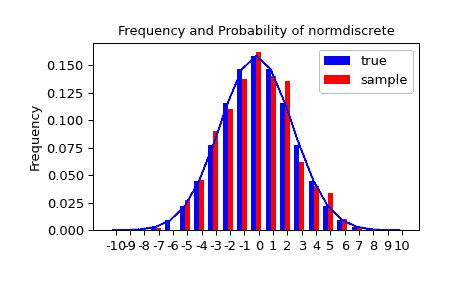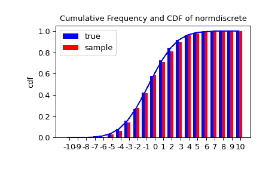

接下来，我们可以测试我们的样本是否由我们的离散正态分布生成。这也验证了随机数是否生成正确。

卡方检验要求每个箱中至少有一定数量的观测值。我们将尾箱合并成更大的箱，以确保它们包含足够的观测值。

```py
>>> f2 = np.hstack([f[:5].sum(), f[5:-5], f[-5:].sum()])
>>> p2 = np.hstack([probs[:5].sum(), probs[5:-5], probs[-5:].sum()])
>>> ch2, pval = stats.chisquare(f2, p2*n_sample) 
```

```py
>>> print('chisquare for normdiscrete: chi2 = %6.3f pvalue = %6.4f' % (ch2, pval))
chisquare for normdiscrete: chi2 = 12.466 pvalue = 0.4090  # random 
```

在这种情况下，p 值很高，因此我们可以非常确信我们的随机样本确实是由该分布生成的。

## 分析一个样本

首先，我们创建一些随机变量。我们设置一个种子，以便每次运行时获得相同的结果以进行查看。例如，我们从学生 t 分布中取一个样本：

```py
>>> x = stats.t.rvs(10, size=1000) 
```

在这里，我们设置了 t 分布的所需形状参数，它在统计学上对应于自由度，设置 size=1000 意味着我们的样本包含 1000 个独立抽取的（伪）随机数。由于我们未指定关键字参数 *loc* 和 *scale*，它们被设置为它们的默认值零和一。

### 描述统计

*x* 是一个 numpy 数组，我们可以直接访问所有数组方法，例如，

```py
>>> print(x.min())   # equivalent to np.min(x)
-3.78975572422  # random
>>> print(x.max())   # equivalent to np.max(x)
5.26327732981  # random
>>> print(x.mean())  # equivalent to np.mean(x)
0.0140610663985  # random
>>> print(x.var())   # equivalent to np.var(x))
1.28899386208  # random 
```

样本属性如何与其理论对应物比较？

```py
>>> m, v, s, k = stats.t.stats(10, moments='mvsk')
>>> n, (smin, smax), sm, sv, ss, sk = stats.describe(x) 
```

```py
>>> sstr = '%-14s mean = %6.4f, variance = %6.4f, skew = %6.4f, kurtosis = %6.4f'
>>> print(sstr % ('distribution:', m, v, s ,k))
distribution:  mean = 0.0000, variance = 1.2500, skew = 0.0000, kurtosis = 1.0000  # random
>>> print(sstr % ('sample:', sm, sv, ss, sk))
sample:        mean = 0.0141, variance = 1.2903, skew = 0.2165, kurtosis = 1.0556  # random 
```

注意：`stats.describe` 使用无偏估计器计算方差，而 `np.var` 使用的是有偏估计器。

对于我们的样本，样本统计数据与它们的理论对应物略有不同。

### T 检验和 KS 检验

我们可以使用 t 检验来测试我们的样本平均值是否在统计上显著地不同于理论期望。

```py
>>> print('t-statistic = %6.3f pvalue = %6.4f' %  stats.ttest_1samp(x, m))
t-statistic =  0.391 pvalue = 0.6955  # random 
```

P 值为 0.7，这意味着在例如 10%的 alpha 误差下，我们无法拒绝样本均值等于零的假设，即标准 t 分布的期望。

作为练习，我们也可以直接计算我们的 t 检验，而不使用提供的函数，这应该会给我们相同的答案，确实如此：

```py
>>> tt = (sm-m)/np.sqrt(sv/float(n))  # t-statistic for mean
>>> pval = stats.t.sf(np.abs(tt), n-1)*2  # two-sided pvalue = Prob(abs(t)>tt)
>>> print('t-statistic = %6.3f pvalue = %6.4f' % (tt, pval))
t-statistic =  0.391 pvalue = 0.6955  # random 
```

Kolmogorov-Smirnov 检验可用于测试样本是否来自标准 t 分布的假设。

```py
>>> print('KS-statistic D = %6.3f pvalue = %6.4f' % stats.kstest(x, 't', (10,)))
KS-statistic D =  0.016 pvalue = 0.9571  # random 
```

再次，P 值足够高，我们无法拒绝随机样本确实按照 t 分布分布的假设。在实际应用中，我们不知道底层分布是什么。如果我们对样本执行 Kolmogorov-Smirnov 检验，以检验其是否符合标准正态分布，则同样不能拒绝我们的样本是由正态分布生成的假设，因为在本例中，P 值几乎为 40%。

```py
>>> print('KS-statistic D = %6.3f pvalue = %6.4f' % stats.kstest(x, 'norm'))
KS-statistic D =  0.028 pvalue = 0.3918  # random 
```

然而，标准正态分布的方差为 1，而我们的样本方差为 1.29。如果我们对样本进行标准化，并将其与正态分布进行检验，则 P 值再次足够大，我们无法拒绝样本来自正态分布的假设。

```py
>>> d, pval = stats.kstest((x-x.mean())/x.std(), 'norm')
>>> print('KS-statistic D = %6.3f pvalue = %6.4f' % (d, pval))
KS-statistic D =  0.032 pvalue = 0.2397  # random 
```

注意：Kolmogorov-Smirnov 检验假定我们针对具有给定参数的分布进行检验，由于在最后一种情况下，我们估计了均值和方差，这一假设被违反，并且基于此的 P 值的检验统计分布不正确。

### 分布的尾部

最后，我们可以检查分布的上尾部。我们可以使用百分位点函数 PPF，它是 CDF 函数的反函数，来获取临界值，或者更直接地，我们可以使用生存函数的反函数。

```py
>>> crit01, crit05, crit10 = stats.t.ppf([1-0.01, 1-0.05, 1-0.10], 10)
>>> print('critical values from ppf at 1%%, 5%% and 10%%  %8.4f  %8.4f  %8.4f' % (crit01, crit05, crit10))
critical values from ppf at 1%, 5% and 10%   2.7638   1.8125   1.3722
>>> print('critical values from isf at 1%%, 5%% and 10%%  %8.4f  %8.4f  %8.4f' % tuple(stats.t.isf([0.01,0.05,0.10],10)))
critical values from isf at 1%, 5% and 10%   2.7638   1.8125   1.3722 
```

```py
>>> freq01 = np.sum(x>crit01) / float(n) * 100
>>> freq05 = np.sum(x>crit05) / float(n) * 100
>>> freq10 = np.sum(x>crit10) / float(n) * 100
>>> print('sample %%-frequency at 1%%, 5%% and 10%% tail %8.4f  %8.4f  %8.4f' % (freq01, freq05, freq10))
sample %-frequency at 1%, 5% and 10% tail   1.4000   5.8000  10.5000  # random 
```

在所有三种情况下，我们的样本在尾部的权重比底层分布更大。我们可以简要检查一个更大的样本，看看是否能更接近匹配。在这种情况下，经验频率与理论概率非常接近，但如果我们重复几次，波动仍然相当大。

```py
>>> freq05l = np.sum(stats.t.rvs(10, size=10000) > crit05) / 10000.0 * 100
>>> print('larger sample %%-frequency at 5%% tail %8.4f' % freq05l)
larger sample %-frequency at 5% tail   4.8000  # random 
```

我们还可以将其与正态分布的尾部进行比较，正态分布在尾部的权重较小：

```py
>>> print('tail prob. of normal at 1%%, 5%% and 10%%  %8.4f  %8.4f  %8.4f' %
...       tuple(stats.norm.sf([crit01, crit05, crit10])*100))
tail prob. of normal at 1%, 5% and 10%   0.2857   3.4957   8.5003 
```

卡方检验可用于测试有限数量的箱子，观察到的频率是否显著不同于假设分布的概率。

```py
>>> quantiles = [0.0, 0.01, 0.05, 0.1, 1-0.10, 1-0.05, 1-0.01, 1.0]
>>> crit = stats.t.ppf(quantiles, 10)
>>> crit
array([       -inf, -2.76376946, -1.81246112, -1.37218364,  1.37218364,
 1.81246112,  2.76376946,         inf])
>>> n_sample = x.size
>>> freqcount = np.histogram(x, bins=crit)[0]
>>> tprob = np.diff(quantiles)
>>> nprob = np.diff(stats.norm.cdf(crit))
>>> tch, tpval = stats.chisquare(freqcount, tprob*n_sample)
>>> nch, npval = stats.chisquare(freqcount, nprob*n_sample)
>>> print('chisquare for t:      chi2 = %6.2f pvalue = %6.4f' % (tch, tpval))
chisquare for t:      chi2 =  2.30 pvalue = 0.8901  # random
>>> print('chisquare for normal: chi2 = %6.2f pvalue = %6.4f' % (nch, npval))
chisquare for normal: chi2 = 64.60 pvalue = 0.0000  # random 
```

我们看到标准正态分布明显被拒绝，而标准 t 分布则无法被拒绝。由于我们样本的方差与两个标准分布都不同，我们可以再次考虑估计尺度和位置来重新进行测试。

分布的拟合方法可用于估计分布的参数，并且使用估计分布的概率重复进行测试。

```py
>>> tdof, tloc, tscale = stats.t.fit(x)
>>> nloc, nscale = stats.norm.fit(x)
>>> tprob = np.diff(stats.t.cdf(crit, tdof, loc=tloc, scale=tscale))
>>> nprob = np.diff(stats.norm.cdf(crit, loc=nloc, scale=nscale))
>>> tch, tpval = stats.chisquare(freqcount, tprob*n_sample)
>>> nch, npval = stats.chisquare(freqcount, nprob*n_sample)
>>> print('chisquare for t:      chi2 = %6.2f pvalue = %6.4f' % (tch, tpval))
chisquare for t:      chi2 =  1.58 pvalue = 0.9542  # random
>>> print('chisquare for normal: chi2 = %6.2f pvalue = %6.4f' % (nch, npval))
chisquare for normal: chi2 = 11.08 pvalue = 0.0858  # random 
```

考虑到估计的参数，我们仍然可以拒绝我们的样本来自正态分布的假设（在 5% 的水平上），但同样地，我们无法拒绝 t 分布，其 p 值为 0.95。

### 正态分布的特殊测试

由于正态分布是统计学中最常见的分布，有几个额外的函数可用于测试样本是否可能来自正态分布。

首先，我们可以测试我们样本的偏度和峰度是否显著不同于正态分布：

```py
>>> print('normal skewtest teststat = %6.3f pvalue = %6.4f' % stats.skewtest(x))
normal skewtest teststat =  2.785 pvalue = 0.0054  # random
>>> print('normal kurtosistest teststat = %6.3f pvalue = %6.4f' % stats.kurtosistest(x))
normal kurtosistest teststat =  4.757 pvalue = 0.0000  # random 
```

这两个测试被合并到正态性测试中

```py
>>> print('normaltest teststat = %6.3f pvalue = %6.4f' % stats.normaltest(x))
normaltest teststat = 30.379 pvalue = 0.0000  # random 
```

在所有三个测试中，p 值非常低，我们可以拒绝我们的样本具有正态分布的假设。

由于我们样本的偏度和峰度基于中心矩，如果我们测试标准化样本，我们得到完全相同的结果：

```py
>>> print('normaltest teststat = %6.3f pvalue = %6.4f' %
...       stats.normaltest((x-x.mean())/x.std()))
normaltest teststat = 30.379 pvalue = 0.0000  # random 
```

由于正态性被强烈拒绝，我们可以检查正态测试是否对其他情况给出合理的结果：

```py
>>> print('normaltest teststat = %6.3f pvalue = %6.4f' %
...       stats.normaltest(stats.t.rvs(10, size=100)))
normaltest teststat =  4.698 pvalue = 0.0955  # random
>>> print('normaltest teststat = %6.3f pvalue = %6.4f' %
...              stats.normaltest(stats.norm.rvs(size=1000)))
normaltest teststat =  0.613 pvalue = 0.7361  # random 
```

当测试小样本的 t 分布观测值和大样本的正态分布观测值的正态性时，在两种情况下我们都无法拒绝样本来自正态分布的原假设。在第一种情况下，这是因为测试不足以区分小样本中的 t 分布和正态分布随机变量。

## 比较两个样本

在接下来的内容中，我们得到了两个样本，可以来自相同或不同的分布，我们想要测试这些样本是否具有相同的统计特性。

### 比较均值

测试样本的均值是否相同：

```py
>>> rvs1 = stats.norm.rvs(loc=5, scale=10, size=500)
>>> rvs2 = stats.norm.rvs(loc=5, scale=10, size=500)
>>> stats.ttest_ind(rvs1, rvs2)
Ttest_indResult(statistic=-0.5489036175088705, pvalue=0.5831943748663959)  # random 
```

测试具有不同均值的样本：

```py
>>> rvs3 = stats.norm.rvs(loc=8, scale=10, size=500)
>>> stats.ttest_ind(rvs1, rvs3)
Ttest_indResult(statistic=-4.533414290175026, pvalue=6.507128186389019e-06)  # random 
```

### Kolmogorov-Smirnov 测试两个样本的 ks_2samp

对于从同一分布中抽取的样本，我们无法拒绝原假设，因为 p 值很高。

```py
>>> stats.ks_2samp(rvs1, rvs2)
KstestResult(statistic=0.026, pvalue=0.9959527565364388)  # random 
```

在第二个例子中，即具有不同位置（即均值）的情况下，我们可以拒绝原假设，因为 p 值低于 1%。

```py
>>> stats.ks_2samp(rvs1, rvs3)
KstestResult(statistic=0.114, pvalue=0.00299005061044668)  # random 
```

## 核密度估计

统计学中的一个常见任务是从一组数据样本中估计随机变量的概率密度函数（PDF）。这个任务被称为密度估计。最著名的工具是直方图。直方图是一种用于可视化的有用工具（主要是因为每个人都能理解它），但是它没有有效地使用可用的数据。核密度估计（KDE）是同一任务的更有效工具。`gaussian_kde` 估计器可用于估计单变量和多变量数据的 PDF。如果数据是单峰的话，它的效果最好。

### 单变量估计

我们从最少量的数据开始，以了解`gaussian_kde`的工作原理以及带宽选择的不同选项。从 PDF 中采样的数据显示为图的底部蓝色虚线（称为拉格图）：

```py
>>> from scipy import stats
>>> import matplotlib.pyplot as plt 
```

```py
>>> x1 = np.array([-7, -5, 1, 4, 5], dtype=np.float64)
>>> kde1 = stats.gaussian_kde(x1)
>>> kde2 = stats.gaussian_kde(x1, bw_method='silverman') 
```

```py
>>> fig = plt.figure()
>>> ax = fig.add_subplot(111) 
```

```py
>>> ax.plot(x1, np.zeros(x1.shape), 'b+', ms=20)  # rug plot
>>> x_eval = np.linspace(-10, 10, num=200)
>>> ax.plot(x_eval, kde1(x_eval), 'k-', label="Scott's Rule")
>>> ax.plot(x_eval, kde2(x_eval), 'r-', label="Silverman's Rule") 
```

```py
>>> plt.show() 
```

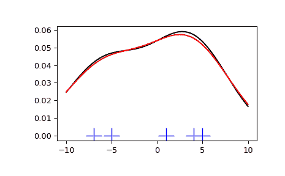

我们发现**Scott's Rule**和**Silverman's Rule**之间的差异非常小，而且在有限的数据量下，带宽选择可能有点过宽。我们可以定义自己的带宽函数来获得更少平滑的结果。

```py
>>> def my_kde_bandwidth(obj, fac=1./5):
...  """We use Scott's Rule, multiplied by a constant factor."""
...     return np.power(obj.n, -1./(obj.d+4)) * fac 
```

```py
>>> fig = plt.figure()
>>> ax = fig.add_subplot(111) 
```

```py
>>> ax.plot(x1, np.zeros(x1.shape), 'b+', ms=20)  # rug plot
>>> kde3 = stats.gaussian_kde(x1, bw_method=my_kde_bandwidth)
>>> ax.plot(x_eval, kde3(x_eval), 'g-', label="With smaller BW") 
```

```py
>>> plt.show() 
```

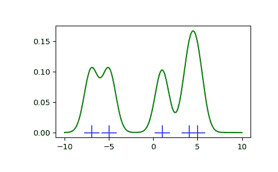

我们发现，如果将带宽设置得非常窄，得到的概率密度函数（PDF）估计值就简单地是围绕每个数据点的高斯函数之和。

现在我们来看一个更现实的例子，并比较两种可用带宽选择规则之间的差异。这些规则已知对（接近）正态分布很有效，但即使对于非常强烈非正态的单峰分布，它们也能工作得相当好。作为一个非正态分布，我们采用自由度为 5 的学生 T 分布。

```py
import numpy as np
import matplotlib.pyplot as plt
from scipy import stats

rng = np.random.default_rng()
x1 = rng.normal(size=200)  # random data, normal distribution
xs = np.linspace(x1.min()-1, x1.max()+1, 200)

kde1 = stats.gaussian_kde(x1)
kde2 = stats.gaussian_kde(x1, bw_method='silverman')

fig = plt.figure(figsize=(8, 6))

ax1 = fig.add_subplot(211)
ax1.plot(x1, np.zeros(x1.shape), 'b+', ms=12)  # rug plot
ax1.plot(xs, kde1(xs), 'k-', label="Scott's Rule")
ax1.plot(xs, kde2(xs), 'b-', label="Silverman's Rule")
ax1.plot(xs, stats.norm.pdf(xs), 'r--', label="True PDF")

ax1.set_xlabel('x')
ax1.set_ylabel('Density')
ax1.set_title("Normal (top) and Student's T$_{df=5}$ (bottom) distributions")
ax1.legend(loc=1)

x2 = stats.t.rvs(5, size=200, random_state=rng)  # random data, T distribution
xs = np.linspace(x2.min() - 1, x2.max() + 1, 200)

kde3 = stats.gaussian_kde(x2)
kde4 = stats.gaussian_kde(x2, bw_method='silverman')

ax2 = fig.add_subplot(212)
ax2.plot(x2, np.zeros(x2.shape), 'b+', ms=12)  # rug plot
ax2.plot(xs, kde3(xs), 'k-', label="Scott's Rule")
ax2.plot(xs, kde4(xs), 'b-', label="Silverman's Rule")
ax2.plot(xs, stats.t.pdf(xs, 5), 'r--', label="True PDF")

ax2.set_xlabel('x')
ax2.set_ylabel('Density')

plt.show() 
```

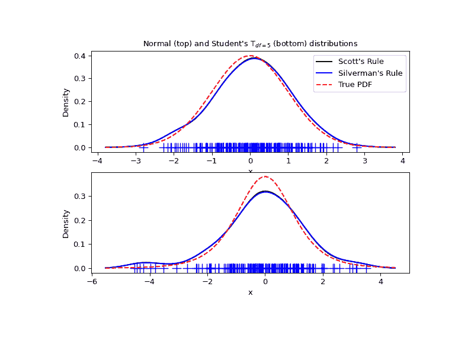

现在我们来看一个双峰分布，其中一个特征的高斯较宽，另一个特征的高斯较窄。我们预期这将是一个更难近似的密度，因为需要精确解析每个特征所需的不同带宽。

```py
>>> from functools import partial 
```

```py
>>> loc1, scale1, size1 = (-2, 1, 175)
>>> loc2, scale2, size2 = (2, 0.2, 50)
>>> x2 = np.concatenate([np.random.normal(loc=loc1, scale=scale1, size=size1),
...                      np.random.normal(loc=loc2, scale=scale2, size=size2)]) 
```

```py
>>> x_eval = np.linspace(x2.min() - 1, x2.max() + 1, 500) 
```

```py
>>> kde = stats.gaussian_kde(x2)
>>> kde2 = stats.gaussian_kde(x2, bw_method='silverman')
>>> kde3 = stats.gaussian_kde(x2, bw_method=partial(my_kde_bandwidth, fac=0.2))
>>> kde4 = stats.gaussian_kde(x2, bw_method=partial(my_kde_bandwidth, fac=0.5)) 
```

```py
>>> pdf = stats.norm.pdf
>>> bimodal_pdf = pdf(x_eval, loc=loc1, scale=scale1) * float(size1) / x2.size + \
...               pdf(x_eval, loc=loc2, scale=scale2) * float(size2) / x2.size 
```

```py
>>> fig = plt.figure(figsize=(8, 6))
>>> ax = fig.add_subplot(111) 
```

```py
>>> ax.plot(x2, np.zeros(x2.shape), 'b+', ms=12)
>>> ax.plot(x_eval, kde(x_eval), 'k-', label="Scott's Rule")
>>> ax.plot(x_eval, kde2(x_eval), 'b-', label="Silverman's Rule")
>>> ax.plot(x_eval, kde3(x_eval), 'g-', label="Scott * 0.2")
>>> ax.plot(x_eval, kde4(x_eval), 'c-', label="Scott * 0.5")
>>> ax.plot(x_eval, bimodal_pdf, 'r--', label="Actual PDF") 
```

```py
>>> ax.set_xlim([x_eval.min(), x_eval.max()])
>>> ax.legend(loc=2)
>>> ax.set_xlabel('x')
>>> ax.set_ylabel('Density')
>>> plt.show() 
```

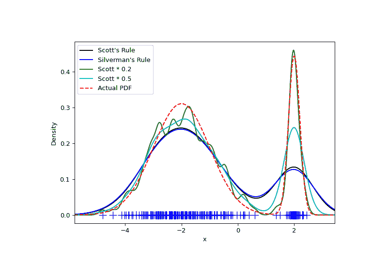

正如预期的那样，由于双峰分布两个特征的不同特征尺寸，KDE 与真实 PDF 的接近程度并不如我们希望的那样。通过将默认带宽减半（`Scott * 0.5`），我们可以稍微改善一些，而使用比默认带宽小 5 倍的因子则不足以平滑。然而，在这种情况下，我们真正需要的是非均匀（自适应）带宽。

### 多变量估计

使用 `gaussian_kde` 我们可以进行多变量以及单变量估计。这里展示了双变量情况。首先，我们生成一些随机数据，模拟两个变量之间的相关性。

```py
>>> def measure(n):
...  """Measurement model, return two coupled measurements."""
...     m1 = np.random.normal(size=n)
...     m2 = np.random.normal(scale=0.5, size=n)
...     return m1+m2, m1-m2 
```

```py
>>> m1, m2 = measure(2000)
>>> xmin = m1.min()
>>> xmax = m1.max()
>>> ymin = m2.min()
>>> ymax = m2.max() 
```

然后我们将 KDE 应用于数据：

```py
>>> X, Y = np.mgrid[xmin:xmax:100j, ymin:ymax:100j]
>>> positions = np.vstack([X.ravel(), Y.ravel()])
>>> values = np.vstack([m1, m2])
>>> kernel = stats.gaussian_kde(values)
>>> Z = np.reshape(kernel.evaluate(positions).T, X.shape) 
```

最后，我们将估计的双变量分布作为色彩映射图绘制出来，并在顶部绘制个别数据点。

```py
>>> fig = plt.figure(figsize=(8, 6))
>>> ax = fig.add_subplot(111) 
```

```py
>>> ax.imshow(np.rot90(Z), cmap=plt.cm.gist_earth_r,
...           extent=[xmin, xmax, ymin, ymax])
>>> ax.plot(m1, m2, 'k.', markersize=2) 
```

```py
>>> ax.set_xlim([xmin, xmax])
>>> ax.set_ylim([ymin, ymax]) 
```

```py
>>> plt.show() 
```

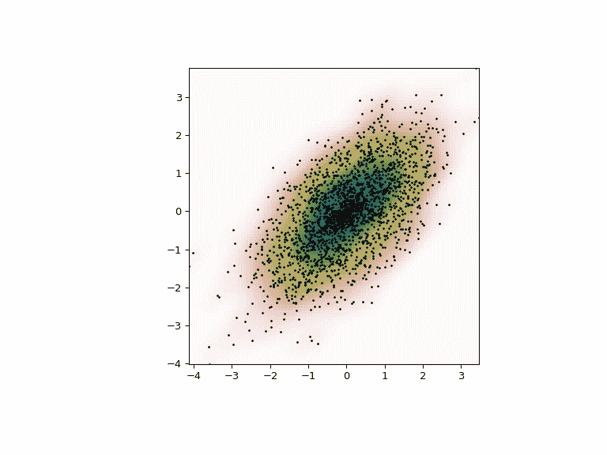

### 多尺度图相关性（MGC）

使用 `multiscale_graphcorr`，我们可以对高维和非线性数据进行独立性测试。在开始之前，让我们导入一些有用的包：

```py
>>> import numpy as np
>>> import matplotlib.pyplot as plt; plt.style.use('classic')
>>> from scipy.stats import multiscale_graphcorr 
```

让我们使用自定义绘图函数来绘制数据关系：

```py
>>> def mgc_plot(x, y, sim_name, mgc_dict=None, only_viz=False,
...              only_mgc=False):
...  """Plot sim and MGC-plot"""
...     if not only_mgc:
...         # simulation
...         plt.figure(figsize=(8, 8))
...         ax = plt.gca()
...         ax.set_title(sim_name + " Simulation", fontsize=20)
...         ax.scatter(x, y)
...         ax.set_xlabel('X', fontsize=15)
...         ax.set_ylabel('Y', fontsize=15)
...         ax.axis('equal')
...         ax.tick_params(axis="x", labelsize=15)
...         ax.tick_params(axis="y", labelsize=15)
...         plt.show()
...     if not only_viz:
...         # local correlation map
...         plt.figure(figsize=(8,8))
...         ax = plt.gca()
...         mgc_map = mgc_dict["mgc_map"]
...         # draw heatmap
...         ax.set_title("Local Correlation Map", fontsize=20)
...         im = ax.imshow(mgc_map, cmap='YlGnBu')
...         # colorbar
...         cbar = ax.figure.colorbar(im, ax=ax)
...         cbar.ax.set_ylabel("", rotation=-90, va="bottom")
...         ax.invert_yaxis()
...         # Turn spines off and create white grid.
...         for edge, spine in ax.spines.items():
...             spine.set_visible(False)
...         # optimal scale
...         opt_scale = mgc_dict["opt_scale"]
...         ax.scatter(opt_scale[0], opt_scale[1],
...                    marker='X', s=200, color='red')
...         # other formatting
...         ax.tick_params(bottom="off", left="off")
...         ax.set_xlabel('#Neighbors for X', fontsize=15)
...         ax.set_ylabel('#Neighbors for Y', fontsize=15)
...         ax.tick_params(axis="x", labelsize=15)
...         ax.tick_params(axis="y", labelsize=15)
...         ax.set_xlim(0, 100)
...         ax.set_ylim(0, 100)
...         plt.show() 
```

让我们先看一些线性数据：

```py
>>> rng = np.random.default_rng()
>>> x = np.linspace(-1, 1, num=100)
>>> y = x + 0.3 * rng.random(x.size) 
```

可以在下方绘制模拟关系：

```py
>>> mgc_plot(x, y, "Linear", only_viz=True) 
```

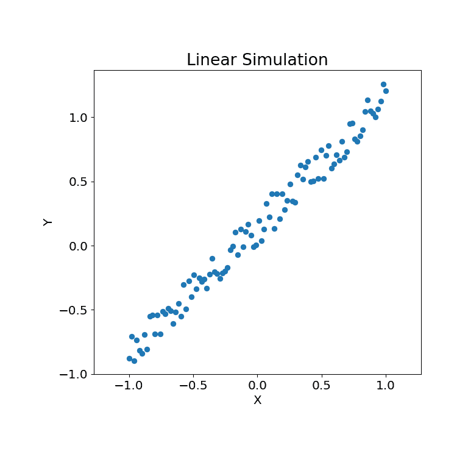

现在，我们可以看到测试统计量、p 值和 MGC 地图在下方进行了可视化。最优尺度显示为地图上的红色“x”：

```py
>>> stat, pvalue, mgc_dict = multiscale_graphcorr(x, y)
>>> print("MGC test statistic: ", round(stat, 1))
MGC test statistic:  1.0
>>> print("P-value: ", round(pvalue, 1))
P-value:  0.0
>>> mgc_plot(x, y, "Linear", mgc_dict, only_mgc=True) 
```

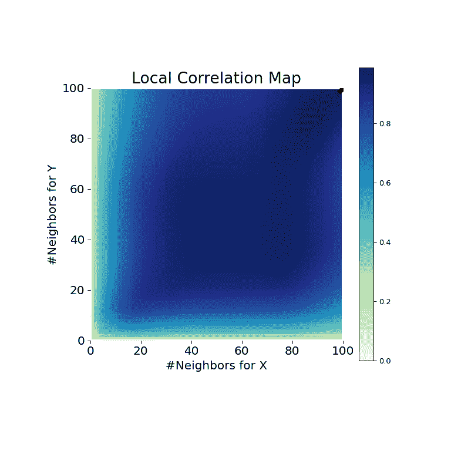

从这里可以清楚地看出，MGC 能够确定输入数据矩阵之间的关系，因为 p 值非常低，而 MGC 检验统计量相对较高。MGC 地图指示出**强烈的线性关系**。直观上来说，这是因为拥有更多的邻居将有助于识别 \(x\) 和 \(y\) 之间的线性关系。在这种情况下，最优尺度等同于全局尺度，用地图上的红点标记。

对于非线性数据集，同样可以执行相同操作。以下的 \(x\) 和 \(y\) 数组来自非线性模拟：

```py
>>> unif = np.array(rng.uniform(0, 5, size=100))
>>> x = unif * np.cos(np.pi * unif)
>>> y = unif * np.sin(np.pi * unif) + 0.4 * rng.random(x.size) 
```

可以在下方绘制模拟关系：

```py
>>> mgc_plot(x, y, "Spiral", only_viz=True) 
```

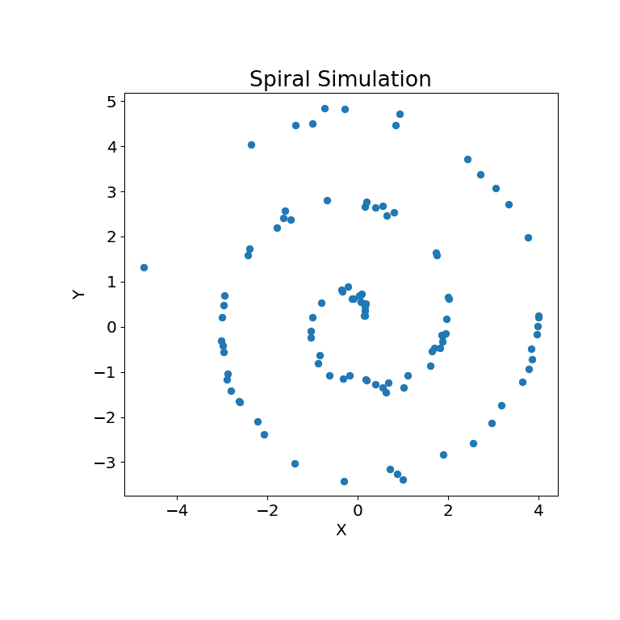

现在，我们可以看到测试统计量、p 值和 MGC 地图在下方进行了可视化。最优尺度显示为地图上的红色“x”：

```py
>>> stat, pvalue, mgc_dict = multiscale_graphcorr(x, y)
>>> print("MGC test statistic: ", round(stat, 1))
MGC test statistic:  0.2  # random
>>> print("P-value: ", round(pvalue, 1))
P-value:  0.0
>>> mgc_plot(x, y, "Spiral", mgc_dict, only_mgc=True) 
```

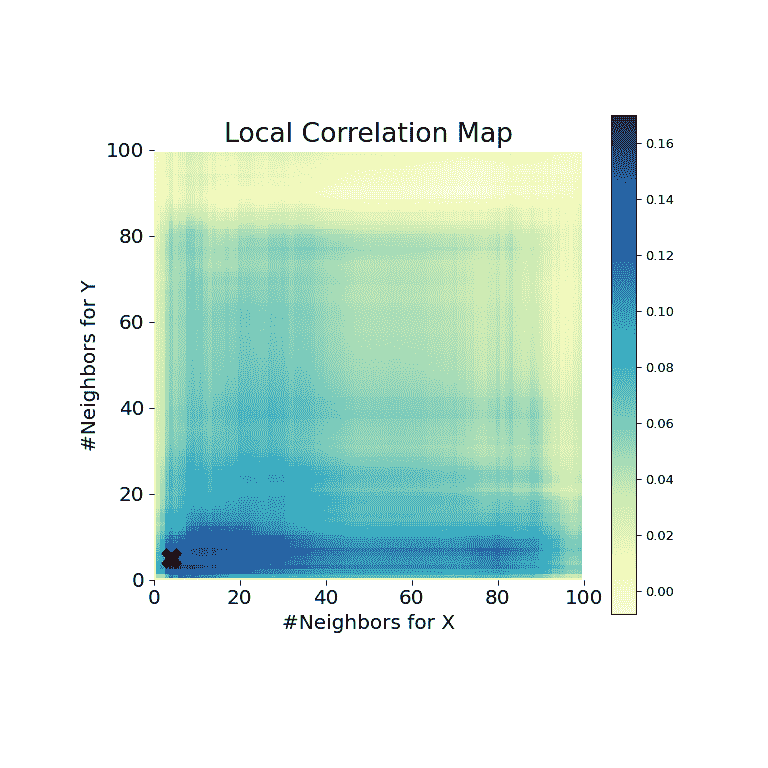

从这里可以清楚地看出，MGC 能够再次确定关系，因为 p 值非常低，而 MGC 检验统计量相对较高。MGC 地图指示出**强烈的非线性关系**。在这种情况下，最优尺度等同于局部尺度，用地图上的红点标记。

## 拟准蒙特卡罗

在讨论准蒙特卡洛（QMC）之前，先快速介绍一下蒙特卡洛（MC）。MC 方法，或 MC 实验，是一类广泛的计算算法，依赖于重复随机抽样来获得数值结果。其基本概念是利用随机性来解决在原则上可能是确定性的问题。它们通常用于物理和数学问题，并且在难以或不可能使用其他方法时最为有用。MC 方法主要用于三类问题：优化、数值积分和从概率分布中生成抽样。

具有特定属性的随机数生成比听起来更复杂。简单的 MC 方法旨在采样独立同分布的点。但生成多组随机点可能会产生完全不同的结果。

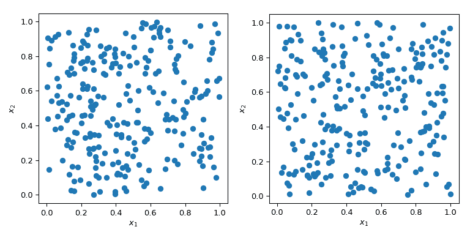

在上述图中的两种情况中，点是随机生成的，不了解之前绘制的点。显然，空间的某些区域未被探索——这可能在模拟中造成问题，因为特定的点集可能会触发完全不同的行为。

蒙特卡洛（MC）的一个巨大优势是它具有已知的收敛性质。让我们来看看在 5 维空间中平方和的均值：

\[f(\mathbf{x}) = \left( \sum_{j=1}^{5}x_j \right)²,\]

其中，\(x_j \sim \mathcal{U}(0,1)\)。它具有已知的均值，\(\mu = 5/3+5(5-1)/4\)。使用 MC 抽样，我们可以数值计算这个均值，并且近似误差遵循理论速率\(O(n^{-1/2})\)。

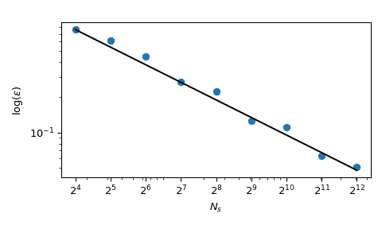

尽管收敛性是确保的，实践者倾向于希望有一个更确定性的探索过程。使用普通的 MC，可以使用种子来获得可重复的过程。但是固定种子会破坏收敛性质：一个给定的种子可以对一类问题有效，但对另一类问题无效。

为了以确定性方式穿过空间，通常使用跨越所有参数维度的常规网格，也称为饱和设计。让我们考虑单位超立方体，所有边界从 0 到 1。现在，点之间的距离为 0.1，填充单位间隔所需的点数将是 10。在二维超立方体中，相同的间距需要 100 个点，而在三维中则需要 1,000 个点。随着维度数量的增加，填充空间所需的实验数量将呈指数增长。这种指数增长被称为“维数灾难”。

```py
>>> import numpy as np
>>> disc = 10
>>> x1 = np.linspace(0, 1, disc)
>>> x2 = np.linspace(0, 1, disc)
>>> x3 = np.linspace(0, 1, disc)
>>> x1, x2, x3 = np.meshgrid(x1, x2, x3) 
```

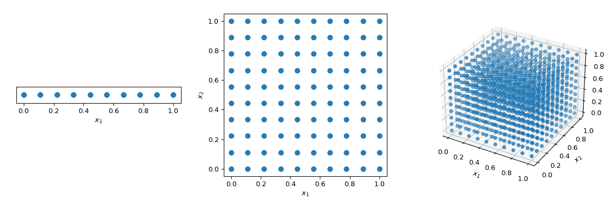

为了缓解这个问题，设计了 QMC 方法。它们是确定性的，对空间覆盖良好，其中一些可以继续并保持良好的特性。与 MC 方法的主要区别在于，这些点不是独立同分布的，而是知道之前的点。因此，有些方法也被称为序列。

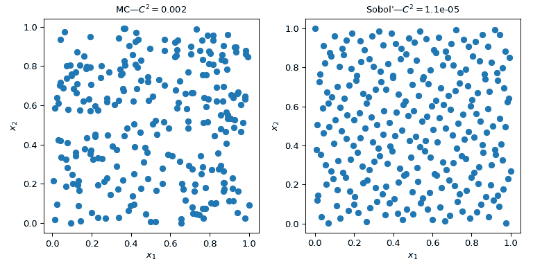

此图展示了 2 组 256 个点。左侧的设计是普通的 MC，而右侧的设计是使用*Sobol’* 方法的 QMC 设计。我们清楚地看到 QMC 版本更均匀。点样本更接近边界，且聚集和间隙较少。

评估均匀性的一种方法是使用称为差异的度量。这里*Sobol’*点的差异比粗糙的 MC 方法更好。

回到平均值的计算，QMC 方法对于误差的收敛速率也更好。它们可以实现\(O(n^{-1})\)的速率，对于非常平滑的函数甚至可以实现更好的速率。此图表明*Sobol’*方法具有\(O(n^{-1})\)的速率：

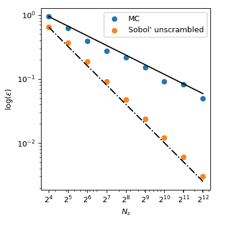

我们参考`scipy.stats.qmc`的文档以获取更多数学细节。

### 计算差异

让我们考虑两组点集。从下图可以明显看出，左侧的设计覆盖了更多的空间，而右侧的设计则较少。可以使用称为`discrepancy`的度量来量化。差异越低，样本越均匀。

```py
>>> import numpy as np
>>> from scipy.stats import qmc
>>> space_1 = np.array([[1, 3], [2, 6], [3, 2], [4, 5], [5, 1], [6, 4]])
>>> space_2 = np.array([[1, 5], [2, 4], [3, 3], [4, 2], [5, 1], [6, 6]])
>>> l_bounds = [0.5, 0.5]
>>> u_bounds = [6.5, 6.5]
>>> space_1 = qmc.scale(space_1, l_bounds, u_bounds, reverse=True)
>>> space_2 = qmc.scale(space_2, l_bounds, u_bounds, reverse=True)
>>> qmc.discrepancy(space_1)
0.008142039609053464
>>> qmc.discrepancy(space_2)
0.010456854423869011 
```

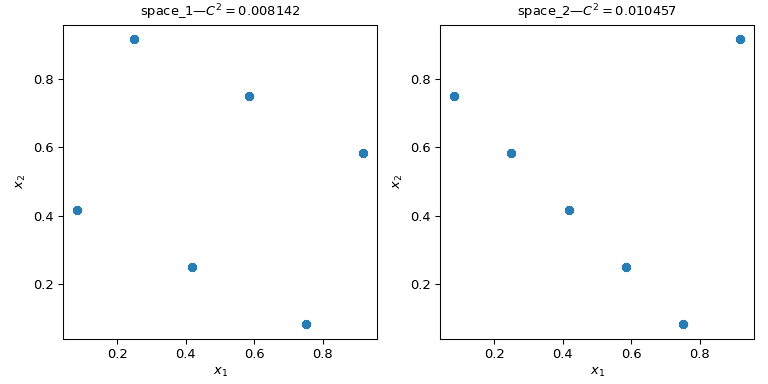

### 使用 QMC 引擎

实现了几个 QMC 抽样器/引擎。这里我们看看两种最常用的 QMC 方法：`Sobol` 和 `Halton` 序列。

```py
"""Sobol' and Halton sequences."""
from scipy.stats import qmc
import numpy as np

import matplotlib.pyplot as plt

rng = np.random.default_rng()

n_sample = 256
dim = 2

sample = {}

# Sobol'
engine = qmc.Sobol(d=dim, seed=rng)
sample["Sobol'"] = engine.random(n_sample)

# Halton
engine = qmc.Halton(d=dim, seed=rng)
sample["Halton"] = engine.random(n_sample)

fig, axs = plt.subplots(1, 2, figsize=(8, 4))

for i, kind in enumerate(sample):
    axs[i].scatter(sample[kind][:, 0], sample[kind][:, 1])

    axs[i].set_aspect('equal')
    axs[i].set_xlabel(r'$x_1$')
    axs[i].set_ylabel(r'$x_2$')
    axs[i].set_title(f'{kind}—$C² = ${qmc.discrepancy(sample[kind]):.2}')

plt.tight_layout()
plt.show() 
```

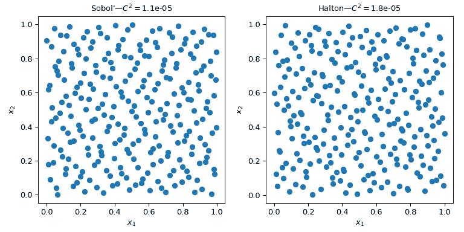

警告

QMC 方法需要特别小心，用户必须阅读文档以避免常见的陷阱。例如，*Sobol’* 方法要求点数是 2 的幂次方。此外，稀疏化、燃烧或其他点选择可能会破坏序列的性质，导致点集比 MC 方法更差。

QMC 引擎是状态感知的。这意味着可以继续序列、跳过某些点或重置它。让我们从`Halton`获取 5 个点。然后请求第二组 5 个点：

```py
>>> from scipy.stats import qmc
>>> engine = qmc.Halton(d=2)
>>> engine.random(5)
array([[0.22166437, 0.07980522],  # random
 [0.72166437, 0.93165708],
 [0.47166437, 0.41313856],
 [0.97166437, 0.19091633],
 [0.01853937, 0.74647189]])
>>> engine.random(5)
array([[0.51853937, 0.52424967],  # random
 [0.26853937, 0.30202745],
 [0.76853937, 0.857583  ],
 [0.14353937, 0.63536078],
 [0.64353937, 0.01807683]]) 
```

现在我们重置序列。请求 5 个点会得到相同的第一个 5 个点：

```py
>>> engine.reset()
>>> engine.random(5)
array([[0.22166437, 0.07980522],  # random
 [0.72166437, 0.93165708],
 [0.47166437, 0.41313856],
 [0.97166437, 0.19091633],
 [0.01853937, 0.74647189]]) 
```

现在我们推进序列以获取相同的第二组 5 个点：

```py
>>> engine.reset()
>>> engine.fast_forward(5)
>>> engine.random(5)
array([[0.51853937, 0.52424967],  # random
 [0.26853937, 0.30202745],
 [0.76853937, 0.857583  ],
 [0.14353937, 0.63536078],
 [0.64353937, 0.01807683]]) 
```

注意

默认情况下，`Sobol`和`Halton` 都是乱序的。收敛性能更好，并且防止在高维度中出现点的边缘或明显的模式。没有实际理由不使用乱序版本。

### 制作 QMC 引擎，即继承`QMCEngine`

要创建自己的`QMCEngine`，必须定义几种方法。以下是一个包装[`numpy.random.Generator`](https://numpy.org/devdocs/reference/random/generator.html#numpy.random.Generator "(在 NumPy v2.0.dev0 中)")的示例。

```py
>>> import numpy as np
>>> from scipy.stats import qmc
>>> class RandomEngine(qmc.QMCEngine):
...     def __init__(self, d, seed=None):
...         super().__init__(d=d, seed=seed)
...         self.rng = np.random.default_rng(self.rng_seed)
...
...
...     def _random(self, n=1, *, workers=1):
...         return self.rng.random((n, self.d))
...
...
...     def reset(self):
...         self.rng = np.random.default_rng(self.rng_seed)
...         self.num_generated = 0
...         return self
...
...
...     def fast_forward(self, n):
...         self.random(n)
...         return self 
```

然后像任何其他 QMC 引擎一样使用它：

```py
>>> engine = RandomEngine(2)
>>> engine.random(5)
array([[0.22733602, 0.31675834],  # random
 [0.79736546, 0.67625467],
 [0.39110955, 0.33281393],
 [0.59830875, 0.18673419],
 [0.67275604, 0.94180287]])
>>> engine.reset()
>>> engine.random(5)
array([[0.22733602, 0.31675834],  # random
 [0.79736546, 0.67625467],
 [0.39110955, 0.33281393],
 [0.59830875, 0.18673419],
 [0.67275604, 0.94180287]]) 
```

### 使用 QMC 的指南

+   QMC 有规则！确保阅读文档，否则可能不会比 MC 有任何好处。

+   如果需要**精确**\(2^m\)个点，请使用`Sobol`。

+   `Halton`允许采样或跳过任意数量的点。这是以比*Sobol'*更慢的收敛速率为代价的。

+   永远不要移除序列的第一个点。这将破坏其属性。

+   乱序总是更好的。

+   如果使用基于 LHS 的方法，不能添加点而不丢失 LHS 属性。（有一些方法可以做到，但这些方法尚未实现。）
