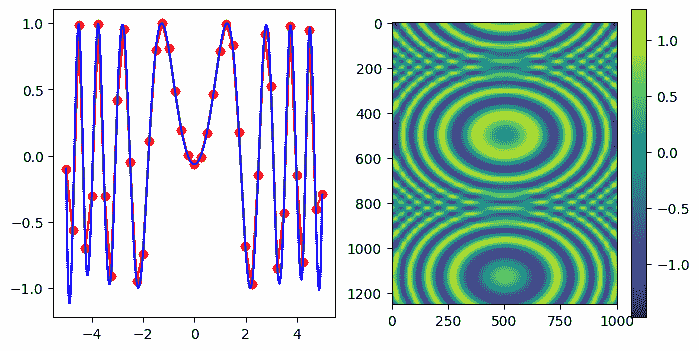
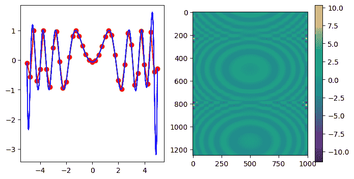
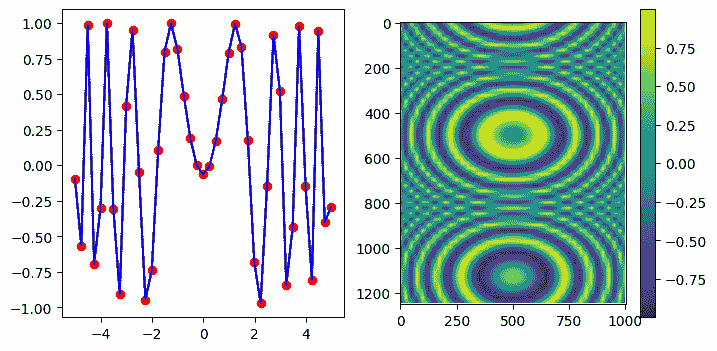
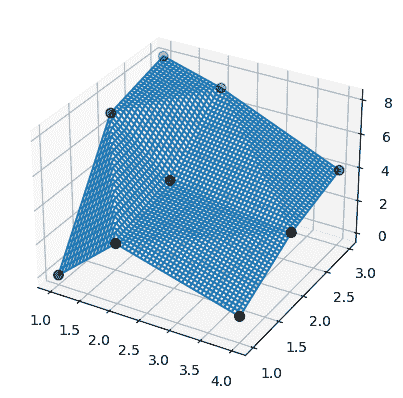
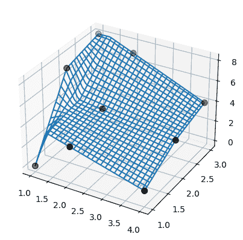
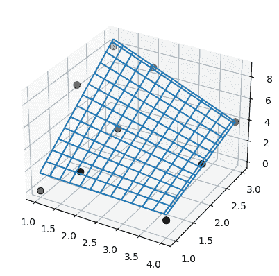

# 插值过渡指南

> 原文：[`docs.scipy.org/doc/scipy-1.12.0/notebooks/interp_transition_guide.html`](https://docs.scipy.org/doc/scipy-1.12.0/notebooks/interp_transition_guide.html)

本笔记本包含三组演示：

+   用于遗留 bug 兼容`scipy.interpolate.interp2d`的 FITPACK 低级替代品；

+   建议用于新代码中的`scipy.interpolate.interp2d`替代品；

+   展示了基于 2D FITPACK 的线性插值失败模式及推荐的替代方案。

**注意：** 由于本笔记本展示了`interp2d`的用法（标记为已弃用），我们将简单起见静默处理弃用警告：

```py
import warnings
warnings.filterwarnings('ignore') 
```

## 1\. 如何过渡到不再使用`interp2d`

`interp2d`在 2D 常规网格上和插值 2D 分散数据时会静默切换。这种切换基于（拉直后的）`x`、`y`和`z`数组的长度。简而言之，对于常规网格，请使用`scipy.interpolate.RectBivariateSpline`；对于分散插值，请使用`bisprep/bisplev`组合。下面我们提供了逐点转换的文字示例，这应该完全保留`interp2d`的结果。

### 1.1 `interp2d`在常规网格上的应用

我们从（稍作修改的）文档字符串示例开始。

```py
import numpy as np
import matplotlib.pyplot as plt
from scipy.interpolate import interp2d, RectBivariateSpline

x = np.arange(-5.01, 5.01, 0.25)
y = np.arange(-5.01, 7.51, 0.25)
xx, yy = np.meshgrid(x, y)
z = np.sin(xx**2 + 2.*yy**2)
f = interp2d(x, y, z, kind='cubic') 
```

这是“常规网格”代码路径的示例，因为

```py
z.size == len(x) * len(y) 
```

```py
True 
```

还要注意`x.size != y.size`：

```py
x.size, y.size 
```

```py
(41, 51) 
```

现在，让我们构建一个方便的函数来构造插值器并绘制它。

```py
def plot(f, xnew, ynew):
    fig, (ax1, ax2) = plt.subplots(1, 2, figsize=(8, 4))
    znew = f(xnew, ynew)

    ax1.plot(x, z[0, :], 'ro-', xnew, znew[0, :], 'b-')

    im = ax2.imshow(znew)
    plt.colorbar(im, ax=ax2)

    plt.show()
    return znew 
```

绘图：

```py
xnew = np.arange(-5.01, 5.01, 1e-2)
ynew = np.arange(-5.01, 7.51, 1e-2)
znew_i = plot(f, xnew, ynew) 
```



#### 替代方案：使用`RectBivariateSpline`，结果完全相同

注意转置：首先在构造函数中，其次在评估结果时需要转置。这是为了撤消`interp2d`的转置操作。

```py
r = RectBivariateSpline(x, y, z.T)

rt = lambda xnew, ynew: r(xnew, ynew).T
znew_r = plot(rt, xnew, ynew) 
```


```py
from numpy.testing import assert_allclose
assert_allclose(znew_i, znew_r, atol=1e-14) 
```

### 1.2\. 使用点的完整坐标进行`interp2d`（分散插值）

在这里，我们展示了前一个练习中的网格平铺以说明功能。

```py
xxr = xx.ravel()
yyr = yy.ravel()
zzr = z.ravel()

f = interp2d(xxr, yyr, zzr, kind='cubic') 
```

注意这是“非常规网格”代码路径，用于分散数据，其中`len(x) == len(y) == len(z)`。

```py
len(xxr) == len(yyr) == len(zzr) 
```

```py
True 
```

```py
xnew = np.arange(-5.01, 5.01, 1e-2)
ynew = np.arange(-5.01, 7.51, 1e-2)
znew_i = plot(f, xnew, ynew) 
```



#### 替换：直接使用`scipy.interpolate.bisplrep` / `scipy.interpolate.bisplev`

```py
from scipy.interpolate import bisplrep, bisplev
tck = bisplrep(xxr, yyr, zzr, kx=3, ky=3, s=0)
# convenience: make up a callable from bisplev
ff = lambda xnew, ynew: bisplev(xnew, ynew, tck).T   # Note the transpose, to mimic what interp2d does

znew_b = plot(ff, xnew, ynew) 
```


```py
assert_allclose(znew_i, znew_b, atol=1e-15) 
```

## 2\. 替代`interp2d`：正则网格

对于新代码，推荐的替代方案是`RegularGridInterpolator`。这是一个独立的实现，不基于 FITPACK。支持最近邻、线性插值和奇次张量积样条。

样条结节保证与数据点重合。

注意，这里：

1.  元组参数是`(x, y)`

1.  `z`数组需要转置

1.  关键字名称是*method*，而不是*kind*

1.  `bounds_error`参数默认为`True`。

```py
from scipy.interpolate import RegularGridInterpolator as RGI

r = RGI((x, y), z.T, method='linear', bounds_error=False) 
```

评估：创建一个 2D 网格。使用`indexing='ij'`和`sparse=True`以节省一些内存：

```py
xxnew, yynew = np.meshgrid(xnew, ynew, indexing='ij', sparse=True) 
```

评估时，请注意元组参数：

```py
znew_reggrid = r((xxnew, yynew)) 
```

```py
fig, (ax1, ax2) = plt.subplots(1, 2, figsize=(8, 4))

# Again, note the transpose to undo the `interp2d` convention
znew_reggrid_t = znew_reggrid.T

ax1.plot(x, z[0, :], 'ro-', xnew, znew_reggrid_t[0, :], 'b-')

im = ax2.imshow(znew_reggrid_t)
plt.colorbar(im, ax=ax2) 
```

```py
<matplotlib.colorbar.Colorbar at 0x7fa55ccd5f10> 
```



## 3\. 散点 2D 线性插值：优先使用`LinearNDInterpolator`而不是`SmoothBivariateSpline`或`bisplrep`

对于 2D 散点线性插值，`SmoothBivariateSpline`和`biplrep`可能会发出警告，或者无法插值数据，或者产生带有结节远离数据点的样条。“相反，建议使用`LinearNDInterpolator`，它基于通过`QHull`对数据进行三角剖分。

```py
# TestSmoothBivariateSpline::test_integral
from scipy.interpolate import SmoothBivariateSpline, LinearNDInterpolator

x = np.array([1,1,1,2,2,2,4,4,4])
y = np.array([1,2,3,1,2,3,1,2,3])
z = np.array([0,7,8,3,4,7,1,3,4]) 
```

现在，使用基于 Qhull 的数据三角剖分进行线性插值：

```py
xy = np.c_[x, y]   # or just list(zip(x, y))
lut2 = LinearNDInterpolator(xy, z)

X = np.linspace(min(x), max(x))
Y = np.linspace(min(y), max(y))
X, Y = np.meshgrid(X, Y) 
```

结果易于理解和解释：

```py
fig = plt.figure()
ax = fig.add_subplot(projection='3d')

ax.plot_wireframe(X, Y, lut2(X, Y))
ax.scatter(x, y, z,  'o', color='k', s=48) 
```

```py
<mpl_toolkits.mplot3d.art3d.Path3DCollection at 0x7fa55cbd8250> 
```



注意，`bisplrep`做了一些不同的事情！它可能会将样条结节放在数据之外。

作为说明，考虑前面示例中的相同数据：

```py
tck = bisplrep(x, y, z, kx=1, ky=1, s=0)

fig = plt.figure()
ax = fig.add_subplot(projection='3d')

xx = np.linspace(min(x), max(x))
yy = np.linspace(min(y), max(y))
X, Y = np.meshgrid(xx, yy)
Z = bisplev(xx, yy, tck)
Z = Z.reshape(*X.shape).T

ax.plot_wireframe(X, Y, Z, rstride=2, cstride=2)
ax.scatter(x, y, z,  'o', color='k', s=48) 
```

```py
<mpl_toolkits.mplot3d.art3d.Path3DCollection at 0x7fa55cc26310> 
```



此外，`SmoothBivariateSpline`无法插值数据。再次使用前面示例中的相同数据。

```py
lut = SmoothBivariateSpline(x, y, z, kx=1, ky=1, s=0)

fig = plt.figure()
ax = fig.add_subplot(projection='3d')

xx = np.linspace(min(x), max(x))
yy = np.linspace(min(y), max(y))
X, Y = np.meshgrid(xx, yy)

ax.plot_wireframe(X, Y, lut(xx, yy).T, rstride=4, cstride=4)
ax.scatter(x, y, z,  'o', color='k', s=48) 
```

```py
<mpl_toolkits.mplot3d.art3d.Path3DCollection at 0x7fa55cc6ebe0> 
```



注意，`SmoothBivariateSpline`和`bisplrep`的结果都存在缺陷，不像`LinearNDInterpolator`那样。此处所示的问题是针对线性插值报告的，然而 FITPACK 的结节选择机制并不保证对高阶（如三次）样条曲面避免这些问题。
