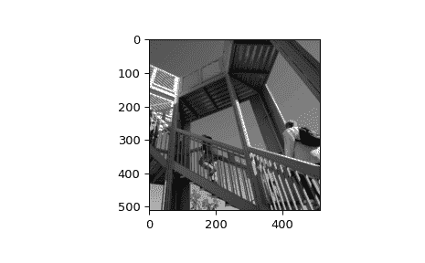

# `scipy.datasets.ascent`

> 原文：[`docs.scipy.org/doc/scipy-1.12.0/reference/generated/scipy.datasets.ascent.html#scipy.datasets.ascent`](https://docs.scipy.org/doc/scipy-1.12.0/reference/generated/scipy.datasets.ascent.html#scipy.datasets.ascent)

```py
scipy.datasets.ascent()
```

获取一个 8 位灰度位深度，512 x 512 像素的图像，方便用于演示。

该图像源自于[`www.public-domain-image.com/people-public-domain-images-pictures/`](http://www.public-domain-image.com/people-public-domain-images-pictures/)上的 accent-to-the-top.jpg。

参数：

**无**

返回：

**ascent**ndarray

用于测试和演示的方便图像

示例

```py
>>> import scipy.datasets
>>> ascent = scipy.datasets.ascent()
>>> ascent.shape
(512, 512)
>>> ascent.max()
255 
```

```py
>>> import matplotlib.pyplot as plt
>>> plt.gray()
>>> plt.imshow(ascent)
>>> plt.show() 
```


