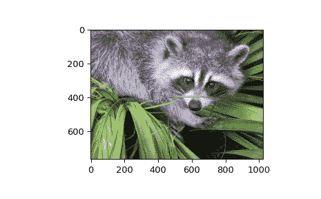

# `scipy.datasets.face`

> 原文：[`docs.scipy.org/doc/scipy-1.12.0/reference/generated/scipy.datasets.face.html#scipy.datasets.face`](https://docs.scipy.org/doc/scipy-1.12.0/reference/generated/scipy.datasets.face.html#scipy.datasets.face)

```py
scipy.datasets.face(gray=False)
```

获取一张 1024 x 768 的浣熊脸部彩色图像。

raccoon-procyon-lotor.jpg 位于 [`www.public-domain-image.com`](http://www.public-domain-image.com)

Parameters:

**gray**bool, 可选

如果为 True 返回 8 位灰度图像，否则返回彩色图像

Returns:

**face**ndarray

浣熊脸部图像

Examples

```py
>>> import scipy.datasets
>>> face = scipy.datasets.face()
>>> face.shape
(768, 1024, 3)
>>> face.max()
255
>>> face.dtype
dtype('uint8') 
```

```py
>>> import matplotlib.pyplot as plt
>>> plt.gray()
>>> plt.imshow(face)
>>> plt.show() 
```


