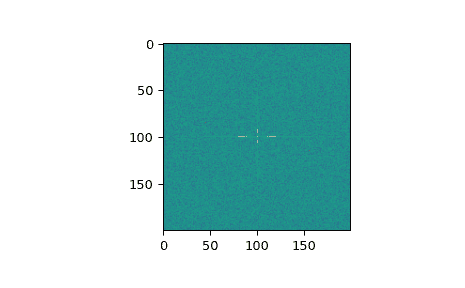

# `scipy.fft.fftn`

> 原文：[`docs.scipy.org/doc/scipy-1.12.0/reference/generated/scipy.fft.fftn.html#scipy.fft.fftn`](https://docs.scipy.org/doc/scipy-1.12.0/reference/generated/scipy.fft.fftn.html#scipy.fft.fftn)

```py
scipy.fft.fftn(x, s=None, axes=None, norm=None, overwrite_x=False, workers=None, *, plan=None)
```

计算 N-D 离散傅里叶变换。

此函数通过快速傅里叶变换（FFT）计算 M-D 数组中任意数量轴上的 N-D 离散傅里叶变换。

参数：

**x**类数组

输入数组，可以是复数。

**s**整数序列，可选

输出的形状（每个转换轴的长度）(`s[0]`表示轴 0，`s[1]`表示轴 1，依此类推)。对于任何轴，如果给定的形状小于输入的形状，则输入将被截断。如果它更大，则使用零填充输入。如果未提供*s*，则使用由*axes*指定的轴上的输入形状。

**axes**整数序列，可选

在其上计算 FFT 的轴。如果未给出，则使用最后`len(s)`个轴，或者如果也未指定*s*，则使用所有轴。

**norm**{“backward”, “ortho”, “forward”}，可选

标准化模式（参见[`fft`](https://docs.scipy.org/doc/scipy-1.12.0/reference/generated/scipy.fft.fft.html#scipy.fft.fft)）。默认为“backward”。

**overwrite_x**布尔型，可选

如果为 True，*x*的内容可以被破坏；默认为 False。有关更多详细信息，请参见[`fft`](https://docs.scipy.org/doc/scipy-1.12.0/reference/generated/scipy.fft.fft.html#scipy.fft.fft)。

**workers**整数，可选

最大工作程序数用于并行计算。如果为负数，则从`os.cpu_count()`的值循环回。有关更多详细信息，请参见[`fft`](https://docs.scipy.org/doc/scipy-1.12.0/reference/generated/scipy.fft.fft.html#scipy.fft.fft)。

**计划**对象，可选

此参数保留了下游 FFT 供应商提供的预计划。目前在 SciPy 中未使用。

自版本 1.5.0 起新增。

返回：

**out**复数 ndarray

被截断或零填充的输入，在由*axes*指示的轴或由参数部分中解释的*s*和*x*的组合中进行了转换。

Raises：

ValueError

如果*s*和*axes*的长度不同。

IndexError

如果*axes*的元素大于*x*的轴数。

另请参见

[`ifftn`](https://docs.scipy.org/doc/scipy-1.12.0/reference/generated/scipy.fft.ifftn.html#scipy.fft.ifftn)

[`fftn`](https://docs.scipy.org/doc/scipy-1.12.0/reference/generated/scipy.fft.fftn.html#scipy.fft.fftn)的逆，逆 N-D FFT。

[`fft`](https://docs.scipy.org/doc/scipy-1.12.0/reference/generated/scipy.fft.fft.html#scipy.fft.fft)

1-D FFT，其定义和惯例。

[`rfftn`](https://docs.scipy.org/doc/scipy-1.12.0/reference/generated/scipy.fft.rfftn.html#scipy.fft.rfftn)

实输入的 N-D FFT。

[`fft2`](https://docs.scipy.org/doc/scipy-1.12.0/reference/generated/scipy.fft.fft2.html#scipy.fft.fft2)

2-D FFT。

[`fftshift`](https://docs.scipy.org/doc/scipy-1.12.0/reference/generated/scipy.fft.fftshift.html#scipy.fft.fftshift)

将零频率项移到数组中心。

注意事项

输出与 [`fft`](https://docs.scipy.org/doc/scipy/reference/generated/scipy.fft.fft.html#scipy.fft.fft) 类似，包含所有轴的低阶角的零频率项，所有轴的前半部分的正频率项，所有轴中间的奈奎斯特频率项，以及所有轴后半部分的负频率项，按照递减负频率的顺序排列。

例子

```py
>>> import scipy.fft
>>> import numpy as np
>>> x = np.mgrid[:3, :3, :3][0]
>>> scipy.fft.fftn(x, axes=(1, 2))
array([[[ 0.+0.j,   0.+0.j,   0.+0.j], # may vary
 [ 0.+0.j,   0.+0.j,   0.+0.j],
 [ 0.+0.j,   0.+0.j,   0.+0.j]],
 [[ 9.+0.j,   0.+0.j,   0.+0.j],
 [ 0.+0.j,   0.+0.j,   0.+0.j],
 [ 0.+0.j,   0.+0.j,   0.+0.j]],
 [[18.+0.j,   0.+0.j,   0.+0.j],
 [ 0.+0.j,   0.+0.j,   0.+0.j],
 [ 0.+0.j,   0.+0.j,   0.+0.j]]])
>>> scipy.fft.fftn(x, (2, 2), axes=(0, 1))
array([[[ 2.+0.j,  2.+0.j,  2.+0.j], # may vary
 [ 0.+0.j,  0.+0.j,  0.+0.j]],
 [[-2.+0.j, -2.+0.j, -2.+0.j],
 [ 0.+0.j,  0.+0.j,  0.+0.j]]]) 
```

```py
>>> import matplotlib.pyplot as plt
>>> rng = np.random.default_rng()
>>> [X, Y] = np.meshgrid(2 * np.pi * np.arange(200) / 12,
...                      2 * np.pi * np.arange(200) / 34)
>>> S = np.sin(X) + np.cos(Y) + rng.uniform(0, 1, X.shape)
>>> FS = scipy.fft.fftn(S)
>>> plt.imshow(np.log(np.abs(scipy.fft.fftshift(FS))**2))
<matplotlib.image.AxesImage object at 0x...>
>>> plt.show() 
```


