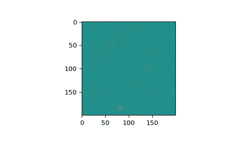

# `scipy.fft.ifftn`

> [`docs.scipy.org/doc/scipy-1.12.0/reference/generated/scipy.fft.ifftn.html#scipy.fft.ifftn`](https://docs.scipy.org/doc/scipy-1.12.0/reference/generated/scipy.fft.ifftn.html#scipy.fft.ifftn)

```py
scipy.fft.ifftn(x, s=None, axes=None, norm=None, overwrite_x=False, workers=None, *, plan=None)
```

计算 N 维逆离散傅里叶变换。

此函数通过快速傅里叶变换（FFT）计算 M-D 数组中任意数量轴上的 N 维离散傅里叶变换的逆变换。换句话说，`ifftn(fftn(x)) == x` 在数值精度范围内成立。

输入与 [`ifft`](https://docs.scipy.org/doc/scipy-1.12.0/reference/generated/scipy.fft.ifft.html#scipy.fft.ifft "scipy.fft.ifft") 类似，应以与由 [`fftn`](https://docs.scipy.org/doc/scipy-1.12.0/reference/generated/scipy.fft.fftn.html#scipy.fft.fftn "scipy.fft.fftn") 返回的相同方式排序，即应在低阶角落中具有所有轴的零频率项，所有轴的前半部分中的正频率项，所有轴的中点处的奈奎斯特频率项，所有轴的后半部分中的负频率项，按照递减负频率顺序排列。

参数：

**x** array_like

输入数组，可以是复数。

**s** 整数序列，可选

输出的形状（每个转换轴的长度）（`s[0]` 表示轴 0，`s[1]` 表示轴 1，依此类推）。这对应于 `ifft(x, n)` 中的 `n`。沿着任意轴，如果给定的形状小于输入的形状，则输入会被裁剪。如果大于输入的形状，则用零填充输入。如果没有给出 *s*，则使用由 *axes* 指定的轴上的输入形状。有关 [`ifft`](https://docs.scipy.org/doc/scipy-1.12.0/reference/generated/scipy.fft.ifft.html#scipy.fft.ifft "scipy.fft.ifft") 的零填充问题，请参见注释。

**axes** 整数序列，可选

要计算逆离散傅里叶变换（IFFT）的轴。如果未给出，则使用最后 `len(s)` 个轴，或者如果也未指定 *s*，则使用所有轴。

**norm** {"backward", "ortho", "forward"}，可选

归一化模式（参见 [`fft`](https://docs.scipy.org/doc/scipy-1.12.0/reference/generated/scipy.fft.fft.html#scipy.fft.fft "scipy.fft.fft")）。默认为“backward”。

**overwrite_x** 布尔值，可选

如果为 True，则 *x* 的内容可以被破坏；默认为 False。详见 [`fft`](https://docs.scipy.org/doc/scipy-1.12.0/reference/generated/scipy.fft.fft.html#scipy.fft.fft "scipy.fft.fft")。

**workers** 整数，可选

并行计算的最大工作线程数。如果为负数，则值从 `os.cpu_count()` 循环回来。详见 [`fft`](https://docs.scipy.org/doc/scipy-1.12.0/reference/generated/scipy.fft.fft.html#scipy.fft.fft "scipy.fft.fft")。

**plan** 对象，可选

此参数保留用于传递由下游 FFT 供应商提供的预计算计划。当前在 SciPy 中未使用。

新版本 1.5.0 中添加。

返回：

**out** 复数 ndarray

被截断或零填充的输入，沿着由 *axes* 指示的轴进行变换，或者根据上面参数部分中解释的 *s* 或 *x* 的组合。

Raises:

ValueError

如果 *s* 和 *axes* 长度不同。

IndexError

如果 *axes* 的元素大于 *x* 的轴数。

See also

[`fftn`](https://docs.scipy.org/doc/scipy-1.12.0/reference/generated/scipy.fft.fftn.html#scipy.fft.fftn "scipy.fft.fftn")

前向 N 维 FFT，其中 `ifftn` 是其逆变换。

[`ifft`](https://docs.scipy.org/doc/scipy/reference/generated/scipy.fft.ifft.html#scipy.fft.ifft)

一维逆 FFT。

[`ifft2`](https://docs.scipy.org/doc/scipy/reference/generated/scipy.fft.ifft2.html#scipy.fft.ifft2)

二维逆 FFT。

[`ifftshift`](https://docs.scipy.org/doc/scipy/reference/generated/scipy.fft.ifftshift.html#scipy.fft.ifftshift)

撤消[`fftshift`](https://docs.scipy.org/doc/scipy/reference/generated/scipy.fft.fftshift.html#scipy.fft.fftshift)，将零频率项移至数组开头。

注意事项

Zero-padding，类似于[`ifft`](https://docs.scipy.org/doc/scipy/reference/generated/scipy.fft.ifft.html#scipy.fft.ifft)，是通过在指定维度的输入末尾添加零来完成的。虽然这是常见的方法，但可能导致令人惊讶的结果。如果希望使用另一种形式的零填充，则必须在调用`ifftn`之前执行。

示例

```py
>>> import scipy.fft
>>> import numpy as np
>>> x = np.eye(4)
>>> scipy.fft.ifftn(scipy.fft.fftn(x, axes=(0,)), axes=(1,))
array([[1.+0.j,  0.+0.j,  0.+0.j,  0.+0.j], # may vary
 [0.+0.j,  1.+0.j,  0.+0.j,  0.+0.j],
 [0.+0.j,  0.+0.j,  1.+0.j,  0.+0.j],
 [0.+0.j,  0.+0.j,  0.+0.j,  1.+0.j]]) 
```

创建并绘制具有带限频率内容的图像：

```py
>>> import matplotlib.pyplot as plt
>>> rng = np.random.default_rng()
>>> n = np.zeros((200,200), dtype=complex)
>>> n[60:80, 20:40] = np.exp(1j*rng.uniform(0, 2*np.pi, (20, 20)))
>>> im = scipy.fft.ifftn(n).real
>>> plt.imshow(im)
<matplotlib.image.AxesImage object at 0x...>
>>> plt.show() 
```


