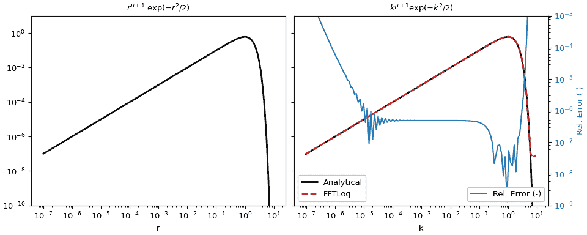

# `scipy.fft.fht`

> 原文：[`docs.scipy.org/doc/scipy-1.12.0/reference/generated/scipy.fft.fht.html#scipy.fft.fht`](https://docs.scipy.org/doc/scipy-1.12.0/reference/generated/scipy.fft.fht.html#scipy.fft.fht)

```py
scipy.fft.fht(a, dln, mu, offset=0.0, bias=0.0)
```

计算快速 Hankel 变换。

使用 FFTLog 算法[[1]](#r25ba8b4d7f66-1), [[2]](#r25ba8b4d7f66-2)计算对数间隔周期序列的离散 Hankel 变换。

参数：

**a**类似数组（…，n）

实数周期性输入数组，均匀对数间隔。对于多维输入，变换在最后一个轴上执行。

**dln**浮点数

输入数组的均匀对数间隔。

**mu**浮点数

Hankel 变换的阶数，任意正数或负数。

**offset**浮点数，可选

输出数组均匀对数间隔的偏移量。

**bias**浮点数，可选

幂律偏差的指数，任意正数或负数。

返回：

**A**类似数组（…，n）

转换后的输出数组，为实数、周期性、均匀对数间隔，并且与输入数组具有相同的形状。

另请参阅

`ifht`

`fht`的倒数。

`fhtoffset`

返回`fht`的最佳偏移量。

注意

此函数计算 Hankel 变换的离散版本

\[A(k) = \int_{0}^{\infty} \! a(r) \, J_\mu(kr) \, k \, dr \;,\]

其中\(J_\mu\)是阶数为\(\mu\)的贝塞尔函数。指数\(\mu\)可以是任意实数，正数或负数。

输入数组*a*是长度为\(n\)的周期序列，均匀对数间隔为*dln*，

\[a_j = a(r_j) \;, \quad r_j = r_c \exp[(j-j_c) \, \mathtt{dln}]\]

关于点\(r_c\)的中心化。请注意，如果\(n\)为偶数，则中心索引\(j_c = (n-1)/2\)为半整数，因此\(r_c\)位于两个输入元素之间。同样，输出数组*A*也是长度为\(n\)的周期序列，也均匀对数间隔，间隔为*dln*

\[A_j = A(k_j) \;, \quad k_j = k_c \exp[(j-j_c) \, \mathtt{dln}]\]

关于点\(k_c\)的中心化。

周期间隔的中心点\(r_c\)和\(k_c\)可以任意选择，但通常选择乘积\(k_c r_c = k_j r_{n-1-j} = k_{n-1-j} r_j\)为单位。可以使用*offset*参数来更改这一点，该参数控制输出数组的对数偏移\(\log(k_c) = \mathtt{offset} - \log(r_c)\)。选择*offset*的最佳值可能会减少离散 Hankel 变换的振铃。

如果*bias*参数非零，则此函数计算有偏 Hankel 变换的离散版本

\[A(k) = \int_{0}^{\infty} \! a_q(r) \, (kr)^q \, J_\mu(kr) \, k \, dr\]

其中\(q\)是*bias*的值，而幂律偏置\(a_q(r) = a(r) \, (kr)^{-q}\)被应用于输入序列。如果存在某个值\(q\)使得\(a_q(r)\)接近周期序列，则偏置变换有助于逼近\(a(r)\)的连续变换，此时得到的\(A(k)\)将接近连续变换。

参考文献

[1]

Talman J. D., 1978, J. Comp. Phys., 29, 35

[2] (1,2)

Hamilton A. J. S., 2000, MNRAS, 312, 257 (astro-ph/9905191)

示例

该示例是`fftlogtest.f`的适应版本，该文件提供在[[2]](#r25ba8b4d7f66-2)中。它评估了积分

\[\int^\infty_0 r^{\mu+1} \exp(-r²/2) J_\mu(k, r) k dr = k^{\mu+1} \exp(-k²/2) .\]

```py
>>> import numpy as np
>>> from scipy import fft
>>> import matplotlib.pyplot as plt 
```

变换的参数。

```py
>>> mu = 0.0                     # Order mu of Bessel function
>>> r = np.logspace(-7, 1, 128)  # Input evaluation points
>>> dln = np.log(r[1]/r[0])      # Step size
>>> offset = fft.fhtoffset(dln, initial=-6*np.log(10), mu=mu)
>>> k = np.exp(offset)/r[::-1]   # Output evaluation points 
```

定义分析函数。

```py
>>> def f(x, mu):
...  """Analytical function: x^(mu+1) exp(-x²/2)."""
...     return x**(mu + 1)*np.exp(-x**2/2) 
```

使用 FFTLog 在`r`处评估函数，并计算相应的`k`值。

```py
>>> a_r = f(r, mu)
>>> fht = fft.fht(a_r, dln, mu=mu, offset=offset) 
```

对于这个例子，我们实际上可以计算分析响应（在这种情况下与输入函数相同）以进行比较，并计算相对误差。

```py
>>> a_k = f(k, mu)
>>> rel_err = abs((fht-a_k)/a_k) 
```

绘制结果。

```py
>>> figargs = {'sharex': True, 'sharey': True, 'constrained_layout': True}
>>> fig, (ax1, ax2) = plt.subplots(1, 2, figsize=(10, 4), **figargs)
>>> ax1.set_title(r'$r^{\mu+1}\ \exp(-r²/2)$')
>>> ax1.loglog(r, a_r, 'k', lw=2)
>>> ax1.set_xlabel('r')
>>> ax2.set_title(r'$k^{\mu+1} \exp(-k²/2)$')
>>> ax2.loglog(k, a_k, 'k', lw=2, label='Analytical')
>>> ax2.loglog(k, fht, 'C3--', lw=2, label='FFTLog')
>>> ax2.set_xlabel('k')
>>> ax2.legend(loc=3, framealpha=1)
>>> ax2.set_ylim([1e-10, 1e1])
>>> ax2b = ax2.twinx()
>>> ax2b.loglog(k, rel_err, 'C0', label='Rel. Error (-)')
>>> ax2b.set_ylabel('Rel. Error (-)', color='C0')
>>> ax2b.tick_params(axis='y', labelcolor='C0')
>>> ax2b.legend(loc=4, framealpha=1)
>>> ax2b.set_ylim([1e-9, 1e-3])
>>> plt.show() 
```


