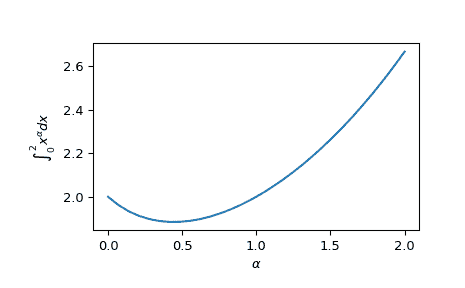

# `scipy.integrate.quad_vec`

> 原文：[`docs.scipy.org/doc/scipy-1.12.0/reference/generated/scipy.integrate.quad_vec.html#scipy.integrate.quad_vec`](https://docs.scipy.org/doc/scipy-1.12.0/reference/generated/scipy.integrate.quad_vec.html#scipy.integrate.quad_vec)

```py
scipy.integrate.quad_vec(f, a, b, epsabs=1e-200, epsrel=1e-08, norm='2', cache_size=100000000.0, limit=10000, workers=1, points=None, quadrature=None, full_output=False, *, args=())
```

向量值函数的自适应积分。

参数：

**f**可调用对象

要积分的向量值函数 f(x)。

**a**浮点数

起点。

**b**浮点数

终点。

**epsabs**浮点数，可选

绝对容差。

**epsrel**浮点数，可选

相对容差。

**norm**{‘max’, ‘2’}，可选

用于误差估计的向量范数。

**cache_size**整数，可选

用于记忆化的字节数。

**limit**浮点数或整数，可选

自适应算法中使用的子区间数量的上限。

**workers**整数或类似映射的可调用对象，可选

如果*workers*是整数，则部分计算以并行方式划分为这么多任务（使用[`multiprocessing.pool.Pool`](https://docs.python.org/3/library/multiprocessing.html#multiprocessing.pool.Pool "(在 Python v3.12 中)")）。提供*-1*以使用进程可用的所有核心。或者，提供一个类似映射的可调用对象，如[`multiprocessing.pool.Pool.map`](https://docs.python.org/3/library/multiprocessing.html#multiprocessing.pool.Pool.map "(在 Python v3.12 中)")，用于并行评估人口。此评估作为`workers(func, iterable)`执行。

**points**列表，可选

附加断点列表。

**quadrature**{‘gk21’, ‘gk15’, ‘trapezoid’}，可选

在子区间上使用的积分规则。选项：‘gk21’（Gauss-Kronrod 21 点规则），‘gk15’（Gauss-Kronrod 15 点规则），‘trapezoid’（复合梯形规则）。默认值：对有限区间使用‘gk21’，对（半）无限区间使用‘gk15’。

**full_output**布尔型，可选

返回额外的`info`字典。

**args**元组，可选

如有需要，传递给函数的额外参数。

自 1.8.0 版本新功能。

返回值：

**res**{float, array-like}

结果的估计值

**err**浮点数

在给定范数下结果的误差估计。

**info**字典

仅在`full_output=True`时返回。信息字典。是一个具有以下属性的对象：

> 成功标志布尔型
> 
> 是否达到了目标精度。
> 
> status 整数
> 
> 收敛的指示器，成功（0），失败（1），以及由于舍入误差而失败（2）。
> 
> neval 整数
> 
> 函数评估的数量。
> 
> intervals 数组，形状（num_intervals，2）
> 
> 子区间的起始点和结束点。
> 
> integrals 数组，形状（num_intervals，…）
> 
> 每个区间的积分。请注意，最多记录`cache_size`个值，并且数组可能包含*nan*表示缺失项。
> 
> errors 数组，形状（num_intervals，）
> 
> 每个区间的估计积分误差。

注意事项

该算法主要遵循 QUADPACK 的 DQAG*算法的实现，实现全局误差控制和自适应细分。

此处的算法与 QUADPACK 方法略有不同：

算法不是一次性将一个区间细分，而是一次性将具有最大误差的 N 个区间细分。这使得积分的（部分）并行化成为可能。

然后，不实现“下一个最大”区间优先细分的逻辑，我们依赖上述扩展来避免仅集中在“小”区间上。

Wynn epsilon 表外推法未被使用（QUADPACK 用于无限区间）。这是因为这里的算法应该适用于矢量值函数，在用户指定的范数下，而将 epsilon 算法扩展到这种情况似乎并没有得到广泛认可。对于最大范数，使用逐元素 Wynn epsilon 可能是可能的，但我们在这里没有这样做，希望 epsilon 外推法主要在特殊情况下有用。

参考文献

[1] R. Piessens, E. de Doncker, QUADPACK (1983).

例子

我们可以计算矢量值函数的积分：

```py
>>> from scipy.integrate import quad_vec
>>> import numpy as np
>>> import matplotlib.pyplot as plt
>>> alpha = np.linspace(0.0, 2.0, num=30)
>>> f = lambda x: x**alpha
>>> x0, x1 = 0, 2
>>> y, err = quad_vec(f, x0, x1)
>>> plt.plot(alpha, y)
>>> plt.xlabel(r"$\alpha$")
>>> plt.ylabel(r"$\int_{0}^{2} x^\alpha dx$")
>>> plt.show() 
```


