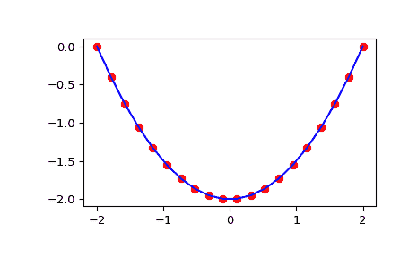

# `scipy.integrate.cumulative_trapezoid`

> 原文链接：[`docs.scipy.org/doc/scipy-1.12.0/reference/generated/scipy.integrate.cumulative_trapezoid.html#scipy.integrate.cumulative_trapezoid`](https://docs.scipy.org/doc/scipy-1.12.0/reference/generated/scipy.integrate.cumulative_trapezoid.html#scipy.integrate.cumulative_trapezoid)

```py
scipy.integrate.cumulative_trapezoid(y, x=None, dx=1.0, axis=-1, initial=None)
```

使用复合梯形法累积地对 y(x) 进行积分。

参数：

**y** array_like

要积分的值。

**x** array_like，可选

要进行积分的坐标。如果为 None（默认），则在 *y* 的连续元素之间使用 *dx* 的间距。

**dx** 浮点数，可选

*y* 元素之间的间距。仅当 *x* 为 None 时使用。

**axis** 整数，可选

指定要累积的轴。默认为 -1（最后一个轴）。

**initial** 标量，可选

如果给定，将此值插入返回结果的开头。仅接受 0 或 None。默认为 None，这意味着 *res* 沿积分轴比 *y* 少一个元素。

自 SciPy 1.15.0 版本起已弃用：*initial* 的非零输入选项。此后，如果 *initial* 不为 None 或 0，则会引发 ValueError。

返回：

**res** ndarray

*y* 沿 *axis* 累积积分的结果。如果 *initial* 为 None，则形状使得积分轴比 *y* 的轴少一个值。如果给定了 *initial*，则形状与 *y* 相同。

另请参阅

[`numpy.cumsum`](https://numpy.org/devdocs/reference/generated/numpy.cumsum.html#numpy.cumsum "(在 NumPy v2.0.dev0 中)"), [`numpy.cumprod`](https://numpy.org/devdocs/reference/generated/numpy.cumprod.html#numpy.cumprod "(在 NumPy v2.0.dev0 中)")

`cumulative_simpson`

使用 Simpson's 1/3 规则的累积积分

`quad`

使用 QUADPACK 的自适应积分

`romberg`

自适应 Romberg 积分

`quadrature`

自适应高斯积分

`fixed_quad`

固定阶数的高斯积分

`dblquad`

双重积分

`tplquad`

三重积分

`romb`

用于采样数据的积分器

`ode`

ODE 积分器

`odeint`

ODE 积分器

示例

```py
>>> from scipy import integrate
>>> import numpy as np
>>> import matplotlib.pyplot as plt 
```

```py
>>> x = np.linspace(-2, 2, num=20)
>>> y = x
>>> y_int = integrate.cumulative_trapezoid(y, x, initial=0)
>>> plt.plot(x, y_int, 'ro', x, y[0] + 0.5 * x**2, 'b-')
>>> plt.show() 
```


