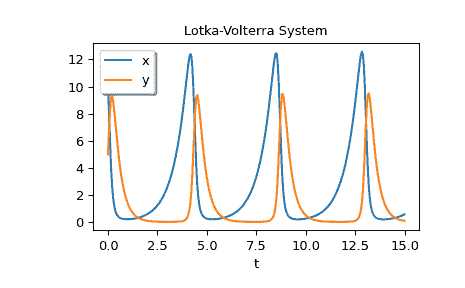

# `scipy.integrate.solve_ivp`

> 原文链接：[`docs.scipy.org/doc/scipy-1.12.0/reference/generated/scipy.integrate.solve_ivp.html#scipy.integrate.solve_ivp`](https://docs.scipy.org/doc/scipy-1.12.0/reference/generated/scipy.integrate.solve_ivp.html#scipy.integrate.solve_ivp)

```py
scipy.integrate.solve_ivp(fun, t_span, y0, method='RK45', t_eval=None, dense_output=False, events=None, vectorized=False, args=None, **options)
```

为一组 ODE 解决初始值问题。

此函数对给定初始值数值积分一组普通微分方程系统：

```py
dy / dt = f(t, y)
y(t0) = y0 
```

这里 t 是一维独立变量（时间），y(t)是一个 N 维向量值函数（状态），而一个 N 维向量值函数 f(t, y)确定了微分方程。目标是找到一个近似满足微分方程的 y(t)，给定初始值 y(t0)=y0。

一些求解器支持在复数域中进行积分，但请注意，对于刚性 ODE 求解器，右手边必须是复可微的（满足柯西-黎曼方程[[11]](#r179348322575-11)）。要解决复数域中的问题，请使用具有复数数据类型的*y0*。另一个始终可用的选项是将问题分别重写为实部和虚部。

参数：

**fun**可调用函数

系统的右手边：在时间 t 处状态`y`的时间导数。调用签名是`fun(t, y)`，其中`t`是标量，`y`是一个长度为`len(y0)`的 ndarray。如果使用了`args`（参见`args`参数的文档），需要传递额外的参数。`fun`必须返回与`y`相同形状的数组。详见*向量化*以获取更多信息。

**t_span**的 2 元序列

积分区间(t0, tf)。求解器从 t=t0 开始积分，直到达到 t=tf。t0 和 tf 都必须是浮点数或可以转换为浮点数的值。

**y0**array_like，形状（n，）

初始状态。对于复数域中的问题，请使用具有复数数据类型的*y0*（即使初始值是纯实数）。

**method**字符串或`OdeSolver`，可选

要使用的积分方法：

> +   ‘RK45’（默认）：五阶（四阶）显式 Runge-Kutta 方法[[1]](#r179348322575-1)。通过假定四阶方法的准确性来控制误差，但使用五阶准确公式（进行本地外推）。对于密集输出，使用四次插值多项式[[2]](#r179348322575-2)。可应用于复数域。
> +   
> +   ‘RK23’：三阶（二阶）显式 Runge-Kutta 方法[[3]](#r179348322575-3)。通过假定二阶方法的准确性来控制误差，但使用三阶准确公式（进行本地外推）。对于密集输出，使用三次 Hermite 多项式。可应用于复数域。
> +   
> +   ‘DOP853’：8 阶显式 Runge-Kutta 方法[[13]](#r179348322575-13)。Python 实现了最初在 Fortran 中编写的“DOP853”算法[[14]](#r179348322575-14)。用于密集输出的 7 阶插值多项式精确到 7 阶。可应用于复数域。
> +   
> +   ‘Radau’：Radau IIA 族的隐式 Runge-Kutta 方法，阶数为 5[[4]](#r179348322575-4)。误差通过三阶准确的嵌入公式控制。满足配点条件的三次多项式用于密集输出。
> +   
> +   ‘BDF’：基于后向差分公式的隐式多步变阶（1 到 5 阶）方法，用于导数近似[[5]](#r179348322575-5)。该实现遵循[[6]](#r179348322575-6)中描述的方法。采用准恒定步长方案，并使用 NDF 修正增强精度。可应用于复数域。
> +   
> +   ‘LSODA’：Adams/BDF 方法，具有自动刚性检测和切换[[7]](#r179348322575-7)，[[8]](#r179348322575-8)。这是 ODEPACK 中 Fortran 求解器的包装器。

显式 Runge-Kutta 方法（‘RK23’、‘RK45’、‘DOP853’）应用于非刚性问题，而隐式方法（‘Radau’、‘BDF’）应用于刚性问题[[9]](#r179348322575-9)。在 Runge-Kutta 方法中，推荐使用‘DOP853’以实现高精度求解（低*rtol*和*atol*值）。

如果不确定，请先尝试运行‘RK45’。如果它执行异常多的迭代、发散或失败，则您的问题可能是刚性的，您应该使用‘Radau’或‘BDF’。‘LSODA’也可以是一个好的通用选择，但它可能不太方便使用，因为它包装了旧的 Fortran 代码。

您还可以传递从`OdeSolver`派生的任意类，该类实现了求解器。

**t_eval** array_like 或 None，可选

计算解的时间点，必须按顺序排序并位于*t_span*内。如果为 None（默认），则使用求解器选择的点。

**dense_output** bool，可选

是否计算连续解。默认为 False。

**events** callable 或 callable 列表，可选

跟踪事件。如果为 None（默认），将不会跟踪任何事件。每个事件发生在时间和状态的连续函数的零点上。每个函数必须具有`event(t, y)`的签名，在使用`args`（参见`args`参数的文档）时必须传递额外的参数。每个函数必须返回一个浮点数。求解器将使用根查找算法找到使得`event(t, y(t)) = 0`的准确时间*t*。默认情况下，将找到所有的零点。求解器在每一步中寻找符号变化，因此如果在一步内发生多次零点穿越，则可能会错过事件。此外，每个*event*函数可能具有以下属性：

> terminal：bool，可选
> 
> 是否在此事件发生时终止积分。如果未分配，则隐式为 False。
> 
> direction: float, optional
> 
> 零点穿越的方向。如果*direction*为正，当从负到正时*event*将触发，如果*direction*为负，则反之。如果为 0，则任何方向都会触发事件。如果未指定，则隐式为 0。

您可以为 Python 中的任何函数分配属性，例如`event.terminal = True`。

**vectorized**bool, optional

是否可以以向量化方式调用*fun*。默认为 False。

如果`vectorized`为 False，则*fun*将始终使用形状为`(n,)`的`y`调用，其中`n = len(y0)`。

如果`vectorized`为 True，则可以使用形状为`(n, k)`的`y`调用*fun*，其中`k`是整数。在这种情况下，*fun*必须表现出`fun(t, y)[:, i] == fun(t, y[:, i])`（即返回数组的每一列都是与`y`的每一列对应的状态的时间导数）。

设置`vectorized=True`允许通过‘Radau’和‘BDF’方法更快地进行雅可比矩阵的有限差分逼近，但会导致其他方法和在某些情况下（例如小的`len(y0)`）‘Radau’和‘BDF’方法的执行速度变慢。

**args**tuple，可选

传递给用户定义函数的附加参数。如果给出，则所有用户定义函数都会传递这些附加参数。例如，如果*fun*的签名为`fun(t, y, a, b, c)`，则*jac*（如果给出）和任何事件函数必须具有相同的签名，并且*args*必须是长度为 3 的元组。

****options**

传递给选择的求解器的选项。列出了所有已实现求解器可用的选项。

**first_step**float 或 None，可选

初始步长。默认为*None*，表示算法应选择。

**max_step**float, optional

允许的最大步长。默认为 np.inf，即步长不受限制，仅由求解器确定。

**rtol, atol**float 或 array_like，可选

相对和绝对容差。求解器保持局部误差估计小于`atol + rtol * abs(y)`。其中*rtol*控制相对精度（正确数字的数量），而*atol*控制绝对精度（正确小数位数）。为了实现所需的*rtol*，请将*atol*设置为小于从`rtol * abs(y)`可以期望的最小值，以便*rtol*主导允许的误差。如果*atol*大于`rtol * abs(y)`，则不能保证正确数字的数量。相反，为了实现所需的*atol*，请设置*rtol*，使得`rtol * abs(y)`始终小于*atol*。如果 y 的组件具有不同的比例，则通过传递形状为(n,)的 array_like 为*atol*的不同组件设置不同的值可能是有益的。默认值为*rtol*为 1e-3 和*atol*为 1e-6。

**jac**array_like、稀疏矩阵、可调用对象或 None，可选

与 *y* 系统右手边的雅可比矩阵，要求 ‘Radau’、‘BDF’ 和 ‘LSODA’ 方法。雅可比矩阵的形状为 (n, n)，其元素 (i, j) 等于 `d f_i / d y_j`。有三种方法来定义雅可比矩阵：

> +   如果是 `array_like` 或 `sparse_matrix`，则假定雅可比矩阵是常数。不支持‘LSODA’。
> +   
> +   如果是可调用的，则假定雅可比矩阵依赖于 *t* 和 *y*；将按需调用为 `jac(t, y)`。如果使用了 `args`（请参阅 `args` 参数的文档），还必须传递额外参数。对于‘Radau’和‘BDF’方法，返回值可能是稀疏矩阵。
> +   
> +   如果为 `None`（默认），雅可比矩阵将通过有限差分逼近。

通常建议提供雅可比矩阵而不是依赖有限差分逼近。

**jac_sparsity**：`array_like`，稀疏矩阵或 `None`，可选

定义雅可比矩阵的稀疏结构，用于有限差分逼近。其形状必须为 (n, n)。如果 *jac* 不为 `None`，则忽略此参数。如果雅可比矩阵每行只有几个非零元素，提供稀疏结构将极大加速计算 [[10]](#r179348322575-10)。零条目意味着雅可比矩阵中相应的元素始终为零。如果为 `None`（默认），则假定雅可比矩阵是密集的。‘LSODA’不支持，见 *lband* 和 *uband*。

**lband, uband**：整数或 `None`，可选

定义“LSODA”方法雅可比矩阵带宽的参数，即，`jac[i, j] != 0` 仅当 `i - lband <= j <= i + uband`。默认为 `None`。设置这些参数需要你的雅可比例程以打包格式返回雅可比矩阵：返回的数组必须有 `n` 列和 `uband + lband + 1` 行，其中雅可比矩阵对角线写入。具体而言，`jac_packed[uband + i - j, j] = jac[i, j]`。`scipy.linalg.solve_banded` 中也使用相同格式（查看示例）。这些参数也可以与 `jac=None` 一起使用，以减少通过有限差分估计的雅可比元素数量。

**min_step**：浮点数，可选

“LSODA”方法的最小允许步长。默认情况下 *min_step* 为零。

返回：

包对象，具有以下字段定义：

**t**：`ndarray`，形状为 (n_points,)

时间点。

**y**：`ndarray`，形状为 (n, n_points)

在 *t* 处解的值。

**sol**：`OdeSolution` 或 `None`

找到的解作为 `OdeSolution` 实例；如果 *dense_output* 设置为 `False`，则为 `None`。

**t_events**：`ndarray` 列表或 `None`

包含每种事件类型检测到事件的数组列表。如果 *events* 为 `None`，则为 `None`。

**y_events**：`ndarray` 列表或 `None`

对于每个*t_events*的值，对应的解的值。如果*events*为 None，则为 None。

**nfev**整数

右手边求值的数量。

**njev**整数

雅可比矩阵的求值数量。

**nlu**整数

LU 分解的数量。

**状态**整数

算法终止的原因：

> +   -1：积分步骤失败。
> +   
> +   0：求解器成功到达*tspan*的末尾。
> +   
> +   1：发生终止事件。

**消息**字符串

算法终止原因的可读描述。

**成功**布尔值

如果求解器达到时间间隔的结束或发生终止事件（`status >= 0`），则为 True。

参考文献

[1]

J. R. Dormand, P. J. Prince, “一族嵌入 Runge-Kutta 公式”，计算和应用数学杂志，第 6 卷，第 1 期，pp. 19-26，1980 年。

[2]

L. W. Shampine, “一些实用的 Runge-Kutta 公式”，计算数学，第 46 卷，第 173 期，pp. 135-150，1986 年。

[3]

P. Bogacki, L.F. Shampine, “一对 3(2)的 Runge-Kutta 公式”，应用数学通讯，第 2 卷，第 4 期，pp. 321-325，1989 年。

[4]

E. Hairer, G. Wanner, “求解普通微分方程 II：刚性和微分代数问题”，第 IV.8 节。

[5]

[反向差分公式](https://zh.wikipedia.org/wiki/%E5%90%8E%E5%90%91%E5%B7%AE%E5%88%86%E5%85%AC%E5%BC%8F)在维基百科上。

[6]

L. F. Shampine, M. W. Reichelt, “MATLAB ODE 套件”，SIAM J. SCI. COMPUTE.，第 18 卷，第 1 期，pp. 1-22，1997 年。

[7]

A. C. Hindmarsh, “ODEPACK，一组系统化的常微分方程求解器”，IMACS 科学计算交易，第 1 卷，pp. 55-64，1983 年。

[8]

L. Petzold, “自动选择求解刚性和非刚性常微分方程方法”，SIAM 科学与统计计算期刊，第 4 卷，第 1 期，pp. 136-148，1983 年。

[9]

[刚性方程](https://zh.wikipedia.org/wiki/%E5%88%9A%E6%80%A7%E6%96%B9%E7%A8%8B)在维基百科上。

[10]

A. Curtis, M. J. D. Powell, and J. Reid, “关于稀疏雅可比矩阵估计的研究”，数学应用研究所杂志，第 13 卷，pp. 117-120，1974 年。

[11]

[柯西-黎曼方程](https://zh.wikipedia.org/wiki/%E6%9F%AF%E6%96%AF%E5%8D%8E%E9%87%8C%E6%9B%BC%E6%96%B9%E7%A8%8B)在维基百科上。

[12]

[Lotka-Volterra 方程组](https://zh.wikipedia.org/wiki/Lotka%E2%80%93Volterra%E6%96%B9%E7%A8%8B)在维基百科上。

[13]

E. Hairer, S. P. Norsett G. Wanner, “求解普通微分方程 I：非刚性问题”，第 II 节。

[14]

[DOP853 的原始 Fortran 代码页面](http://www.unige.ch/~hairer/software.html)。

例子

显示自动选择时间点的基本指数衰减。

```py
>>> import numpy as np
>>> from scipy.integrate import solve_ivp
>>> def exponential_decay(t, y): return -0.5 * y
>>> sol = solve_ivp(exponential_decay, [0, 10], [2, 4, 8])
>>> print(sol.t)
[ 0\.          0.11487653  1.26364188  3.06061781  4.81611105  6.57445806
 8.33328988 10\.        ]
>>> print(sol.y)
[[2\.         1.88836035 1.06327177 0.43319312 0.18017253 0.07483045
 0.03107158 0.01350781]
 [4\.         3.7767207  2.12654355 0.86638624 0.36034507 0.14966091
 0.06214316 0.02701561]
 [8\.         7.5534414  4.25308709 1.73277247 0.72069014 0.29932181
 0.12428631 0.05403123]] 
```

指定希望获得解的点。

```py
>>> sol = solve_ivp(exponential_decay, [0, 10], [2, 4, 8],
...                 t_eval=[0, 1, 2, 4, 10])
>>> print(sol.t)
[ 0  1  2  4 10]
>>> print(sol.y)
[[2\.         1.21305369 0.73534021 0.27066736 0.01350938]
 [4\.         2.42610739 1.47068043 0.54133472 0.02701876]
 [8\.         4.85221478 2.94136085 1.08266944 0.05403753]] 
```

炮弹向上发射，撞击时有终端事件。通过猴子修补一个函数来应用事件的`terminal`和`direction`字段。这里的`y[0]`是位置，`y[1]`是速度。抛射物从位置 0 以+10 的速度开始。注意，积分从未达到 t=100，因为事件是终端的。

```py
>>> def upward_cannon(t, y): return [y[1], -0.5]
>>> def hit_ground(t, y): return y[0]
>>> hit_ground.terminal = True
>>> hit_ground.direction = -1
>>> sol = solve_ivp(upward_cannon, [0, 100], [0, 10], events=hit_ground)
>>> print(sol.t_events)
[array([40.])]
>>> print(sol.t)
[0.00000000e+00 9.99900010e-05 1.09989001e-03 1.10988901e-02
 1.11088891e-01 1.11098890e+00 1.11099890e+01 4.00000000e+01] 
```

使用*dense_output*和*events*找到炮弹轨迹顶点的位置，即 100。顶点并非终点，因此同时找到顶点和地面触地点。在 t=20 时没有信息，因此使用 sol 属性评估解。通过设置`dense_output=True`返回 sol 属性。另外，*y_events*属性可用于访问事件发生时的解。

```py
>>> def apex(t, y): return y[1]
>>> sol = solve_ivp(upward_cannon, [0, 100], [0, 10],
...                 events=(hit_ground, apex), dense_output=True)
>>> print(sol.t_events)
[array([40.]), array([20.])]
>>> print(sol.t)
[0.00000000e+00 9.99900010e-05 1.09989001e-03 1.10988901e-02
 1.11088891e-01 1.11098890e+00 1.11099890e+01 4.00000000e+01]
>>> print(sol.sol(sol.t_events[1][0]))
[100\.   0.]
>>> print(sol.y_events)
[array([[-5.68434189e-14, -1.00000000e+01]]),
 array([[1.00000000e+02, 1.77635684e-15]])] 
```

作为具有额外参数系统的示例，我们将实现 Lotka-Volterra 方程[[12]](#r179348322575-12)。

```py
>>> def lotkavolterra(t, z, a, b, c, d):
...     x, y = z
...     return [a*x - b*x*y, -c*y + d*x*y]
... 
```

我们通过*args*参数传入参数值 a=1.5, b=1, c=3 和 d=1。

```py
>>> sol = solve_ivp(lotkavolterra, [0, 15], [10, 5], args=(1.5, 1, 3, 1),
...                 dense_output=True) 
```

计算密集解并绘制。

```py
>>> t = np.linspace(0, 15, 300)
>>> z = sol.sol(t)
>>> import matplotlib.pyplot as plt
>>> plt.plot(t, z.T)
>>> plt.xlabel('t')
>>> plt.legend(['x', 'y'], shadow=True)
>>> plt.title('Lotka-Volterra System')
>>> plt.show() 
```



几个使用 solve_ivp 解决带有复杂矩阵`A`的微分方程`y' = Ay`的示例。

```py
>>> A = np.array([[-0.25 + 0.14j, 0, 0.33 + 0.44j],
...               [0.25 + 0.58j, -0.2 + 0.14j, 0],
...               [0, 0.2 + 0.4j, -0.1 + 0.97j]]) 
```

用上述`A`和`y`作为 3x1 向量解决 IVP：

```py
>>> def deriv_vec(t, y):
...     return A @ y
>>> result = solve_ivp(deriv_vec, [0, 25],
...                    np.array([10 + 0j, 20 + 0j, 30 + 0j]),
...                    t_eval=np.linspace(0, 25, 101))
>>> print(result.y[:, 0])
[10.+0.j 20.+0.j 30.+0.j]
>>> print(result.y[:, -1])
[18.46291039+45.25653651j 10.01569306+36.23293216j
 -4.98662741+80.07360388j] 
```

用上面的`A`解决 IVP，其中`y`是 3x3 矩阵：

```py
>>> def deriv_mat(t, y):
...     return (A @ y.reshape(3, 3)).flatten()
>>> y0 = np.array([[2 + 0j, 3 + 0j, 4 + 0j],
...                [5 + 0j, 6 + 0j, 7 + 0j],
...                [9 + 0j, 34 + 0j, 78 + 0j]]) 
```

```py
>>> result = solve_ivp(deriv_mat, [0, 25], y0.flatten(),
...                    t_eval=np.linspace(0, 25, 101))
>>> print(result.y[:, 0].reshape(3, 3))
[[ 2.+0.j  3.+0.j  4.+0.j]
 [ 5.+0.j  6.+0.j  7.+0.j]
 [ 9.+0.j 34.+0.j 78.+0.j]]
>>> print(result.y[:, -1].reshape(3, 3))
[[  5.67451179 +12.07938445j  17.2888073  +31.03278837j
 37.83405768 +63.25138759j]
 [  3.39949503 +11.82123994j  21.32530996 +44.88668871j
 53.17531184+103.80400411j]
 [ -2.26105874 +22.19277664j -15.1255713  +70.19616341j
 -38.34616845+153.29039931j]] 
```
