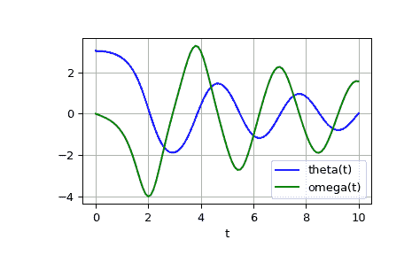

# `scipy.integrate.odeint`

> 原文：[`docs.scipy.org/doc/scipy-1.12.0/reference/generated/scipy.integrate.odeint.html#scipy.integrate.odeint`](https://docs.scipy.org/doc/scipy-1.12.0/reference/generated/scipy.integrate.odeint.html#scipy.integrate.odeint)

```py
scipy.integrate.odeint(func, y0, t, args=(), Dfun=None, col_deriv=0, full_output=0, ml=None, mu=None, rtol=None, atol=None, tcrit=None, h0=0.0, hmax=0.0, hmin=0.0, ixpr=0, mxstep=0, mxhnil=0, mxordn=12, mxords=5, printmessg=0, tfirst=False)
```

集成一组常微分方程。

注意

对于新代码，请使用 [`scipy.integrate.solve_ivp`](https://docs.scipy.org/doc/scipy-1.12.0/reference/generated/scipy.integrate.solve_ivp.html#scipy.integrate.solve_ivp "scipy.integrate.solve_ivp") 来解决微分方程。

使用来自 FORTRAN 库 odepack 中的 lsoda 解决常微分方程组的系统。

解决刚性或非刚性一阶常微分方程组的初值问题：

```py
dy/dt = func(y, t, ...)  [or func(t, y, ...)] 
```

其中 y 可以是向量。

注意

默认情况下，*func* 的前两个参数的顺序与 [`scipy.integrate.ode`](https://docs.scipy.org/doc/scipy-1.12.0/reference/generated/scipy.integrate.ode.html#scipy.integrate.ode "scipy.integrate.ode") 类的系统定义函数和函数 [`scipy.integrate.solve_ivp`](https://docs.scipy.org/doc/scipy-1.12.0/reference/generated/scipy.integrate.solve_ivp.html#scipy.integrate.solve_ivp "scipy.integrate.solve_ivp") 中的参数顺序相反。要使用签名为 `func(t, y, ...)` 的函数，必须将参数 *tfirst* 设置为 `True`。

参数：

**func**callable(y, t, …) 或 callable(t, y, …)

在 t 处计算 y 的导数。如果签名是 `callable(t, y, ...)`，则参数 *tfirst* 必须设置为 `True`。

**y0**数组

y 的初始条件（可以是向量）。

**t**数组

解决 y 的时间点序列。初始值点应该是此序列的第一个元素。此序列必须单调递增或单调递减；允许重复值。

**args**元组，可选

传递给函数的额外参数。

**Dfun**callable(y, t, …) 或 callable(t, y, …)

*func* 的梯度（雅可比矩阵）。如果签名是 `callable(t, y, ...)`，则参数 *tfirst* 必须设置为 `True`。

**col_deriv**bool，可选

如果 *Dfun* 定义沿列的导数（更快），否则 *Dfun* 应定义沿行的导数。

**full_output**bool，可选

如果返回一个字典作为第二个输出的可选输出，则为真

**printmessg**bool，可选

是否打印收敛消息

**tfirst**bool，可选

如果为真，则 *func*（和 *Dfun*（如果给定））的前两个参数必须为 `t, y`，而不是默认的 `y, t`。

新版本 1.1.0 中的新增功能。

返回：

**y**数组，形状为 (len(t), len(y0))

包含在 t 中每个所需时间点的 y 值的数组，初始值 *y0* 在第一行中。

**infodict**dict，仅在 full_output == True 时返回

包含额外输出信息的字典

| 键 | 含义 |
| --- | --- |
| ‘hu’ | 用于每个时间步成功使用的步长向量 |
| ‘tcur’ | 向量，每个时间步达到的 t 值（始终至少与输入时间一样大） |
| ‘tolsf’ | 当检测到要求过多精度时计算的大于 1.0 的容差比例因子向量 |
| ‘tsw’ | 在每个时间步长给出的方法切换时的 t 值 |
| ‘nst’ | 时间步长的累积数量 |
| ‘nfe’ | 每个时间步长的函数评估的累积数量 |
| ‘nje’ | 每个时间步长的雅可比矩阵评估的累积数量 |
| ‘nqu’ | 每个成功步骤的方法阶数向量 |
| ‘imxer’ | 权重局部误差向量（e / ewt）的具有最大幅度分量的分量索引（在错误返回时），否则为-1 |
| ‘lenrw’ | 所需双精度工作数组的长度 |
| ‘leniw’ | 所需整数工作数组的长度 |
| ‘mused’ | 每个成功时间步的方法指示符向量: 1: adams (非刚性), 2: bdf (刚性) |

其他参数:

**ml, mu**int, optional

如果这些参数中任何一个不是 None 或非负数，则假定雅可比矩阵是带状的。这些参数给出了此带状矩阵中下限和上限非零对角线的数量。对于带状情况，*Dfun*应返回一个矩阵，其行包含非零带（从最低对角线开始）。因此，来自*Dfun*的返回矩阵*jac*应具有形状`(ml + mu + 1, len(y0))`，当`ml >=0`或`mu >=0`时。 *jac*中的数据必须存储，以便`jac[i - j + mu, j]`保存第`i`个方程相对于第`j`个状态变量的导数。如果*col_deriv*为 True，则必须返回此*jac*的转置。

**rtol, atol**float, optional

输入参数*rtol*和*atol*确定求解器执行的误差控制。求解器将根据形式为`max-norm of (e / ewt) <= 1`的不等式控制估计的局部误差向量 e 在 y 中，其中 ewt 是计算为`ewt = rtol * abs(y) + atol`的正误差权重向量。rtol 和 atol 可以是与 y 相同长度的向量或标量。默认为 1.49012e-8。

**tcrit**ndarray, optional

关键点（例如奇点）的向量，需要对积分进行注意。

**h0**float, (0: solver-determined), optional

尝试在第一步上尝试的步长。

**hmax**float, (0: solver-determined), optional

允许的最大绝对步长大小。

**hmin**float, (0: solver-determined), optional

允许的最小绝对步长大小。

**ixpr**bool, optional

是否在方法切换时生成额外的打印输出。

**mxstep**int, (0: solver-determined), optional

允许在每个积分点 t 处的每个积分允许的最大步数（内部定义）。

**mxhnil**int, (0: solver-determined), optional

允许打印的最大消息数量。

**mxordn**int, (0: solver-determined), optional

允许非刚性（Adams）方法的最大阶数。

**mxords**int, (0: solver-determined), optional

允许刚性（BDF）方法的最大阶数。

另见

`solve_ivp`

解决 ODE 系统的初始值问题

`ode`

一个基于 VODE 更面向对象的积分器

[`quad`](https://docs.scipy.org/doc/scipy/reference/generated/scipy.integrate.quad.html#scipy.integrate.quad "scipy.integrate.quad")

用于找到曲线下的面积

示例

受重力和摩擦作用的摆角*theta*的二阶微分方程可写成：

```py
theta''(t) + b*theta'(t) + c*sin(theta(t)) = 0 
```

其中*b*和*c*是正常数，而撇号（'）表示导数。要用[`odeint`](https://docs.scipy.org/doc/scipy/reference/generated/scipy.integrate.odeint.html#scipy.integrate.odeint "scipy.integrate.odeint")解决这个方程，我们必须先将其转化为一阶方程组。通过定义角速度`omega(t) = theta'(t)`，我们得到系统：

```py
theta'(t) = omega(t)
omega'(t) = -b*omega(t) - c*sin(theta(t)) 
```

设*y*为向量[*theta*, *omega*]。我们在 Python 中实现这个系统如下：

```py
>>> import numpy as np
>>> def pend(y, t, b, c):
...     theta, omega = y
...     dydt = [omega, -b*omega - c*np.sin(theta)]
...     return dydt
... 
```

我们假设常数为*b* = 0.25 和*c* = 5.0：

```py
>>> b = 0.25
>>> c = 5.0 
```

对于初始条件，我们假设摆近乎垂直，即*theta(0)* = *pi* - 0.1，并且最初静止，因此*omega(0)* = 0。那么初始条件向量为

```py
>>> y0 = [np.pi - 0.1, 0.0] 
```

我们将在间隔 0 <= *t* <= 10 中的 101 个均匀间隔的样本中生成解。因此，我们的时间数组为：

```py
>>> t = np.linspace(0, 10, 101) 
```

调用[`odeint`](https://docs.scipy.org/doc/scipy/reference/generated/scipy.integrate.odeint.html#scipy.integrate.odeint "scipy.integrate.odeint")生成解。要将参数*b*和*c*传递给*pend*，我们使用*args*参数将它们传递给[`odeint`](https://docs.scipy.org/doc/scipy/reference/generated/scipy.integrate.odeint.html#scipy.integrate.odeint "scipy.integrate.odeint")。

```py
>>> from scipy.integrate import odeint
>>> sol = odeint(pend, y0, t, args=(b, c)) 
```

解是一个形状为(101, 2)的数组。第一列是*theta(t)*，第二列是*omega(t)*。以下代码绘制了这两个分量。

```py
>>> import matplotlib.pyplot as plt
>>> plt.plot(t, sol[:, 0], 'b', label='theta(t)')
>>> plt.plot(t, sol[:, 1], 'g', label='omega(t)')
>>> plt.legend(loc='best')
>>> plt.xlabel('t')
>>> plt.grid()
>>> plt.show() 
```


