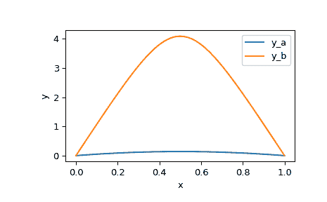
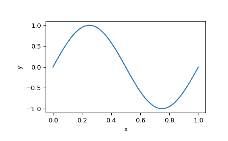

# `scipy.integrate.solve_bvp`

> 原文：[`docs.scipy.org/doc/scipy-1.12.0/reference/generated/scipy.integrate.solve_bvp.html#scipy.integrate.solve_bvp`](https://docs.scipy.org/doc/scipy-1.12.0/reference/generated/scipy.integrate.solve_bvp.html#scipy.integrate.solve_bvp)

```py
scipy.integrate.solve_bvp(fun, bc, x, y, p=None, S=None, fun_jac=None, bc_jac=None, tol=0.001, max_nodes=1000, verbose=0, bc_tol=None)
```

解决 ODE 系统的边界值问题。

此函数数值解一个带有两点边界条件的一阶 ODE 系统：

```py
dy / dx = f(x, y, p) + S * y / (x - a), a <= x <= b
bc(y(a), y(b), p) = 0 
```

这里 x 是一个 1-D 独立变量，y(x) 是一个 N-D 向量值函数，p 是一个 k-D 未知参数向量，它与 y(x) 一起被找到。为了确定问题，必须有 n + k 个边界条件，即 bc 必须是一个 (n + k)-D 函数。

系统右手边的最后一个奇异项是可选的。它由一个 n×n 矩阵 S 定义，使得解必须满足 S y(a) = 0。此条件将在迭代过程中强制执行，因此不得与边界条件相矛盾。详见 [[2]](#r25f8479e577a-2)，解释在数值求解 BVPs 时如何处理此项。

也可以解决复杂域中的问题。在这种情况下，y 和 p 被视为复数，f 和 bc 被假定为复值函数，但 x 保持实数。注意 f 和 bc 必须是复可微的（满足柯西-黎曼方程 [[4]](#r25f8479e577a-4)），否则应将问题分别重写为实部和虚部。要在复杂域中解决问题，请传递一个带有复数数据类型的初始猜测值 y。

参数：

**fun**callable

系统的右手边。调用签名为 `fun(x, y)` 或者如果存在参数则为 `fun(x, y, p)`。所有参数都是 ndarray：`x` 的形状为 (m,)，`y` 的形状为 (n, m)，意味着 `y[:, i]` 对应于 `x[i]`，`p` 的形状为 (k,)。返回值必须是形状为 (n, m) 的数组，并且与 `y` 的布局相同。

**bc**callable

评估边界条件残差的函数。调用签名为 `bc(ya, yb)` 或者如果存在参数则为 `bc(ya, yb, p)`。所有参数都是 ndarray：`ya` 和 `yb` 的形状为 (n,)，`p` 的形状为 (k,)。返回值必须是形状为 (n + k,) 的数组。

**x**array_like，形状为 (m,)

初始网格。必须是一系列严格增加的实数，满足 `x[0]=a` 和 `x[-1]=b`。

**y**array_like，形状为 (n, m)

函数在网格节点处的初始猜测值，第 i 列对应于 `x[i]`。对于复数域中的问题，即使初始猜测是纯实数，也要传递带有复数数据类型的 *y*。

**p**形状为 (k,) 的数组或 None，可选

未知参数的初始猜测值。如果为 None（默认），则假定问题不依赖于任何参数。

**S**形状为 (n, n) 的数组或 None

定义奇异项的矩阵。如果为 None（默认），则在没有奇异项的情况下解决问题。

**fun_jac**callable 或 None，可选

计算 f 对 y 和 p 的导数的函数。其调用签名为 `fun_jac(x, y)` 或者如果存在参数则为 `fun_jac(x, y, p)`。返回必须按以下顺序包含 1 或 2 个元素：

> +   df_dy：形状为 (n, n, m) 的 array_like，其中元素 (i, j, q) 等于 d f_i(x_q, y_q, p) / d (y_q)_j。
> +   
> +   df_dp：形状为 (n, k, m) 的 array_like，其中元素 (i, j, q) 等于 d f_i(x_q, y_q, p) / d p_j。

此处 q 表示 x 和 y 定义的节点数，而 i 和 j 表示向量分量数。如果问题在没有未知参数的情况下解决，则不应返回 df_dp。

如果 *fun_jac* 为 None（默认情况下），则通过向前有限差分法估计导数。

**bc_jac**可调用对象或 None，可选

计算 bc 对 ya、yb 和 p 的导数的函数。其调用签名为 `bc_jac(ya, yb)` 或者如果存在参数则为 `bc_jac(ya, yb, p)`。返回必须按以下顺序包含 2 或 3 个元素：

> +   dbc_dya：形状为 (n, n) 的 array_like，其中元素 (i, j) 等于 d bc_i(ya, yb, p) / d ya_j。
> +   
> +   dbc_dyb：形状为 (n, n) 的 array_like，其中元素 (i, j) 等于 d bc_i(ya, yb, p) / d yb_j。
> +   
> +   dbc_dp：形状为 (n, k) 的 array_like，其中元素 (i, j) 等于 d bc_i(ya, yb, p) / d p_j。

如果问题在没有未知参数的情况下解决，则不应返回 dbc_dp。

如果 *bc_jac* 为 None（默认情况下），则通过向前有限差分法估计导数。

**tol**float，可选

求解的所需解的容差。如果我们定义 `r = y' - f(x, y)`，其中 y 是找到的解，则求解器试图在每个网格间隔上实现 `norm(r / (1 + abs(f)) < tol` 的标准（使用数值积分公式估计的均方根）。默认为 1e-3。

**max_nodes**int，可选

允许的最大网格节点数。如果超过，则算法终止。默认为 1000。

**verbose**{0, 1, 2}，可选

算法详细程度的级别：

> +   0（默认值）：静默工作。
> +   
> +   1：显示终止报告。
> +   
> +   2：迭代过程中显示进展。

**bc_tol**float，可选

边界条件残差的所需绝对容差：*bc* 值应满足 `abs(bc) < bc_tol` 每个分量。默认为 *tol*。允许最多 10 次迭代以达到此容差。

返回：

具有以下字段定义的 Bunch 对象：

**sol**PPoly

找到关于 y 的解为 [`scipy.interpolate.PPoly`](https://scipy.interpolate.PPoly.html#scipy.interpolate.PPoly "scipy.interpolate.PPoly") 实例，一个 C1 连续的三次样条。

**p**ndarray 或 None，形状 (k,)

找到的参数。如果问题中不存在参数，则为 None。

**x**ndarray，形状为 (m,)

最终网格的节点。

**y**ndarray，形状为 (n, m)

在网格节点处的解值。

**yp**ndarray，形状为 (n, m)

解在网格节点处的导数。

**rms_residuals**ndarray，形状为 (m - 1,)

相对于每个网格间隔的相对残差的 RMS 值（请参阅 *tol* 参数的描述）。

**niter**int

完成迭代的次数。

**status**int

算法终止的原因：

> +   0: 算法收敛到期望的精度。
> +   
> +   1: 超过了最大网格节点数。
> +   
> +   2: 在解决匹配系统时遇到奇异雅可比矩阵。

**message**string

终止原因的口头描述。

**success**bool

如果算法收敛到期望的精度（`status=0`）则返回真。

注释

此函数实现了一个具有残差控制的 4 阶匹配算法，类似于 [[1]](#r25f8479e577a-1)。一个匹配系统通过一个具有仿射不变判据函数的阻尼牛顿法解决，如 [[3]](#r25f8479e577a-3) 所述。

注意，在 [[1]](#r25f8479e577a-1) 中，积分残差的定义没有通过区间长度进行归一化。因此，它们的定义与此处使用的定义相差一个 h**0.5 的乘数（其中 h 是区间长度）。

从版本 0.18.0 开始新增。

参考文献

[1] (1,2)

J. Kierzenka, L. F. Shampine, “基于残差控制和 Maltab PSE 的 BVP 求解器”，ACM 数学软件交易，第 27 卷，第 3 期，2001 年，299-316 页。

[2]

L.F. Shampine, P. H. Muir 和 H. Xu，“一个用户友好的 Fortran BVP 求解器”。

[3]

U. Ascher, R. Mattheij 和 R. Russell，“常微分方程边值问题的数值解法”。

[4]

[共轭复数-黎曼方程](https://en.wikipedia.org/wiki/Cauchy-Riemann_equations) 在维基百科上。

示例

在第一个例子中，我们解决 Bratu 的问题：

```py
y'' + k * exp(y) = 0
y(0) = y(1) = 0 
```

对于 k = 1。

我们将方程重写为一个一阶系统，并实现其右手边的评估：

```py
y1' = y2
y2' = -exp(y1) 
```

```py
>>> import numpy as np
>>> def fun(x, y):
...     return np.vstack((y[1], -np.exp(y[0]))) 
```

实现边界条件残差的评估：

```py
>>> def bc(ya, yb):
...     return np.array([ya[0], yb[0]]) 
```

定义具有 5 个节点的初始网格：

```py
>>> x = np.linspace(0, 1, 5) 
```

这个问题已知有两个解。为了获得这两个解，我们对 y 使用两个不同的初始猜测，分别用下标 a 和 b 表示。

```py
>>> y_a = np.zeros((2, x.size))
>>> y_b = np.zeros((2, x.size))
>>> y_b[0] = 3 
```

现在我们准备运行求解器。

```py
>>> from scipy.integrate import solve_bvp
>>> res_a = solve_bvp(fun, bc, x, y_a)
>>> res_b = solve_bvp(fun, bc, x, y_b) 
```

让我们绘制这两个找到的解。我们利用解的样条形式来产生平滑的图形。  

```py
>>> x_plot = np.linspace(0, 1, 100)
>>> y_plot_a = res_a.sol(x_plot)[0]
>>> y_plot_b = res_b.sol(x_plot)[0]
>>> import matplotlib.pyplot as plt
>>> plt.plot(x_plot, y_plot_a, label='y_a')
>>> plt.plot(x_plot, y_plot_b, label='y_b')
>>> plt.legend()
>>> plt.xlabel("x")
>>> plt.ylabel("y")
>>> plt.show() 
```



我们看到两个解的形状相似，但在尺度上有显著差异。

在第二个例子中，我们解决一个简单的 Sturm-Liouville 问题：

```py
y'' + k**2 * y = 0
y(0) = y(1) = 0 
```

已知对于 k = pi * n（其中 n 是整数），存在非平凡解 y = A * sin(k * x)。为了建立归一化常数 A = 1，我们添加一个边界条件：

```py
y'(0) = k 
```

再次，我们将方程重写为一个一阶系统，并实现其右手边的评估：

```py
y1' = y2
y2' = -k**2 * y1 
```

```py
>>> def fun(x, y, p):
...     k = p[0]
...     return np.vstack((y[1], -k**2 * y[0])) 
```

注意，在 [[1]](#r25f8479e577a-1) 中，参数 p 被作为一个向量传递（在我们的情况下只有一个元素）。

实现边界条件：

```py
>>> def bc(ya, yb, p):
...     k = p[0]
...     return np.array([ya[0], yb[0], ya[1] - k]) 
```

设置初始网格和 y 的猜测。我们旨在找到 k = 2 * pi 的解，为此我们设置 y 的值以近似 sin(2 * pi * x)：

```py
>>> x = np.linspace(0, 1, 5)
>>> y = np.zeros((2, x.size))
>>> y[0, 1] = 1
>>> y[0, 3] = -1 
```

使用 6 作为 k 的初始猜测来运行求解器。

```py
>>> sol = solve_bvp(fun, bc, x, y, p=[6]) 
```

我们看到找到的 k 大致正确：

```py
>>> sol.p[0]
6.28329460046 
```

最后，绘制解以查看预期的正弦波形：

```py
>>> x_plot = np.linspace(0, 1, 100)
>>> y_plot = sol.sol(x_plot)[0]
>>> plt.plot(x_plot, y_plot)
>>> plt.xlabel("x")
>>> plt.ylabel("y")
>>> plt.show() 
```


