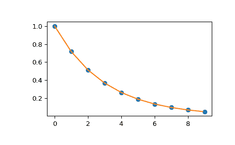

# `scipy.interpolate.interp1d`

> 原文：[`docs.scipy.org/doc/scipy-1.12.0/reference/generated/scipy.interpolate.interp1d.html#scipy.interpolate.interp1d`](https://docs.scipy.org/doc/scipy-1.12.0/reference/generated/scipy.interpolate.interp1d.html#scipy.interpolate.interp1d)

```py
class scipy.interpolate.interp1d(x, y, kind='linear', axis=-1, copy=True, bounds_error=None, fill_value=nan, assume_sorted=False)
```

插值 1-D 函数。

遗留版本

此类被视为遗留版本，将不再接收更新。这也可能意味着在未来的 SciPy 版本中将其移除。有关预期替代 `interp1d` 的指南，请参阅 1-D interpolation。

*x* 和 *y* 是用来近似某个函数 f 的值的数组：`y = f(x)`。此类返回一个函数，其调用方法使用插值来找到新点的值。

参数：

**x**(npoints, ) 类似数组

一个包含实数值的 1-D 数组。

**y**(…, npoints, …) 类似数组

一个包含实数值的 N-D 数组。沿插值轴的 *y* 的长度必须等于 *x* 的长度。使用 `axis` 参数选择正确的轴。与其他插值器不同，默认插值轴是 *y* 的最后一个轴。

**kind**str 或 int，可选

指定插值类型的字符串或指定要使用的样条插值器的顺序的整数。字符串必须是以下之一：'linear'、'nearest'、'nearest-up'、'zero'、'slinear'、'quadratic'、'cubic'、'previous' 或 'next'。'zero'、'slinear'、'quadratic' 和 'cubic' 分别指零阶、一阶、二阶或三阶样条插值；'previous' 和 'next' 分别返回点的前一个或后一个值；'nearest-up' 和 'nearest' 在插值半整数（例如 0.5、1.5）时有所不同，'nearest-up' 向上取整，而 'nearest' 向下取整。默认为 'linear'。

**axis**int，可选

*y* 数组中对应于 x 坐标值的轴。与其他插值器不同，默认为 `axis=-1`。

**copy**bool，可选

如果为 True，则该类会对 x 和 y 进行内部复制。如果为 False，则使用对 *x* 和 *y* 的引用。默认情况下为复制。

**bounds_error**bool，可选

如果为 True，在尝试在 x 范围之外的值（需要外推）进行插值时会引发 ValueError。如果为 False，则将超出范围的值分配给 [`fill_value`](https://docs.scipy.org/doc/scipy-1.12.0/reference/generated/scipy.interpolate.interp1d.html#scipy.interpolate.interp1d.fill_value "scipy.interpolate.interp1d.fill_value")。默认情况下会引发错误，除非 `fill_value="extrapolate"`。

**fill_value**类似数组或（类似数组，类似数组）或“extrapolate”，可选

+   如果是 ndarray（或 float），则此值将用于填充数据范围外请求的点。如果未提供，则默认为 NaN。类似数组必须正确传播到非插值轴的维度。

+   如果是两个元素的元组，则第一个元素用作`x_new < x[0]`的填充值，第二个元素用于`x_new > x[-1]`。任何不是两个元素的元组（例如列表或 ndarray，无论形状如何）都被视为单个类似数组的参数，用于`below, above = fill_value, fill_value`。使用两个元素的元组或 ndarray 需要`bounds_error=False`。

    版本 0.17.0 中的新功能。

+   如果为“extrapolate”，则数据范围外的点将被外推。

    版本 0.17.0 中的新功能。

**assume_sorted**bool，可选

如果为 False，则*x*的值可以按任意顺序排列，并且它们首先被排序。如果为 True，则*x*必须是单调递增值的数组。

另请参阅

`splrep`，`splev`

基于 FITPACK 的样条插值/平滑。

`UnivariateSpline`

FITPACK 例程的面向对象封装。

`interp2d`

二维插值

注意事项

在输入值中存在 NaN 时调用`interp1d`将导致未定义的行为。

输入值*x*和*y*必须可转换为*float*值，如*int*或*float*。

如果*x*中的值不唯一，则结果行为未定义，并且取决于*kind*的选择，即更改*kind*会改变重复项的行为。

示例

```py
>>> import numpy as np
>>> import matplotlib.pyplot as plt
>>> from scipy import interpolate
>>> x = np.arange(0, 10)
>>> y = np.exp(-x/3.0)
>>> f = interpolate.interp1d(x, y) 
```

```py
>>> xnew = np.arange(0, 9, 0.1)
>>> ynew = f(xnew)   # use interpolation function returned by `interp1d`
>>> plt.plot(x, y, 'o', xnew, ynew, '-')
>>> plt.show() 
```



属性：

`fill_value`

填充值。

方法

| `__call__`(x) | 评估插值 |
| --- | --- |
