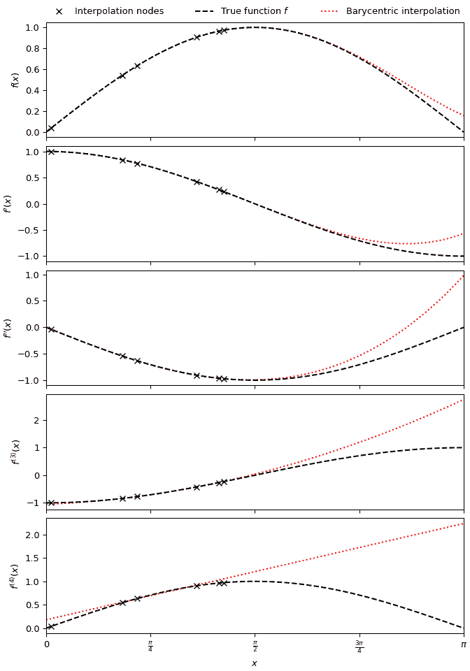

# `scipy.interpolate.BarycentricInterpolator`

> 原文：[`docs.scipy.org/doc/scipy-1.12.0/reference/generated/scipy.interpolate.BarycentricInterpolator.html#scipy.interpolate.BarycentricInterpolator`](https://docs.scipy.org/doc/scipy-1.12.0/reference/generated/scipy.interpolate.BarycentricInterpolator.html#scipy.interpolate.BarycentricInterpolator)

```py
class scipy.interpolate.BarycentricInterpolator(xi, yi=None, axis=0, *, wi=None, random_state=None)
```

一组点的插值多项式。

构造通过给定点集的多项式。允许评估多项式及其所有导数，有效更改要插值的 y 值，并通过添加更多的 x 和 y 值进行更新。

出于数值稳定性的原因，此函数不计算多项式的系数。

在函数评估之前需要提供 *yi* 的值，但前处理不依赖于它们，因此可以快速更新。

参数：

**xi**array_like，形状为 (npoints, )

一维数组，多项式应通过的点的 x 坐标

**yi**array_like，形状为 (…, npoints, …)，可选

y 坐标的 N-D 数组，多项式应通过这些点。如果为 None，则稍后通过 *set_y* 方法提供 y 值。沿插值轴的 *yi* 的长度必须等于 *xi* 的长度。使用 `axis` 参数选择正确的轴。

**axis**int，可选

yi 数组中对应于 x 坐标值的轴。默认为 `axis=0`。

**wi**array_like，可选

所选插值点 *xi* 的重心权重。如果缺少或为 None，则从 *xi* 计算权重（默认）。这允许在使用相同节点 *xi* 计算多个插值时重复使用权重 *wi*，而无需重新计算。

**random_state**{None, int, [`numpy.random.Generator`](https://numpy.org/devdocs/reference/random/generator.html#numpy.random.Generator "(在 NumPy v2.0.dev0 版本中)")，[`numpy.random.RandomState`](https://numpy.org/devdocs/reference/random/legacy.html#numpy.random.RandomState "(在 NumPy v2.0.dev0 版本中)")}，可选

如果 *seed* 为 None（或 *np.random*），则使用 [`numpy.random.RandomState`](https://numpy.org/devdocs/reference/random/legacy.html#numpy.random.RandomState "(在 NumPy v2.0.dev0 版本中)") 单例。如果 *seed* 是整数，则使用新的 `RandomState` 实例，并使用 *seed* 进行种子化。如果 *seed* 已经是 `Generator` 或 `RandomState` 实例，则使用该实例。

注意事项

此类使用“重心插值”方法，将问题视为有理函数插值的特例。这种算法在数值上非常稳定，但即使在精确计算的世界中，除非选择 x 坐标非常仔细 - Chebyshev 零点（例如，cos(i*pi/n)）是一个很好的选择 - 多项式插值本身也是一个非常病态的过程，这是由于 Runge 现象。

基于 Berrut 和 Trefethen 2004 年的“Barycentric Lagrange Interpolation”。

示例

要在区间 \((0, \frac{\pi}{2})\) 内使用六个随机分布的节点生成一个近似于函数 \(\sin x\) 及其前四阶导数的五次重心插值多项式：

```py
>>> import numpy as np
>>> import matplotlib.pyplot as plt
>>> from scipy.interpolate import BarycentricInterpolator
>>> rng = np.random.default_rng()
>>> xi = rng.random(6) * np.pi/2
>>> f, f_d1, f_d2, f_d3, f_d4 = np.sin, np.cos, lambda x: -np.sin(x), lambda x: -np.cos(x), np.sin
>>> P = BarycentricInterpolator(xi, f(xi), random_state=rng)
>>> fig, axs = plt.subplots(5, 1, sharex=True, layout='constrained', figsize=(7,10))
>>> x = np.linspace(0, np.pi, 100)
>>> axs[0].plot(x, P(x), 'r:', x, f(x), 'k--', xi, f(xi), 'xk')
>>> axs[1].plot(x, P.derivative(x), 'r:', x, f_d1(x), 'k--', xi, f_d1(xi), 'xk')
>>> axs[2].plot(x, P.derivative(x, 2), 'r:', x, f_d2(x), 'k--', xi, f_d2(xi), 'xk')
>>> axs[3].plot(x, P.derivative(x, 3), 'r:', x, f_d3(x), 'k--', xi, f_d3(xi), 'xk')
>>> axs[4].plot(x, P.derivative(x, 4), 'r:', x, f_d4(x), 'k--', xi, f_d4(xi), 'xk')
>>> axs[0].set_xlim(0, np.pi)
>>> axs[4].set_xlabel(r"$x$")
>>> axs[4].set_xticks([i * np.pi / 4 for i in range(5)],
...                   ["0", r"$\frac{\pi}{4}$", r"$\frac{\pi}{2}$", r"$\frac{3\pi}{4}$", r"$\pi$"])
>>> axs[0].set_ylabel("$f(x)$")
>>> axs[1].set_ylabel("$f'(x)$")
>>> axs[2].set_ylabel("$f''(x)$")
>>> axs[3].set_ylabel("$f^{(3)}(x)$")
>>> axs[4].set_ylabel("$f^{(4)}(x)$")
>>> labels = ['Interpolation nodes', 'True function $f$', 'Barycentric interpolation']
>>> axs[0].legend(axs[0].get_lines()[::-1], labels, bbox_to_anchor=(0., 1.02, 1., .102),
...               loc='lower left', ncols=3, mode="expand", borderaxespad=0., frameon=False)
>>> plt.show() 
```



属性:

**dtype**

方法

| [`__call__`](https://docs.scipy.org/doc/scipy/reference/generated/scipy.interpolate.BarycentricInterpolator.__call__.html#scipy.interpolate.BarycentricInterpolator.__call__ "scipy.interpolate.BarycentricInterpolator.__call__")(x) | 在点 x 处评估插值多项式 |
| --- | --- |
| [`add_xi`](https://docs.scipy.org/doc/scipy/reference/generated/scipy.interpolate.BarycentricInterpolator.add_xi.html#scipy.interpolate.BarycentricInterpolator.add_xi "scipy.interpolate.BarycentricInterpolator.add_xi")(xi[, yi]) | 将更多 x 值添加到待插值的集合中 |
| [`derivative`](https://docs.scipy.org/doc/scipy/reference/generated/scipy.interpolate.BarycentricInterpolator.derivative.html#scipy.interpolate.BarycentricInterpolator.derivative "scipy.interpolate.BarycentricInterpolator.derivative")(x[, der]) | 在点 x 处评估多项式的单个导数 |
| [`derivatives`](https://docs.scipy.org/doc/scipy/reference/generated/scipy.interpolate.BarycentricInterpolator.derivatives.html#scipy.interpolate.BarycentricInterpolator.derivatives "scipy.interpolate.BarycentricInterpolator.derivatives")(x[, der]) | 在点 *x* 处评估多项式的多个导数 |
| [`set_yi`](https://docs.scipy.org/doc/scipy/reference/generated/scipy.interpolate.BarycentricInterpolator.set_yi.html#scipy.interpolate.BarycentricInterpolator.set_yi "scipy.interpolate.BarycentricInterpolator.set_yi")(yi[, axis]) | 更新待插值的 y 值 |
