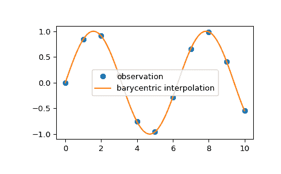

# `scipy.interpolate.barycentric_interpolate`

> 原文：[`docs.scipy.org/doc/scipy-1.12.0/reference/generated/scipy.interpolate.barycentric_interpolate.html#scipy.interpolate.barycentric_interpolate`](https://docs.scipy.org/doc/scipy-1.12.0/reference/generated/scipy.interpolate.barycentric_interpolate.html#scipy.interpolate.barycentric_interpolate)

```py
scipy.interpolate.barycentric_interpolate(xi, yi, x, axis=0, *, der=0)
```

多项式插值的便捷函数。

构造一个通过给定点集的多项式，然后评估多项式。由于数值稳定性的原因，此函数不计算多项式的系数。

此函数使用“重心插值”方法，将问题视为有理函数插值的特殊情况。这种算法在数值上非常稳定，但即使在精确计算的世界中，除非非常谨慎地选择*x*坐标（例如，切比雪夫零点（例如，cos(i*pi/n)）是一个很好的选择），多项式插值本身也是一个由于 Runge 现象而非常病态的过程。

参数：

**xi**array_like

多项式应通过的点的 x 坐标的 1-D 数组

**yi**array_like

多项式应通过的点的 y 坐标。

**x**标量 或 array_like

评估插值函数的点或点。

**der**int 或 列表 或 None, 可选

要评估的导数数量，或者对所有可能非零导数评估（即与点数相等的数量），或者要评估的导数列表。这个数字包括函数值作为“0th”导数。

**axis**int, 可选

与*yi*数组中的轴相对应的 x 坐标值。

返回：

**y**标量 或 array_like

插值值。形状由用*x*替换原始数组中的插值轴决定。

另请参阅

`BarycentricInterpolator`

重心插值器

注解

插值权重的构造是一个相对较慢的过程。如果您希望多次使用相同的 xi 调用此函数（但可能会变化 yi 或 x），您应该使用类`BarycentricInterpolator`。这是此函数在内部使用的内容。

示例

我们可以使用重心插值法对 2D 观察数据进行插值：

```py
>>> import numpy as np
>>> import matplotlib.pyplot as plt
>>> from scipy.interpolate import barycentric_interpolate
>>> x_observed = np.linspace(0.0, 10.0, 11)
>>> y_observed = np.sin(x_observed)
>>> x = np.linspace(min(x_observed), max(x_observed), num=100)
>>> y = barycentric_interpolate(x_observed, y_observed, x)
>>> plt.plot(x_observed, y_observed, "o", label="observation")
>>> plt.plot(x, y, label="barycentric interpolation")
>>> plt.legend()
>>> plt.show() 
```


