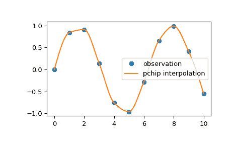

# `scipy.interpolate.pchip_interpolate`

> 原文链接：[`docs.scipy.org/doc/scipy-1.12.0/reference/generated/scipy.interpolate.pchip_interpolate.html#scipy.interpolate.pchip_interpolate`](https://docs.scipy.org/doc/scipy-1.12.0/reference/generated/scipy.interpolate.pchip_interpolate.html#scipy.interpolate.pchip_interpolate)

```py
scipy.interpolate.pchip_interpolate(xi, yi, x, der=0, axis=0)
```

Pchip 插值的便利函数。

xi 和 yi 是用来逼近某些函数 f 的值的数组，其中`yi = f(xi)`。插值器使用单调立方样条来找到新点 x 的值及其导数。

参见`scipy.interpolate.PchipInterpolator`以获取详细信息。

参数：

**xi**类似数组

排序后的 x 坐标列表，长度为 N。

**yi**类似数组

一个实数值的 1-D 数组。*yi*在插值轴上的长度必须等于*xi*的长度。如果是 N-D 数组，请使用轴参数选择正确的轴。

**x**标量或类似数组

长度为 M。

**der**int 或列表，可选

要提取的导数。可以包括第 0 阶导数以返回函数值。

**axis**整数，可选

在 yi 数组中对应于 x 坐标值的轴。

返回：

**y**标量或类似数组

结果的长度为 R 或长度为 M 或 M 乘以 R。

参见

`PchipInterpolator`

PCHIP 1-D 单调立方插值器。

示例

我们可以使用 Pchip 插值来插值 2D 观测数据：

```py
>>> import numpy as np
>>> import matplotlib.pyplot as plt
>>> from scipy.interpolate import pchip_interpolate
>>> x_observed = np.linspace(0.0, 10.0, 11)
>>> y_observed = np.sin(x_observed)
>>> x = np.linspace(min(x_observed), max(x_observed), num=100)
>>> y = pchip_interpolate(x_observed, y_observed, x)
>>> plt.plot(x_observed, y_observed, "o", label="observation")
>>> plt.plot(x, y, label="pchip interpolation")
>>> plt.legend()
>>> plt.show() 
```


