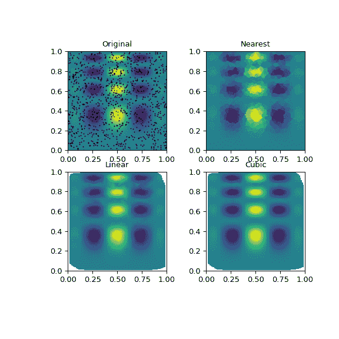

# `scipy.interpolate.griddata`

> 原文链接：[`docs.scipy.org/doc/scipy-1.12.0/reference/generated/scipy.interpolate.griddata.html#scipy.interpolate.griddata`](https://docs.scipy.org/doc/scipy-1.12.0/reference/generated/scipy.interpolate.griddata.html#scipy.interpolate.griddata)

```py
scipy.interpolate.griddata(points, values, xi, method='linear', fill_value=nan, rescale=False)
```

对非结构化 D-D 数据进行插值。

参数：

**points**：形状为 (n, D) 的 2-D ndarray，或者长度为 D 的 1-D ndarray 元组，形状为 (n,)。

数据点坐标。

**values**：float 或 complex 的 ndarray，形状为 (n,)

数据值。

**xi**：形状为 (m, D) 的 2-D ndarray，或者长度为 D 的元组，其中包含可以广播到相同形状的 ndarray。

插值数据点。

**method**：{‘linear’, ‘nearest’, ‘cubic’}，可选

插值方法。其中之一为

`nearest`

返回距离插值点最近的数据点的值。详见[`NearestNDInterpolator`](https://docs.scipy.org/doc/scipy-1.12.0/reference/generated/scipy.interpolate.NearestNDInterpolator.html#scipy.interpolate.NearestNDInterpolator "scipy.interpolate.NearestNDInterpolator")。

`linear`

将输入点集网格化为 N-D 单纯形，并在线性上进行插值。详见[`LinearNDInterpolator`](https://docs.scipy.org/doc/scipy-1.12.0/reference/generated/scipy.interpolate.LinearNDInterpolator.html#scipy.interpolate.LinearNDInterpolator "scipy.interpolate.LinearNDInterpolator")。

`cubic`（1-D）

返回从三次样条确定的值。

`cubic`（2-D）

返回从分段立方体、连续可微（C1）、近似最小曲率的多项式表面确定的值。详见[`CloughTocher2DInterpolator`](https://docs.scipy.org/doc/scipy-1.12.0/reference/generated/scipy.interpolate.CloughTocher2DInterpolator.html#scipy.interpolate.CloughTocher2DInterpolator "scipy.interpolate.CloughTocher2DInterpolator")。

**fill_value**：float，可选

用于在请求点位于输入点凸包外部时填充的值。如果未提供，则默认为 `nan`。对于 ‘nearest’ 方法，此选项无效。

**rescale**：bool，可选

在执行插值之前，将点重新缩放到单位立方体。如果某些输入维度具有不相容的单位并且相差多个数量级，则此选项非常有用。

新版本 0.14.0 中的新增功能。

返回：

ndarray

插值值数组。

参见

[`LinearNDInterpolator`](https://docs.scipy.org/doc/scipy-1.12.0/reference/generated/scipy.interpolate.LinearNDInterpolator.html#scipy.interpolate.LinearNDInterpolator "scipy.interpolate.LinearNDInterpolator")

在 N 维中的分段线性插值器。

[`NearestNDInterpolator`](https://docs.scipy.org/doc/scipy-1.12.0/reference/generated/scipy.interpolate.NearestNDInterpolator.html#scipy.interpolate.NearestNDInterpolator "scipy.interpolate.NearestNDInterpolator")

在 N 维中的最近邻插值器。

[`CloughTocher2DInterpolator`](https://docs.scipy.org/doc/scipy-1.12.0/reference/generated/scipy.interpolate.CloughTocher2DInterpolator.html#scipy.interpolate.CloughTocher2DInterpolator "scipy.interpolate.CloughTocher2DInterpolator")

在 2D 中的分段立方体、C1 平滑、曲率最小化的插值器。

[`interpn`](https://docs.scipy.org/doc/scipy-1.12.0/reference/generated/scipy.interpolate.interpn.html#scipy.interpolate.interpn "scipy.interpolate.interpn")

在规则网格或矩形网格上进行插值。

[`RegularGridInterpolator`](https://docs.scipy.org/doc/scipy/reference/generated/scipy.interpolate.RegularGridInterpolator.html#scipy.interpolate.RegularGridInterpolator "scipy.interpolate.RegularGridInterpolator")

在任意维度上的正则或矩形网格插值器（[`interpn`](https://docs.scipy.org/doc/scipy/reference/generated/scipy.interpolate.interpn.html#scipy.interpolate.interpn "scipy.interpolate.interpn")封装了这个类）。

注意

新版功能在 0.9 版中。

注意

对于正则网格数据，请使用[`interpn`](https://docs.scipy.org/doc/scipy/reference/generated/scipy.interpolate.interpn.html#scipy.interpolate.interpn "scipy.interpolate.interpn")。

示例

假设我们要插值二维函数

```py
>>> import numpy as np
>>> def func(x, y):
...     return x*(1-x)*np.cos(4*np.pi*x) * np.sin(4*np.pi*y**2)**2 
```

在[0, 1]x[0, 1]网格上

```py
>>> grid_x, grid_y = np.mgrid[0:1:100j, 0:1:200j] 
```

但是我们只知道它在 1000 个数据点的值：

```py
>>> rng = np.random.default_rng()
>>> points = rng.random((1000, 2))
>>> values = func(points[:,0], points[:,1]) 
```

这可以通过`griddata`完成——下面我们尝试所有插值方法：

```py
>>> from scipy.interpolate import griddata
>>> grid_z0 = griddata(points, values, (grid_x, grid_y), method='nearest')
>>> grid_z1 = griddata(points, values, (grid_x, grid_y), method='linear')
>>> grid_z2 = griddata(points, values, (grid_x, grid_y), method='cubic') 
```

可以看到所有方法在某种程度上都复制了确切结果，但对于这个平滑函数，分段三次插值器提供了最佳结果：

```py
>>> import matplotlib.pyplot as plt
>>> plt.subplot(221)
>>> plt.imshow(func(grid_x, grid_y).T, extent=(0,1,0,1), origin='lower')
>>> plt.plot(points[:,0], points[:,1], 'k.', ms=1)
>>> plt.title('Original')
>>> plt.subplot(222)
>>> plt.imshow(grid_z0.T, extent=(0,1,0,1), origin='lower')
>>> plt.title('Nearest')
>>> plt.subplot(223)
>>> plt.imshow(grid_z1.T, extent=(0,1,0,1), origin='lower')
>>> plt.title('Linear')
>>> plt.subplot(224)
>>> plt.imshow(grid_z2.T, extent=(0,1,0,1), origin='lower')
>>> plt.title('Cubic')
>>> plt.gcf().set_size_inches(6, 6)
>>> plt.show() 
```


