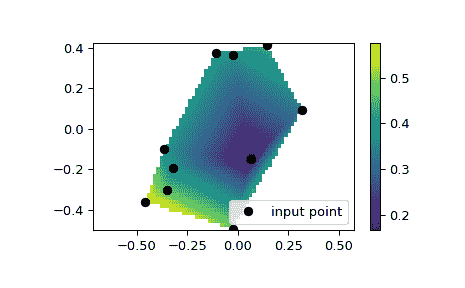

# `scipy.interpolate.LinearNDInterpolator`

> 原文链接：[`docs.scipy.org/doc/scipy-1.12.0/reference/generated/scipy.interpolate.LinearNDInterpolator.html#scipy.interpolate.LinearNDInterpolator`](https://docs.scipy.org/doc/scipy-1.12.0/reference/generated/scipy.interpolate.LinearNDInterpolator.html#scipy.interpolate.LinearNDInterpolator)

```py
class scipy.interpolate.LinearNDInterpolator(points, values, fill_value=np.nan, rescale=False)
```

多维度中的分段线性插值器。

自版本 0.9 起新增。

参数：

**points**浮点数的 ndarray，形状为（npoints，ndims）；或 Delaunay

数据点坐标的 2D 数组，或预计算的 Delaunay 三角剖分。

**values**浮点数或复数的 ndarray，形状为（npoints，…），可选

*points*处的 N-D 数据值数组。*values*沿第一轴的长度必须等于*points*的长度。与某些插值器不同，插值轴无法更改。

**fill_value**float，可选

用于填充请求点在输入点凸包之外的值。如果未提供，则默认为`nan`。

**rescale**bool，可选

在执行插值之前将点重新缩放到单位立方体。如果某些输入维度具有不可比较的单位并且差异为多个数量级，则这很有用。

另请参阅

[`griddata`](https://docs.scipy.org/doc/scipy-1.12.0/reference/generated/scipy.interpolate.griddata.html#scipy.interpolate.griddata "scipy.interpolate.griddata")

对非结构化 D-D 数据进行插值。

[`NearestNDInterpolator`](https://docs.scipy.org/doc/scipy-1.12.0/reference/generated/scipy.interpolate.NearestNDInterpolator.html#scipy.interpolate.NearestNDInterpolator "scipy.interpolate.NearestNDInterpolator")

N 维空间中的最近邻插值器。

[`CloughTocher2DInterpolator`](https://docs.scipy.org/doc/scipy-1.12.0/reference/generated/scipy.interpolate.CloughTocher2DInterpolator.html#scipy.interpolate.CloughTocher2DInterpolator "scipy.interpolate.CloughTocher2DInterpolator")

二维中的分段三次、C1 平滑、曲率最小化插值器。

[`interpn`](https://docs.scipy.org/doc/scipy-1.12.0/reference/generated/scipy.interpolate.interpn.html#scipy.interpolate.interpn "scipy.interpolate.interpn")

在规则网格或矩形网格上的插值。

[`RegularGridInterpolator`](https://docs.scipy.org/doc/scipy-1.12.0/reference/generated/scipy.interpolate.RegularGridInterpolator.html#scipy.interpolate.RegularGridInterpolator "scipy.interpolate.RegularGridInterpolator")

在任意维度的规则或矩形网格上的插值器（[`interpn`](https://docs.scipy.org/doc/scipy-1.12.0/reference/generated/scipy.interpolate.interpn.html#scipy.interpolate.interpn "scipy.interpolate.interpn"）封装了此类）。

注意

通过 Qhull（[[1]](#rb6d8aaa8ff0b-1)）对输入数据进行三角剖分，并在每个三角形上执行线性重心插值来构造插值器。

注意

对于规则网格上的数据，请使用[`interpn`](https://docs.scipy.org/doc/scipy-1.12.0/reference/generated/scipy.interpolate.interpn.html#scipy.interpolate.interpn "scipy.interpolate.interpn")。

参考

[[1]](#id1)

[`www.qhull.org/`](http://www.qhull.org/)

示例

我们可以在 2D 平面上进行插值：

```py
>>> from scipy.interpolate import LinearNDInterpolator
>>> import numpy as np
>>> import matplotlib.pyplot as plt
>>> rng = np.random.default_rng()
>>> x = rng.random(10) - 0.5
>>> y = rng.random(10) - 0.5
>>> z = np.hypot(x, y)
>>> X = np.linspace(min(x), max(x))
>>> Y = np.linspace(min(y), max(y))
>>> X, Y = np.meshgrid(X, Y)  # 2D grid for interpolation
>>> interp = LinearNDInterpolator(list(zip(x, y)), z)
>>> Z = interp(X, Y)
>>> plt.pcolormesh(X, Y, Z, shading='auto')
>>> plt.plot(x, y, "ok", label="input point")
>>> plt.legend()
>>> plt.colorbar()
>>> plt.axis("equal")
>>> plt.show() 
```



方法

| [`__call__`](https://docs.scipy.org/doc/scipy/reference/generated/scipy.interpolate.LinearNDInterpolator.html#scipy.interpolate.LinearNDInterpolator.__call__ "scipy.interpolate.LinearNDInterpolator.__call__")(xi) | 在给定点处评估插值器。 |
| --- | --- |
