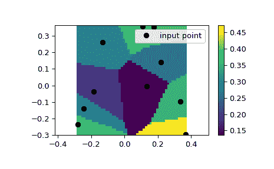

# `scipy.interpolate.NearestNDInterpolator`

> 原始文本：[`docs.scipy.org/doc/scipy-1.12.0/reference/generated/scipy.interpolate.NearestNDInterpolator.html#scipy.interpolate.NearestNDInterpolator`](https://docs.scipy.org/doc/scipy-1.12.0/reference/generated/scipy.interpolate.NearestNDInterpolator.html#scipy.interpolate.NearestNDInterpolator)

```py
class scipy.interpolate.NearestNDInterpolator(x, y, rescale=False, tree_options=None)
```

NearestNDInterpolator(x, y).

N > 1 维的最近邻插值器。

自版本 0.9 新增。

参数：

**x**(npoints, ndims) 2-D ndarray of floats

数据点坐标。

**y**(npoints, ) 1-D ndarray of float or complex

数据值。

**rescale**boolean, optional

在执行插值之前，将点重新缩放为单位立方体。如果输入维度具有不可比较的单位并且相差多个数量级，则此操作很有用。

自版本 0.14.0 新增。

**tree_options**dict, optional

传递给底层 `cKDTree` 的选项。

自版本 0.17.0 新增。

另请参阅

`griddata`

插值非结构化的 D-D 数据。

`LinearNDInterpolator`

N 维分段线性插值器。

`CloughTocher2DInterpolator`

2D 中分段三次、C1 平滑、曲率最小化插值器。

`interpn`

在规则网格或矩形网格上进行插值。

`RegularGridInterpolator`

在任意维度的规则或矩形网格上的插值器（`interpn` 封装了此类）。

注释

使用 `scipy.spatial.cKDTree`

注意

对于规则网格上的数据，请使用 `interpn`。

示例

我们可以在 2D 平面上插值数值：

```py
>>> from scipy.interpolate import NearestNDInterpolator
>>> import numpy as np
>>> import matplotlib.pyplot as plt
>>> rng = np.random.default_rng()
>>> x = rng.random(10) - 0.5
>>> y = rng.random(10) - 0.5
>>> z = np.hypot(x, y)
>>> X = np.linspace(min(x), max(x))
>>> Y = np.linspace(min(y), max(y))
>>> X, Y = np.meshgrid(X, Y)  # 2D grid for interpolation
>>> interp = NearestNDInterpolator(list(zip(x, y)), z)
>>> Z = interp(X, Y)
>>> plt.pcolormesh(X, Y, Z, shading='auto')
>>> plt.plot(x, y, "ok", label="input point")
>>> plt.legend()
>>> plt.colorbar()
>>> plt.axis("equal")
>>> plt.show() 
```



方法

| `__call__`(*args, **query_options) | 在给定点评估插值器。 |
| --- | --- |
