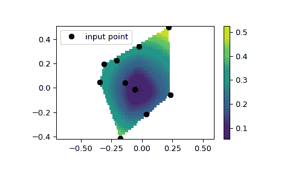

# `scipy.interpolate.CloughTocher2DInterpolator`

> 原文链接：[`docs.scipy.org/doc/scipy-1.12.0/reference/generated/scipy.interpolate.CloughTocher2DInterpolator.html#scipy.interpolate.CloughTocher2DInterpolator`](https://docs.scipy.org/doc/scipy-1.12.0/reference/generated/scipy.interpolate.CloughTocher2DInterpolator.html#scipy.interpolate.CloughTocher2DInterpolator)

```py
class scipy.interpolate.CloughTocher2DInterpolator(points, values, fill_value=nan, tol=1e-06, maxiter=400, rescale=False)
```

CloughTocher2DInterpolator(points, values, tol=1e-6)。

2D 中分段三次、C1 平滑、曲率最小化的插值器。

从版本 0.9 开始新增。

参数：

**points**浮点数的 ndarray，形状为(npoints, ndims)；或 Delaunay

数据点坐标的 2-D 数组，或预计算的 Delaunay 三角化。

**values**浮点数或复数的 ndarray，形状为(npoints, …)

N-D 数组，表示*points*处的数据值。*values*沿第一个轴的长度必须等于*points*的长度。与某些插值器不同，插值轴不能更改。

**fill_value**float, optional

用于填充请求点超出输入点凸包的值。如果未提供，则默认为`nan`。

**tol**float, optional

梯度估计的绝对/相对容差。

**maxiter**int, optional

梯度估计中的最大迭代次数。

**rescale**bool, optional

在执行插值之前将点重新缩放到单位立方体中。如果一些输入维度具有不可共享的单位，并且相差许多数量级，则这是有用的。

另请参阅

`griddata`

对非结构化 D-D 数据进行插值。

`LinearNDInterpolator`

N > 1 维度中的分段线性插值器。

`NearestNDInterpolator`

N > 1 维度中的最近邻插值器。

`interpn`

在规则网格或矩形网格上进行插值。

`RegularGridInterpolator`

在任意维度的规则或矩形网格上进行插值（`interpn`包装了这个类）。

注释

插值器通过使用 Qhull 对输入数据进行三角化，并在每个三角形上使用 Clough-Tocher 方案构造分段三次插值 Bezier 多项式来构建。插值器保证连续可微。

插值曲面的梯度被选择为使得插值曲面的曲率近似最小化。为此所需的梯度是使用[Nielson83]和[Renka84]中描述的全局算法估计的。

注意

对于规则网格数据，请使用`interpn`。

参考文献

[1]

[`www.qhull.org/`](http://www.qhull.org/)

[CT]

例如，参见 P. Alfeld, ‘’A trivariate Clough-Tocher scheme for tetrahedral data’’. Computer Aided Geometric Design, 1, 169 (1984); G. Farin, ‘’Triangular Bernstein-Bezier patches’’. Computer Aided Geometric Design, 3, 83 (1986).

[Nielson83]

G. Nielson, ‘’A method for interpolating scattered data based upon a minimum norm network’’. Math. Comp., 40, 253 (1983).

[Renka84]

R. J. Renka and A. K. Cline. ‘’A Triangle-based C1 interpolation method.’’, Rocky Mountain J. Math., 14, 223 (1984).

示例

我们可以在二维平面上进行插值：

```py
>>> from scipy.interpolate import CloughTocher2DInterpolator
>>> import numpy as np
>>> import matplotlib.pyplot as plt
>>> rng = np.random.default_rng()
>>> x = rng.random(10) - 0.5
>>> y = rng.random(10) - 0.5
>>> z = np.hypot(x, y)
>>> X = np.linspace(min(x), max(x))
>>> Y = np.linspace(min(y), max(y))
>>> X, Y = np.meshgrid(X, Y)  # 2D grid for interpolation
>>> interp = CloughTocher2DInterpolator(list(zip(x, y)), z)
>>> Z = interp(X, Y)
>>> plt.pcolormesh(X, Y, Z, shading='auto')
>>> plt.plot(x, y, "ok", label="input point")
>>> plt.legend()
>>> plt.colorbar()
>>> plt.axis("equal")
>>> plt.show() 
```



方法

| `__call__`(xi) | 在给定点处评估插值器。 |
| --- | --- |
