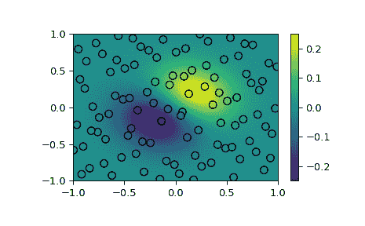

# `scipy.interpolate.RBFInterpolator`

> 原文链接：[`docs.scipy.org/doc/scipy-1.12.0/reference/generated/scipy.interpolate.RBFInterpolator.html#scipy.interpolate.RBFInterpolator`](https://docs.scipy.org/doc/scipy-1.12.0/reference/generated/scipy.interpolate.RBFInterpolator.html#scipy.interpolate.RBFInterpolator)

```py
class scipy.interpolate.RBFInterpolator(y, d, neighbors=None, smoothing=0.0, kernel='thin_plate_spline', epsilon=None, degree=None)
```

N 维中的径向基函数（RBF）插值。

参数：

**y**(npoints, ndims) 数组类

二维数据点坐标数组。

**d**(npoints, …) 数组类

在*y*处的 N 维数据值数组。*d*沿第一个轴的长度必须等于*y*的长度。与某些插值器不同，插值轴不能更改。

**邻居**int，可选

如果指定，每个评估点处的插值器值将仅使用这些最近的数据点。默认情况下使用所有数据点。

**平滑**float 或 (npoints, ) 数组类，可选

平滑参数。当设置为 0 时，插值器完美适合数据。对于较大的值，插值器接近指定次数多项式的最小二乘拟合。默认值为 0。

**核心**str，可选

RBF 的类型。应为以下之一

> +   ‘线性’：`-r`
> +   
> +   ‘薄板样条’：`r**2 * log(r)`
> +   
> +   ‘三次’：`r**3`
> +   
> +   ‘五次’：`-r**5`
> +   
> +   ‘多孔径’：`-sqrt(1 + r**2)`
> +   
> +   ‘逆多孔径’：`1/sqrt(1 + r**2)`
> +   
> +   ‘逆二次’：`1/(1 + r**2)`
> +   
> +   ‘高斯’：`exp(-r**2)`

默认为‘薄板样条’。

**epsilon**float，可选

形状参数，将输入缩放到 RBF。如果*kernel*为‘线性’、‘薄板样条’、‘三次’或‘五次’，默认为 1，可以忽略，因为它与缩放平滑参数具有相同效果。否则，必须指定此参数。

**次数**int，可选

添加多项式的次数。对于某些 RBF，如果多项式次数太小，插值器可能不是良好的形式。这些 RBF 及其对应的最小次数为

> +   ‘多孔径’：0
> +   
> +   ‘线性’：0
> +   
> +   ‘薄板样条’：1
> +   
> +   ‘三次’：1
> +   
> +   ‘五次’：2

默认值为*kernel*的最小次数，如果没有最小次数则为 0。将其设置为-1 以取消添加多项式。

另请参阅

[`NearestNDInterpolator`](https://docs.scipy.org/doc/scipy-1.12.0/reference/generated/scipy.interpolate.NearestNDInterpolator.html#scipy.interpolate.NearestNDInterpolator "scipy.interpolate.NearestNDInterpolator")

[`LinearNDInterpolator`](https://docs.scipy.org/doc/scipy-1.12.0/reference/generated/scipy.interpolate.LinearNDInterpolator.html#scipy.interpolate.LinearNDInterpolator "scipy.interpolate.LinearNDInterpolator")

[`CloughTocher2DInterpolator`](https://docs.scipy.org/doc/scipy-1.12.0/reference/generated/scipy.interpolate.CloughTocher2DInterpolator.html#scipy.interpolate.CloughTocher2DInterpolator "scipy.interpolate.CloughTocher2DInterpolator")

注释

RBF 是 N 维空间中的标量值函数，其在\(x\)处的值可以用\(r=||x - c||\)表示，其中\(c\)是 RBF 的中心。

数据值向量\(d\)的 RBF 插值器，这些数据值来自位置\(y\)，是以\(y\)为中心的 RBF 的线性组合加上指定度数的多项式。RBF 插值器表示为

\[f(x) = K(x, y) a + P(x) b\]

其中 \(K(x, y)\) 是以\(y\)为中心的 RBF 矩阵，在点\(x\)处评估，\(P(x)\) 是包含具有指定度数的多项式的矩阵，评估在\(x\)处。系数\(a\)和\(b\)是线性方程组的解

\[(K(y, y) + \lambda I) a + P(y) b = d\]

和

\[P(y)^T a = 0\]

其中 \(\lambda\) 是一个非负的平滑参数，控制我们希望拟合数据的程度。当平滑参数为 0 时，数据可以完全拟合。

以上系统在满足以下要求时是唯一可解的：

> +   \(P(y)\) 必须具有完整的列秩。当*degree*为-1 或 0 时，\(P(y)\) 总是具有完整的列秩。当*degree*为 1 时，如果数据点位置不全共线（N=2）、共面（N=3）等，则\(P(y)\) 具有完整的列秩。
> +   
> +   如果*kernel*是 'multiquadric'、'linear'、'thin_plate_spline'、'cubic' 或 'quintic'，则*degree*不能低于上述最小值。
> +   
> +   如果*smoothing*为 0，则每个数据点的位置必须不同。

当使用非尺度不变的 RBF（如 'multiquadric'、'inverse_multiquadric'、'inverse_quadratic' 或 'gaussian'）时，必须选择适当的形状参数（例如通过交叉验证）。形状参数较小的值对应于较宽的 RBF。当形状参数过小时，问题可能变得病态或奇异。

解决 RBF 插值系数所需的内存随数据点数的增加而呈二次增长，当插值超过约一千个数据点时可能变得不实用。为了克服大型插值问题的内存限制，可以指定*neighbors*参数，仅使用最近的数据点为每个评估点计算 RBF 插值。

新版本 1.7.0 中新增。

参考文献

[1]

Fasshauer, G., 2007\. 使用 Matlab 的无网格逼近方法。World Scientific Publishing Co.

[2]

[`amadeus.math.iit.edu/~fass/603_ch3.pdf`](http://amadeus.math.iit.edu/~fass/603_ch3.pdf)

[3]

Wahba, G., 1990\. 观测数据的样条模型。SIAM。

[4]

[`pages.stat.wisc.edu/~wahba/stat860public/lect/lect8/lect8.pdf`](http://pages.stat.wisc.edu/~wahba/stat860public/lect/lect8/lect8.pdf)

示例

演示如何将散点数据插值到二维网格。

```py
>>> import numpy as np
>>> import matplotlib.pyplot as plt
>>> from scipy.interpolate import RBFInterpolator
>>> from scipy.stats.qmc import Halton 
```

```py
>>> rng = np.random.default_rng()
>>> xobs = 2*Halton(2, seed=rng).random(100) - 1
>>> yobs = np.sum(xobs, axis=1)*np.exp(-6*np.sum(xobs**2, axis=1)) 
```

```py
>>> xgrid = np.mgrid[-1:1:50j, -1:1:50j]
>>> xflat = xgrid.reshape(2, -1).T
>>> yflat = RBFInterpolator(xobs, yobs)(xflat)
>>> ygrid = yflat.reshape(50, 50) 
```

```py
>>> fig, ax = plt.subplots()
>>> ax.pcolormesh(*xgrid, ygrid, vmin=-0.25, vmax=0.25, shading='gouraud')
>>> p = ax.scatter(*xobs.T, c=yobs, s=50, ec='k', vmin=-0.25, vmax=0.25)
>>> fig.colorbar(p)
>>> plt.show() 
```



方法

| `__call__`(x) | 在*x*处评估插值器。 |
| --- | --- |
