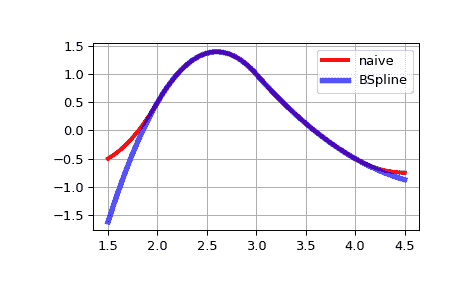

# `scipy.interpolate.BSpline`

> 原文：[`docs.scipy.org/doc/scipy-1.12.0/reference/generated/scipy.interpolate.BSpline.html#scipy.interpolate.BSpline`](https://docs.scipy.org/doc/scipy-1.12.0/reference/generated/scipy.interpolate.BSpline.html#scipy.interpolate.BSpline)

```py
class scipy.interpolate.BSpline(t, c, k, extrapolate=True, axis=0)
```

B 样条基上的单变量样条。

\[S(x) = \sum_{j=0}^{n-1} c_j B_{j, k; t}(x)\]

其中\(B_{j, k; t}\)是度为*k*和结点*t*的 B 样条基函数。

参数：

**t**ndarray，形状（n+k+1，）

结点

**c**ndarray，形状（>=n，…）

样条系数

**k**int

B 样条度

**外推**bool 或'周期性'，可选

是否在基本区间*t[k] .. t[n]*之外外推，或返回 nans。如果为 True，则在基本区间上激活 B 样条函数的第一个和最后一个多项式片段。如果是'周期性'，则使用周期性外推。默认值为 True。

**轴**int，可选

插值轴。默认为零。

注意事项

B 样条基函数通过以下方式定义

\[ \begin{align}\begin{aligned}B_{i, 0}(x) = 1, \textrm{if $t_i \le x < t_{i+1}$, otherwise $0$,}\\B_{i, k}(x) = \frac{x - t_i}{t_{i+k} - t_i} B_{i, k-1}(x) + \frac{t_{i+k+1} - x}{t_{i+k+1} - t_{i+1}} B_{i+1, k-1}(x)\end{aligned}\end{align} \]

**实现细节**

+   对于度为*k*的样条，至少需要*k+1*个系数，因此*n >= k+1*。额外的系数*c[j]*（其中*j > n*）将被忽略。

+   度为*k*的 B 样条基函数在基本区间*t[k] <= x <= t[n]*上形成一个单位分区。

参考文献

[1]

Tom Lyche 和 Knut Morken，样条方法，[`www.uio.no/studier/emner/matnat/ifi/INF-MAT5340/v05/undervisningsmateriale/`](http://www.uio.no/studier/emner/matnat/ifi/INF-MAT5340/v05/undervisningsmateriale/)

[2]

Carl de Boor，样条的实用指南，Springer，2001。

示例

将 B 样条的递归定义翻译成 Python 代码，我们有：

```py
>>> def B(x, k, i, t):
...    if k == 0:
...       return 1.0 if t[i] <= x < t[i+1] else 0.0
...    if t[i+k] == t[i]:
...       c1 = 0.0
...    else:
...       c1 = (x - t[i])/(t[i+k] - t[i]) * B(x, k-1, i, t)
...    if t[i+k+1] == t[i+1]:
...       c2 = 0.0
...    else:
...       c2 = (t[i+k+1] - x)/(t[i+k+1] - t[i+1]) * B(x, k-1, i+1, t)
...    return c1 + c2 
```

```py
>>> def bspline(x, t, c, k):
...    n = len(t) - k - 1
...    assert (n >= k+1) and (len(c) >= n)
...    return sum(c[i] * B(x, k, i, t) for i in range(n)) 
```

请注意，这是评估 B 样条的一种低效（虽然直接）的方法 —— 这个样条类以一种等效但更高效的方式执行。

在基本区间`2 <= x <= 4`上构建二次样条函数，并与评估样条的朴素方式进行比较：

```py
>>> from scipy.interpolate import BSpline
>>> k = 2
>>> t = [0, 1, 2, 3, 4, 5, 6]
>>> c = [-1, 2, 0, -1]
>>> spl = BSpline(t, c, k)
>>> spl(2.5)
array(1.375)
>>> bspline(2.5, t, c, k)
1.375 
```

请注意，在基本区间之外的结果会有所不同。这是因为`BSpline`会在基本区间上激活的 B 样条函数的第一个和最后一个多项式片段进行外推。

```py
>>> import matplotlib.pyplot as plt
>>> import numpy as np
>>> fig, ax = plt.subplots()
>>> xx = np.linspace(1.5, 4.5, 50)
>>> ax.plot(xx, [bspline(x, t, c ,k) for x in xx], 'r-', lw=3, label='naive')
>>> ax.plot(xx, spl(xx), 'b-', lw=4, alpha=0.7, label='BSpline')
>>> ax.grid(True)
>>> ax.legend(loc='best')
>>> plt.show() 
```



属性：

**t**ndarray

结点向量

**c**ndarray

样条系数

**k**int

样条度

**外推**bool

如果为 True，则在基本区间上激活的 B 样条函数的第一个和最后一个多项式片段进行外推。

**轴**int

插值轴。

`tck`元组

等同于`(self.t, self.c, self.k)`（只读）。

方法

| `__call__`(x[, nu, extrapolate]) | 求解样条函数。 |
| --- | --- |
| `basis_element`(t[, extrapolate]) | 返回 B 样条基底元素 `B(x | t[0], ..., t[k+1])`。 |
| `derivative`([nu]) | 返回表示导数的 B 样条。 |
| `antiderivative`([nu]) | 返回表示原函数的 B 样条。 |
| `integrate`(a, b[, extrapolate]) | 计算样条的定积分。 |
| `construct_fast`(t, c, k[, extrapolate, axis]) | 构造一个不进行检查的样条。 |
| `design_matrix`(x, t, k[, extrapolate]) | 返回一个以 CSR 格式稀疏数组表示的设计矩阵。 |
| `from_power_basis`(pp[, bc_type]) | 从幂基底中的分段多项式构造 B 样条基底的多项式。 |
