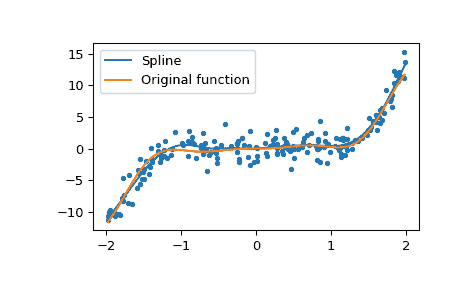

# `scipy.interpolate.make_smoothing_spline`

> 原文：[`docs.scipy.org/doc/scipy-1.12.0/reference/generated/scipy.interpolate.make_smoothing_spline.html#scipy.interpolate.make_smoothing_spline`](https://docs.scipy.org/doc/scipy-1.12.0/reference/generated/scipy.interpolate.make_smoothing_spline.html#scipy.interpolate.make_smoothing_spline)

```py
scipy.interpolate.make_smoothing_spline(x, y, w=None, lam=None)
```

使用 `lam` 控制曲线光滑度和其接近数据的平滑立方样条函数的（系数）。如果 `lam` 是 None，则使用 GCV 标准 [1] 来找到它。

平滑样条作为解决带有给定参数 `lam` 的正则化加权线性回归问题的解：

\[\sum\limits_{i=1}^n w_i\lvert y_i - f(x_i) \rvert² + \lambda\int\limits_{x_1}^{x_n} (f^{(2)}(u))² d u\]

其中 \(f\) 是一个样条函数，\(w\) 是一个权重向量，\(\lambda\) 是一个正则化参数。

如果 `lam` 是 None，则使用 GCV 标准来找到最优的正则化参数，否则使用给定的参数解决带有给定参数的正则化加权线性回归问题。该参数控制如下的权衡：参数越大，函数越平滑。

参数：

**x** 数组，形状 (n,)

横坐标。*n* 至少为 5。

**y** 数组，形状 (n,)

纵坐标。*n* 至少为 5。

**w** 数组，形状 (n,)，可选

权重向量。默认为`np.ones_like(x)`。

**lam** 浮点数，(\(\lambda \geq 0\))，可选

正则化参数。如果 `lam` 是 None，则根据 GCV 标准来确定。默认为 None。

返回：

**func** 一个 BSpline 对象。

一个可调用的 B 样条基函数表示为使用 GCV 标准 [1] 的平滑样条的解，在 `lam` 是 None 的情况下，使用给定的参数 `lam`。

注意

该算法是 Woltring 在 FORTRAN 中引入的算法的重新实现。由于许可问题，原始版本不能在 SciPy 源代码中使用。重新实现的详细信息在这里讨论（仅限俄语）[4]。

如果权重向量 `w` 是 None，则假设所有点在权重上是相等的，并且权重向量是全 1 向量。

注意，在加权残差平方和中，权重不是平方的：\(\sum\limits_{i=1}^n w_i\lvert y_i - f(x_i) \rvert²\) 而在 `splrep` 中，总和是由平方权重构建的。

在初始问题病态的情况下（例如，乘积 \(X^T W X\) 其中 \(X\) 是设计矩阵不是正定矩阵时），会引发 ValueError。

参考文献

[1]

G. Wahba，“Estimating the smoothing parameter” in Spline models for observational data，Philadelphia, Pennsylvania：Society for Industrial and Applied Mathematics，1990，pp. 45-65。[DOI:10.1137/1.9781611970128](https://doi.org/10.1137/1.9781611970128)

[2]

H. J. Woltring, 广义交叉验证样条平滑和微分的 Fortran 包, 《工程软件进展》, 第 8 卷, 第 2 期, 1986 年, pp. 104-113. [DOI:10.1016/0141-1195(86)90098-7](https://doi.org/10.1016/0141-1195(86)90098-7)

[3]

T. Hastie, J. Friedman, 和 R. Tisbshirani, "平滑样条" in 《统计学习的要素: 数据挖掘、推断和预测》, 纽约: Springer, 2017, pp. 241-249. [DOI:10.1007/978-0-387-84858-7](https://doi.org/10.1007/978-0-387-84858-7)

[4]

E. Zemlyanoy, "广义交叉验证平滑样条", 学士学位论文, 2022 年. [`www.hse.ru/ba/am/students/diplomas/620910604`](https://www.hse.ru/ba/am/students/diplomas/620910604) (俄语)

示例

生成一些噪声数据

```py
>>> import numpy as np
>>> np.random.seed(1234)
>>> n = 200
>>> def func(x):
...    return x**3 + x**2 * np.sin(4 * x)
>>> x = np.sort(np.random.random_sample(n) * 4 - 2)
>>> y = func(x) + np.random.normal(scale=1.5, size=n) 
```

制作平滑样条函数

```py
>>> from scipy.interpolate import make_smoothing_spline
>>> spl = make_smoothing_spline(x, y) 
```

绘制两者

```py
>>> import matplotlib.pyplot as plt
>>> grid = np.linspace(x[0], x[-1], 400)
>>> plt.plot(grid, spl(grid), label='Spline')
>>> plt.plot(grid, func(grid), label='Original function')
>>> plt.scatter(x, y, marker='.')
>>> plt.legend(loc='best')
>>> plt.show() 
```


