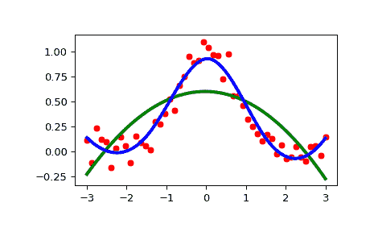

# `scipy.interpolate.UnivariateSpline`

> 原文：[`docs.scipy.org/doc/scipy-1.12.0/reference/generated/scipy.interpolate.UnivariateSpline.html#scipy.interpolate.UnivariateSpline`](https://docs.scipy.org/doc/scipy-1.12.0/reference/generated/scipy.interpolate.UnivariateSpline.html#scipy.interpolate.UnivariateSpline)

```py
class scipy.interpolate.UnivariateSpline(x, y, w=None, bbox=[None, None], k=3, s=None, ext=0, check_finite=False)
```

对给定数据点进行的 1-D 平滑样条拟合。

将度为 *k* 的样条 y = spl(x) 拟合到提供的 *x*、*y* 数据。*s* 通过指定一个平滑条件来指定节点的数量。

参数：

**x**(N,) array_like

独立输入数据的 1-D 数组。必须是递增的；如果 *s* 为 0，则必须严格递增。

**y**(N,) array_like

与 *x* 长度相同的依赖输入数据的 1-D 数组。

**w**(N,) array_like, optional

样条拟合的权重。必须是正数。如果 *w* 为 None，则权重都是 1。默认为 None。

**bbox**(2,) array_like, optional

两个序列，指定逼近区间的边界。如果 *bbox* 为 None，则 `bbox=[x[0], x[-1]]`。默认为 None。

**k**int, optional

平滑样条的阶数。必须满足 1 <= *k* <= 5。`k = 3` 是三次样条。默认为 3。

**s**float or None, optional

用于选择结点数的正平滑因子。将增加结点数，直到满足平滑条件：

```py
sum((w[i] * (y[i]-spl(x[i])))**2, axis=0) <= s 
```

但是，由于数值问题，实际条件是：

```py
abs(sum((w[i] * (y[i]-spl(x[i])))**2, axis=0) - s) < 0.001 * s 
```

如果 *s* 为 None，则 *s* 将被设置为 *len(w)*，用于使用所有数据点的平滑样条。如果为 0，则样条将通过所有数据点进行插值。这相当于 `InterpolatedUnivariateSpline`。默认为 None。用户可以使用 *s* 来控制拟合的紧密度和平滑度之间的权衡。较大的 *s* 表示更多的平滑，而较小的值表示较少的平滑。推荐的 *s* 值取决于权重 *w*。如果权重代表 *y* 的标准偏差的倒数，则在范围 (m-sqrt(2*m),m+sqrt(2*m)) 内应该找到一个好的 *s* 值，其中 *m* 是 *x*、*y* 和 *w* 中的数据点数。这意味着如果 `1/w[i]` 是 `y[i]` 的标准偏差的估计值，则 `s = len(w)` 应该是一个很好的值。

**ext**int or str, optional

控制了不在结点序列定义的区间内的外推模式。

+   如果 ext=0 或者 ‘extrapolate’，返回外推值。

+   如果 ext=1 或者 ‘zeros’，返回 0

+   如果 ext=2 或者 ‘raise’，引发 ValueError

+   如果 ext=3 或者 ‘const’，返回边界值。

默认为 0。

**check_finite**bool, optional

是否检查输入数组是否只包含有限数值。禁用可能会提高性能，但如果输入包含无穷大或 NaN，则可能会导致问题（崩溃、非终止或无意义的结果）。默认为 False。

参见

`BivariateSpline`

双变量样条的基类。

`SmoothBivariateSpline`

给定点的平滑双变量样条。

`LSQBivariateSpline`

使用加权最小二乘拟合的双变量样条。

`RectSphereBivariateSpline`

在球面上的矩形网格上的双变量样条。

`SmoothSphereBivariateSpline`

球面坐标中的平滑双变量样条。

`LSQSphereBivariateSpline`

使用加权最小二乘拟合的球面坐标中的平滑双变量样条。

`RectBivariateSpline`

矩形网格上的双变量样条。

`InterpolatedUnivariateSpline`

为给定数据点集插值的一维样条插值函数。

`bisplrep`

一个用于找到表面的双变量 B-样条表示的函数。

`bisplev`

评估双变量 B-样条及其导数的函数。

`splrep`

一维曲线 B-样条表示的函数。

`splev`

评估 B-样条或其导数的函数。

`sproot`

一个用于寻找三次 B-样条根的函数。

`splint`

在两个给定点之间评估 B-样条的定积分。

`spalde`

评估 B-样条的所有导数的函数。

注释

数据点的数量必须大于样条度数 *k*。

**NaN 处理**：如果输入数组包含`nan`值，则结果无用，因为底层的样条拟合程序无法处理`nan`。解决方法是对非数字数据点使用零权重：

```py
>>> import numpy as np
>>> from scipy.interpolate import UnivariateSpline
>>> x, y = np.array([1, 2, 3, 4]), np.array([1, np.nan, 3, 4])
>>> w = np.isnan(y)
>>> y[w] = 0.
>>> spl = UnivariateSpline(x, y, w=~w) 
```

注意，需要将`nan`替换为数值（精确数值不重要，只要相应的权重为零即可）。

References

基于在[[1]](#r7b7bd71fb0ec-1)、[[2]](#r7b7bd71fb0ec-2)、[[3]](#r7b7bd71fb0ec-3)和[[4]](#r7b7bd71fb0ec-4)中描述的算法：

[1]

P. Dierckx，“使用样条函数进行平滑、求导和积分的算法”，J.Comp.Appl.Maths 1 (1975) 165-184。

[2]

P. Dierckx，“在使用样条函数进行数据平滑的快速算法”，SIAM J.Numer.Anal. 19 (1982) 1286-1304。

[3]

P. Dierckx，“使用样条函数进行曲线拟合的改进算法”，报告 tw54，计算机科学系，库鲁文大学，1981 年。

[4]

P. Dierckx，“使用样条函数进行曲线和曲面拟合”，《数值分析专著》，牛津大学出版社，1993 年。

Examples

```py
>>> import numpy as np
>>> import matplotlib.pyplot as plt
>>> from scipy.interpolate import UnivariateSpline
>>> rng = np.random.default_rng()
>>> x = np.linspace(-3, 3, 50)
>>> y = np.exp(-x**2) + 0.1 * rng.standard_normal(50)
>>> plt.plot(x, y, 'ro', ms=5) 
```

使用默认值进行平滑参数：

```py
>>> spl = UnivariateSpline(x, y)
>>> xs = np.linspace(-3, 3, 1000)
>>> plt.plot(xs, spl(xs), 'g', lw=3) 
```

手动调整平滑量：

```py
>>> spl.set_smoothing_factor(0.5)
>>> plt.plot(xs, spl(xs), 'b', lw=3)
>>> plt.show() 
```



Methods

| `__call__`(x[, nu, ext]) | 在位置 x 处评估样条函数（或其第 nu 阶导数）。 |
| --- | --- |
| `antiderivative`([n]) | 构造表示该样条函数不定积分的新样条函数。 |
| `derivative`([n]) | 构造表示该样条函数导数的新样条函数。 |
| `derivatives`(x) | 返回样条函数在点 x 处的所有导数。 |
| `get_coeffs`() | 返回样条函数的系数。 |
| `get_knots`() | 返回样条函数内部结点的位置。 |
| `get_residual`() | 返回样条逼近的加权残差平方和。 |
| [`integral`](https://docs.scipy.org/doc/scipy/reference/generated/scipy.interpolate.UnivariateSpline.integral.html#scipy.interpolate.UnivariateSpline.integral)(a, b) | 返回样条函数在两个给定点之间的定积分。 |
| [`roots`](https://docs.scipy.org/doc/scipy/reference/generated/scipy.interpolate.UnivariateSpline.roots.html#scipy.interpolate.UnivariateSpline.roots)() | 返回样条函数的零点。 |
| [`set_smoothing_factor`](https://docs.scipy.org/doc/scipy/reference/generated/scipy.interpolate.UnivariateSpline.set_smoothing_factor.html#scipy.interpolate.UnivariateSpline.set_smoothing_factor)(s) | 使用给定的平滑系数 s 和上次调用时找到的节点继续计算样条函数。 |
| **validate_input** |
