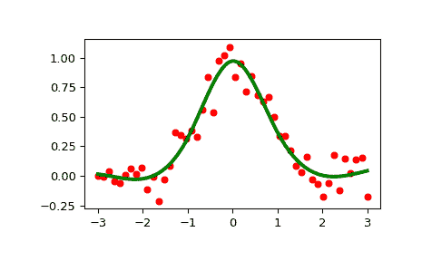

# `scipy.interpolate.LSQUnivariateSpline`

> 原文：[`docs.scipy.org/doc/scipy-1.12.0/reference/generated/scipy.interpolate.LSQUnivariateSpline.html#scipy.interpolate.LSQUnivariateSpline`](https://docs.scipy.org/doc/scipy-1.12.0/reference/generated/scipy.interpolate.LSQUnivariateSpline.html#scipy.interpolate.LSQUnivariateSpline)

```py
class scipy.interpolate.LSQUnivariateSpline(x, y, t, w=None, bbox=[None, None], k=3, ext=0, check_finite=False)
```

具有显式内部结点的一维样条。

将样条 y = spl(x) 拟合到提供的 *x*, *y* 数据。*t* 指定样条的内部结点

参数：

**x**(N,) array_like

数据点的输入维度 - 必须递增

**y**(N,) array_like

数据点的输入维度

**t**(M,) array_like

样条的内部结点。必须按升序排列，并且：

```py
bbox[0] < t[0] < ... < t[-1] < bbox[-1] 
```

**w**(N,) array_like，可选

用于样条拟合的权重。必须为正数。如果为 None（默认），所有权重均为 1。

**bbox**(2,) array_like，可选

指定逼近区间边界的 2 元组序列。如果为 None（默认），`bbox = [x[0], x[-1]]`。

**k**int，可选

平滑样条的阶数。必须满足 1 <= *k* <= 5。默认值为 *k* = 3，即三次样条。

**ext**int 或者 str，可选

控制超出结点序列定义的区间的外推模式。

+   如果 ext=0 或者 ‘extrapolate’，返回外推值。

+   如果 ext=1 或者 ‘zeros’，返回 0

+   如果 ext=2 或者 ‘raise’，引发 ValueError

+   如果 ext=3 或者 ‘const’，返回边界值。

默认值为 0。

**check_finite**bool，可选

是否检查输入数组仅包含有限数。禁用可能会提高性能，但如果输入包含无穷大或 NaN，则可能会导致问题（崩溃、非终止或非意义结果）。默认值为 False。

引发：

ValueError

如果内部结点不满足 Schoenberg-Whitney 条件

另请参见

`UnivariateSpline`

用于拟合给定数据点集的平滑单变量样条。

`InterpolatedUnivariateSpline`

给定数据点的插值单变量样条。

`splrep`

一个用于找到一维曲线的 B-样条表示的函数

`splev`

一个用于评估 B-样条或其导数的函数

`sproot`

一个用于找到立方 B-样条根的函数

`splint`

一个用于计算 B-样条在给定两点之间的定积分的函数

`spalde`

一个用于评估 B-样条的所有导数的函数

注意

数据点数必须大于样条度数 *k*。

节点 *t* 必须满足 Schoenberg-Whitney 条件，即必须存在数据点 `x[j]` 的子集，使得 `t[j] < x[j] < t[j+k+1]`，对于 `j=0, 1,...,n-k-2`。

示例

```py
>>> import numpy as np
>>> from scipy.interpolate import LSQUnivariateSpline, UnivariateSpline
>>> import matplotlib.pyplot as plt
>>> rng = np.random.default_rng()
>>> x = np.linspace(-3, 3, 50)
>>> y = np.exp(-x**2) + 0.1 * rng.standard_normal(50) 
```

用预定义的内部节点拟合平滑样条：

```py
>>> t = [-1, 0, 1]
>>> spl = LSQUnivariateSpline(x, y, t) 
```

```py
>>> xs = np.linspace(-3, 3, 1000)
>>> plt.plot(x, y, 'ro', ms=5)
>>> plt.plot(xs, spl(xs), 'g-', lw=3)
>>> plt.show() 
```



检查节点向量：

```py
>>> spl.get_knots()
array([-3., -1., 0., 1., 3.]) 
```

构造使用另一个样条的节点的 LSQ 样条：

```py
>>> x = np.arange(10)
>>> s = UnivariateSpline(x, x, s=0)
>>> s.get_knots()
array([ 0.,  2.,  3.,  4.,  5.,  6.,  7.,  9.])
>>> knt = s.get_knots()
>>> s1 = LSQUnivariateSpline(x, x, knt[1:-1])    # Chop 1st and last knot
>>> s1.get_knots()
array([ 0.,  2.,  3.,  4.,  5.,  6.,  7.,  9.]) 
```

方法

| `__call__`(x[, nu, ext]) | 在位置 *x* 处评估样条（或其第 *nu* 阶导数）。 |
| --- | --- |
| `antiderivative`([n]) | 构造一个表示此样条的反导数的新样条。 |
| `derivative`([n]) | 构造一个表示此样条导数的新样条。 |
| `derivatives`(x) | 返回样条在点 *x* 处的所有导数。 |
| `get_coeffs`() | 返回样条系数。 |
| `get_knots`() | 返回样条内部节点的位置。 |
| `get_residual`() | 返回样条逼近的加权残差平方和。 |
| `integral`(a, b) | 返回样条在给定两点之间的定积分。 |
| `roots`() | 返回样条的零点。 |
| `set_smoothing_factor`(s) | 使用给定的平滑系数 *s* 和上次调用时找到的节点继续样条计算。 |
| **validate_input** |  |
