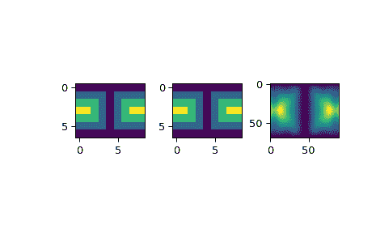

# `scipy.interpolate.LSQSphereBivariateSpline`

> 原文：[`docs.scipy.org/doc/scipy-1.12.0/reference/generated/scipy.interpolate.LSQSphereBivariateSpline.html#scipy.interpolate.LSQSphereBivariateSpline`](https://docs.scipy.org/doc/scipy-1.12.0/reference/generated/scipy.interpolate.LSQSphereBivariateSpline.html#scipy.interpolate.LSQSphereBivariateSpline)

```py
class scipy.interpolate.LSQSphereBivariateSpline(theta, phi, r, tt, tp, w=None, eps=1e-16)
```

在球坐标中使用加权最小二乘双变量样条逼近。

根据*theta*和*phi*方向上给定的一组结点确定平滑的双三次样条。

0.11.0 版本中新增。

参数：

**theta, phi, r**array_like

数据点的 1-D 序列（顺序不重要）。坐标必须以弧度给出。Theta 必须位于区间`[0, pi]`内，phi 必须位于区间`[0, 2pi]`内。

**tt, tp**array_like

严格排序的结点坐标的 1-D 序列。坐标必须满足`0 < tt[i] < pi`，`0 < tp[i] < 2*pi`。

**w**array_like, optional

与*theta*、*phi*和*r*长度相同的正 1-D 权重序列。

**eps**float, optional

用于确定超定线性方程组的有效秩的阈值。*eps*的值应在开区间`(0, 1)`内， 默认值为 1e-16。

另请参见

`BivariateSpline`

双变量样条的基类。

`UnivariateSpline`

用于拟合给定数据点的平滑单变量样条。

`SmoothBivariateSpline`

通过给定点的平滑双变量样条

`LSQBivariateSpline`

使用加权最小二乘拟合的双变量样条

`RectSphereBivariateSpline`

在球面上的矩形网格上的双变量样条

`SmoothSphereBivariateSpline`

在球坐标中的平滑双变量样条

`RectBivariateSpline`

在矩形网格上的双变量样条。

`bisplrep`

用于找到表面的双变量 B 样条表示的函数

`bisplev`

一个函数用于评估双变量 B 样条及其导数

注意事项

欲了解更多信息，请参阅关于该功能的[FITPACK](http://www.netlib.org/dierckx/sphere.f)网站。

示例

假设我们有全局数据在粗网格上（输入数据不必在网格上）：

```py
>>> from scipy.interpolate import LSQSphereBivariateSpline
>>> import numpy as np
>>> import matplotlib.pyplot as plt 
```

```py
>>> theta = np.linspace(0, np.pi, num=7)
>>> phi = np.linspace(0, 2*np.pi, num=9)
>>> data = np.empty((theta.shape[0], phi.shape[0]))
>>> data[:,0], data[0,:], data[-1,:] = 0., 0., 0.
>>> data[1:-1,1], data[1:-1,-1] = 1., 1.
>>> data[1,1:-1], data[-2,1:-1] = 1., 1.
>>> data[2:-2,2], data[2:-2,-2] = 2., 2.
>>> data[2,2:-2], data[-3,2:-2] = 2., 2.
>>> data[3,3:-2] = 3.
>>> data = np.roll(data, 4, 1) 
```

我们需要设置插值器对象。在这里，我们还必须指定要使用的节点坐标。

```py
>>> lats, lons = np.meshgrid(theta, phi)
>>> knotst, knotsp = theta.copy(), phi.copy()
>>> knotst[0] += .0001
>>> knotst[-1] -= .0001
>>> knotsp[0] += .0001
>>> knotsp[-1] -= .0001
>>> lut = LSQSphereBivariateSpline(lats.ravel(), lons.ravel(),
...                                data.T.ravel(), knotst, knotsp) 
```

作为第一个测试，我们将查看算法在输入坐标上运行时返回的内容。

```py
>>> data_orig = lut(theta, phi) 
```

最后，我们对数据进行插值，得到更精细的网格。

```py
>>> fine_lats = np.linspace(0., np.pi, 70)
>>> fine_lons = np.linspace(0., 2*np.pi, 90)
>>> data_lsq = lut(fine_lats, fine_lons) 
```

```py
>>> fig = plt.figure()
>>> ax1 = fig.add_subplot(131)
>>> ax1.imshow(data, interpolation='nearest')
>>> ax2 = fig.add_subplot(132)
>>> ax2.imshow(data_orig, interpolation='nearest')
>>> ax3 = fig.add_subplot(133)
>>> ax3.imshow(data_lsq, interpolation='nearest')
>>> plt.show() 
```



方法

| `__call__`(theta, phi[, dtheta, dphi, grid]) | 在给定位置评估样条或其导数。 |
| --- | --- |
| `ev`(theta, phi[, dtheta, dphi]) | 在点处评估样条 |
| `get_coeffs`() | 返回样条系数。 |
| `get_knots`() | 返回一个元组(tx,ty)，其中 tx、ty 包含关于 x、y 变量的样条节点位置。 |
| `get_residual`() | 返回样条逼近的加权平方残差和：sum ((w[i]*(z[i]-s(x[i],y[i])))**2,axis=0) |
| `partial_derivative`(dx, dy) | 构造表示此样条偏导数的新样条。 |
