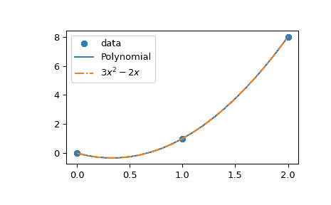

# `scipy.interpolate.lagrange`

> 原文链接：[`docs.scipy.org/doc/scipy-1.12.0/reference/generated/scipy.interpolate.lagrange.html#scipy.interpolate.lagrange`](https://docs.scipy.org/doc/scipy-1.12.0/reference/generated/scipy.interpolate.lagrange.html#scipy.interpolate.lagrange)

```py
scipy.interpolate.lagrange(x, w)
```

返回 Lagrange 插值多项式。

给定两个 1-D 数组*x*和*w*，返回通过点*(x, w)*的 Lagrange 插值多项式。

警告：此实现在数值上不稳定。即使选择了最佳点，也不要期望能够使用超过大约 20 个点。

参数：

**x**array_like

*x*代表一组数据点的 x 坐标。

**w**array_like

*w*代表一组数据点的 y 坐标，即，f(*x*)。

返回：

**lagrange**[`numpy.poly1d`](https://numpy.org/devdocs/reference/generated/numpy.poly1d.html#numpy.poly1d "(在 NumPy v2.0.dev0 中)") 实例

Lagrange 插值多项式。

示例

通过 3 个点插值\(f(x) = x³\)。

```py
>>> import numpy as np
>>> from scipy.interpolate import lagrange
>>> x = np.array([0, 1, 2])
>>> y = x**3
>>> poly = lagrange(x, y) 
```

由于只有 3 个点，Lagrange 多项式的次数为 2。具体地，它由以下公式给出：

\[\begin{split}\begin{aligned} L(x) &= 1\times \frac{x (x - 2)}{-1} + 8\times \frac{x (x-1)}{2} \\ &= x (-2 + 3x) \end{aligned}\end{split}\]

```py
>>> from numpy.polynomial.polynomial import Polynomial
>>> Polynomial(poly.coef[::-1]).coef
array([ 0., -2.,  3.]) 
```

```py
>>> import matplotlib.pyplot as plt
>>> x_new = np.arange(0, 2.1, 0.1)
>>> plt.scatter(x, y, label='data')
>>> plt.plot(x_new, Polynomial(poly.coef[::-1])(x_new), label='Polynomial')
>>> plt.plot(x_new, 3*x_new**2 - 2*x_new + 0*x_new,
...          label=r"$3 x² - 2 x$", linestyle='-.')
>>> plt.legend()
>>> plt.show() 
```


