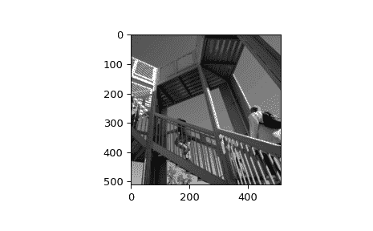

# `scipy.misc.ascent`

> 原文链接：[`docs.scipy.org/doc/scipy-1.12.0/reference/generated/scipy.misc.ascent.html#scipy.misc.ascent`](https://docs.scipy.org/doc/scipy-1.12.0/reference/generated/scipy.misc.ascent.html#scipy.misc.ascent)

```py
scipy.misc.ascent()
```

获取一个便于演示的 8 位灰度深度，512 x 512 像素的图像

该图像来源于[`www.public-domain-image.com/people-public-domain-images-pictures/`](http://www.public-domain-image.com/people-public-domain-images-pictures/)

自 1.10.0 版本起已弃用：`ascent`在 SciPy 1.10.0 中已从`scipy.misc.ascent`中弃用，并将在 SciPy 1.12.0 中完全移除。数据集方法已移至`scipy.datasets`模块。请改用`scipy.datasets.ascent`。

参数：

**None**

返回:

**ascent**ndarray

用于测试和演示的便利图像

示例

```py
>>> import scipy.misc
>>> ascent = scipy.misc.ascent()
>>> ascent.shape
(512, 512)
>>> ascent.max()
255 
```

```py
>>> import matplotlib.pyplot as plt
>>> plt.gray()
>>> plt.imshow(ascent)
>>> plt.show() 
```


