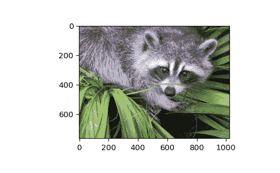

# `scipy.misc.face`

> 原文：[`docs.scipy.org/doc/scipy-1.12.0/reference/generated/scipy.misc.face.html#scipy.misc.face`](https://docs.scipy.org/doc/scipy-1.12.0/reference/generated/scipy.misc.face.html#scipy.misc.face)

```py
scipy.misc.face(gray=False)
```

获得一张大小为 1024 x 768 的浣熊脸的彩色图像。

在 [`www.public-domain-image.com`](http://www.public-domain-image.com) 上的 raccoon-procyon-lotor.jpg

自版本 1.10.0 起弃用：`face` 已从 SciPy 1.10.0 的 `scipy.misc.face` 中弃用，并将在 SciPy 1.12.0 中完全移除。数据集方法已迁移到 `scipy.datasets` 模块。请使用 `scipy.datasets.face` 替代。

参数：

**gray**bool，可选

如果为 True，则返回 8 位灰度图像，否则返回彩色图像

返回：

**face**ndarray

浣熊脸的图像

示例

```py
>>> import scipy.misc
>>> face = scipy.misc.face()
>>> face.shape
(768, 1024, 3)
>>> face.max()
255
>>> face.dtype
dtype('uint8') 
```

```py
>>> import matplotlib.pyplot as plt
>>> plt.gray()
>>> plt.imshow(face)
>>> plt.show() 
```


