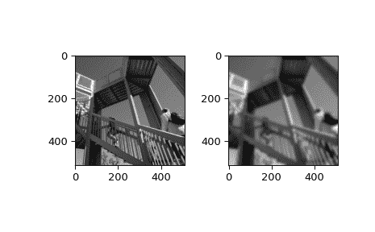

# `scipy.ndimage.gaussian_filter`

> 原文链接：[`docs.scipy.org/doc/scipy-1.12.0/reference/generated/scipy.ndimage.gaussian_filter.html#scipy.ndimage.gaussian_filter`](https://docs.scipy.org/doc/scipy-1.12.0/reference/generated/scipy.ndimage.gaussian_filter.html#scipy.ndimage.gaussian_filter)

```py
scipy.ndimage.gaussian_filter(input, sigma, order=0, output=None, mode='reflect', cval=0.0, truncate=4.0, *, radius=None, axes=None)
```

多维高斯滤波器。

参数：

**输入**array_like

输入数组。

**sigma**标量或标量序列

高斯核的标准偏差。高斯滤波器的标准偏差作为序列给出，或作为单个数字，此时对于所有轴都是相等的。

**顺序**整数或整数序列，可选

每个轴上的滤波器顺序以整数序列或单个数字给出。顺序为 0 对应于使用高斯核的卷积。正数顺序对应于与高斯导数的卷积。

**输出**数组或 dtype，可选

要放置输出的数组，或返回数组的 dtype。默认情况下，将创建与输入相同 dtype 的数组。

**模式**字符串或序列，可选

当滤波器重叠边界时，*mode*参数决定如何扩展输入数组。通过传递与输入数组维数相等的模式序列，可以指定每个轴上的不同模式。默认值为‘reflect’。有效的值及其行为如下：

‘reflect’ (*d c b a | a b c d | d c b a*)

输入通过关于最后一个像素边缘的反射进行扩展。此模式有时也称为半样本对称。

‘constant’ (*k k k k | a b c d | k k k k*)

输入通过填充超出边缘的所有值来扩展，填充值由*cval*参数定义。

‘nearest’ (*a a a a | a b c d | d d d d*)

输入通过复制最后一个像素来扩展。

‘mirror’ (*d c b | a b c d | c b a*)

输入通过关于最后一个像素中心的反射进行扩展。此模式有时也称为全样本对称。

‘wrap’ (*a b c d | a b c d | a b c d*)

输入通过包裹到对立边缘来扩展。

为了与插值函数保持一致，还可以使用以下模式名称：

‘grid-constant’

这是“constant”的同义词。

‘grid-mirror’

这是“reflect”的同义词。

‘grid-wrap’

这是“wrap”的同义词。

**cval**标量，可选

如果*mode*为‘constant’，则填充输入边缘之外的值。默认为 0.0。

**截断**浮点数，可选

在此标准偏差截断滤波器。默认为 4.0。

**半径**None 或整数或整数序列，可选

高斯核的半径。半径作为序列给出，或作为单个数字，此时对于所有轴都是相等的。如果指定，则沿每个轴的核大小将为`2*radius + 1`，*truncate*将被忽略。默认为 None。

**轴**整数元组或 None，可选

如果为 None，则 *input* 沿所有轴进行滤波。否则，将沿指定轴进行滤波。当指定 *axes* 时，用于 *sigma*、*order*、*mode* 和/或 *radius* 的任何元组必须与 *axes* 的长度相匹配。这些元组中的第 i 个条目对应于 *axes* 中的第 i 个条目。

返回：

**gaussian_filter**ndarray

返回形状与 *input* 相同的数组。

注释

多维滤波器实现为一系列 1-D 卷积滤波器。中间数组以与输出相同的数据类型存储。因此，对于具有有限精度的输出类型，由于中间结果可能存储不足的精度，结果可能不精确。

高斯核在每个轴向上的大小为`2*radius + 1`。如果 *radius* 为 None，则默认使用 `radius = round(truncate * sigma)`。

示例

```py
>>> from scipy.ndimage import gaussian_filter
>>> import numpy as np
>>> a = np.arange(50, step=2).reshape((5,5))
>>> a
array([[ 0,  2,  4,  6,  8],
 [10, 12, 14, 16, 18],
 [20, 22, 24, 26, 28],
 [30, 32, 34, 36, 38],
 [40, 42, 44, 46, 48]])
>>> gaussian_filter(a, sigma=1)
array([[ 4,  6,  8,  9, 11],
 [10, 12, 14, 15, 17],
 [20, 22, 24, 25, 27],
 [29, 31, 33, 34, 36],
 [35, 37, 39, 40, 42]]) 
```

```py
>>> from scipy import datasets
>>> import matplotlib.pyplot as plt
>>> fig = plt.figure()
>>> plt.gray()  # show the filtered result in grayscale
>>> ax1 = fig.add_subplot(121)  # left side
>>> ax2 = fig.add_subplot(122)  # right side
>>> ascent = datasets.ascent()
>>> result = gaussian_filter(ascent, sigma=5)
>>> ax1.imshow(ascent)
>>> ax2.imshow(result)
>>> plt.show() 
```


