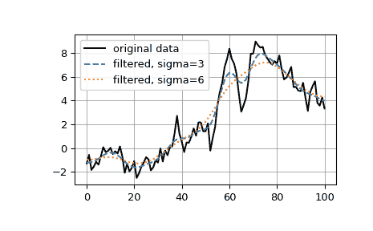

# `scipy.ndimage.gaussian_filter1d`

> 原始文本：[`docs.scipy.org/doc/scipy-1.12.0/reference/generated/scipy.ndimage.gaussian_filter1d.html#scipy.ndimage.gaussian_filter1d`](https://docs.scipy.org/doc/scipy-1.12.0/reference/generated/scipy.ndimage.gaussian_filter1d.html#scipy.ndimage.gaussian_filter1d)

```py
scipy.ndimage.gaussian_filter1d(input, sigma, axis=-1, order=0, output=None, mode='reflect', cval=0.0, truncate=4.0, *, radius=None)
```

1-D 高斯滤波器。

参数：

**input**array_like

输入数组。

**sigma**scalar

高斯核的标准差。

**axis**int，可选

*input*沿其计算的轴。默认值为-1。

**order**int，可选

顺序为 0 对应于与高斯核卷积。正序对应于高斯的那个导数的卷积。

**output**array 或 dtype，可选

放置输出的数组，或者返回数组的 dtype。默认情况下，将创建与输入相同 dtype 的数组。

**mode**{‘reflect’, ‘constant’, ‘nearest’, ‘mirror’, ‘wrap’}，可选

*mode*参数确定如何扩展输入数组超出其边界。默认值为‘reflect’。每个有效值的行为如下：

‘reflect’ (*d c b a | a b c d | d c b a*)

输入通过反射最后一个像素的边界来扩展。此模式有时也称为半样本对称。

‘constant’ (*k k k k | a b c d | k k k k*)

输入通过使用与*cval*参数定义的相同常数值填充边缘以扩展。

‘nearest’ (*a a a a | a b c d | d d d d*)

输入通过复制最后一个像素来扩展。

‘mirror’ (*d c b | a b c d | c b a*)

输入通过反射最后一个像素的中心来扩展。此模式有时也称为整样本对称。

‘wrap’ (*a b c d | a b c d | a b c d*)

输入通过环绕到相反边缘来扩展。

为了与插值函数保持一致，还可以使用以下模式名称：

‘grid-mirror’

这是“reflect”的同义词。

‘grid-constant’

这是“constant”的同义词。

‘grid-wrap’

这是“wrap”的同义词。

**cval**scalar，可选

如果*mode*为‘constant’，则填充输入边缘之外的值。默认值为 0.0。

**truncate**float，可选

在此标准差处截断滤波器。默认值为 4.0。

**radius**None 或 int，可选

高斯核的半径。如果指定，核的大小将为`2*radius + 1`，*truncate*将被忽略。默认值为 None。

返回：

**gaussian_filter1d**ndarray

注意事项

高斯核沿每个轴的大小将为`2*radius + 1`。如果*radius*为 None，则使用默认值`radius = round(truncate * sigma)`。

示例

```py
>>> from scipy.ndimage import gaussian_filter1d
>>> import numpy as np
>>> gaussian_filter1d([1.0, 2.0, 3.0, 4.0, 5.0], 1)
array([ 1.42704095,  2.06782203,  3\.        ,  3.93217797,  4.57295905])
>>> gaussian_filter1d([1.0, 2.0, 3.0, 4.0, 5.0], 4)
array([ 2.91948343,  2.95023502,  3\.        ,  3.04976498,  3.08051657])
>>> import matplotlib.pyplot as plt
>>> rng = np.random.default_rng()
>>> x = rng.standard_normal(101).cumsum()
>>> y3 = gaussian_filter1d(x, 3)
>>> y6 = gaussian_filter1d(x, 6)
>>> plt.plot(x, 'k', label='original data')
>>> plt.plot(y3, '--', label='filtered, sigma=3')
>>> plt.plot(y6, ':', label='filtered, sigma=6')
>>> plt.legend()
>>> plt.grid()
>>> plt.show() 
```


