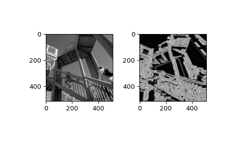

# `scipy.ndimage.gaussian_gradient_magnitude`

> 原文链接：[`docs.scipy.org/doc/scipy-1.12.0/reference/generated/scipy.ndimage.gaussian_gradient_magnitude.html#scipy.ndimage.gaussian_gradient_magnitude`](https://docs.scipy.org/doc/scipy-1.12.0/reference/generated/scipy.ndimage.gaussian_gradient_magnitude.html#scipy.ndimage.gaussian_gradient_magnitude)

```py
scipy.ndimage.gaussian_gradient_magnitude(input, sigma, output=None, mode='reflect', cval=0.0, **kwargs)
```

使用高斯导数的多维梯度幅度。

参数：

**input**array_like

输入数组。

**sigma**标量或标量序列

高斯滤波器的标准偏差分别给出每个轴作为序列，或作为一个单一的数字，其中它对所有轴是相等的。

**output**数组或 dtype，可选

放置输出的数组，或返回数组的 dtype。默认情况下，将创建与输入相同 dtype 的数组。

**mode**str 或序列，可选

*mode*参数确定在过滤器重叠边界时如何扩展输入数组。通过传递与输入数组维数相等长度的模式序列，可以指定每个轴上的不同模式。默认值为‘reflect’。有效值及其行为如下：

‘reflect’ (*d c b a | a b c d | d c b a*)

输入通过关于最后一个像素边缘的反射来扩展。有时这种模式也称为半样本对称。

‘constant’ (*k k k k | a b c d | k k k k*)

输入通过用由*cval*参数定义的相同常量值填充边缘之外的所有值来扩展。

‘nearest’ (*a a a a | a b c d | d d d d*)

输入通过复制最后一个像素来扩展。

‘mirror’ (*d c b | a b c d | c b a*)

输入通过关于最后一个像素中心的反射来扩展。有时这种模式也称为整体样本对称。

‘wrap’ (*a b c d | a b c d | a b c d*)

输入通过环绕到相对的边缘来扩展。

为了与插值函数保持一致，以下模式名称也可以使用：

‘grid-constant’

这是‘constant’的同义词。

‘grid-mirror’

这是‘reflect’的同义词。

‘grid-wrap’

这是‘wrap’的同义词。

**cval**标量，可选

如果*mode*为‘constant’，用来填充输入边缘之外的值。默认值为 0.0。

**额外的关键字参数将传递给 gaussian_filter()。**

返回：

**gaussian_gradient_magnitude**ndarray

过滤后的数组。与*input*具有相同的形状。

示例

```py
>>> from scipy import ndimage, datasets
>>> import matplotlib.pyplot as plt
>>> fig = plt.figure()
>>> plt.gray()  # show the filtered result in grayscale
>>> ax1 = fig.add_subplot(121)  # left side
>>> ax2 = fig.add_subplot(122)  # right side
>>> ascent = datasets.ascent()
>>> result = ndimage.gaussian_gradient_magnitude(ascent, sigma=5)
>>> ax1.imshow(ascent)
>>> ax2.imshow(result)
>>> plt.show() 
```


