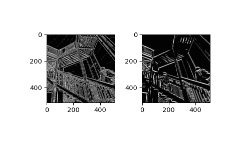

# `scipy.ndimage.gaussian_laplace`

> 原始文档：[`docs.scipy.org/doc/scipy-1.12.0/reference/generated/scipy.ndimage.gaussian_laplace.html#scipy.ndimage.gaussian_laplace`](https://docs.scipy.org/doc/scipy-1.12.0/reference/generated/scipy.ndimage.gaussian_laplace.html#scipy.ndimage.gaussian_laplace)

```py
scipy.ndimage.gaussian_laplace(input, sigma, output=None, mode='reflect', cval=0.0, **kwargs)
```

使用高斯二阶导数的多维拉普拉斯滤波器。

参数：

**input** array_like

输入数组。

**sigma** 标量或标量序列

高斯滤波器的标准差以序列的形式给出，或者作为单个数字，此时对所有轴都是相等的。

**output** array 或 dtype，可选

用于放置输出的数组，或者返回数组的数据类型。默认情况下，将创建与输入相同数据类型的数组。

**mode**str 或者序列，可选

*mode* 参数决定了当滤波器重叠边界时如何扩展输入数组。通过传递与输入数组维度数目相等长度的模式序列，可以指定沿每个轴的不同模式。默认值是“reflect”。有效的值及其行为如下：

‘reflect’（*d c b a | a b c d | d c b a*）

输入通过关于最后一个像素边缘的反射进行扩展。有时也称为半样本对称模式。

‘constant’（*k k k k | a b c d | k k k k*）

输入通过使用由*cval*参数定义的相同常量值填充超出边缘的所有值进行扩展。

‘nearest’（*a a a a | a b c d | d d d d*）

输入通过复制最后一个像素进行扩展。

‘mirror’（*d c b | a b c d | c b a*）

输入通过关于最后一个像素中心的反射进行扩展。有时也称为全样本对称模式。

‘wrap’（*a b c d | a b c d | a b c d*）

输入通过围绕到相反边缘进行扩展。

为了与插值函数保持一致，还可以使用以下模式名称：

‘grid-constant’

这是“constant”的同义词。

‘grid-mirror’

这是“reflect”的同义词。

‘grid-wrap’

这是“wrap”的同义词。

**cval**标量，可选

如果*mode*为‘constant’，则用于填充输入超出边缘的值。默认值为 0.0。

**额外的关键字参数将被传递给 gaussian_filter()。**

返回：

**gaussian_laplace** ndarray

过滤后的数组。与*input*具有相同的形状。

示例

```py
>>> from scipy import ndimage, datasets
>>> import matplotlib.pyplot as plt
>>> ascent = datasets.ascent() 
```

```py
>>> fig = plt.figure()
>>> plt.gray()  # show the filtered result in grayscale
>>> ax1 = fig.add_subplot(121)  # left side
>>> ax2 = fig.add_subplot(122)  # right side 
```

```py
>>> result = ndimage.gaussian_laplace(ascent, sigma=1)
>>> ax1.imshow(result) 
```

```py
>>> result = ndimage.gaussian_laplace(ascent, sigma=3)
>>> ax2.imshow(result)
>>> plt.show() 
```


