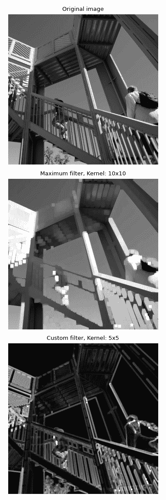

# `scipy.ndimage.generic_filter`

> 原文：[`docs.scipy.org/doc/scipy-1.12.0/reference/generated/scipy.ndimage.generic_filter.html#scipy.ndimage.generic_filter`](https://docs.scipy.org/doc/scipy-1.12.0/reference/generated/scipy.ndimage.generic_filter.html#scipy.ndimage.generic_filter)

```py
scipy.ndimage.generic_filter(input, function, size=None, footprint=None, output=None, mode='reflect', cval=0.0, origin=0, extra_arguments=(), extra_keywords=None)
```

使用给定函数计算多维滤波器。

在每个元素处调用提供的函数。在该元素处的滤波器足迹内的输入值作为双值数组传递给函数。

参数：

**input**类似数组

输入数组。

**function**{callable, scipy.LowLevelCallable}

在每个元素上应用的函数。

**size**标量或元组，可选

见 footprint，如果给出了 footprint，则忽略。

**footprint**数组，可选

必须定义*size*或*footprint*之一。*size*表示从输入数组中的每个元素位置获取的形状，以定义滤波器函数的输入。*footprint*是一个布尔数组，隐式指定了一个形状，但也指定了该形状内部哪些元素将传递给滤波器函数。因此，`size=(n,m)`等同于`footprint=np.ones((n,m))`。我们根据输入数组的维数调整*size*，因此如果输入数组形状为(10,10,10)，而*size*为 2，则使用的实际大小为(2,2,2)。如果给定了*footprint*，则*size*将被忽略。

**output**数组或 dtype，可选

放置输出的数组或返回数组的 dtype，可选，默认情况下将创建与输入相同 dtype 的数组。

**mode**{‘reflect’, ‘constant’, ‘nearest’, ‘mirror’, ‘wrap’}，可选

*mode*参数决定如何扩展输入数组超出其边界的方式。默认为‘reflect’。每个有效值的行为如下：

‘reflect’ (*d c b a | a b c d | d c b a*)

通过反射关于最后一个像素的边界来扩展输入。此模式有时也称为半样本对称。

‘constant’ (*k k k k | a b c d | k k k k*)

通过填充所有超出边缘的值来扩展输入，填充值由*cval*参数定义。

‘nearest’ (*a a a a | a b c d | d d d d*)

通过复制最后一个像素来扩展输入。

‘mirror’ (*d c b | a b c d | c b a*)

通过关于最后一个像素中心的反射来扩展输入。此模式有时也称为全样本对称。

‘wrap’ (*a b c d | a b c d | a b c d*)

通过环绕到相对边缘来扩展输入。

为了与插值函数保持一致，还可以使用以下模式名称：

‘grid-mirror’

这是‘reflect’的同义词。

‘grid-constant’

这是‘constant’的同义词。

‘grid-wrap’

这是‘wrap’的同义词。

**cval**标量，可选

如果*mode*为‘constant’，则用于填充输入边缘的值。默认为 0.0。

**origin**整数或序列，可选

控制滤波器在输入数组像素上的放置。值为 0（默认）将滤波器居中在像素上，正值将滤波器向左移动，负值将其向右移动。通过传递长度等于输入数组维数的起源序列，可以指定每个轴上的不同移位。

**extra_arguments**sequence, optional

需要传递给传递函数的额外位置参数的序列。

**extra_keywords**dict, optional

需要传递给传递函数的额外关键字参数的字典。

返回：

**generic_filter**ndarray

过滤后的数组。形状与*input*相同。

注释

此函数还接受具有以下签名之一的低级回调函数，并包装在[`scipy.LowLevelCallable`](https://scipy.LowLevelCallable.html#scipy.LowLevelCallable "scipy.LowLevelCallable")中：

```py
int  callback(double  *buffer,  npy_intp  filter_size,
  double  *return_value,  void  *user_data)
int  callback(double  *buffer,  intptr_t  filter_size,
  double  *return_value,  void  *user_data) 
```

调用函数在输入和输出数组的元素上进行迭代，每个元素调用回调函数。当前元素处于滤波器足迹内的元素通过`buffer`参数传递，足迹内元素的数量通过`filter_size`传递。计算得到的值在`return_value`中返回。`user_data`作为[`scipy.LowLevelCallable`](https://scipy.LowLevelCallable.html#scipy.LowLevelCallable "scipy.LowLevelCallable")的数据指针提供。

回调函数必须返回整数错误状态，如果出现问题则为零，否则为一。如果发生错误，通常应在返回之前设置 Python 错误状态并附上信息，否则调用函数会设置默认错误消息。

此外，还接受一些其他低级函数指针规范，但这些仅用于向后兼容，不应在新代码中使用。

示例

导入必要的模块并加载用于过滤的示例图像。

```py
>>> import numpy as np
>>> from scipy import datasets
>>> from scipy.ndimage import generic_filter
>>> import matplotlib.pyplot as plt
>>> ascent = datasets.ascent() 
```

通过将简单的 NumPy 聚合函数作为*function*的参数来计算大小为 10 的最大滤波器。

```py
>>> maximum_filter_result = generic_filter(ascent, np.amax, [10, 10]) 
```

虽然也可以直接使用[`maximum_filter`](https://scipy.ndimage.maximum_filter.html#scipy.ndimage.maximum_filter "scipy.ndimage.maximum_filter")获取最大滤波器，但`generic_filter`允许使用通用 Python 函数或[`scipy.LowLevelCallable`](https://scipy.LowLevelCallable.html#scipy.LowLevelCallable "scipy.LowLevelCallable")作为滤波器。在这里，我们计算了大小为 5 的核的最大值和最小值之间的范围作为示例。

```py
>>> def custom_filter(image):
...     return np.amax(image) - np.amin(image)
>>> custom_filter_result = generic_filter(ascent, custom_filter, [5, 5]) 
```

绘制原始和过滤后的图像。

```py
>>> fig, axes = plt.subplots(3, 1, figsize=(4, 12))
>>> plt.gray()  # show the filtered result in grayscale
>>> top, middle, bottom = axes
>>> for ax in axes:
...     ax.set_axis_off()  # remove coordinate system
>>> top.imshow(ascent)
>>> top.set_title("Original image")
>>> middle.imshow(maximum_filter_result)
>>> middle.set_title("Maximum filter, Kernel: 10x10")
>>> bottom.imshow(custom_filter_result)
>>> bottom.set_title("Custom filter, Kernel: 5x5")
>>> fig.tight_layout() 
```


