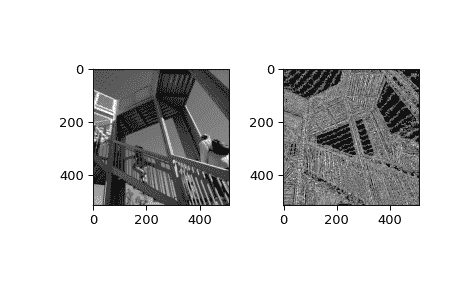

# `scipy.ndimage.laplace`

> 原始文本：[`docs.scipy.org/doc/scipy-1.12.0/reference/generated/scipy.ndimage.laplace.html#scipy.ndimage.laplace`](https://docs.scipy.org/doc/scipy-1.12.0/reference/generated/scipy.ndimage.laplace.html#scipy.ndimage.laplace)

```py
scipy.ndimage.laplace(input, output=None, mode='reflect', cval=0.0)
```

基于近似二阶导数的 N 维拉普拉斯滤波器。

参数：

**输入**array_like

输入数组。

**输出**数组或 dtype，可选项。

放置输出的数组，或返回数组的 dtype。默认情况下，将创建与输入相同 dtype 的数组。

**模式**str 或序列，可选项。

*mode*参数确定滤波器重叠边界时如何扩展输入数组。通过传递与输入数组维数相等长度的模式序列，可以指定每个轴上的不同模式。默认值为'reflect'。有效的值及其行为如下：

‘reflect’（*d c b a | a b c d | d c b a*）

输入通过关于最后一个像素边缘的反射进行扩展。此模式有时也称为半样本对称。

‘constant’（*k k k k | a b c d | k k k k*）

输入通过使用由*cval*参数定义的相同常量值填充超出边缘的所有值进行扩展。

‘nearest’（*a a a a | a b c d | d d d d*）

输入通过复制最后一个像素进行扩展。

‘mirror’（*d c b | a b c d | c b a*）

输入通过关于最后一个像素中心的反射进行扩展。此模式有时也称为整体样本对称。

‘wrap’（*a b c d | a b c d | a b c d*）

输入被绕到相对边缘以扩展。

为了与插值函数保持一致，以下模式名称也可以使用：

‘grid-constant’

这是‘constant’的同义词。

‘grid-mirror’

这是‘reflect’的同义词。

‘grid-wrap’

这是‘wrap’的同义词。

**cval**标量，可选项

如果*mode*为'constant'，则用于填充输入的过去边缘的值。默认为 0.0。

返回：

**拉普拉斯**ndarray

过滤后的数组。与*input*具有相同的形状。

示例

```py
>>> from scipy import ndimage, datasets
>>> import matplotlib.pyplot as plt
>>> fig = plt.figure()
>>> plt.gray()  # show the filtered result in grayscale
>>> ax1 = fig.add_subplot(121)  # left side
>>> ax2 = fig.add_subplot(122)  # right side
>>> ascent = datasets.ascent()
>>> result = ndimage.laplace(ascent)
>>> ax1.imshow(ascent)
>>> ax2.imshow(result)
>>> plt.show() 
```


