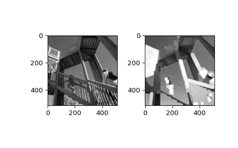

# `scipy.ndimage.maximum_filter`

> 原文链接：[`docs.scipy.org/doc/scipy-1.12.0/reference/generated/scipy.ndimage.maximum_filter.html#scipy.ndimage.maximum_filter`](https://docs.scipy.org/doc/scipy-1.12.0/reference/generated/scipy.ndimage.maximum_filter.html#scipy.ndimage.maximum_filter)

```py
scipy.ndimage.maximum_filter(input, size=None, footprint=None, output=None, mode='reflect', cval=0.0, origin=0, *, axes=None)
```

计算多维最大滤波器。

参数：

**input**类似数组

输入数组。

**size**标量或元组，可选

请参见下面的 footprint。如果给定 footprint，则忽略。

**footprint**数组，可选

必须定义*size*或*footprint*之一。*size*给出从输入数组中的每个元素位置取得的形状，以定义滤波器函数的输入。*footprint*是一个布尔数组，指定（隐式地）一个形状，以及将传递给滤波器函数的这个形状中的元素。因此，`size=(n,m)`等同于`footprint=np.ones((n,m))`。我们将*size*调整为输入数组的维数，因此，如果输入数组形状为(10,10,10)，而*size*为 2，则使用的实际大小为(2,2,2)。当给定*footprint*时，将忽略*size*。

**output**数组或 dtype，可选

输出数组的位置或返回数组的 dtype。默认情况下将创建与输入相同 dtype 的数组。

**mode**字符串或序列，可选

*mode*参数确定滤波器在重叠边界时如何扩展输入数组。通过传递与输入数组维度数相等长度的模式序列，可以沿每个轴指定不同的模式。默认值为‘反射’。有效值及其行为如下：

‘反射’ (*d c b a | a b c d | d c b a*)

通过关于最后像素边缘的反射来扩展输入。此模式有时也称为半样本对称。

‘常量’ (*k k k k | a b c d | k k k k*)

通过使用由*cval*参数定义的相同常数值填充超出边缘的所有值来扩展输入。

‘最近邻’ (*a a a a | a b c d | d d d d*)

通过复制最后一个像素来扩展输入。

‘镜像’ (*d c b | a b c d | c b a*)

通过关于最后像素中心的反射来扩展输入。此模式有时也称为整体样本对称。

‘包裹’ (*a b c d | a b c d | a b c d*)

通过包裹到相反边缘来扩展输入。

为了与插值函数保持一致，还可以使用以下模式名称：

‘网格常量’

这是“常量”的同义词。

‘网格镜像’

这是“反射”的同义词。

‘网格包裹’

这是“包裹”的同义词。

**cval**标量，可选

如果*mode*为‘常量’，则用来填充输入边缘之外的值。默认为 0.0。

**origin**整数或序列，可选

控制滤波器在输入数组像素上的放置位置。值为 0（默认）将滤波器居中在像素上，正值将滤波器向左移动，负值则向右移动。通过传递长度等于输入数组维度数量的起源序列，可以沿每个轴指定不同的移位。

**轴**整数或 None 的元组，可选

如果为 None，则在所有轴上对*input*进行过滤。否则，在指定的轴上对*input*进行过滤。当指定*axes*时，用于*size*、*origin*和/或*mode*的任何元组必须与*axes*的长度匹配。这些元组中的第 i 个条目对应于*axes*中的第 i 个条目。

返回：

**maximum_filter**ndarray

过滤后的数组。形状与*input*相同。

注意

一系列模式（每个轴一个）仅在脚印可分离时受支持。否则，必须提供单个模式字符串。

示例

```py
>>> from scipy import ndimage, datasets
>>> import matplotlib.pyplot as plt
>>> fig = plt.figure()
>>> plt.gray()  # show the filtered result in grayscale
>>> ax1 = fig.add_subplot(121)  # left side
>>> ax2 = fig.add_subplot(122)  # right side
>>> ascent = datasets.ascent()
>>> result = ndimage.maximum_filter(ascent, size=20)
>>> ax1.imshow(ascent)
>>> ax2.imshow(result)
>>> plt.show() 
```


