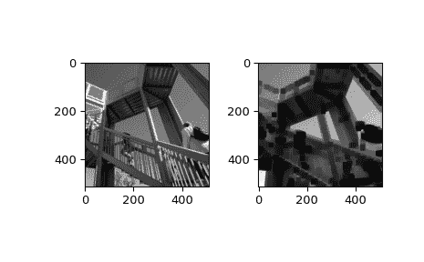

# `scipy.ndimage.minimum_filter`

> 原文：[`docs.scipy.org/doc/scipy-1.12.0/reference/generated/scipy.ndimage.minimum_filter.html#scipy.ndimage.minimum_filter`](https://docs.scipy.org/doc/scipy-1.12.0/reference/generated/scipy.ndimage.minimum_filter.html#scipy.ndimage.minimum_filter)

```py
scipy.ndimage.minimum_filter(input, size=None, footprint=None, output=None, mode='reflect', cval=0.0, origin=0, *, axes=None)
```

计算多维最小滤波器。

参数：

**input**类数组

输入数组。

**size**标量或元组，可选

参见 footprint。如果给定了 footprint，则忽略 origin。

**footprint**数组，可选

必须定义*size*或*footprint*之一。*size*给出从输入数组中的每个元素位置获取形状，以定义滤波器函数的输入的形状。*footprint*是一个布尔数组，隐式指定形状，但也指定这个形状内哪些元素将传递给滤波器函数。因此，*size=(n,m)*等同于*footprint=np.ones((n,m))*。我们调整*size*以适应输入数组的维数，因此，如果输入数组形状为(10,10,10)，而*size*为 2，则使用的实际大小为(2,2,2)。给定*footprint*时，*size*将被忽略。

**output**数组或数据类型，可选

用于放置输出的数组或返回数组的数据类型。默认情况下，将创建与输入相同数据类型的数组。

**mode**字符串或序列，可选

*mode*参数确定滤波器在过滤器与边界重叠时如何扩展输入数组。通过传递与输入数组维数相同长度的模式序列，可以指定每个轴上的不同模式。默认值为‘reflect’。有效值及其行为如下：

‘reflect’（*d c b a | a b c d | d c b a*）

输入通过关于最后一个像素边缘的反射进行扩展。有时也称为半样本对称模式。

‘constant’（*k k k k | a b c d | k k k k*）

输入通过用由*cval*参数定义的相同常数值填充边缘之外的所有值进行扩展。

‘nearest’（*a a a a | a b c d | d d d d*）

输入通过复制最后一个像素进行扩展。

‘mirror’（*d c b | a b c d | c b a*）

输入通过关于最后一个像素中心的反射进行扩展。有时也称为整体样本对称模式。

‘wrap’（*a b c d | a b c d | a b c d*）

输入通过绕到相对边缘进行扩展。

为了与插值函数保持一致，还可以使用以下模式名称：

‘grid-constant’

这是‘constant’的同义词。

‘grid-mirror’

这是‘reflect’的同义词。

‘grid-wrap’

这是‘wrap’的同义词。

**cval**标量，可选

如果*mode*为‘constant’，则用于填充输入边缘之外的值。默认值为 0.0。

**origin**整数或序列，可选

控制滤波器放置在输入数组像素上的位置。值为 0（默认）将滤波器居中于像素上，正值将滤波器向左移动，负值向右移动。通过传递长度等于输入数组维数的起源序列，可以指定每个轴上的不同移位。

**axes**整数或 None 的元组，可选

如果为 None，则*input*沿所有轴进行过滤。否则，*input*沿指定的轴进行过滤。当指定了*axes*时，用于*size*、*origin*和/或*mode*的任何元组必须与*axes*的长度匹配。这些元组中的第 i 个条目对应于*axes*中的第 i 个条目。

返回：

**minimum_filter** ndarray

过滤后的数组。与*input*具有相同的形状。

注意事项

仅当足迹是可分离的时，才支持一系列模式（每个轴一个）。否则，必须提供单个模式字符串。

示例

```py
>>> from scipy import ndimage, datasets
>>> import matplotlib.pyplot as plt
>>> fig = plt.figure()
>>> plt.gray()  # show the filtered result in grayscale
>>> ax1 = fig.add_subplot(121)  # left side
>>> ax2 = fig.add_subplot(122)  # right side
>>> ascent = datasets.ascent()
>>> result = ndimage.minimum_filter(ascent, size=20)
>>> ax1.imshow(ascent)
>>> ax2.imshow(result)
>>> plt.show() 
```


