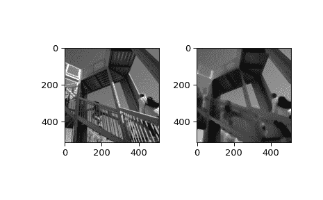

# `scipy.ndimage.percentile_filter`

> 原文：[`docs.scipy.org/doc/scipy-1.12.0/reference/generated/scipy.ndimage.percentile_filter.html#scipy.ndimage.percentile_filter`](https://docs.scipy.org/doc/scipy-1.12.0/reference/generated/scipy.ndimage.percentile_filter.html#scipy.ndimage.percentile_filter)

```py
scipy.ndimage.percentile_filter(input, percentile, size=None, footprint=None, output=None, mode='reflect', cval=0.0, origin=0, *, axes=None)
```

计算多维百分位数滤波器。

参数：

**输入**array_like

输入数组。

**percentile**标量

百分位参数可能小于零，即百分位=-20 等同于百分位=80

**size**标量或元组，可选

参见下面的 footprint。如果给定了 footprint，则忽略此参数。

**footprint**数组，可选

必须定义*size*或*footprint*中的一个。*size*给出从输入数组中的每个元素位置取出的形状，以定义滤波函数的输入。*footprint*是一个布尔数组，隐式指定了一个形状，同时也指定了将传递给滤波函数的这些形状内的元素。因此，`size=(n,m)`等同于`footprint=np.ones((n,m))`。我们调整*size*以适应输入数组的维数，因此，如果输入数组的形状为(10,10,10)，而*size*为 2，则使用的实际大小为(2,2,2)。当给定*footprint*时，将忽略*size*。

**输出**数组或 dtype，可选

用于放置输出的数组，或者返回数组的 dtype。默认情况下，将创建与输入相同 dtype 的数组。

**mode**{‘reflect’, ‘constant’, ‘nearest’, ‘mirror’, ‘wrap’}，可选

参数*mode*决定了如何扩展输入数组超出其边界的部分。默认是‘reflect’。每个有效值的行为如下：

‘reflect’（*d c b a | a b c d | d c b a*）

输入通过关于最后一个像素边缘的反射来扩展。这种模式有时也称为半采样对称。

‘constant’（*k k k k | a b c d | k k k k*）

输入通过填充所有超出边缘的值，使用由参数*cval*定义的同一常量值来扩展。

‘nearest’（*a a a a | a b c d | d d d d*）

输入通过复制最后一个像素来扩展。

‘mirror’（*d c b | a b c d | c b a*）

输入通过关于最后一个像素中心的反射来扩展。这种模式有时也称为全样本对称。

‘wrap’（*a b c d | a b c d | a b c d*）

输入通过环绕到相对边缘来扩展。

为了与插值函数保持一致，还可以使用以下模式名称：

‘grid-mirror’

这是‘reflect’的同义词。

‘grid-constant’

这是‘constant’的同义词。

‘grid-wrap’

这是‘wrap’的同义词。

**cval**标量，可选

如果*mode*为‘constant’，则用于填充输入边缘之外的值的值。默认值为 0.0。

**origin**int 或序列，可选

控制滤波器在输入数组像素上的放置。值为 0（默认）将滤波器居中于像素上，正值将滤波器向左移动，负值向右移动。通过传递与输入数组维数相等长度的原点序列，可以在每个轴上指定不同的移动。

**axes**整数元组或 None，可选

如果为 None，*input*在所有轴上进行过滤。否则，*input*沿指定轴进行过滤。

返回：

**percentile_filter**ndarray

过滤后的数组。与*input*具有相同的形状。

示例

```py
>>> from scipy import ndimage, datasets
>>> import matplotlib.pyplot as plt
>>> fig = plt.figure()
>>> plt.gray()  # show the filtered result in grayscale
>>> ax1 = fig.add_subplot(121)  # left side
>>> ax2 = fig.add_subplot(122)  # right side
>>> ascent = datasets.ascent()
>>> result = ndimage.percentile_filter(ascent, percentile=20, size=20)
>>> ax1.imshow(ascent)
>>> ax2.imshow(result)
>>> plt.show() 
```


