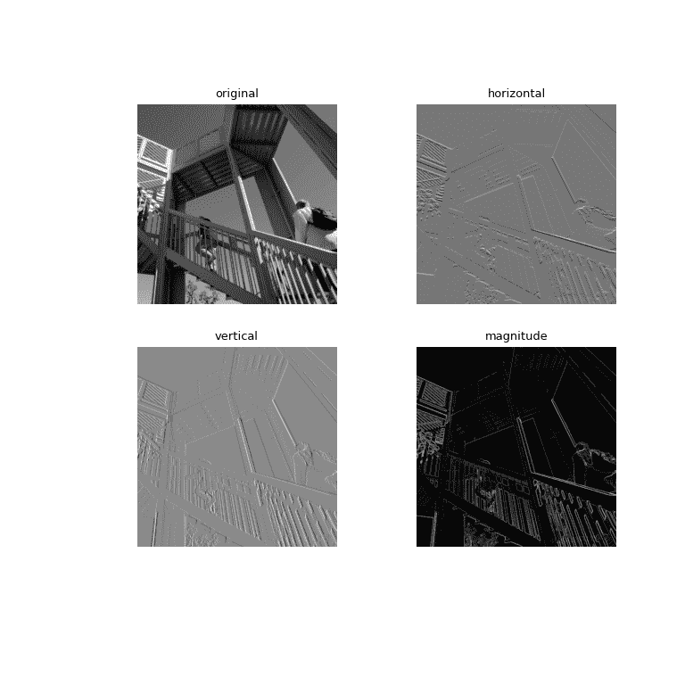

# `scipy.ndimage.sobel`

> 原文：[`docs.scipy.org/doc/scipy-1.12.0/reference/generated/scipy.ndimage.sobel.html#scipy.ndimage.sobel`](https://docs.scipy.org/doc/scipy-1.12.0/reference/generated/scipy.ndimage.sobel.html#scipy.ndimage.sobel)

```py
scipy.ndimage.sobel(input, axis=-1, output=None, mode='reflect', cval=0.0)
```

计算 Sobel 滤波器。

参数：

**input**array_like

输入数组。

**axis**int，可选

*input* 的轴向来计算。默认为 -1。

**output**array 或 dtype，可选

用于放置输出的数组，或者返回数组的 dtype。默认情况下，将创建与输入相同 dtype 的数组。

**mode**str 或序列，可选

*mode* 参数确定当滤波器重叠边界时如何扩展输入数组。通过传递与输入数组维数相等的模式序列，可以指定每个轴向的不同模式。默认值为 ‘reflect’。有效的值及其行为如下：

‘reflect’（*d c b a | a b c d | d c b a*）

输入通过关于最后一个像素边缘的反射进行扩展。这种模式有时也称为半采样对称。

‘constant’（*k k k k | a b c d | k k k k*）

输入通过填充所有超出边缘的值的相同常量值来扩展。

‘nearest’（*a a a a | a b c d | d d d d*）

输入通过复制最后一个像素进行扩展。

‘mirror’（*d c b | a b c d | c b a*）

输入通过关于最后一个像素中心的反射进行扩展。这种模式有时也称为整体样本对称。

‘wrap’（*a b c d | a b c d | a b c d*）

输入通过环绕到相反边缘进行扩展。

为了与插值函数保持一致，还可以使用以下模式名称：

‘grid-constant’

这是 ‘constant’ 的同义词。

‘grid-mirror’

这是 ‘reflect’ 的同义词。

‘grid-wrap’

这是 ‘wrap’ 的同义词。

**cval**标量，可选

如果 *mode* 为 ‘constant’，用于填充输入之外的值。默认为 0.0。

返回：

**sobel**ndarray

过滤后的数组。形状与 *input* 相同。

注意事项

此函数计算特定轴向的 Sobel 梯度。通过水平变换（axis=0）可以突出水平边缘，通过垂直变换（axis=1）可以突出垂直边缘，等等，对于更高维度也是如此。这些可以组合以给出梯度的大小。

示例

```py
>>> from scipy import ndimage, datasets
>>> import matplotlib.pyplot as plt
>>> import numpy as np
>>> ascent = datasets.ascent().astype('int32')
>>> sobel_h = ndimage.sobel(ascent, 0)  # horizontal gradient
>>> sobel_v = ndimage.sobel(ascent, 1)  # vertical gradient
>>> magnitude = np.sqrt(sobel_h**2 + sobel_v**2)
>>> magnitude *= 255.0 / np.max(magnitude)  # normalization
>>> fig, axs = plt.subplots(2, 2, figsize=(8, 8))
>>> plt.gray()  # show the filtered result in grayscale
>>> axs[0, 0].imshow(ascent)
>>> axs[0, 1].imshow(sobel_h)
>>> axs[1, 0].imshow(sobel_v)
>>> axs[1, 1].imshow(magnitude)
>>> titles = ["original", "horizontal", "vertical", "magnitude"]
>>> for i, ax in enumerate(axs.ravel()):
...     ax.set_title(titles[i])
...     ax.axis("off")
>>> plt.show() 
```


