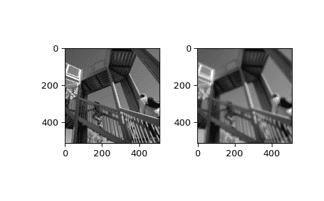

# `scipy.ndimage.fourier_gaussian`

> 原文链接：[`docs.scipy.org/doc/scipy-1.12.0/reference/generated/scipy.ndimage.fourier_gaussian.html#scipy.ndimage.fourier_gaussian`](https://docs.scipy.org/doc/scipy-1.12.0/reference/generated/scipy.ndimage.fourier_gaussian.html#scipy.ndimage.fourier_gaussian)

```py
scipy.ndimage.fourier_gaussian(input, sigma, n=-1, axis=-1, output=None)
```

多维高斯傅里叶滤波器。

数组与高斯核的傅里叶变换相乘。

参数：

**input**array_like

输入数组。

**sigma**float 或 序列

高斯核的 sigma 值。如果是浮点数，则所有轴的 sigma 值相同。如果是序列，则 sigma 必须包含每个轴的一个值。

**n**int, 可选

如果*n*为负（默认），则假定输入是复数 fft 的结果。如果*n*大于或等于零，则假定输入是实数 fft 的结果，*n*表示变换前沿着实部变换方向的数组长度。

**axis**int, 可选

实部变换的轴。

**output**ndarray, 可选

如果给定，输入过滤的结果将放置在此数组中。

返回：

**fourier_gaussian**ndarray

过滤后的输入。

示例

```py
>>> from scipy import ndimage, datasets
>>> import numpy.fft
>>> import matplotlib.pyplot as plt
>>> fig, (ax1, ax2) = plt.subplots(1, 2)
>>> plt.gray()  # show the filtered result in grayscale
>>> ascent = datasets.ascent()
>>> input_ = numpy.fft.fft2(ascent)
>>> result = ndimage.fourier_gaussian(input_, sigma=4)
>>> result = numpy.fft.ifft2(result)
>>> ax1.imshow(ascent)
>>> ax2.imshow(result.real)  # the imaginary part is an artifact
>>> plt.show() 
```


