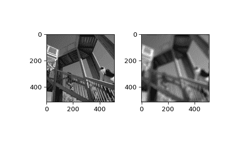

# `scipy.ndimage.fourier_uniform`

> 原文链接：[`docs.scipy.org/doc/scipy-1.12.0/reference/generated/scipy.ndimage.fourier_uniform.html#scipy.ndimage.fourier_uniform`](https://docs.scipy.org/doc/scipy-1.12.0/reference/generated/scipy.ndimage.fourier_uniform.html#scipy.ndimage.fourier_uniform)

```py
scipy.ndimage.fourier_uniform(input, size, n=-1, axis=-1, output=None)
```

多维均匀傅里叶滤波器。

数组与给定大小的盒子的傅里叶变换相乘。

参数：

**input**array_like

输入数组。

**size**float 或 序列

用于过滤的盒子的大小。如果是浮点数，则*size*对所有轴都相同。如果是序列，则*size*必须包含每个轴的一个值。

**n**int，可选

如果*n*为负（默认），则假定输入是复数 fft 的结果。如果*n*大于或等于零，则假定输入是实数 fft 的结果，并且*n*给出了变换前数组沿实部变换方向的长度。

**axis**int，可选

实部变换的轴。

**output**ndarray，可选

如果给定，则将输入的过滤结果放入此数组中。

返回：

**fourier_uniform**ndarray

过滤后的输入。

示例

```py
>>> from scipy import ndimage, datasets
>>> import numpy.fft
>>> import matplotlib.pyplot as plt
>>> fig, (ax1, ax2) = plt.subplots(1, 2)
>>> plt.gray()  # show the filtered result in grayscale
>>> ascent = datasets.ascent()
>>> input_ = numpy.fft.fft2(ascent)
>>> result = ndimage.fourier_uniform(input_, size=20)
>>> result = numpy.fft.ifft2(result)
>>> ax1.imshow(ascent)
>>> ax2.imshow(result.real)  # the imaginary part is an artifact
>>> plt.show() 
```


