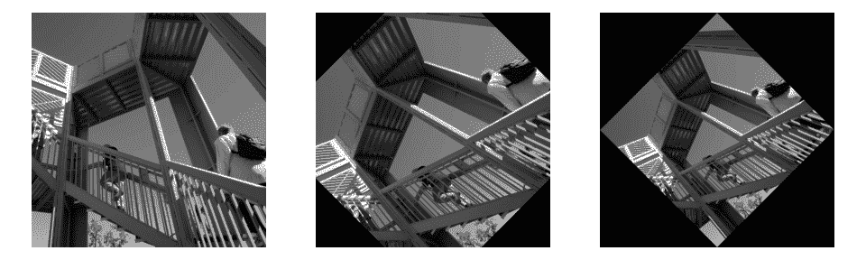

# `scipy.ndimage.rotate`

> 原始文本：[`docs.scipy.org/doc/scipy-1.12.0/reference/generated/scipy.ndimage.rotate.html#scipy.ndimage.rotate`](https://docs.scipy.org/doc/scipy-1.12.0/reference/generated/scipy.ndimage.rotate.html#scipy.ndimage.rotate)

```py
scipy.ndimage.rotate(input, angle, axes=(1, 0), reshape=True, output=None, order=3, mode='constant', cval=0.0, prefilter=True)
```

旋转数组。

使用请求的阶数的样条插值，围绕由*axes*参数给出的两个轴定义的平面旋转数组。

参数：

**input**array_like

输入数组。

**angle**float

旋转角度（以度为单位）。

**axes**两个整数的元组，可选

定义旋转平面的两个轴。默认值为前两个轴。

**reshape**bool，可选

如果*reshape*为真，则调整输出形状，以便输入数组完全包含在输出中。默认为 True。

**output**array 或 dtype，可选

要放置输出的数组，或返回数组的 dtype。默认情况下，将创建与输入相同 dtype 的数组。

**order**int，可选

样条插值的顺序，默认为 3。顺序必须在 0-5 范围内。

**mode**{‘reflect’，‘grid-mirror’，‘constant’，‘grid-constant’，‘nearest’，‘mirror’，‘grid-wrap’，‘wrap’}，可选

*mode*参数确定如何扩展输入数组超出其边界。默认为‘constant’。每个有效值的行为如下（请参见边界模式的附加图和细节）：

‘reflect’ (*d c b a | a b c d | d c b a*)

输入通过关于最后一个像素边缘的反射来扩展。这种模式有时也称为半采样对称。

‘grid-mirror’

这是‘reflect’的同义词。

‘constant’ (*k k k k | a b c d | k k k k*)

输入通过使用由*cval*参数定义的相同常数值来填充边缘之外的所有值来扩展。不在输入边缘之外执行插值。

‘grid-constant’ (*k k k k | a b c d | k k k k*)

使用由*cval*参数定义的相同常数值填充输入边缘之外的所有值来扩展输入。对于超出输入范围的样本也进行插值。

‘nearest’ (*a a a a | a b c d | d d d d*)

输入通过复制最后一个像素来扩展。

‘mirror’ (*d c b | a b c d | c b a*)

输入通过关于最后一个像素中心的反射来扩展。这种模式有时也称为整采样对称。

‘grid-wrap’ (*a b c d | a b c d | a b c d*)

输入通过环绕到相反边缘进行扩展。

‘wrap’ (*d b c d | a b c d | b c a b*)

输入通过环绕到相反边缘的方式进行扩展，但最后一个点和初始点完全重叠。在这种情况下，在重叠点选择哪个样本是不明确的。

**cval**标量，可选

如果*mode*为‘constant’，则用于填充输入边缘之外的值。默认值为 0.0。

**prefilter**bool，可选

决定是否对输入数组进行预过滤，使用`spline_filter`进行插值之前。默认为 True，如果*order > 1*，将创建一个临时的*float64*数组来存储过滤后的值。如果将其设置为 False，则输出在*order > 1*时会稍微模糊，除非输入已经经过预过滤，即调用`spline_filter`处理过原始输入。

返回：

**rotate** ndarray

旋转后的输入图像。

注意

对于复数*input*，此函数独立旋转实部和虚部。

1.6.0 版新增：支持复数数值。

示例

```py
>>> from scipy import ndimage, datasets
>>> import matplotlib.pyplot as plt
>>> fig = plt.figure(figsize=(10, 3))
>>> ax1, ax2, ax3 = fig.subplots(1, 3)
>>> img = datasets.ascent()
>>> img_45 = ndimage.rotate(img, 45, reshape=False)
>>> full_img_45 = ndimage.rotate(img, 45, reshape=True)
>>> ax1.imshow(img, cmap='gray')
>>> ax1.set_axis_off()
>>> ax2.imshow(img_45, cmap='gray')
>>> ax2.set_axis_off()
>>> ax3.imshow(full_img_45, cmap='gray')
>>> ax3.set_axis_off()
>>> fig.set_layout_engine('tight')
>>> plt.show() 
```



```py
>>> print(img.shape)
(512, 512)
>>> print(img_45.shape)
(512, 512)
>>> print(full_img_45.shape)
(724, 724) 
```
