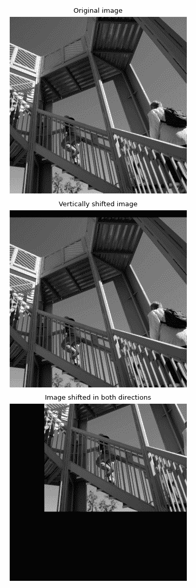

# `scipy.ndimage.shift`

> 原文：[`docs.scipy.org/doc/scipy-1.12.0/reference/generated/scipy.ndimage.shift.html#scipy.ndimage.shift`](https://docs.scipy.org/doc/scipy-1.12.0/reference/generated/scipy.ndimage.shift.html#scipy.ndimage.shift)

```py
scipy.ndimage.shift(input, shift, output=None, order=3, mode='constant', cval=0.0, prefilter=True)
```

移动数组。

数组使用请求的阶数的样条插值进行移动。超出输入边界的点根据给定的模式进行填充。

参数：

**input**array_like

输入数组。

**shift**浮点数或序列

轴上的移动量。如果是浮点数，`shift`对每个轴都是相同的。如果是序列，`shift`应包含每个轴的一个值。

**output**数组或 dtype，可选

用于放置输出的数组，或返回数组的 dtype。默认情况下，将创建与输入相同 dtype 的数组。

**order**整数，可选

样条插值的顺序，默认为 3。顺序必须在 0-5 的范围内。

**mode**{‘reflect’, ‘grid-mirror’, ‘constant’, ‘grid-constant’, ‘nearest’, ‘mirror’, ‘grid-wrap’, ‘wrap’}，可选

*mode*参数决定了如何扩展输入数组超出其边界的部分。默认为‘constant’。每个有效值的行为如下（请参阅边界模式的额外图表和详细信息）：

‘reflect’（*d c b a | a b c d | d c b a*）

输入通过在最后一个像素的边缘周围反射来进行扩展。有时也称为半样本对称。

‘grid-mirror’

这是‘reflect’的同义词。

‘constant’（*k k k k | a b c d | k k k k*）

输入通过使用由*cval*参数定义的相同常量值来填充超出边缘的所有值来进行扩展。超出输入边界的地方不执行插值。

‘grid-constant’（*k k k k | a b c d | k k k k*）

输入通过使用由*cval*参数定义的相同常量值来填充超出边缘的所有值来进行扩展。对于输入范围之外的样本也会进行插值。

‘nearest’（*a a a a | a b c d | d d d d*）

输入通过复制最后一个像素来进行扩展。

‘mirror’（*d c b | a b c d | c b a*）

输入通过在最后一个像素的中心周围反射来进行扩展。有时也称为整样本对称。

‘grid-wrap’（*a b c d | a b c d | a b c d*）

输入通过围绕到相对边缘的对面来进行扩展。

‘wrap’（*d b c d | a b c d | b c a b*）

输入通过围绕到相对边缘的对面来进行扩展，但是以使最后点和初始点完全重叠的方式。在这种情况下，不清楚在重叠点会选择哪个样本。

**cval**标量，可选

如果*mode*为‘constant’，用于填充输入边界之外的值。默认为 0.0。

**prefilter**布尔值，可选

确定输入数组在插值之前是否使用`spline_filter`进行预过滤。默认为 True，如果*order > 1*，将创建一个临时的*float64*数组来存储过滤后的值。如果设置为 False，则输出会略微模糊，除非输入已预过滤，即调用`spline_filter`后的原始输入。

返回：

**shift** ndarray

移动后的输入。

另请参阅

`affine_transform`

仿射变换

注意

对于复数*input*，此函数独立移动实部和虚部。

自`1.6.0`版本新增：添加复数支持。

示例

导入必要的模块和示例图像。

```py
>>> from scipy.ndimage import shift
>>> import matplotlib.pyplot as plt
>>> from scipy import datasets
>>> image = datasets.ascent() 
```

将图像垂直向上移动`20`像素。

```py
>>> image_shifted_vertically = shift(image, (20, 0)) 
```

将图像垂直向上移动`-200`像素，水平向右移动`100`像素。

```py
>>> image_shifted_both_directions = shift(image, (-200, 100)) 
```

绘制原始图像和移动后的图像。

```py
>>> fig, axes = plt.subplots(3, 1, figsize=(4, 12))
>>> plt.gray()  # show the filtered result in grayscale
>>> top, middle, bottom = axes
>>> for ax in axes:
...     ax.set_axis_off()  # remove coordinate system
>>> top.imshow(image)
>>> top.set_title("Original image")
>>> middle.imshow(image_shifted_vertically)
>>> middle.set_title("Vertically shifted image")
>>> bottom.imshow(image_shifted_both_directions)
>>> bottom.set_title("Image shifted in both directions")
>>> fig.tight_layout() 
```


