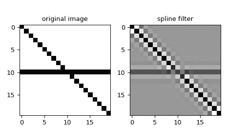

# `scipy.ndimage.spline_filter`

> 原始文本：[`docs.scipy.org/doc/scipy-1.12.0/reference/generated/scipy.ndimage.spline_filter.html#scipy.ndimage.spline_filter`](https://docs.scipy.org/doc/scipy-1.12.0/reference/generated/scipy.ndimage.spline_filter.html#scipy.ndimage.spline_filter)

```py
scipy.ndimage.spline_filter(input, order=3, output=<class 'numpy.float64'>, mode='mirror')
```

多维样条滤波器。

参数：

**input**array_like

输入数组。

**order**int，可选

样条的顺序，默认为 3。

**output**ndarray 或 dtype，可选

用于放置输出的数组或返回数组的数据类型。默认为`numpy.float64`。

**mode**{‘reflect’，‘grid-mirror’，‘constant’，‘grid-constant’，‘nearest’，‘mirror’，‘grid-wrap’，‘wrap’}，可选

*mode*参数确定输入数组在其边界之外如何扩展。默认为‘mirror’。每个有效值的行为如下（参见边界模式的附加图和详细信息）：

‘reflect’（*d c b a | a b c d | d c b a*)

输入通过最后一个像素的边缘反射进行扩展。此模式有时也称为半样本对称。

‘grid-mirror’

这是“reflect”的同义词。

‘constant’（*k k k k | a b c d | k k k k*)

输入通过填充所有超出边缘的值相同的常量值（由*cval*参数定义）进行扩展。超出输入边界的部分不进行插值。

‘grid-constant’（*k k k k | a b c d | k k k k*)

输入通过填充所有超出边缘的值相同的常量值（由*cval*参数定义）进行扩展。超出输入范围的样本也会进行插值。

‘nearest’（*a a a a | a b c d | d d d d*)

输入通过复制最后一个像素进行扩展。

‘mirror’（*d c b | a b c d | c b a*)

输入通过最后一个像素的中心反射进行扩展。此模式有时也称为整样本对称。

‘grid-wrap’（*a b c d | a b c d | a b c d*)

输入通过环绕到相反边缘进行扩展。

‘wrap’（*d b c d | a b c d | b c a b*)

输入通过包装到相反边缘进行扩展，但以确保最后一个点和初始点完全重叠的方式。在这种情况下，无法定义在重叠点选择哪个样本。

返回：

**spline_filter**ndarray

过滤后的数组。形状与*input*相同。

另见

`spline_filter1d`

沿给定轴计算 1-D 样条滤波器。

注意事项

多维滤波器实现为一系列 1-D 样条滤波器。中间数组以与输出相同的数据类型存储。因此，对于精度有限的输出类型，结果可能不精确，因为中间结果可能存储有限精度。

对于复值*input*，此函数独立处理实部和虚部。

自 1.6.0 版本开始：增加了对复数支持。

示例

我们可以使用多维样条对图像进行滤波：

```py
>>> from scipy.ndimage import spline_filter
>>> import numpy as np
>>> import matplotlib.pyplot as plt
>>> orig_img = np.eye(20)  # create an image
>>> orig_img[10, :] = 1.0
>>> sp_filter = spline_filter(orig_img, order=3)
>>> f, ax = plt.subplots(1, 2, sharex=True)
>>> for ind, data in enumerate([[orig_img, "original image"],
...                             [sp_filter, "spline filter"]]):
...     ax[ind].imshow(data[0], cmap='gray_r')
...     ax[ind].set_title(data[1])
>>> plt.tight_layout()
>>> plt.show() 
```


